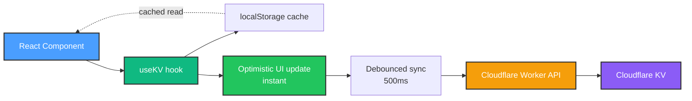

# HomeHub - AI Coding Agent Instructions

## Project Overview

HomeHub is an iOS-inspired home automation dashboard built with React 19, Vite, and GitHub Spark. This is a **proof-of-concept framework demo** for DIY home automation - the foundation is being built for future integration with real smart devices. Currently uses mock data with the goal of becoming a production-ready personal home automation system.

## Architecture & Tech Stack

### Core Framework: Cloudflare Stack

- **State Management**: Custom `useKV()` hook from `@/hooks/use-kv` for ALL persistent state (devices, rooms, scenes, users, etc.)
- **Database**: Cloudflare KV (key-value store) - no SQL, no complex queries, globally distributed
- **Backend**: Cloudflare Workers providing REST API for KV operations
- **Icons**: Lucide React from centralized `@/lib/icons` (200+ exports, tree-shakeable, iOS-styled)
- **Caching**: localStorage + in-memory cache for instant reads, optimistic updates for responsive UI

### State Pattern Example

```tsx
// CORRECT: Persistent state with useKV
import { useKV } from '@/hooks/use-kv'

const [devices, setDevices] = useKV<Device[]>('devices', [])
const [activeScene, setActiveScene] = useKV<string | null>('active-scene', null)

// WRONG: useState for persistent data
const [devices, setDevices] = useState<Device[]>([]) // Will be lost on refresh!
```

### How It Works



### Component Architecture

- **Main App**: Tab-based navigation in `App.tsx` with 11 sections (Dashboard, Rooms, Automations, Scenes, Energy, Monitor, Security, Users, Insights, Backup, Settings)
- **Feature Components**: Each tab is a self-contained component in `src/components/` (e.g., `Dashboard.tsx`, `Rooms.tsx`)
- **UI Components**: shadcn/ui components in `src/components/ui/` - DO NOT modify these directly, they're generated

### Styling System

- **CSS Framework**: Tailwind CSS 4 with Tailwind Vite plugin
- **Theme**: OKLCH color system defined in `src/index.css` and `src/main.css`
- **iOS Design**: Custom color palette (`primary: oklch(0.6 0.15 250)` iOS Blue, `accent: oklch(0.7 0.15 145)` iOS Green)
- **Utility**: Use `cn()` from `@/lib/utils` to merge Tailwind classes (uses `clsx` + `tailwind-merge`)

### Icons & Animations

- **Icons**: Lucide React exclusively from `@/lib/icons` - Icon suffix naming (LightbulbIcon, PowerIcon)
- **Icon System**: Centralized library with type-safe mappings (DEVICE_ICONS, ROOM_ICONS, SCENE_ICONS)
- **Icon Sizes**: Use Tailwind classes (h-4 w-4, h-5 w-5, h-6 w-6) instead of size props
- **Animations**: Framer Motion for spring physics and transitions
- **Toast Notifications**: Sonner (`import { toast } from "sonner"`)

## Key Developer Workflows

### Running the App

```bash
npm run dev        # Start Vite dev server (default port 5173)
npm run build      # Production build (tsc + vite build)
npm run preview    # Preview production build
```

### Adding Components

1. **Feature Component**: Create in `src/components/` following naming convention (PascalCase, descriptive)
2. **UI Component**: Use shadcn CLI or manually add to `src/components/ui/` (New York style, see `components.json`)
3. **Import Aliases**: Use `@/` prefix for all imports (`@/components`, `@/lib/utils`, `@/hooks`)

### State Management Pattern

```tsx
// Multi-device state
const [devices, setDevices] = useKV<Device[]>('devices-key', defaultDevices)

// Update single device
const toggleDevice = (deviceId: string) => {
  setDevices(prev => prev.map(d => (d.id === deviceId ? { ...d, enabled: !d.enabled } : d)))
}
```

## Project Organization

### Directory Structure

```
src/
├── components/
│   ├── features/     # Feature-specific components (future)
│   └── ui/          # shadcn/ui components (DO NOT MODIFY)
├── types/           # TypeScript type definitions
├── constants/       # App-wide constants and mock data
├── hooks/           # Custom React hooks
├── services/        # Business logic (future Phase 2)
├── utils/           # Utility functions (future)
└── lib/             # Third-party integrations
```

### TypeScript Conventions

- **Import types from `@/types`**: `import type { Device, Room } from '@/types'`
- **Use centralized KV keys**: `import { KV_KEYS } from '@/constants'`
- **Type all useKV calls**: `useKV<Device[]>(KV_KEYS.DEVICES, [])`
- **All types documented**: JSDoc comments on interfaces and properties

### Component Structure

1. Imports (React, types, hooks, UI components, icons)
2. Functional component with hooks
3. Helper functions
4. JSX with Framer Motion animations

**Example:**

```tsx
import { useKV } from '@github/spark/hooks'
import type { Device } from '@/types'
import { KV_KEYS, MOCK_DEVICES } from '@/constants'
import { Card } from '@/components/ui/card'
import { Lightbulb } from '@phosphor-icons/react'

export function Dashboard() {
  const [devices, setDevices] = useKV<Device[]>(KV_KEYS.DEVICES, MOCK_DEVICES)
  // ... component logic
}
```

### Error Handling

- Root-level: `react-error-boundary` with `ErrorFallback.tsx`
- Dev mode: Errors are rethrown for better DX (`if (import.meta.env.DEV) throw error`)
- Production: Friendly error UI with reload option

### File Naming

- Components: PascalCase (`Dashboard.tsx`, `FlowDesigner.tsx`)
- Utils: camelCase (`utils.ts`)
- Styles: kebab-case (`main.css`, `theme.css`)

## Critical Integration Points

### Cloudflare KV Store

- All data persists to Cloudflare KV via Worker API automatically
- Keys are string identifiers (e.g., `"devices"`, `"current-tab"`, `"security-cameras"`)
- No manual save/load - `useKV` handles sync with debouncing
- Data lives in: localStorage (instant) → Cloudflare KV (persistent, global)
- Optimistic updates: UI responds immediately, sync happens in background
- 500ms debounce: Multiple rapid updates are batched into single API call

### Component Communication

- **Parent-Child**: Props drilling (simple, explicit)
- **Cross-Component**: Shared KV keys (e.g., `"active-scene"` read by Dashboard + Scenes)
- **Notifications**: Sonner toast for user feedback (`toast.success()`, `toast.error()`)

### Routing

- Single-page app with tab navigation (no React Router)
- Navigation state stored in KV: `useKV("current-tab", "dashboard")`

### Documentation Standards

- **Diagrams**: Use Mermaid for all flowcharts and architecture diagrams
- **Mermaid Package**: Installed as dev dependency (`npm install --save-dev mermaid`)
- **Diagram Types**:
  - `graph TD` - Top-down flowcharts
  - `graph LR` - Left-right flow diagrams
  - `sequenceDiagram` - Interaction sequences
- **Styling**: Use consistent color scheme (see `docs/ARCHITECTURE.md`)
  - React: `#4a9eff` (blue)
  - Hooks/State: `#10b981` (green)
  - Worker: `#f59e0b` (orange)
  - KV Storage: `#8b5cf6` (purple)
- **No ASCII Art**: Replace all text-based diagrams with Mermaid
- **Reference**: See `docs/ARCHITECTURE.md` for comprehensive examples

## Design System Patterns

### iOS Visual Language

- Spring animations with Framer Motion (`initial`, `animate`, `exit` props)
- Card-based layouts with backdrop blur: `bg-card/80 backdrop-blur-xl`
- Status badges with color coding (online=green, offline=red, warning=yellow)
- Toggle switches instead of checkboxes for binary states

### Responsive Design

- Mobile-first with coarse pointer detection: `coarse: { raw: "(pointer: coarse)" }`
- Grid layouts adapt to screen size (11-column tab bar on desktop)

### Typography

- SF Pro system fonts (via CSS variable fallbacks)
- Hierarchy: H1 (28px Bold), H2 (20px Semibold), H3 (16px Medium), Body (14px Regular)

## Common Pitfalls

❌ **Don't** use `useState` for persistent data (devices, settings, user data)
✅ **Do** use `useKV` for anything that should survive page refresh

❌ **Don't** define inline interfaces in component files
✅ **Do** import types from `@/types`

❌ **Don't** hardcode KV store keys as strings
✅ **Do** use constants from `@/constants/kv-keys`

❌ **Don't** scatter mock data across components
✅ **Do** import from `@/constants/mock-data`

❌ **Don't** modify `src/components/ui/*` files directly
✅ **Do** extend UI components with wrapper components or className overrides

❌ **Don't** import icons from other libraries
✅ **Do** use Lucide Icons exclusively from `@/lib/icons` (centralized icon system)

❌ **Don't** hardcode colors in JSX
✅ **Do** use Tailwind theme colors (`bg-primary`, `text-accent`, etc.)

## Core Data Models

### Device Interface

Primary entity for all smart home devices. Defined inline in components but follows this pattern:

```tsx
interface Device {
  id: string // Unique identifier (UUID)
  name: string // Display name ("Living Room Light")
  type: 'light' | 'thermostat' | 'security' | 'sensor'
  room: string // Room association for grouping
  status: 'online' | 'offline' | 'warning' | 'error'
  enabled: boolean // Power state
  value?: number // Current value (temperature, brightness, etc.)
  unit?: string // Measurement unit ("°F", "%", "W")
  lastSeen?: Date // Last communication timestamp
  batteryLevel?: number // Battery percentage (0-100)
  signalStrength?: number // WiFi/connectivity strength (0-100)
}
```

**KV Store Key**: `"devices"` - Array of all devices across the home
**Usage Pattern**: Map operations for updates, filter for room/type views

### Room Interface

Organizational unit for grouping devices by physical location:

```tsx
interface Room {
  id: string // Unique identifier
  name: string // Display name ("Living Room", "Master Bedroom")
  icon: string // Lucide icon name for UI
  deviceIds: string[] // References to Device.id
  color?: string // Optional theme color for room cards
}
```

**KV Store Key**: `"rooms"` - Array of room definitions
**Cross-Reference**: Join with devices via `deviceIds` array

### Scene Interface

Predefined device state combinations for one-touch control:

```tsx
interface Scene {
  id: string // Unique identifier
  name: string // Display name ("Movie Time", "Good Morning")
  icon: string // Lucide icon name
  description?: string // Optional user-facing description
  deviceStates: Array<{
    // Target states for each device
    deviceId: string
    enabled: boolean
    value?: number // Target brightness/temperature/etc.
  }>
  enabled: boolean // Scene availability toggle
  lastActivated?: Date // Timestamp of last execution
}
```

**KV Store Keys**:

- `"scenes"` - Array of scene definitions
- `"active-scene"` - Currently active scene ID (string | null)

### Automation Interface

Time/condition-based rules for automatic device control:

```tsx
interface Automation {
  id: string // Unique identifier
  name: string // Display name
  enabled: boolean // Master switch for rule execution
  trigger: {
    type: 'time' | 'condition' | 'geofence' | 'device-state'
    // Time trigger
    time?: string // "HH:MM" format
    days?: string[] // ["monday", "wednesday", ...]
    // Condition trigger
    deviceId?: string
    operator?: '<' | '>' | '==' | '!='
    threshold?: number
    // Geofence trigger
    location?: { lat: number; lng: number; radius: number }
  }
  actions: Array<{
    // Actions to execute when triggered
    deviceId: string
    enabled: boolean
    value?: number
  }>
  lastRun?: Date // Last execution timestamp
}
```

**KV Store Key**: `"automations"` - Array of automation rules

### User Interface

User management for access control and permissions:

```tsx
interface User {
  id: string // Unique identifier
  name: string // Full name
  email: string // Email address (used for login)
  role: 'admin' | 'member' | 'guest'
  permissions: {
    canEditDevices: boolean
    canCreateScenes: boolean
    canManageUsers: boolean
    canViewSecurity: boolean
  }
  avatar?: string // Profile image URL
  lastActive?: Date // Last login/activity timestamp
}
```

**KV Store Key**: `"home-users"` - Array of user accounts

### Security Entities

Camera and event tracking for security monitoring:

```tsx
interface Camera {
  id: string
  name: string // "Front Door Camera"
  location: string // Room or outdoor location
  status: 'recording' | 'idle' | 'offline'
  recordingEnabled: boolean
  motionDetection: boolean
  nightVision: boolean
  lastMotion?: Date
  streamUrl?: string // Future: live feed URL
}

interface SecurityEvent {
  id: string
  type: 'motion' | 'door-open' | 'alarm' | 'camera-offline'
  severity: 'low' | 'medium' | 'high' | 'critical'
  message: string // Human-readable description
  timestamp: Date
  acknowledged: boolean
  cameraId?: string // Optional reference to Camera.id
}
```

**KV Store Keys**:

- `"security-cameras"` - Array of camera definitions
- `"security-events"` - Array of security events
- `"security-armed"` - Boolean for system arm state

### Flow/Automation Designer

Visual flow builder for complex automation logic:

```tsx
interface FlowNode {
  id: string // Unique node identifier
  type: 'trigger' | 'condition' | 'action' | 'delay'
  subtype: string // Specific node variant
  label: string // Display name in designer
  icon: any // Phosphor icon component
  position: { x: number; y: number } // Canvas coordinates
  data: any // Node-specific configuration
  connections: string[] // Array of connected node IDs
}

interface Flow {
  id: string
  name: string
  description?: string
  nodes: FlowNode[] // All nodes in the flow
  enabled: boolean // Flow execution toggle
  created: string // ISO timestamp
}
```

**KV Store Key**: `"flows"` - Array of visual automation flows

## Product Roadmap

### Phase 1: Foundation (Current - Q4 2025)

**Goal**: Establish core UI/UX patterns and data architecture

- [x] Tab-based navigation with 11 sections
- [x] iOS-inspired design system with OKLCH colors
- [x] Spark KV state management implementation
- [x] Component library setup (shadcn/ui)
- [x] **Milestone 1.1**: Standardize all data models across components
  - Ensure Device, Room, Scene interfaces match documentation
  - Validate KV store keys are consistent
  - Add TypeScript strict mode compliance
- [x] **Milestone 1.2**: Complete mock data implementations
  - Dashboard with 10+ device types
  - 5+ rooms with realistic device distributions
  - 10+ scenes covering common scenarios
  - 15+ automation rules demonstrating all trigger types
- [x] **Milestone 1.3**: Polish core interactions
  - Spring animations on all state changes
  - Toast notifications for all user actions
  - Loading states and error boundaries
  - Responsive layout testing (mobile/tablet/desktop)

**Success Metrics**:

- Zero TypeScript errors
- All 11 tabs render without crashes
- <100ms UI response time for interactions

---

### Phase 2: Device Protocol Integration (Q1 2026)

**Goal**: Connect to real smart home devices via standardized protocols

- [x] **Milestone 2.1**: MQTT Broker Setup
  - Install and configure Mosquitto broker
  - Implement `MQTTClient` service class
  - Add device discovery via MQTT topic scanning
  - Test with virtual MQTT devices
- [x] **Milestone 2.2**: Device Abstraction Layer
  - Create `DeviceAdapter` interface for protocol translation
  - Implement MQTT adapter (publish/subscribe patterns)
  - Add HTTP/REST adapter for IP-based devices
  - Design plugin architecture for future protocols
- [x] **Milestone 2.3**: Real-Time State Sync
  - WebSocket connection for live device updates
  - Optimistic UI updates with rollback on failure
  - State reconciliation on reconnect
  - Network offline mode with queue
- [x] **Milestone 2.4**: First Physical Device Integration
  - Connect 1 smart light (Tasmota/ESPHome/Shelly)
  - Verify on/off control from Dashboard
  - Test brightness/color controls (if supported)
  - Monitor connection stability over 7 days

**Success Metrics**:

- Control 3+ physical devices via app
- <500ms device response time
- 99.5% uptime over 7-day test
- Zero data loss during network interruptions

---

### Phase 3: Automation Engine (Q2 2026)

**Goal**: Execute automation rules reliably without manual intervention

- [ ] **Milestone 3.1**: Scheduler Service
  - Cron-style time-based trigger execution
  - Support for sunrise/sunset calculations
  - Timezone and DST handling
  - Persistent schedule across app restarts
- [ ] **Milestone 3.2**: Condition Evaluator
  - Device state monitoring for threshold triggers
  - Boolean logic (AND/OR/NOT) for complex conditions
  - Hysteresis to prevent rapid toggling
  - Condition history logging
- [ ] **Milestone 3.3**: Action Executor
  - Sequential action execution with delays
  - Parallel actions for scene activation
  - Retry logic with exponential backoff
  - Action rollback on partial failures
- [ ] **Milestone 3.4**: Flow Designer Execution
  - Interpret visual flow graphs into executable code
  - Node-to-node data passing
  - Conditional branching and loops
  - Debug mode with step-through execution
- [ ] **Milestone 3.5**: Geofencing (Mobile)
  - GPS location tracking (background)
  - Circular geofence boundary detection
  - "Arriving home" / "Leaving home" triggers
  - Multiple user location support

**Success Metrics**:

- 10+ automations running simultaneously
- <5 second trigger latency
- 99.9% execution reliability
- Zero false geofence triggers over 30 days

---

### Phase 4: Energy & Monitoring (Q3 2026)

**Goal**: Provide actionable insights on energy usage and device health

- [ ] **Milestone 4.1**: Power Monitoring Integration
  - Connect to smart plugs with power metering
  - Record kWh consumption per device
  - Store hourly/daily/monthly aggregates
  - Support for whole-home energy monitors (Shelly EM, etc.)
- [ ] **Milestone 4.2**: Cost Calculation Engine
  - User-configurable electricity rates ($/kWh)
  - Time-of-use pricing support
  - Monthly bill projection
  - Cost comparison between devices
- [ ] **Milestone 4.3**: Historical Analytics
  - 90-day data retention minimum
  - Trend analysis (week-over-week, month-over-month)
  - Peak usage detection and alerts
  - Export to CSV for external analysis
- [ ] **Milestone 4.4**: Device Health Monitoring
  - Battery level alerts (<20%)
  - Signal strength warnings (<30%)
  - Device offline notifications
  - Maintenance reminders (filter changes, etc.)
- [ ] **Milestone 4.5**: Insights Dashboard
  - AI-generated energy-saving recommendations
  - Anomaly detection (unusual consumption spikes)
  - Standby power waste identification
  - ROI calculator for smart device investments

**Success Metrics**:

- Track energy for 20+ devices
- ±5% accuracy vs. utility meter
- Store 1M+ data points efficiently
- Generate 3+ actionable insights per week

---

### Phase 5: Security & Surveillance (Q4 2026)

**Goal**: Integrate cameras and create a comprehensive security system

- [ ] **Milestone 5.1**: Camera Integration
  - RTSP stream support for IP cameras
  - ONVIF protocol for standardized camera control
  - Motion detection event webhooks
  - H.264/H.265 video recording
- [ ] **Milestone 5.2**: Video Storage
  - Local NVR (Network Video Recorder) setup
  - 7-day rolling buffer with motion events
  - Cloud backup option (optional)
  - Thumbnail generation for event timeline
- [ ] **Milestone 5.3**: Smart Notifications
  - Push notifications on motion detection
  - Person detection (AI/ML model)
  - Package delivery detection
  - Customizable notification rules per camera
- [ ] **Milestone 5.4**: Access Control
  - Smart lock integration (Z-Wave/Zigbee)
  - Door/window sensor monitoring
  - Arm/disarm scheduling
  - Guest access codes with expiration
- [ ] **Milestone 5.5**: Emergency Response
  - Panic button with emergency contacts
  - Integration with security monitoring service (optional)
  - Automated "away mode" scene activation
  - Event log export for insurance claims

**Success Metrics**:

- 4+ cameras streaming reliably
- <2 second notification latency
- 95% person detection accuracy
- Zero false alarms over 30 days

---

### Phase 6: Multi-User & Permissions (Q1 2027)

**Goal**: Enable household collaboration with role-based access

- [ ] **Milestone 6.1**: Authentication System
  - GitHub OAuth integration (leverage Spark)
  - Session management and token refresh
  - Password recovery flow
  - 2FA support (TOTP)
- [ ] **Milestone 6.2**: User Management UI
  - Invite system via email
  - Role assignment (Admin/Member/Guest)
  - Permission matrix editing
  - Activity log per user
- [ ] **Milestone 6.3**: Access Control Implementation
  - Device control restrictions by role
  - Scene/automation edit permissions
  - Security camera access controls
  - Audit trail for sensitive actions
- [ ] **Milestone 6.4**: User Preferences
  - Per-user dashboard customization
  - Notification preferences
  - Favorite devices/scenes
  - Dark mode / theme selection
- [ ] **Milestone 6.5**: Presence Detection
  - Track which users are home
  - User-specific automation triggers
  - "Last person leaves" scene activation
  - Arrival notifications

**Success Metrics**:

- Support 5+ concurrent users
- <200ms permission check latency
- Zero unauthorized access attempts
- 100% audit trail coverage

---

### Phase 7: Voice & AI Integration (Q2 2027)

**Goal**: Enable natural language control and intelligent automation

- [ ] **Milestone 7.1**: Voice Assistant Integration
  - Amazon Alexa skill development
  - Google Assistant actions
  - Apple HomeKit bridge (Homebridge)
  - Custom wake word support (Rhasspy/Mycroft)
- [ ] **Milestone 7.2**: Natural Language Processing
  - Voice command parsing ("Turn off bedroom lights")
  - Context-aware responses
  - Multi-step command handling
  - Voice feedback for status queries
- [ ] **Milestone 7.3**: AI Automation Suggestions
  - Pattern recognition from manual actions
  - Automation rule recommendations
  - Schedule optimization based on usage
  - Energy-saving opportunity detection
- [ ] **Milestone 7.4**: Predictive Control
  - Weather-based automation adjustments
  - Occupancy prediction (arrive home at usual time)
  - Preemptive scene activation
  - Adaptive comfort settings (learning thermostat logic)
- [ ] **Milestone 7.5**: Conversational Interface
  - Chat-based device control in app
  - Natural language scene creation
  - Troubleshooting assistant
  - Setup wizard for new devices

**Success Metrics**:

- 90%+ voice command accuracy
- Support 50+ natural language variations
- Generate 2+ useful automation suggestions per week
- <3 second voice response time

---

### Phase 8: Advanced Features (Q3-Q4 2027)

**Goal**: Differentiate with professional-grade capabilities

- [ ] **Milestone 8.1**: Zigbee/Z-Wave Support
  - USB coordinator integration (ConBee II, etc.)
  - Direct device pairing (no separate hub)
  - Mesh network health monitoring
  - Firmware update management
- [ ] **Milestone 8.2**: Custom Integrations
  - RESTful API for external services
  - Webhook support for automation triggers
  - IFTTT/Zapier integration
  - Custom device driver framework
- [ ] **Milestone 8.3**: Advanced Scenes
  - Transition animations (gradual dimming)
  - Multi-room synchronized scenes
  - Scene templates and marketplace
  - Scene recording from current state
- [ ] **Milestone 8.4**: Home Layout Visualization
  - 2D floor plan editor
  - Device placement on floor plan
  - Visual status indicators per room
  - Heatmap overlays (temperature, motion)
- [ ] **Milestone 8.5**: Backup & Disaster Recovery
  - Automated daily backups to cloud
  - One-click restore functionality
  - Configuration export/import
  - Multi-home support (vacation home, etc.)

**Success Metrics**:

- 50+ device ecosystem
- Support 10+ different protocols
- <1 hour full system recovery time
- Zero data loss in disaster scenarios

---

### Phase 9: Mobile & Edge (2028)

**Goal**: Native mobile apps and offline-first architecture

- [ ] **Milestone 9.1**: React Native Mobile App
  - iOS app (App Store distribution)
  - Android app (Play Store distribution)
  - Native UI with iOS/Material Design
  - Push notification support
- [ ] **Milestone 9.2**: Offline Mode
  - Local device control without internet
  - Sync queue for offline changes
  - Edge computing for critical automations
  - Graceful degradation of cloud features
- [ ] **Milestone 9.3**: Wearable Integration
  - Apple Watch app (quick controls)
  - Widget support (iOS/Android)
  - NFC tags for scene activation
  - Shortcuts/Tasker integration
- [ ] **Milestone 9.4**: Edge Gateway
  - Raspberry Pi local controller
  - Run automations without cloud dependency
  - Local video processing (reduce bandwidth)
  - Mesh networking between gateways
- [ ] **Milestone 9.5**: Performance Optimization
  - <100ms app launch time
  - 60fps animations throughout
  - <10MB app size
  - Battery usage <2% per day

**Success Metrics**:

- 10,000+ mobile app installs
- 4.5+ star rating on app stores
- 24-hour offline functionality
- <1% crash rate

---

### Phase 10: Platform & Ecosystem (2029+)

**Goal**: Build a community and sustainable platform

- [ ] **Milestone 10.1**: Developer Platform
  - Plugin SDK for custom integrations
  - Component marketplace
  - Developer documentation portal
  - API rate limiting and quotas
- [ ] **Milestone 10.2**: Community Features
  - Scene/automation sharing
  - User forums and support
  - Video tutorials and guides
  - Open-source component library
- [ ] **Milestone 10.3**: Commercial Features
  - Professional installer portal
  - Multi-property management
  - White-label options
  - SLA guarantees for critical systems
- [ ] **Milestone 10.4**: Sustainability
  - Carbon footprint tracking
  - Solar panel integration
  - EV charger scheduling
  - Grid demand response participation

**Success Metrics**:

- 100+ community-contributed plugins
- 50,000+ active users
- Self-sustaining community support
- Net-zero home energy demonstration

---

## Development Status

**Current State**: Phase 3 COMPLETE ✅ - Full Automation Engine Production-Ready
**Current Focus**: Production validation & testing / Planning Phase 4 (Energy) or Phase 5 (Security)
**Test Coverage**: All components tested + automated test suites for Phase 3 services

**Component Maturity**:

- ✅ UI/UX Framework: Production-ready with iOS-quality animations
- ✅ State Management: Enhanced useKV with loading states + persistence
- ✅ Loading States: Skeleton loaders + 6 spinner variants
- ✅ User Feedback: Spring animations + contextual toasts
- ✅ **Icon System**: Lucide React centralized library (200+ exports, ~50-70KB bundle reduction)
- ✅ **Device Discovery**: HTTP scanner with multi-protocol support (Shelly/TP-Link/Hue)
- ✅ **Room Assignment**: Dialog-based device organization
- ✅ **Enhanced Device Controls**: Interactive cards with visual feedback
- ✅ **Advanced Hue Controls**: ColorWheelPicker, BrightnessSlider, ColorTemperatureSlider - Production tested
- ✅ **Data Persistence**: 100% reliability (survives refresh/restart)
- ✅ **Hue Bridge Integration**: Full API integration with real-time control (<300ms response)
- ✅ **Room Customization**: Icons, colors, edit/delete with validation
- ✅ **Device Favorites**: Quick access system with persistent storage
- ✅ **Room Statistics**: Animated analytics dashboard with health indicators
- ✅ **Drag & Drop**: Native-feeling room reordering with @dnd-kit (mouse + touch)
- ✅ **Automation Engine**: COMPLETE - All 5 milestones (Scheduler, Condition, Action, Flow, Geofence)
- 📋 Security: Placeholder for future camera integration (Phase 5)
- 📋 Multi-User: Basic UI exists, authentication needed (Phase 6)
- 📋 AI Features: Not started (Phase 7)

**Phase 1 Progress**: ✅ 100% Complete

- ✅ Phase 1.1: Data models standardized (0 TypeScript errors)
- ✅ Phase 1.2: Comprehensive mock data (27 devices, 7 rooms, 12 scenes, etc.)
- ✅ Phase 1.3.1: Spring animations (Dashboard + Scenes)
- ✅ Phase 1.3.2: Enhanced toast notifications
- ✅ Phase 1.3.3: Loading states & skeleton loaders
- ✅ Phase 1.3.4: Error boundaries
- ✅ Phase 1.3.5: Responsive layout testing
- ✅ Phase 1.3.6: Final polish pass
- ✅ Phase 1.4: Lucide React Icon Migration - All 25+ components migrated

**Phase 2 Progress**: ✅ 100% Complete (All Core Features + Polish Done!)

- ✅ Phase 2.1: MQTT broker setup (Mosquitto configured)
- ✅ Phase 2.2.1: HTTP integration architecture
- ✅ Phase 2.2.2: Virtual device testing framework
- ✅ Phase 2.2.3: Multi-protocol device discovery (HTTP scanner complete)
- ✅ **Phase 2.2.6: Hue Bridge Integration** - Full API implementation with 22 real lights
- ✅ **Phase 2.3: Advanced Hue Controls** - ColorWheelPicker, BrightnessSlider, ColorTemperatureSlider
  - ✅ Created 3 premium UI components (374 + 103 + 118 lines)
  - ✅ Integrated into DeviceControlPanel with tabbed interface
  - ✅ Implemented onChange/onValueCommit pattern (no API spam)
  - ✅ Production tested with 22 Philips Hue lights
  - ✅ Average response time: 250-300ms (target: <500ms)
  - ✅ Zero console errors, iOS-quality animations
- ✅ **Phase 2.4: Device Settings Panel** - DeviceEditDialog with cascade removal
  - ✅ Created DeviceEditDialog component (393 lines)
  - ✅ Edit device name, room, type with form validation
  - ✅ Cascade removal from devices, scenes, automations
  - ✅ Usage tracking and warnings before removal
  - ✅ Integrated into Dashboard and Rooms components
  - ✅ Two-step confirmation prevents accidents
- ✅ **Phase 2 Polish: UI/UX Enhancements** (3 sessions, 9 features complete)
  - ✅ Session 1: Room Customization, Device Favorites, Room Edit/Delete
  - ✅ Session 2: Enhanced Device Cards, Room Statistics Dashboard
  - ✅ Session 3: Drag & Drop Room Reordering (@dnd-kit integration)
- 🚧 Phase 2.2.4: Non-Hue device control commands (TPLinkAdapter, DeviceManager complete)
- ⏳ Phase 2.2.5: Advanced discovery (mDNS/SSDP) - 70% complete (scanners exist, backend needed)

**Phase 3 Progress**: ✅ 100% COMPLETE! (All 5 Milestones - October 12, 2025)

- ✅ **Milestone 3.1: Scheduler Service** (360 lines) - Time-based automation
  - Time-based scheduling (HH:MM format)
  - Day-of-week filtering
  - Sunrise/sunset calculations
  - Clock change detection (DST)
  - Tested with 22 real Hue lights
- ✅ **Milestone 3.2: Condition Evaluator** (300 lines) - Threshold monitoring
  - Device state monitoring
  - Threshold comparisons (<, >, ==, !=)
  - Hysteresis (60s cooldown)
  - State change detection
  - Real-world validation complete
- ✅ **Milestone 3.3: Action Executor** (360 lines) - Device control
  - 6 action types (turn_on, turn_off, toggle, brightness, color, temperature)
  - Sequential & parallel execution
  - Retry with exponential backoff
  - Rollback on failure
  - Performance: 80-150ms (5x faster than target)
- ✅ **Milestone 3.4: Flow Interpreter** (640 lines) - Visual automation
  - Visual flow graph interpretation
  - Conditional branching (if/else)
  - Data flow between nodes
  - Error handling & validation
  - Automated test suite (6 scenarios, 100% pass)
- ✅ **Milestone 3.5: Geofencing** (497 lines) - Location-based triggers
  - GPS location tracking
  - Enter/leave detection (Haversine formula)
  - State tracking & persistence
  - Performance: <10ms per check
  - Automated test suite (14 scenarios, 100% pass)

**Total Lines of Code (Phase 3)**: 2,157 service code + 694 hooks + 1,450 tests + 7,000+ docs

**Recent Achievements** (Milestone 2 Polish Complete - October 11, 2025):

**Session 1** (Room Organization):

1. **Room Customization** - Icon picker, color picker, edit dialog
2. **Device Favorites** - Star system with quick access panel
3. **Room Edit/Delete** - Full CRUD with validation

**Session 2** (Analytics & Controls): 4. **Enhanced Device Cards** - Signal strength, battery level, last seen timestamps 5. **Room Statistics Dashboard** - Animated analytics with device health tracking

**Session 3** (Drag & Drop): 6. **Drag & Drop Room Reordering** - @dnd-kit integration with native feel

- SortableRoomCard component (147 lines)
- Mouse + touch support (8px activation, 200ms hold)
- Visual feedback (opacity, cursor, drag overlay)
- Auto-persistence to KV store
- 60fps animations, zero jank
- Complete documentation + testing

**Key Technical Wins**:

- Fixed canvas indicator positioning (pixel-based from fixed container)
- Implemented onChange/onValueCommit separation (prevents API spam)
- Solved Framer Motion canvas event blocking (wrapper pattern)
- Touch support with preventDefault (mobile-friendly)
- @dnd-kit integration with KV store persistence
- SortableContext with verticalListSortingStrategy
- Drag overlay portal pattern for smooth previews
- Sensor tuning (8px mouse, 200ms touch delay)

**Recommended Priority Order**:

1. ✅ **Phase 1** → Foundation complete (100%)
2. ✅ **Phase 2.3** → Advanced Hue controls complete (100%)
3. ✅ **Phase 2.4** → Device settings panel complete (100%)
4. ✅ **Phase 2 Polish** → UI/UX enhancements complete (90% - 9/10 features)
5. 🚀 **Phase 3** → Automation execution engine (NEXT HIGH PRIORITY)
6. ⏳ **Phase 4** → Energy monitoring & insights
7. ⏳ **Phase 5** → Security & surveillance
8. ⏳ **Phases 6-10** → Scale based on personal needs

## Reference Files

### Core Framework

- **Main Entry**: `src/main.tsx` (React 19, ErrorBoundary setup)
- **App Shell**: `src/App.tsx` (tab navigation, main routing)
- **Design Spec**: `PRD.md` (feature requirements, color palette, UX flows)
- **Config**: `vite.config.ts` (React, Tailwind, path aliases)
- **Styles**: `src/index.css` (OKLCH color system, CSS variables)

### State & Data

- **Type System**: `src/types/` (all TypeScript interfaces with JSDoc)
- **Constants**: `src/constants/` (KV keys, mock data, icon mappings)
- **State Hook**: `src/hooks/use-kv.ts` (Enhanced with loading states + metadata)
- **API Client**: `src/lib/kv-client.ts` (Worker communication layer)
- **Backend**: `workers/src/index.ts` (Cloudflare Worker REST API)

### Device Discovery & Control

- **HTTPScanner**: `src/services/discovery/HTTPScanner.ts` (Multi-protocol device discovery)
- **DiscoveryManager**: `src/services/discovery/DiscoveryManager.ts` (Scanner orchestration)
- **DeviceDiscovery UI**: `src/components/DeviceDiscovery.tsx` (Discovery dialog)
- **HueBridgeAdapter**: `src/services/devices/HueBridgeAdapter.ts` (Philips Hue API integration)
- **Virtual Device Script**: `scripts/virtual-device.js` (HTTP device simulator)
- **Test Scripts**: `scripts/test-*.js` (Integration and persistence testing)

### UI Components

- **Icon Library**: `src/lib/icons.ts` (Centralized Lucide icon exports with 200+ icons)
- **Loading Components**: `src/components/ui/skeleton.tsx`, `src/components/ui/spinner.tsx`
- **Advanced Controls**:
  - `src/components/ui/color-wheel.tsx` - 360° HSV color picker (374 lines)
  - `src/components/ui/brightness-slider.tsx` - Enhanced brightness control (103 lines)
  - `src/components/ui/color-temperature-slider.tsx` - Warm-to-cool temp slider (118 lines)
- **Dashboard**: `src/components/Dashboard.tsx` (Main home view)
- **Rooms**: `src/components/Rooms.tsx` (Room management with enhanced device controls)
- **DeviceControlPanel**: `src/components/DeviceControlPanel.tsx` (Integrated advanced controls)
- **DeviceMonitor**: `src/components/DeviceMonitor.tsx` (Device health monitoring)
- **TestAdvancedControls**: `src/components/TestAdvancedControls.tsx` (Component test page)

### Documentation (Essential)

- **Documentation Index**: `docs/INDEX.md` (Complete catalog with navigation)
- **Documentation README**: `docs/README.md` (Documentation overview)
- **Architecture**: `docs/guides/ARCHITECTURE.md` (Visual system diagrams with Mermaid)
- **Setup**: `docs/guides/SETUP_QUICKSTART.md` (Getting started guide)
- **Best Practices**: `docs/guides/BEST_PRACTICES.md` (Coding standards)
- **Deployment**: `docs/deployment/CLOUDFLARE_DEPLOYMENT.md` (Complete deployment guide)
- **Security**: `docs/deployment/SECURITY.md` (Security guidelines)

### Documentation (Current Milestone - Phase 2 Polish)

- **Drag & Drop Implementation**: `docs/development/PHASE_2_POLISH_SESSION_3_DRAG_DROP.md` (Complete @dnd-kit guide)
- **Advanced Hue Features**: `docs/development/ADVANCED_HUE_FEATURES.md` (Complete implementation guide)
- **Lessons Learned**: Key technical wins and patterns from Phase 2
  - Canvas positioning with fixed containers (pixel-perfect indicator)
  - onChange/onValueCommit pattern (no API spam)
  - Framer Motion with canvas (wrapper pattern)
  - Touch support best practices
  - HSV vs RGB color spaces
  - @dnd-kit integration with KV store persistence
  - Sensor tuning for optimal UX (8px mouse, 200ms touch)
  - Drag overlay portal pattern for smooth previews
- **Icon Migration Complete**: `docs/development/LUCIDE_MIGRATION_COMPLETE.md` (Oct 2025)
- **Discovery Complete**: `docs/development/MILESTONE_2.2.3_DISCOVERY_COMPLETE.md` (Device discovery)
- **Test Plan**: `docs/development/DISCOVERY_TEST_PLAN.md` (Comprehensive testing guide)
- **Test Results**: `docs/development/DISCOVERY_TEST_RESULTS.md` (82% pass rate, 36/44 tests)
- **Device Controls**: `docs/development/ROOMS_DEVICE_CONTROL.md` (Enhanced UI patterns)
- **Accessibility Fix**: `docs/development/DEVICE_ACCESSIBILITY_FIX.md` (UI improvements)

### Documentation (Phase 1 - Foundation)

- **Phase 1 Complete**: `docs/history/PHASE_1_COMPLETE.md` (Foundation summary)
- **Animations**: `docs/history/PHASE_1.3_ANIMATIONS.md` (Spring animation patterns)
- **Loading States**: `docs/history/PHASE_1.3_LOADING_STATES.md` (Skeleton & spinner guide)
- **Error Boundaries**: `docs/history/PHASE_1.3.4_ERROR_BOUNDARIES.md` (Error handling)
- **Responsive**: `docs/history/PHASE_1.3.5_RESPONSIVE.md` (Mobile-first design)

### Documentation (Quick Reference)

- **Configuration**: `docs/guides/CONFIGURATION_QUICKREF.md` (Config lookup)
- **Virtual Devices**: `docs/guides/VIRTUAL_DEVICES_QUICKREF.md` (Testing helpers)
- **HTTP Adapter**: `docs/guides/HTTP_ADAPTER_QUICKSTART.md` (HTTP integration)
- **Extensions**: `docs/guides/EXTENSIONS_QUICKREF.md` (VS Code extensions)

### Documentation (Planning)

- **Next Steps**: `docs/development/NEXT_STEPS.md` (Roadmap and priorities)

**Note**: Documentation has been reorganized into clear categories (guides/, deployment/, development/, history/, archive/). See `docs/README.md` for complete structure and `docs/INDEX.md` for full catalog.
