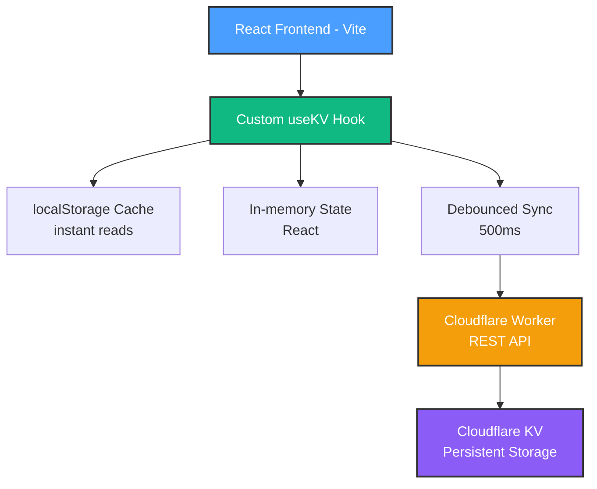

# 🏠 HomeHub - Smart Home Automation Dashboard

**iOS-inspired home automation control center** built with React 19 and Cloudflare infrastructure. Beautiful, fast, and ready for real device integration.

🚀 **Live Production App**: [homehub.andernet.dev](https://homehub.andernet.dev)


🚀 What's Inside?

- A clean, minimal Spark environment

- Pre-configured for local development

---- Ready to scale with your ideas

## 🎯 What is HomeHub?🧠 What Can You Do?

HomeHub is a **proof-of-concept framework** for DIY home automation. Currently powered by mock data, it's being built as the foundation for a production-ready personal home automation system.Right now, this is just a starting point — the perfect place to begin building and testing your Spark applications.

### ✨ Key Features🧹 Just Exploring?

No problem! If you were just checking things out and don’t need to keep this code:

- **iOS-Inspired UI**: OKLCH color system, spring animations, familiar interactions

- **11 Feature Sections**: Dashboard, Rooms, Scenes, Automations, Energy, Security, and more- Simply delete your Spark.

- **Visual Flow Designer**: Drag-and-drop automation builder (think Node-RED meets iOS)- Everything will be cleaned up — no traces left behind.

- **Edge-First Architecture**: Cloudflare Workers + KV for global performance

- **Offline-First**: localStorage cache for instant reads, optimistic UI updates📄 License For Spark Template Resources

- **Type-Safe**: Full TypeScript with JSDoc documentation

The Spark Template files and resources from GitHub are licensed under the terms of the MIT license, Copyright GitHub, Inc.

---

## 🚀 Quick Start

### Prerequisites

- Node.js 18+
- npm or yarn
- Cloudflare account (free tier works!)

### Installation

```bash
# Clone the repository
git clone https://github.com/yourusername/homehub.git
cd homehub

# Install dependencies
npm install

# Set up environment
cp .env.example .env
# Edit .env with your Cloudflare Worker URL

# Run locally
npm run dev
```

Open <http://localhost:5173> to see the app!

---

## 🏗️ Architecture



### Tech Stack

- **Frontend**: React 19, Vite 6, TypeScript 5.7
- **Backend**: Cloudflare Workers (serverless functions)
- **Database**: Cloudflare KV (key-value store)
- **UI**: shadcn/ui, Tailwind CSS 4, Framer Motion
- **Icons**: Phosphor Icons

---

## 📦 Project Structure

```text
homehub/
├── src/
│   ├── components/      # Feature components (Dashboard, Rooms, etc.)
│   ├── types/          # TypeScript definitions (100+ interfaces)
│   ├── constants/      # KV keys, mock data, icons
│   ├── hooks/          # Custom React hooks (useKV)
│   └── lib/            # API clients, utilities
├── workers/
│   └── src/
│       └── index.ts    # Cloudflare Worker (REST API)
├── docs/               # Comprehensive documentation
└── scripts/            # Automation scripts
```

---

## 🎨 Features Overview

### 1. Dashboard

Real-time device status, quick controls, energy insights, security alerts

### 2. Rooms

Organize devices by physical location, room-level controls

### 3. Scenes

One-touch automation (e.g., "Movie Time", "Good Morning", "Leaving Home")

### 4. Automations

Time-based and condition-based rules with schedule builder

### 5. Flow Designer

Visual automation builder with drag-and-drop nodes:

- **Triggers**: Time, device state, geofence, manual
- **Conditions**: If/then logic, thresholds, boolean operators
- **Actions**: Control devices, notifications, delays
- **100+ pre-built nodes** with mini-map navigation

### 6. Energy Monitoring

Track consumption, costs, identify energy hogs (Phase 4)

### 7. Security

Camera integration, event logging, arm/disarm system (Phase 5)

### 8. User Management

Multi-user support with role-based permissions (Phase 6)

### 9. Insights

AI-powered recommendations, pattern analysis (Phase 7)

### 10. Backup & Recovery

Export/import configurations, disaster recovery

### 11. Settings

Device preferences, notifications, integrations

---

## 🔧 Development

### Running the App

```bash
npm run dev              # Start Vite dev server
npm run build            # Production build
npm run preview          # Preview production build
npm run lint             # ESLint check
```

### Working with Cloudflare Workers

```bash
cd workers
npm install              # Install Worker dependencies
npm run dev              # Run Worker locally
npm run deploy           # Deploy to Cloudflare
```

### State Management Pattern

```tsx
import { useKV } from '@/hooks/use-kv'

// Persistent state (survives page refresh)
const [devices, setDevices] = useKV<Device[]>('devices', [])

// Update device
const toggleDevice = (id: string) => {
  setDevices(prev => prev.map(d => (d.id === id ? { ...d, enabled: !d.enabled } : d)))
  // UI updates instantly, syncs to Cloudflare KV in background
}
```

---

## 📚 Documentation

- **[Architecture Diagrams](docs/ARCHITECTURE.md)** - Complete visual system architecture
- **[Deployment Guide](docs/CLOUDFLARE_DEPLOYMENT.md)** - Step-by-step Cloudflare setup
- **[Migration Complete](docs/MIGRATION_COMPLETE.md)** - Spark → Cloudflare migration summary
- **[Migration Strategy](docs/CLOUDFLARE_MIGRATION.md)** - Technical migration details
- **[Copilot Instructions](.github/copilot-instructions.md)** - AI coding agent guidelines
- **[Best Practices](docs/BEST_PRACTICES.md)** - Code standards and patterns
- **[Refactor Plan](docs/REFACTOR_PLAN.md)** - Project reorganization roadmap

---

## 🗺️ Roadmap

### Phase 1: Foundation (Current) ✅

- iOS-inspired UI framework
- Mock data for all 11 sections
- Cloudflare infrastructure migration
- Type system and constants

### Phase 2: Device Integration (Q1 2026)

- MQTT broker setup
- HTTP/REST device adapters
- Real-time state sync
- Connect first physical device

### Phase 3: Automation Engine (Q2 2026)

- Time-based scheduler
- Condition evaluator
- Flow execution engine
- Geofencing (mobile)

### Phase 4: Energy & Monitoring (Q3 2026)

- Power metering integration
- Cost calculation
- Historical analytics
- AI insights

### Phase 5: Security & Surveillance (Q4 2026)

- Camera integration (RTSP/ONVIF)
- Motion detection
- Event notifications
- Smart locks

### Phase 6: Multi-User (Q1 2027)

- Authentication (OAuth)
- Role-based access
- User permissions
- Presence detection

### Phase 7: Voice & AI (Q2 2027)

- Alexa/Google Assistant
- Natural language control
- Predictive automation
- Pattern recognition

### Phase 8+: Advanced Features (2027+)

- Zigbee/Z-Wave support
- Custom integrations
- Mobile apps (React Native)
- Edge gateway (Raspberry Pi)

Full roadmap: [Copilot Instructions](.github/copilot-instructions.md#product-roadmap)

---

## 🎯 Current Status

**Phase**: 1 (Foundation)
**Progress**: 85% complete
**Next Milestone**: Deploy to Cloudflare Pages

**What Works**:

- ✅ All 11 UI sections render correctly
- ✅ Mock data for devices, rooms, scenes, automations
- ✅ Visual flow designer with 100+ nodes
- ✅ Cloudflare KV state persistence
- ✅ Type-safe codebase with JSDoc

**What's Next**:

- 🚧 Deploy Worker to Cloudflare
- 🚧 Connect Cloudflare Pages
- 📋 Device protocol research (Phase 2)

---

## 📚 Documentation

Comprehensive documentation is available in the [`docs/`](docs/) directory:

### Quick Links

- **🚀 [Getting Started](docs/guides/SETUP_QUICKSTART.md)** - Get running in 15 minutes
- **🏗️ [Architecture](docs/guides/ARCHITECTURE.md)** - System design and data flow
- **💻 [Best Practices](docs/guides/BEST_PRACTICES.md)** - Coding standards
- **🧪 [Testing Guide](docs/development/DISCOVERY_TEST_PLAN.md)** - Comprehensive test plan
- **🚀 [Deployment](docs/deployment/CLOUDFLARE_DEPLOYMENT.md)** - Deploy to production
- **📖 [Full Documentation Index](docs/INDEX.md)** - Complete catalog

### Documentation Structure

```
docs/
├── guides/         # User guides & references (13 files)
├── deployment/     # Production deployment (6 files)
├── development/    # Active work (9 files)
├── history/        # Completed features (24 files)
└── archive/        # Historical documents (13 files)
```

**See [`docs/README.md`](docs/README.md) for the complete documentation overview.**

---

## 🤝 Contributing

This is a personal project, but suggestions and feedback are welcome!

### Reporting Issues

- Use GitHub Issues for bugs or feature requests
- Include screenshots for UI issues
- Provide browser/OS info for compatibility issues

### Code Standards

- Follow TypeScript conventions in [`docs/guides/BEST_PRACTICES.md`](docs/guides/BEST_PRACTICES.md)
- Use `useKV` for persistent state (never `useState` for data that should persist)
- Import types from `@/types`
- Use Phosphor Icons exclusively
- See [`docs/guides/ARCHITECTURE.md`](docs/guides/ARCHITECTURE.md) for architectural patterns

---

## 📄 License

MIT License - Copyright (c) 2025

The Spark Template files and resources from GitHub are licensed under the terms of the MIT license, Copyright GitHub, Inc.

---

## 🙏 Acknowledgments

- **React Team**: For React 19 and modern patterns
- **Cloudflare**: For amazing free tier and edge network
- **shadcn**: For beautiful UI components
- **Phosphor Icons**: For comprehensive icon library
- **GitHub Copilot**: For AI-assisted development

---

## 📞 Contact

- **Issues**: <https://github.com/yourusername/homehub/issues>
- **Discussions**: <https://github.com/yourusername/homehub/discussions>

---

**Built with ❤️ and React 19** | **Powered by Cloudflare ⚡**
