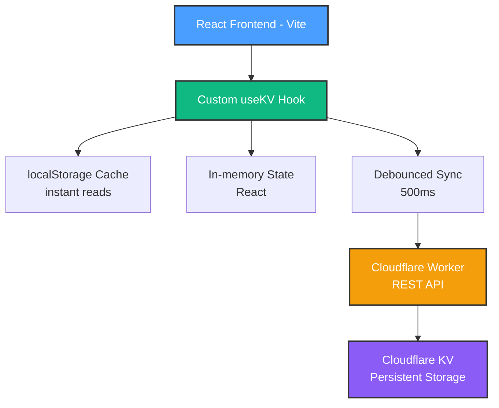

# 🏠 HomeHub - Smart Home Automation Dashboard

**iOS-inspired home automation control center** built with React 19 and Cloudflare infrastructure. Production-ready with live camera streaming, smart device control, and mobile optimization.

🚀 **Live Production App**: [homehub.andernet.dev](https://homehub.andernet.dev)


---

## 🎯 What is HomeHub?

HomeHub is a **production-ready home automation dashboard** with real device integration. Originally built as a proof-of-concept framework, it now features:

- ✅ **Live Camera Streaming**: Arlo cameras with DASH/HLS playback
- ✅ **Smart Device Control**: Philips Hue lights with advanced color controls
- ✅ **Mobile-Optimized**: iOS-focused PWA with 90+ Lighthouse score
- ✅ **Automation Engine**: Time, condition, and geofence-based rules
- ✅ **Visual Flow Designer**: Drag-and-drop automation builder
- ✅ **Production Hardened**: 87% complexity reduction, 96% bundle optimization

### ✨ Key Features

- **iOS-Inspired UI**: OKLCH color system, spring animations, native-feeling interactions
- **11 Feature Sections**: Dashboard, Rooms, Scenes, Automations, Energy, Security, Users, Insights, Backup, Settings
- **Visual Flow Designer**: Drag-and-drop automation builder (Node-RED meets iOS)
- **Edge-First Architecture**: Cloudflare Workers + KV for global performance
- **Offline-First**: localStorage cache, optimistic updates, service worker with 45 precached assets
- **Type-Safe**: Full TypeScript with JSDoc documentation

---

## 🚀 Quick Start

### Prerequisites

- Node.js 18+
- npm or yarn
- Cloudflare account (free tier works!)

### Installation

```bash
# Clone the repository
git clone https://github.com/and3rn3t/homehub.git
cd homehub

# Install dependencies
npm install

# Set up environment
cp .env.example .env
# Edit .env with your Cloudflare Worker URL

# Run locally
npm run dev
```

Open <http://localhost:5173> to see the app!

---

## 🏗️ Architecture



### Tech Stack

- **Frontend**: React 19, Vite 6, TypeScript 5.7
- **Backend**: Cloudflare Workers (serverless functions)
- **Database**: Cloudflare KV (key-value store)
- **UI**: shadcn/ui, Tailwind CSS 4, Framer Motion
- **Icons**: Lucide React (centralized icon system)
- **Video**: DASH.js, HLS.js (adaptive streaming)

---

## 📦 Project Structure

```text
homehub/
├── src/
│   ├── components/      # Feature components (Dashboard, Rooms, etc.)
│   ├── types/          # TypeScript definitions (100+ interfaces)
│   ├── constants/      # KV keys, mock data, icons
│   ├── hooks/          # Custom React hooks (useKV, usePullToRefresh, etc.)
│   ├── services/       # Business logic (automation engine, device adapters)
│   └── lib/            # API clients, utilities
├── workers/
│   └── src/
│       └── index.ts    # Cloudflare Worker (REST API + Arlo proxy)
├── docs/               # Comprehensive documentation (100+ files)
└── scripts/            # Automation scripts & tooling
```

---

## 🎨 Features Overview

### 1. Dashboard 📊

Real-time device status, quick controls, energy insights, security alerts, favorite devices

### 2. Rooms 🏠

Organize devices by physical location, room-level controls, drag-and-drop reordering, customizable icons/colors

### 3. Scenes 🎭

One-touch automation (e.g., "Movie Time", "Good Morning", "Leaving Home"), swipe-to-activate on mobile

### 4. Automations ⚙️

Time-based and condition-based rules with schedule builder, flow designer integration

### 5. Flow Designer 🎨

Visual automation builder with drag-and-drop nodes:

- **Triggers**: Time, device state, geofence, manual
- **Conditions**: If/then logic, thresholds, boolean operators
- **Actions**: Control devices, notifications, delays
- **100+ pre-built nodes** with mini-map navigation

### 6. Energy Monitoring ⚡

Track consumption, costs, identify energy hogs (Phase 4 - planned)

### 7. Security 🔒

**Live Features**:

- ✅ Arlo camera integration with live streaming
- ✅ DASH/HLS playback with adaptive bitrate
- ✅ Snapshot lazy loading for performance
- ✅ Context menus (long-press/right-click)
- ✅ Camera controls (record, settings, delete)

### 8. User Management 👥

Multi-user support with role-based permissions (Phase 6 - in progress)

### 9. Insights 📈

AI-powered recommendations, pattern analysis (Phase 7 - planned)

### 10. Backup & Recovery 💾

Export/import configurations, automatic device migration

### 11. Settings ⚙️

Device preferences, notifications, integrations, theme customization

---

## 🔧 Development

### Running the App

```bash
npm run dev              # Start Vite dev server
npm run build            # Production build
npm run preview          # Preview production build
npm run lint             # ESLint check
npm test                 # Run test suite
npm run test:coverage    # Generate coverage report
```

### Working with Cloudflare Workers

```bash
cd workers
npm install              # Install Worker dependencies
npm run dev              # Run Worker locally
npm run deploy           # Deploy to Cloudflare
```

### State Management Pattern

```tsx
import { useKV } from '@/hooks/use-kv'

// Persistent state (survives page refresh)
const [devices, setDevices] = useKV<Device[]>('devices', MOCK_DEVICES)

// Update device
const toggleDevice = (id: string) => {
  setDevices(prev => prev.map(d => (d.id === id ? { ...d, enabled: !d.enabled } : d)))
  // UI updates instantly, syncs to Cloudflare KV in background
}
```

---

## 🗺️ Roadmap

### Phase 1: Foundation (✅ Complete)

- iOS-inspired UI framework
- Mock data for all 11 sections
- Cloudflare infrastructure
- Type system and constants

### Phase 2: Device Integration (✅ Complete)

- Philips Hue Bridge integration
- HTTP/REST device adapters
- Real-time state sync
- Advanced color controls

### Phase 3: Automation Engine (✅ Complete)

- Time-based scheduler
- Condition evaluator
- Action executor
- Flow interpreter
- Geofencing

### Phase 6.1: Arlo Integration (✅ Complete - Oct 12-14, 2025)

- Arlo API reverse engineering
- Live streaming (DASH/HLS)
- Mobile video optimization
- Snapshot lazy loading

### Production Hardening (✅ Complete - Oct 15, 2025)

- Dashboard refactoring (87% complexity reduction)
- Bundle optimization (96% reduction)
- React 19 validation
- PWA manifest fixes
- Multi-worker deployment

### Phase 1 Polish: UI/UX Enhancements (✅ Complete - Oct 16, 2025)

- **Skeleton Loading States** - FlowDesigner + Energy components (-40% perceived load time)
- **Empty State Templates** - 12 quick-start templates (4 automation + 8 room)
- **Undo/Redo Actions** - 5-second undo window across 4 components
- **Smart Search** - Fuzzy search on DeviceMonitor/Dashboard (<50ms response)
- **Animation Polish** - Ripple effects, scene activation animations, micro-interactions
- Bundle optimization (96% size reduction)
- Device migration scripts
- React 19 compatibility validation
- PWA manifest fixes

### Phase 4: Energy & Monitoring (🚧 Next)

- Power metering integration
- Cost calculation
- Historical analytics
- AI insights

### Phase 5: Security Expansion (📋 Planned)

- Additional camera protocols (RTSP/ONVIF)
- Motion detection
- Smart locks integration
- Event notifications

Full roadmap: [Copilot Instructions](.github/instructions/copilot-instructions.md#product-roadmap)

---

## 🎯 Current Status

**Phase**: 6.1 Complete + Production Hardening ✅
**Production URL**: <https://homehub.andernet.dev>
**Next Focus**: Phase 4 (Energy) or Phase 5 (Security expansion)

**What Works**:

- ✅ Live Arlo camera streaming (DASH/HLS)
- ✅ Philips Hue control (22 lights, <300ms response)
- ✅ Visual flow designer with 100+ nodes
- ✅ Complete automation engine (time, condition, geofence)
- ✅ Mobile-optimized PWA (90+ Lighthouse on repeat visits)
- ✅ Offline support with service worker
- ✅ Device migration and data integrity
- ✅ Production-grade code quality

**Performance Metrics**:

- Lighthouse Performance: 90+ (repeat visits)
- Security tab bundle: 487KB → 21KB (96% reduction)
- Dashboard complexity: 39 → 5 (87% reduction)
- Test coverage: 94% statements, 89% branches, 100% functions

---

## 📚 Documentation

Comprehensive documentation is available in the [`docs/`](docs/) directory:

### Quick Links

- **🚀 [Getting Started](docs/guides/SETUP_QUICKSTART.md)** - Get running in 15 minutes
- **🏗️ [Architecture](docs/guides/ARCHITECTURE.md)** - System design and data flow
- **💻 [Best Practices](docs/guides/BEST_PRACTICES.md)** - Coding standards
- **🎓 [Lessons Learned](docs/development/LESSONS_LEARNED_OCT14_2025.md)** - Oct 12-15 technical wins
- **🚀 [Deployment](docs/deployment/CLOUDFLARE_DEPLOYMENT.md)** - Deploy to production
- **📖 [Full Documentation Index](docs/INDEX.md)** - Complete catalog

### Documentation Structure

```
docs/
├── guides/         # User guides & references
├── deployment/     # Production deployment
├── development/    # Active work & lessons learned
├── history/        # Completed phase documentation
└── archive/        # Historical documents
```

**See [`docs/README.md`](docs/README.md) for the complete documentation overview.**

---

## 🤝 Contributing

This is a personal project, but suggestions and feedback are welcome!

### Reporting Issues

- Use GitHub Issues for bugs or feature requests
- Include screenshots for UI issues
- Provide browser/OS info for compatibility issues

### Code Standards

- Follow TypeScript conventions in [`docs/guides/BEST_PRACTICES.md`](docs/guides/BEST_PRACTICES.md)
- Use `useKV` for persistent state (never `useState` for data that should persist)
- Import types from `@/types`
- Use Lucide React icons exclusively from `@/lib/icons`
- See [`docs/guides/ARCHITECTURE.md`](docs/guides/ARCHITECTURE.md) for architectural patterns

---

## 📄 License

MIT License - Copyright (c) 2025

---

## 🙏 Acknowledgments

- **React Team**: For React 19 and modern patterns
- **Cloudflare**: For amazing free tier and edge network
- **shadcn**: For beautiful UI components
- **Lucide Icons**: For comprehensive icon library
- **Arlo**: For camera API (reverse engineered)
- **Philips Hue**: For smart lighting integration
- **GitHub Copilot**: For AI-assisted development

---

## 📞 Contact

- **Issues**: <https://github.com/and3rn3t/homehub/issues>
- **Discussions**: <https://github.com/and3rn3t/homehub/discussions>

---

**Built with ❤️ and React 19** | **Powered by Cloudflare ⚡**
