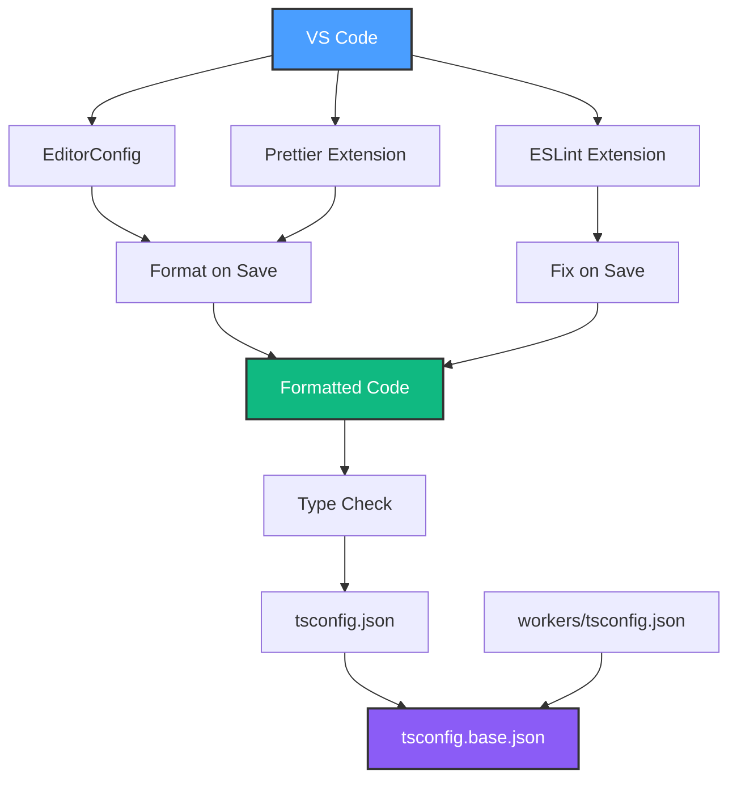
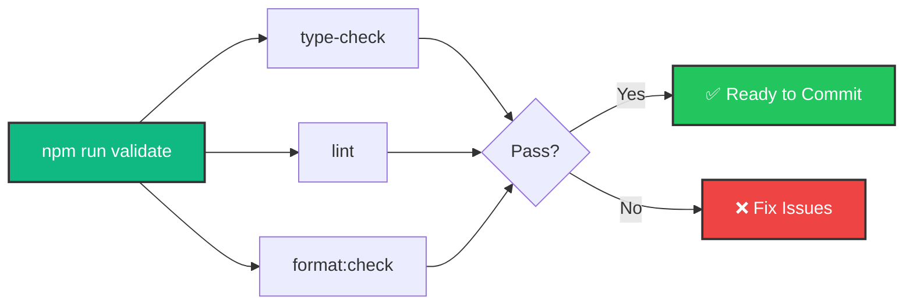

# ✅ Configuration Synchronization Complete

## Summary of Changes

I've successfully added and synchronized multiple configuration files across your HomeHub project to ensure consistency, better tooling integration, and improved developer experience.

---

## 📦 What Was Added

### 1. **Code Quality & Formatting**

| File               | Purpose                       | Synchronizes                        |
| ------------------ | ----------------------------- | ----------------------------------- |
| `eslint.config.js` | JavaScript/TypeScript linting | Code quality rules across project   |
| `.prettierrc.json` | Code formatting               | Style consistency                   |
| `.prettierignore`  | Prettier exclusions           | Which files to skip                 |
| `.editorconfig`    | Editor settings               | Basic formatting across all editors |

### 2. **TypeScript Configuration**

| File                    | Purpose          | Extends                 |
| ----------------------- | ---------------- | ----------------------- |
| `tsconfig.base.json`    | Shared TS config | N/A (base)              |
| `tsconfig.json`         | Frontend config  | `tsconfig.base.json`    |
| `workers/tsconfig.json` | Worker config    | `../tsconfig.base.json` |

### 3. **VS Code Integration**

| File                      | Purpose                                   |
| ------------------------- | ----------------------------------------- |
| `.vscode/settings.json`   | Workspace settings (format on save, etc.) |
| `.vscode/extensions.json` | Recommended extensions list               |

### 4. **Environment & Types**

| File                 | Purpose                         |
| -------------------- | ------------------------------- |
| `src/types/env.d.ts` | Type-safe environment variables |
| `.gitignore`         | Enhanced exclusion patterns     |

### 5. **Documentation**

| File                        | Purpose                                    |
| --------------------------- | ------------------------------------------ |
| `docs/CONFIGURATION.md`     | Complete configuration guide with diagrams |
| `CONFIGURATION_QUICKREF.md` | Quick reference card                       |

---

## 🔄 What's Synchronized

### TypeScript Settings

```
tsconfig.base.json
    ├── Strict type checking enabled
    ├── ES2022 target
    ├── Bundler module resolution
    └── Common linting rules
         ├─→ tsconfig.json (Frontend)
         │    └── React JSX support
         │    └── DOM types
         │    └── Path aliases (@/*)
         └─→ workers/tsconfig.json (Worker)
              └── Cloudflare Workers types
              └── No DOM types
              └── Composite build
```

**Benefits**:

- ✅ Consistent compiler behavior
- ✅ Shared strict type checking
- ✅ Environment-specific overrides when needed
- ✅ Build optimization with project references

### Code Style

**EditorConfig** → **Prettier** → **ESLint**

All three work together:

1. **EditorConfig**: Basic rules (indentation, line endings)
2. **Prettier**: Code formatting (quotes, semicolons, line width)
3. **ESLint**: Code quality (unused vars, React hooks rules)

**Benefits**:

- ✅ Consistent style across all editors
- ✅ Auto-fix on save in VS Code
- ✅ Pre-commit validation with `npm run validate`

### Development Environment

**VS Code Settings** enforce:

- Format on save (Prettier)
- ESLint auto-fix on save
- Organize imports on save
- TypeScript workspace version
- Tailwind CSS IntelliSense config

**Benefits**:

- ✅ Zero-config setup for new developers
- ✅ Instant feedback on code issues
- ✅ Consistent experience across team

---

## 🎯 New Commands Available

Add these to your workflow:

```bash
# Development
npm run dev                  # Start frontend (port 5173)
npm run worker:dev           # Start worker (port 8787)

# Code Quality
npm run lint                 # Check for linting errors
npm run lint:fix             # Auto-fix linting errors
npm run format               # Format all code
npm run format:check         # Verify formatting

# Type Safety
npm run type-check           # Run TypeScript compiler check
npm run type-check:watch     # Watch mode for type checking

# Complete Validation
npm run validate             # Run all checks (types + lint + format)

# Deployment
npm run build                # Build frontend
npm run worker:deploy        # Deploy worker to Cloudflare
```

---

## 📝 What Changed in Existing Files

### `package.json`

- ✅ Added `prettier` and `prettier-plugin-tailwindcss` as dev dependencies
- ✅ Added new scripts: `lint:fix`, `format`, `format:check`, `type-check`, `validate`

### `tsconfig.json`

- ✅ Now extends `tsconfig.base.json` for shared settings
- ✅ Added project references to `workers/tsconfig.json`
- ✅ Cleaner with less duplication

### `workers/tsconfig.json`

- ✅ Now extends `../tsconfig.base.json`
- ✅ Changed `moduleResolution` from `node` to `bundler` (fixed deprecation warning)
- ✅ Added `composite: true` for project references

### `.gitignore`

- ✅ Better organization with comments
- ✅ Added Cloudflare-specific patterns (`.wrangler`, `.dev.vars`)
- ✅ Added TypeScript build info (`.tsbuildinfo`)
- ✅ Environment file patterns
- ✅ VS Code settings exceptions

---

## 🎨 Code Style Standards (Now Enforced)

### Formatting

- **Indentation**: 2 spaces
- **Quotes**: Single quotes (`'not "`)
- **Semicolons**: None (`;`)
- **Line Width**: 100 characters
- **Line Endings**: LF (`\n`)
- **Trailing Commas**: ES5 compatible

### TypeScript

- **Strict mode**: Enabled
- **No implicit any**: Warning
- **Unused variables**: Warning (with `_` prefix exception)
- **Path aliases**: Always use `@/*` for imports

### React

- **Hooks**: ESLint rules enforced
- **Fast Refresh**: Export rules enforced
- **JSX**: `react-jsx` runtime (no `import React`)

---

## 🚀 Getting Started (Updated Flow)

### First Time Setup

```bash
# 1. Install all dependencies
npm install
cd workers && npm install && cd ..

# 2. Copy environment template
cp .env.example .env
# Edit .env with your Worker URL

# 3. Open in VS Code
code .
# Install recommended extensions when prompted

# 4. Verify everything works
npm run validate
```

### Daily Development

```bash
# Start both servers
npm run dev              # Terminal 1: Frontend
npm run worker:dev       # Terminal 2: Worker

# Before committing
npm run validate         # Check everything
git add .
git commit -m "feat: add new feature"
```

---

## 🔍 Integration Points

### How Tools Work Together



### Validation Pipeline



---

## 🎯 Benefits Summary

### For You (Solo Developer)

- ✅ **Consistent code style** without thinking about it
- ✅ **Catch errors early** with TypeScript + ESLint
- ✅ **Auto-formatting** saves time
- ✅ **Type-safe environment variables**
- ✅ **One command validation** before commits

### For Future Contributors

- ✅ **Zero-config setup** - just clone and install
- ✅ **Clear standards** documented and enforced
- ✅ **VS Code optimized** for best experience
- ✅ **Shared TypeScript config** prevents drift

### For Production

- ✅ **Type safety** reduces runtime errors
- ✅ **Consistent builds** across environments
- ✅ **Better debugging** with source maps
- ✅ **Optimized bundles** with proper tree-shaking

---

## 📚 Documentation

All configuration details are documented in:

1. **[docs/CONFIGURATION.md](./docs/CONFIGURATION.md)** - Complete guide with examples and troubleshooting
2. **[CONFIGURATION_QUICKREF.md](./CONFIGURATION_QUICKREF.md)** - Quick reference card
3. **In-file comments** - Each config file has explanatory comments

---

## 🔮 Next Steps

### Recommended Follow-ups

1. **Install VS Code Extensions**:

   ```bash
   # Open VS Code, install recommended extensions when prompted
   code .
   ```

2. **Run Initial Validation**:

   ```bash
   npm run validate
   ```

3. **Format Existing Code**:

   ```bash
   npm run format
   ```

4. **Commit Configuration**:

   ```bash
   git add .
   git commit -m "chore: add project configuration and tooling"
   ```

### Optional Enhancements

Consider adding in the future:

- **Husky**: Git hooks for pre-commit validation
- **lint-staged**: Only lint changed files
- **Commitlint**: Enforce conventional commit messages
- **Jest**: Unit testing framework
- **Playwright**: E2E testing

---

## 🐛 Troubleshooting

### "TypeScript errors after adding configs"

```bash
# Clear TypeScript cache
rm -rf node_modules/.cache
rm -rf node_modules/.tmp
npm run type-check
```

### "ESLint not working in VS Code"

1. Install `dbaeumer.vscode-eslint` extension
2. Reload window: `Ctrl+Shift+P` → "Reload Window"
3. Check output: `Ctrl+Shift+P` → "ESLint: Show Output Channel"

### "Prettier not formatting"

1. Install `esbenp.prettier-vscode` extension
2. Set as default: `Ctrl+Shift+P` → "Format Document With..." → "Prettier"
3. Check `.prettierrc.json` exists in root

---

## ✨ Summary

Your project now has:

- ✅ Unified TypeScript configuration
- ✅ Automated code formatting (Prettier)
- ✅ Code quality checks (ESLint)
- ✅ Editor consistency (EditorConfig)
- ✅ VS Code integration
- ✅ Type-safe environment variables
- ✅ Comprehensive documentation
- ✅ Easy validation workflow

Everything is synchronized and ready for production development! 🚀
