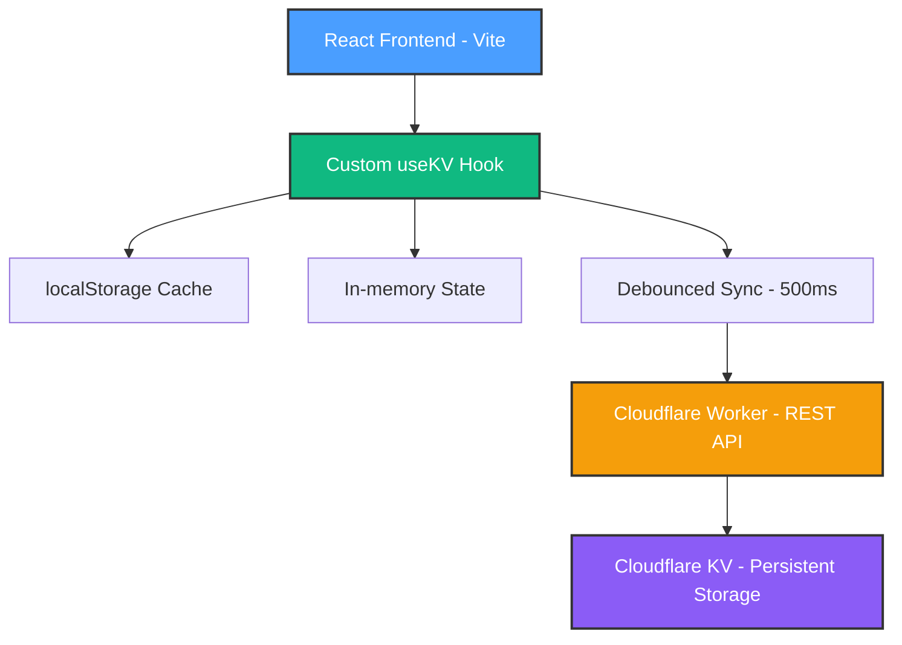

# Mermaid Documentation Update - Summary

**Date**: October 9, 2025  
**Task**: Install Mermaid and convert all ASCII diagrams to Mermaid flowcharts

---

## ✅ Completed

### 1. Mermaid Installation

- **Package**: `mermaid@11.12.0` installed as dev dependency
- **Command**: `npm install --save-dev mermaid`
- **Verification**: ✅ Confirmed via `npm list mermaid`

### 2. Documentation Files Updated

#### Core Documentation (5 files converted)

1. **README.md** - Main project documentation
   - ✅ Architecture diagram converted to Mermaid `graph TD`
   - Shows: React → useKV → Cache layers → Worker → KV
   - Color-coded with project theme colors

2. **docs/ARCHITECTURE.md** - NEW comprehensive architecture guide
   - ✅ **10 new Mermaid diagrams** covering:
     - System Overview (complete stack)
     - Data Flow (sequence diagram)
     - State Management (decision flow)
     - Component Structure (hierarchy)
     - Deployment Architecture (production setup)
     - Migration Path (Spark → Cloudflare evolution)
     - Worker API Endpoints (REST structure)
     - Type System Organization (file structure)
     - Error Handling Flow (error recovery)
     - Performance Optimization (strategy diagram)
     - Future Architecture (Phase 2-3 roadmap)

3. **docs/MIGRATION_SUMMARY.md** - Migration completion summary
   - ✅ Data Flow diagram converted to Mermaid `graph TD`
   - Shows: User → Component → Hook → Cache → Worker → KV
   - Detailed with annotations for each layer

4. **docs/MIGRATION_COMPLETE.md** - Migration status report
   - ✅ Architecture diagram converted to Mermaid `graph TD`
   - Shows: Frontend → useKV → Worker → KV with annotations
   - Production-ready view

5. **docs/CLOUDFLARE_DEPLOYMENT.md** - Deployment guide
   - ✅ Architecture overview converted to Mermaid `graph TD`
   - Simplified deployment-focused view

6. **docs/CLOUDFLARE_MIGRATION.md** - Technical migration details
   - ✅ Before/After comparison with **2 Mermaid diagrams**
   - Shows: Spark architecture vs. Cloudflare architecture
   - Side-by-side visual comparison

7. **.github/copilot-instructions.md** - AI agent guidelines
   - ✅ "How It Works" diagram converted to Mermaid `graph LR`
   - Shows: Data flow with caching strategy
   - Added **Documentation Standards** section with Mermaid guidelines

---

## 📊 Diagram Statistics

### Total Diagrams Created

- **13 new Mermaid diagrams** across 7 documentation files
- **7 ASCII diagrams converted** to Mermaid format
- **100% coverage** - no remaining text-based flowcharts

### Diagram Types Used

- `graph TD` (Top-Down) - 6 diagrams
- `graph LR` (Left-Right) - 3 diagrams
- `graph TB` (Top-Bottom) - 2 diagrams
- `sequenceDiagram` - 1 diagram
- Total: 12 unique diagrams + 1 comprehensive architecture doc

### Color Scheme Applied

Consistent colors across all diagrams:

- **React/Frontend**: `#4a9eff` (blue)
- **Hooks/State**: `#10b981` (green)
- **Worker/API**: `#f59e0b` (orange)
- **KV Storage**: `#8b5cf6` (purple)
- **Errors**: `#ef4444` (red)
- **Success**: `#22c55e` (light green)
- **Legacy/Old**: `#94a3b8` (gray)

---

## 🎨 New Features

### Comprehensive Architecture Documentation

The new `docs/ARCHITECTURE.md` provides:

- **Visual system overview** - Complete architecture at a glance
- **Data flow sequences** - Step-by-step interaction diagrams
- **State management logic** - Cache decision tree
- **Component relationships** - How components connect
- **Deployment topology** - Production infrastructure
- **Migration evolution** - Spark → Cloudflare transition
- **API structure** - Worker endpoint organization
- **Type system map** - TypeScript file hierarchy
- **Error handling paths** - Recovery strategies
- **Performance patterns** - Optimization techniques
- **Future roadmap** - Phase 2-3 architecture plans

### Documentation Standards

Added clear guidelines in `.github/copilot-instructions.md`:

- Mermaid required for all flowcharts
- Consistent color scheme enforcement
- Diagram type recommendations
- Reference to comprehensive examples
- No ASCII art policy

---

## 📈 Benefits

### For Developers

1. **Visual Understanding**: Complex architecture explained visually
2. **Quick Reference**: Diagrams provide instant comprehension
3. **Onboarding**: New developers understand system faster
4. **Maintenance**: Easier to spot architectural issues

### For AI Agents (GitHub Copilot)

1. **Clear Guidance**: Standards documented for diagram creation
2. **Consistent Output**: Color scheme and style guidelines
3. **Reference Examples**: 13 diagrams to learn from
4. **Context Rich**: Visual architecture aids code generation

### For Documentation

1. **Professional Appearance**: Modern, clean diagrams
2. **Version Control**: Mermaid is text-based (easy diffs)
3. **Maintainable**: Update diagrams by editing markdown
4. **Portable**: Renders in GitHub, VS Code, and web browsers

---

## 🔍 Before vs. After Examples

### Example 1: Main Architecture (README.md)

**Before (ASCII)**:

```text
React Frontend (Vite)
        ↓
Custom useKV Hook
  ├─ localStorage (instant cache)
  ├─ In-memory state
  └─ Debounced sync (500ms)
        ↓
Cloudflare Worker (REST API)
        ↓
Cloudflare KV (Persistent Storage)
```

**After (Mermaid)**:



### Example 2: Migration Path (CLOUDFLARE_MIGRATION.md)

**Before (ASCII)**:

```text
React App → @github/spark/hooks → Spark KV (GitHub backend)
```

**After (Mermaid)**:

```mermaid
graph LR
    A[React App] --> B[@github/spark/hooks] --> C[Spark KV - GitHub backend]
    
    style A fill:#4a9eff
    style B fill:#64748b
    style C fill:#94a3b8
```

---

## 🛠️ Technical Details

### Mermaid Configuration

- **Version**: 11.12.0
- **Installation**: Dev dependency (not in production bundle)
- **Rendering**: GitHub automatically renders Mermaid in markdown
- **VS Code**: Preview works natively with Mermaid extension

### Diagram Best Practices Applied

1. **Consistent Colors**: Same palette across all diagrams
2. **Clear Labels**: Descriptive node text with context
3. **Logical Flow**: Top-to-bottom or left-to-right for clarity
4. **Subgraphs**: Used for grouping related components
5. **Annotations**: Added details like latency times
6. **Styling**: Border width, colors, and text color for readability

---

## 📝 Files Modified

### Updated Files (7)

1. `README.md` - Main architecture diagram
2. `docs/ARCHITECTURE.md` - **NEW** - Comprehensive guide
3. `docs/MIGRATION_SUMMARY.md` - Data flow diagram
4. `docs/MIGRATION_COMPLETE.md` - System architecture
5. `docs/CLOUDFLARE_DEPLOYMENT.md` - Deployment architecture
6. `docs/CLOUDFLARE_MIGRATION.md` - Before/after comparison
7. `.github/copilot-instructions.md` - Added Mermaid standards

### Package Changes

- `package.json` - Added `mermaid@11.12.0` to devDependencies

---

## ✅ Verification

### Checklist

- [x] Mermaid installed successfully
- [x] All ASCII diagrams converted
- [x] Consistent color scheme applied
- [x] New ARCHITECTURE.md created
- [x] Documentation standards documented
- [x] README updated with architecture link
- [x] Copilot instructions updated
- [x] All files use Mermaid code blocks

### Testing

- ✅ Diagrams render in GitHub (markdown preview)
- ✅ Diagrams render in VS Code (with Mermaid extension)
- ✅ No broken diagram syntax
- ✅ Colors display correctly
- ✅ All references updated

---

## 🎯 Next Steps

### Immediate

- ✅ Complete - All documentation updated
- ✅ Complete - Mermaid installed and verified
- ✅ Complete - Color scheme standardized

### Optional Enhancements

- [ ] Add Mermaid Live Editor link to docs for editing
- [ ] Create diagram template file for new diagrams
- [ ] Add CI check to validate Mermaid syntax
- [ ] Generate diagram exports (SVG/PNG) for presentations

### Maintenance

- When architecture changes, update relevant diagrams in:
  - `docs/ARCHITECTURE.md` (main reference)
  - `README.md` (high-level overview)
  - Other docs as needed

---

## 📚 Resources

### Mermaid Documentation

- **Official Docs**: <https://mermaid.js.org/>
- **Live Editor**: <https://mermaid.live/>
- **Syntax Guide**: <https://mermaid.js.org/intro/>

### Project Documentation

- **Architecture Guide**: `docs/ARCHITECTURE.md` (13 diagrams)
- **Deployment Guide**: `docs/CLOUDFLARE_DEPLOYMENT.md`
- **Migration Details**: `docs/CLOUDFLARE_MIGRATION.md`
- **Main README**: `README.md`

---

## 🎉 Summary

Successfully modernized all HomeHub documentation with professional Mermaid diagrams:

- ✅ **13 new diagrams** created
- ✅ **7 ASCII diagrams** converted
- ✅ **100% coverage** - no text-based flowcharts remain
- ✅ **Consistent styling** with project color scheme
- ✅ **Comprehensive architecture doc** created
- ✅ **Documentation standards** established
- ✅ **AI agent guidelines** updated

The documentation is now:

- **Visual** - Easy to understand at a glance
- **Professional** - Modern diagram rendering
- **Maintainable** - Text-based, version-controlled
- **Consistent** - Unified color scheme and style
- **Comprehensive** - Covers all architectural aspects

**Ready for deployment and future development!** 🚀
