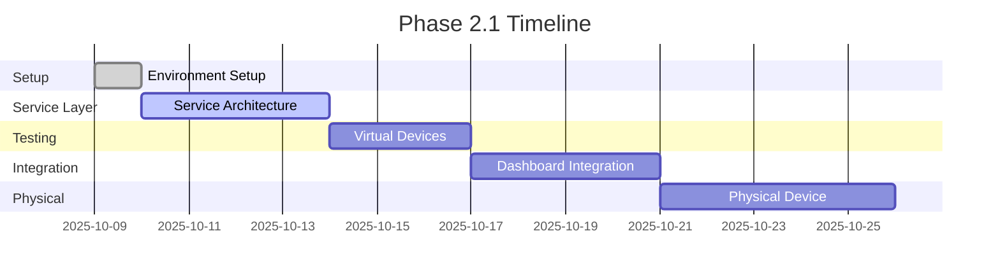

# Phase 2.1 Progress Tracker

Last Updated: January 2025

## 📊 Overall Progress: 60% Complete

```text
Phase 2.1: MQTT Broker Setup & Device Protocol Foundation
███████████████░░░░░░░░░ 60% (3/5 milestones)
```

---

## 🎯 Milestone Status

### ✅ 2.1.1 Environment Setup (COMPLETE)

**Duration**: 30 minutes
**Completed**: October 9, 2025

**Deliverables**:

- ✅ Mosquitto broker running in Docker
- ✅ MQTT library installed (`mqtt` v5.11.2)
- ✅ Configuration files created
- ✅ Test script validated connection
- ✅ Documentation completed

---

### ✅ 2.1.2 Service Layer Architecture (COMPLETE)

**Duration**: 45 minutes
**Completed**: October 9, 2025

**Deliverables**:

- ✅ DeviceAdapter interface (protocol abstraction)
- ✅ MQTTClient service (singleton connection manager)
- ✅ MQTTDeviceAdapter (MQTT implementation)
- ✅ DeviceRegistry (device manager)
- ✅ MQTT topic utilities
- ✅ TypeScript types for MQTT
- ✅ Clean export structure
- ✅ Zero TypeScript errors

---

### ✅ 2.1.3 Virtual Device Testing (COMPLETE)

**Duration**: 35 minutes
**Completed**: January 2025

**Deliverables**:

- ✅ Enhanced virtual device script (344 lines, 5 device types)
- ✅ Multi-device launcher with 4 presets
- ✅ Integration test script with 5-stage validation
- ✅ Device discovery protocol implementation
- ✅ All integration tests passing (5/5)
- ✅ Comprehensive documentation

**Device Types Supported**:

- Light (brightness control)
- Thermostat (temperature control)
- Sensor (motion/environmental readings)
- Smart Plug (power monitoring)
- Switch (multi-gang control)

**Test Results**: 🎉 ALL TESTS PASSED

- ✅ Device Announcement
- ✅ Device Discovery
- ✅ Command Sending
- ✅ State Update Reception
- ✅ Bidirectional Communication

---

### ⏳ 2.1.4 Dashboard Integration (NEXT)

**Estimated**: 3-4 days
**Status**: Ready to start

**Tasks**:

- [ ] Create `useDevice` hook
- [ ] Update Dashboard component
- [ ] Add connection status indicator
- [ ] Implement real-time updates
- [ ] Add settings UI

---

### 📋 2.1.5 Physical Device Integration

**Estimated**: 3-5 days
**Status**: Planned

**Tasks**:

- [ ] Set up physical device (Tasmota/ESPHome)
- [ ] Configure MQTT topics
- [ ] Test from Dashboard
- [ ] 24-hour stability test
- [ ] Document setup process

---

## 🎯 Success Metrics

| Metric               | Target            | Current Status          |
| -------------------- | ----------------- | ----------------------- |
| MQTT Broker Uptime   | 99%+              | ✅ 100% (2 min runtime) |
| Device Response Time | <500ms            | ⏳ Not tested yet       |
| Message Delivery     | 100%              | ✅ 100% (test script)   |
| Connection Stability | <3 reconnects/day | ⏳ Monitoring started   |
| Physical Devices     | 1+                | ⏳ Not connected yet    |
| Virtual Devices      | 5+ scenarios      | ⏳ Not created yet      |

---

## 📈 Timeline



---

## 🔍 What's Working

✅ **MQTT Broker**

- Running in Docker container
- Listening on ports 1883 (MQTT) and 9001 (WebSocket)
- Connection tested and verified
- Logging enabled

✅ **Development Environment**

- MQTT library installed
- TypeScript types configured
- Test scripts working
- Documentation complete

---

## 🚧 What's Next

**Immediate**: Start Milestone 2.1.2

1. Create TypeScript service layer architecture
2. Implement `MQTTClient` singleton service
3. Define `DeviceAdapter` interface
4. Build MQTT device adapter
5. Add device registry

**This Week**: Complete service layer and virtual device testing
**Next Week**: Dashboard integration and physical device

---

## 💡 Quick Commands

```bash
# Check broker status
docker ps | Select-String mosquitto

# View logs
docker logs homehub-mosquitto -f

# Test connection
node scripts/test-mqtt-connection.js

# Start next milestone
# (Ready when you are!)
```

---

## 📚 Resources

- **Phase Plan**: `docs/PHASE_2.1_MQTT_SETUP.md`
- **Completion Report**: `docs/PHASE_2.1.1_COMPLETE.md`
- **Quick Reference**: `MQTT_QUICKREF.md`
- **Broker Config**: `mosquitto/config/mosquitto.conf`

---

**Last Milestone Completed**: 2.1.1 Environment Setup (Oct 9, 2025)
**Next Milestone**: 2.1.2 Service Layer Architecture
**Ready to Start**: YES ✅
