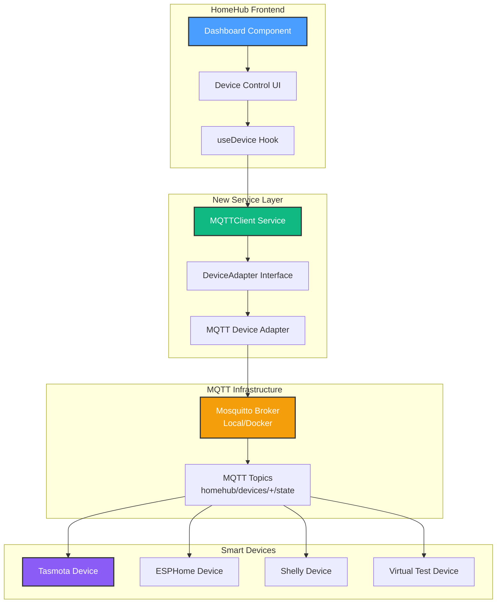
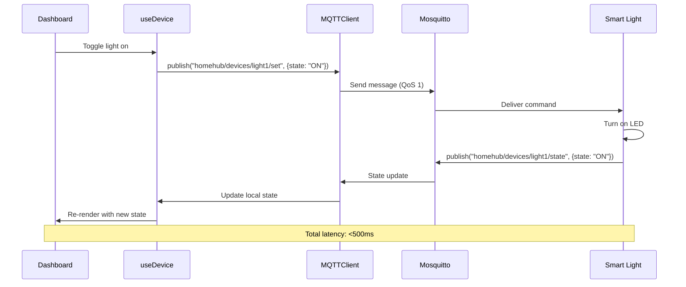

# Phase 2.1: MQTT Broker Setup & Device Protocol Foundation

**Status**: 📋 Planning
**Start Date**: October 2025
**Estimated Duration**: 2-3 weeks
**Goal**: Connect HomeHub to real smart home devices via MQTT protocol

---

## 🎯 Executive Summary

Phase 2.1 marks HomeHub's transition from a UI framework to a functional smart home system. This phase establishes the **Device Protocol Integration** layer, starting with MQTT as the primary communication protocol. By the end of this phase, you'll control at least one physical smart device from the HomeHub dashboard.

**Key Objectives**:

1. Install and configure Mosquitto MQTT broker
2. Implement `MQTTClient` service class for pub/sub messaging
3. Create device discovery mechanism via MQTT topic scanning
4. Test with virtual MQTT devices before connecting physical hardware
5. Connect and control your first physical device (smart light recommended)

---

## 📊 Success Metrics

| Metric                      | Target            | Validation Method                      |
| --------------------------- | ----------------- | -------------------------------------- |
| MQTT Broker Uptime          | 99%+              | 7-day monitoring                       |
| Device Response Time        | <500ms            | Dashboard toggle → device state change |
| Message Delivery            | 100%              | QoS 1 guaranteed delivery              |
| Connection Stability        | <3 reconnects/day | Log analysis                           |
| Physical Devices Controlled | 1+                | Manual testing                         |
| Virtual Device Tests        | 5+ scenarios      | Automated test suite                   |

---

## 🏗️ Architecture Overview



### Data Flow



---

## 🛠️ Implementation Milestones

### Milestone 2.1.1: Environment Setup (2-3 days)

**Objective**: Install MQTT broker and development tools

#### Tasks

1. **Install Mosquitto Broker**
   - **Option A - Windows Native** (Recommended for dev):

     ```powershell
     # Download from: https://mosquitto.org/download/
     # Or use Chocolatey:
     choco install mosquitto
     ```

   - **Option B - Docker** (Better for production):

     ```powershell
     # Create docker-compose.yml in project root
     docker-compose up -d mosquitto
     ```

2. **Configure Broker**
   - Create `mosquitto.conf` with authentication
   - Set up persistence for message storage
   - Configure WebSocket support for browser clients
   - Enable logging for development

3. **Install MQTT Development Tools**

   ```powershell
   # MQTT Explorer (GUI client for testing)
   choco install mqtt-explorer

   # Mosquitto CLI clients (for terminal testing)
   # Included with Mosquitto installation
   ```

4. **Install Node.js MQTT Library**

   ```powershell
   cd c:\git\homehub
   npm install mqtt --save
   npm install @types/mqtt --save-dev
   ```

#### Deliverables

- ✅ Mosquitto broker running on `localhost:1883`
- ✅ MQTT Explorer connected and can send/receive test messages
- ✅ `mosquitto.conf` configured with security settings
- ✅ `docker-compose.yml` (if using Docker)

#### Configuration Files

**`mosquitto.conf` (Basic)**:

```conf
# Mosquitto configuration for HomeHub

# Listeners
listener 1883 127.0.0.1
protocol mqtt

listener 9001
protocol websockets

# Security (start without password for dev)
allow_anonymous true

# Persistence
persistence true
persistence_location /var/lib/mosquitto/

# Logging
log_dest file /var/log/mosquitto/mosquitto.log
log_type all
log_timestamp true
```

**`docker-compose.yml`**:

```yaml
version: '3.8'

services:
  mosquitto:
    image: eclipse-mosquitto:2.0
    container_name: homehub-mosquitto
    ports:
      - '1883:1883' # MQTT
      - '9001:9001' # WebSocket
    volumes:
      - ./mosquitto/config:/mosquitto/config
      - ./mosquitto/data:/mosquitto/data
      - ./mosquitto/log:/mosquitto/log
    restart: unless-stopped
```

---

### Milestone 2.1.2: Service Layer Architecture (3-4 days)

**Objective**: Create abstraction layer for device communication

#### Tasks

1. **Create `DeviceAdapter` Interface**
   - Define contract for all device protocols
   - Support for connect, disconnect, send command, listen for state
   - Error handling and reconnection logic

2. **Implement `MQTTClient` Service**
   - Singleton pattern for broker connection
   - Connection management with auto-reconnect
   - Topic subscription/unsubscription
   - Message publishing with QoS levels

3. **Create `MQTTDeviceAdapter`**
   - Implements `DeviceAdapter` interface
   - Maps HomeHub device types to MQTT topics
   - Translates commands to MQTT payloads
   - Parses incoming state updates

4. **Add Device Registry**
   - In-memory map of device ID → adapter instance
   - Auto-discovery of new devices
   - Health monitoring (last seen, connection state)

#### File Structure

```
src/
├── services/
│   ├── device/
│   │   ├── DeviceAdapter.ts          # Interface definition
│   │   ├── MQTTDeviceAdapter.ts      # MQTT implementation
│   │   ├── DeviceRegistry.ts         # Device management
│   │   └── index.ts                  # Exports
│   ├── mqtt/
│   │   ├── MQTTClient.ts             # Core MQTT client
│   │   ├── MQTTConfig.ts             # Configuration
│   │   ├── MQTTTopics.ts             # Topic naming conventions
│   │   └── index.ts                  # Exports
│   └── index.ts                      # Service layer exports
├── hooks/
│   ├── use-device.ts                 # NEW: Device control hook
│   ├── use-mqtt-connection.ts        # NEW: Connection status hook
│   └── index.ts                      # Update exports
```

#### Code Scaffolds

**`src/services/device/DeviceAdapter.ts`**:

```typescript
/**
 * Device Adapter Interface
 *
 * Contract for all device protocol implementations.
 * Each protocol (MQTT, HTTP, Zigbee, etc.) must implement this interface.
 */

import type { Device } from '@/types'

export interface DeviceCommand {
  deviceId: string
  command: 'toggle' | 'set_value' | 'get_state'
  value?: number | boolean | string
  metadata?: Record<string, unknown>
}

export interface DeviceStateUpdate {
  deviceId: string
  enabled: boolean
  value?: number
  status: 'online' | 'offline' | 'warning' | 'error'
  lastSeen: Date
  metadata?: Record<string, unknown>
}

export interface DeviceAdapter {
  /**
   * Unique identifier for this adapter type
   */
  readonly protocol: string

  /**
   * Connect to device or broker
   */
  connect(): Promise<void>

  /**
   * Disconnect from device or broker
   */
  disconnect(): Promise<void>

  /**
   * Send command to device
   */
  sendCommand(command: DeviceCommand): Promise<void>

  /**
   * Subscribe to device state updates
   * @param callback Function called when device state changes
   * @returns Unsubscribe function
   */
  onStateUpdate(deviceId: string, callback: (state: DeviceStateUpdate) => void): () => void

  /**
   * Discover devices on the network
   * @returns List of discovered devices
   */
  discoverDevices(): Promise<Device[]>

  /**
   * Check if adapter is connected
   */
  isConnected(): boolean
}
```

**`src/services/mqtt/MQTTClient.ts`**:

```typescript
/**
 * MQTT Client Service
 *
 * Singleton service for managing MQTT broker connection.
 * Handles auto-reconnect, message routing, and connection state.
 */

import mqtt, { type MqttClient, type IClientOptions } from 'mqtt'
import { EventEmitter } from 'events'

export interface MQTTConfig {
  brokerUrl: string // 'mqtt://localhost:1883' or 'ws://localhost:9001'
  clientId?: string
  username?: string
  password?: string
  reconnectPeriod?: number // Default 5000ms
  connectTimeout?: number // Default 30000ms
}

export class MQTTClientService extends EventEmitter {
  private static instance: MQTTClientService | null = null
  private client: MqttClient | null = null
  private config: MQTTConfig
  private subscriptions: Map<string, Set<(message: string) => void>> = new Map()

  private constructor(config: MQTTConfig) {
    super()
    this.config = {
      reconnectPeriod: 5000,
      connectTimeout: 30000,
      clientId: `homehub-${Math.random().toString(16).slice(2, 8)}`,
      ...config,
    }
  }

  /**
   * Get singleton instance
   */
  static getInstance(config?: MQTTConfig): MQTTClientService {
    if (!MQTTClientService.instance) {
      if (!config) {
        throw new Error('MQTTClientService: config required for first initialization')
      }
      MQTTClientService.instance = new MQTTClientService(config)
    }
    return MQTTClientService.instance
  }

  /**
   * Connect to MQTT broker
   */
  async connect(): Promise<void> {
    if (this.client?.connected) {
      console.log('[MQTT] Already connected')
      return
    }

    return new Promise((resolve, reject) => {
      const options: IClientOptions = {
        clientId: this.config.clientId,
        username: this.config.username,
        password: this.config.password,
        reconnectPeriod: this.config.reconnectPeriod,
        connectTimeout: this.config.connectTimeout,
        clean: true,
      }

      this.client = mqtt.connect(this.config.brokerUrl, options)

      this.client.on('connect', () => {
        console.log('[MQTT] Connected to broker:', this.config.brokerUrl)
        this.emit('connected')
        resolve()
      })

      this.client.on('error', error => {
        console.error('[MQTT] Connection error:', error)
        this.emit('error', error)
        reject(error)
      })

      this.client.on('message', (topic, payload) => {
        const message = payload.toString()
        console.log(`[MQTT] Received on ${topic}:`, message)

        // Route to topic-specific handlers
        const handlers = this.subscriptions.get(topic)
        if (handlers) {
          handlers.forEach(handler => handler(message))
        }

        // Emit global message event
        this.emit('message', { topic, message })
      })

      this.client.on('disconnect', () => {
        console.log('[MQTT] Disconnected from broker')
        this.emit('disconnected')
      })

      this.client.on('reconnect', () => {
        console.log('[MQTT] Reconnecting to broker...')
        this.emit('reconnecting')
      })
    })
  }

  /**
   * Disconnect from MQTT broker
   */
  async disconnect(): Promise<void> {
    if (!this.client) return

    return new Promise(resolve => {
      this.client!.end(false, {}, () => {
        console.log('[MQTT] Disconnected cleanly')
        this.client = null
        resolve()
      })
    })
  }

  /**
   * Publish message to topic
   */
  async publish(topic: string, message: string | object, qos: 0 | 1 | 2 = 1): Promise<void> {
    if (!this.client?.connected) {
      throw new Error('MQTT client not connected')
    }

    const payload = typeof message === 'string' ? message : JSON.stringify(message)

    return new Promise((resolve, reject) => {
      this.client!.publish(topic, payload, { qos }, error => {
        if (error) {
          console.error(`[MQTT] Publish error on ${topic}:`, error)
          reject(error)
        } else {
          console.log(`[MQTT] Published to ${topic}:`, payload)
          resolve()
        }
      })
    })
  }

  /**
   * Subscribe to topic
   */
  subscribe(topic: string, handler: (message: string) => void): () => void {
    if (!this.client?.connected) {
      throw new Error('MQTT client not connected')
    }

    // Add handler to subscriptions map
    if (!this.subscriptions.has(topic)) {
      this.subscriptions.set(topic, new Set())

      // Subscribe to topic on broker
      this.client.subscribe(topic, { qos: 1 }, error => {
        if (error) {
          console.error(`[MQTT] Subscribe error on ${topic}:`, error)
        } else {
          console.log(`[MQTT] Subscribed to ${topic}`)
        }
      })
    }

    this.subscriptions.get(topic)!.add(handler)

    // Return unsubscribe function
    return () => {
      const handlers = this.subscriptions.get(topic)
      if (handlers) {
        handlers.delete(handler)

        // If no more handlers, unsubscribe from broker
        if (handlers.size === 0) {
          this.subscriptions.delete(topic)
          this.client?.unsubscribe(topic, error => {
            if (error) {
              console.error(`[MQTT] Unsubscribe error on ${topic}:`, error)
            } else {
              console.log(`[MQTT] Unsubscribed from ${topic}`)
            }
          })
        }
      }
    }
  }

  /**
   * Check if connected to broker
   */
  isConnected(): boolean {
    return this.client?.connected ?? false
  }

  /**
   * Get connection state
   */
  getState(): 'connected' | 'disconnected' | 'reconnecting' | 'offline' {
    if (!this.client) return 'offline'
    if (this.client.connected) return 'connected'
    if (this.client.reconnecting) return 'reconnecting'
    return 'disconnected'
  }
}
```

**`src/services/mqtt/MQTTTopics.ts`**:

```typescript
/**
 * MQTT Topic Naming Conventions
 *
 * Standardized topic structure for HomeHub MQTT communication.
 * Format: homehub/{category}/{deviceId}/{action}
 */

export const MQTT_TOPICS = {
  // Device state topics
  DEVICE_STATE: (deviceId: string) => `homehub/devices/${deviceId}/state`,
  DEVICE_SET: (deviceId: string) => `homehub/devices/${deviceId}/set`,
  DEVICE_GET: (deviceId: string) => `homehub/devices/${deviceId}/get`,

  // Discovery topics
  DEVICE_DISCOVERY: 'homehub/discovery/+',
  DEVICE_ANNOUNCE: 'homehub/discovery/announce',

  // System topics
  SYSTEM_STATUS: 'homehub/system/status',
  SYSTEM_LOG: 'homehub/system/log',

  // Wildcards for bulk subscriptions
  ALL_DEVICE_STATES: 'homehub/devices/+/state',
  ALL_DEVICES: 'homehub/devices/#',
} as const

/**
 * Parse device ID from topic
 */
export function parseDeviceIdFromTopic(topic: string): string | null {
  const match = topic.match(/^homehub\/devices\/([^/]+)\//)
  return match ? match[1] : null
}

/**
 * Parse action from topic
 */
export function parseActionFromTopic(topic: string): string | null {
  const match = topic.match(/\/([^/]+)$/)
  return match ? match[1] : null
}
```

---

### Milestone 2.1.3: Virtual Device Testing (2-3 days)

**Objective**: Test MQTT infrastructure with simulated devices

#### Tasks

1. **Create Virtual Device Simulator**
   - Node.js script that acts as a smart device
   - Publishes state updates every 5 seconds
   - Responds to commands within 100ms
   - Supports multiple device types (light, thermostat, sensor)

2. **Write Integration Tests**
   - Test connection/disconnection
   - Test command sending
   - Test state updates
   - Test error handling (broker offline, timeout)

3. **Create Debug Dashboard**
   - Show live MQTT messages in UI
   - Display connection status
   - Manual message publishing tool
   - Topic subscription viewer

#### Virtual Device Script

**`scripts/virtual-device.js`**:

```javascript
/**
 * Virtual MQTT Device Simulator
 *
 * Simulates a smart device for testing HomeHub MQTT integration.
 * Usage: node scripts/virtual-device.js [deviceType] [deviceId]
 */

const mqtt = require('mqtt')

const deviceType = process.argv[2] || 'light'
const deviceId = process.argv[3] || `virtual-${deviceType}-${Date.now()}`

console.log(`Starting virtual ${deviceType} device: ${deviceId}`)

// Device state
let state = {
  id: deviceId,
  name: `Virtual ${deviceType}`,
  type: deviceType,
  enabled: false,
  value: 0,
  status: 'online',
  lastSeen: new Date().toISOString(),
}

// Connect to broker
const client = mqtt.connect('mqtt://localhost:1883', {
  clientId: `virtual-device-${deviceId}`,
})

client.on('connect', () => {
  console.log('Connected to MQTT broker')

  // Subscribe to command topic
  const commandTopic = `homehub/devices/${deviceId}/set`
  client.subscribe(commandTopic, { qos: 1 })
  console.log(`Subscribed to: ${commandTopic}`)

  // Announce device
  client.publish(
    'homehub/discovery/announce',
    JSON.stringify({
      id: deviceId,
      type: deviceType,
      name: state.name,
      capabilities: ['toggle', 'set_value'],
    }),
    { qos: 1 }
  )

  // Publish initial state
  publishState()

  // Publish state every 5 seconds
  setInterval(publishState, 5000)
})

client.on('message', (topic, payload) => {
  const message = payload.toString()
  console.log(`Received command: ${message}`)

  try {
    const command = JSON.parse(message)

    // Handle commands
    if (command.command === 'toggle') {
      state.enabled = !state.enabled
      console.log(`Toggled ${state.enabled ? 'ON' : 'OFF'}`)
    } else if (command.command === 'set_value' && command.value !== undefined) {
      state.value = command.value
      state.enabled = command.value > 0
      console.log(`Set value to ${state.value}`)
    }

    // Update last seen
    state.lastSeen = new Date().toISOString()

    // Publish updated state immediately
    publishState()
  } catch (error) {
    console.error('Error processing command:', error)
  }
})

function publishState() {
  const stateTopic = `homehub/devices/${deviceId}/state`
  client.publish(stateTopic, JSON.stringify(state), { qos: 1 })
  console.log(`Published state: ${JSON.stringify(state)}`)
}

// Handle shutdown
process.on('SIGINT', () => {
  console.log('\nShutting down...')
  state.status = 'offline'
  publishState()
  client.end()
  process.exit(0)
})
```

**Usage**:

```powershell
# Start a virtual light
node scripts/virtual-device.js light living-room-light

# Start a virtual thermostat
node scripts/virtual-device.js thermostat main-thermostat

# Start multiple devices in separate terminals
node scripts/virtual-device.js sensor front-door-sensor
```

---

### Milestone 2.1.4: Dashboard Integration (3-4 days)

**Objective**: Connect Dashboard UI to MQTT service layer

#### Tasks

1. **Create `useDevice` Hook**
   - Wraps MQTT device control
   - Manages device state synchronization
   - Handles optimistic updates with rollback
   - Error handling with toast notifications

2. **Update Dashboard Component**
   - Replace mock data with real MQTT devices
   - Add connection status indicator
   - Show device online/offline states
   - Handle loading and error states

3. **Create Connection Settings UI**
   - MQTT broker configuration panel
   - Connection test button
   - Manual device discovery trigger
   - Topic debugging tools

4. **Add Real-Time Updates**
   - Subscribe to all device state topics
   - Update UI immediately on state changes
   - Show "last updated" timestamps
   - Visual feedback for state transitions

#### Hook Implementation

**`src/hooks/use-device.ts`**:

```typescript
/**
 * useDevice Hook
 *
 * React hook for controlling smart devices via MQTT.
 * Provides optimistic updates with automatic rollback on failure.
 */

import { useState, useEffect, useCallback } from 'react'
import type { Device } from '@/types'
import { MQTTClientService } from '@/services/mqtt'
import { toast } from 'sonner'

export interface UseDeviceOptions {
  onStateUpdate?: (device: Device) => void
  optimisticUpdate?: boolean // Default true
}

export function useDevice(deviceId: string, options: UseDeviceOptions = {}) {
  const [device, setDevice] = useState<Device | null>(null)
  const [loading, setLoading] = useState(true)
  const [error, setError] = useState<Error | null>(null)

  const mqtt = MQTTClientService.getInstance()

  // Subscribe to device state updates
  useEffect(() => {
    const stateTopic = `homehub/devices/${deviceId}/state`

    const unsubscribe = mqtt.subscribe(stateTopic, message => {
      try {
        const stateUpdate = JSON.parse(message)
        setDevice(prev => ({ ...prev, ...stateUpdate }))
        setLoading(false)
        options.onStateUpdate?.(stateUpdate)
      } catch (err) {
        console.error('Failed to parse device state:', err)
        setError(err as Error)
      }
    })

    // Request current state
    mqtt.publish(`homehub/devices/${deviceId}/get`, { command: 'get_state' })

    return () => {
      unsubscribe()
    }
  }, [deviceId])

  /**
   * Toggle device on/off
   */
  const toggle = useCallback(async () => {
    if (!device) return

    // Optimistic update
    const previousState = device.enabled
    if (options.optimisticUpdate !== false) {
      setDevice(prev => (prev ? { ...prev, enabled: !prev.enabled } : null))
    }

    try {
      await mqtt.publish(`homehub/devices/${deviceId}/set`, { command: 'toggle' })
      toast.success(`${device.name} turned ${!previousState ? 'on' : 'off'}`)
    } catch (err) {
      // Rollback on error
      setDevice(prev => (prev ? { ...prev, enabled: previousState } : null))
      toast.error(`Failed to control ${device.name}`)
      console.error('Device control error:', err)
    }
  }, [device, deviceId, options.optimisticUpdate])

  /**
   * Set device value (brightness, temperature, etc.)
   */
  const setValue = useCallback(
    async (value: number) => {
      if (!device) return

      const previousValue = device.value

      // Optimistic update
      if (options.optimisticUpdate !== false) {
        setDevice(prev => (prev ? { ...prev, value, enabled: value > 0 } : null))
      }

      try {
        await mqtt.publish(`homehub/devices/${deviceId}/set`, { command: 'set_value', value })
      } catch (err) {
        // Rollback on error
        setDevice(prev => (prev ? { ...prev, value: previousValue } : null))
        toast.error(`Failed to set value for ${device.name}`)
        console.error('Device control error:', err)
      }
    },
    [device, deviceId, options.optimisticUpdate]
  )

  return {
    device,
    loading,
    error,
    toggle,
    setValue,
    isOnline: device?.status === 'online',
  }
}
```

**`src/hooks/use-mqtt-connection.ts`**:

```typescript
/**
 * useMQTTConnection Hook
 *
 * Monitor MQTT broker connection status.
 */

import { useState, useEffect } from 'react'
import { MQTTClientService } from '@/services/mqtt'

export type ConnectionState = 'connected' | 'disconnected' | 'reconnecting' | 'offline'

export function useMQTTConnection() {
  const [state, setState] = useState<ConnectionState>('offline')
  const [error, setError] = useState<Error | null>(null)

  useEffect(() => {
    const mqtt = MQTTClientService.getInstance()

    // Update state
    setState(mqtt.getState())

    // Listen for state changes
    const handleConnect = () => setState('connected')
    const handleDisconnect = () => setState('disconnected')
    const handleReconnect = () => setState('reconnecting')
    const handleError = (err: Error) => {
      setError(err)
      setState('offline')
    }

    mqtt.on('connected', handleConnect)
    mqtt.on('disconnected', handleDisconnect)
    mqtt.on('reconnecting', handleReconnect)
    mqtt.on('error', handleError)

    return () => {
      mqtt.off('connected', handleConnect)
      mqtt.off('disconnected', handleDisconnect)
      mqtt.off('reconnecting', handleReconnect)
      mqtt.off('error', handleError)
    }
  }, [])

  return { state, error, isConnected: state === 'connected' }
}
```

---

### Milestone 2.1.5: Physical Device Integration (3-5 days)

**Objective**: Control your first real smart device

#### Recommended First Device Options

1. **Tasmota Smart Plug** (Easiest)
   - Pre-flashed or flash with Tasmota firmware
   - Built-in MQTT support
   - Web UI for configuration
   - Cost: $10-15 on Amazon

2. **ESP8266 + Relay Module** (DIY)
   - Flash with ESPHome or Tasmota
   - Full customization
   - Educational value
   - Cost: $5-10 for parts

3. **Shelly Plug S** (Premium)
   - Works out-of-box
   - Professional build quality
   - Power monitoring included
   - Cost: $15-20

#### Tasks

1. **Device Setup**
   - Flash firmware (if needed)
   - Connect device to WiFi
   - Configure MQTT broker settings
   - Test with MQTT Explorer

2. **Topic Configuration**
   - Map device topics to HomeHub format
   - Test command publishing
   - Verify state updates
   - Document topic structure

3. **Dashboard Integration**
   - Add device to Dashboard
   - Test on/off control
   - Verify state synchronization
   - Add device-specific controls (brightness, color, etc.)

4. **Error Handling**
   - Handle device offline scenarios
   - Retry logic for failed commands
   - User notifications for issues
   - Automatic reconnection

#### Tasmota Configuration Example

**MQTT Settings in Tasmota Web UI**:

```
Host: 192.168.1.100  # Your computer's IP
Port: 1883
Client: tasmota-plug-001
User: (leave blank for now)
Password: (leave blank for now)
Topic: tasmota/plug1
Full Topic: %topic%/%prefix%/
```

**Topic Mapping**:

```typescript
// Tasmota topics -> HomeHub topics
const TASMOTA_MAPPING = {
  // Tasmota publishes to: tasmota/plug1/stat/POWER
  // HomeHub subscribes to: homehub/devices/living-room-plug/state

  // Command: HomeHub -> Tasmota
  command: (deviceId: string) => ({
    homehub: `homehub/devices/${deviceId}/set`,
    tasmota: 'cmnd/tasmota/plug1/POWER',
  }),

  // State: Tasmota -> HomeHub
  state: (deviceId: string) => ({
    tasmota: 'stat/tasmota/plug1/POWER',
    homehub: `homehub/devices/${deviceId}/state`,
  }),
}
```

**Bridge Script** (optional):

```javascript
// scripts/tasmota-bridge.js
// Translates between Tasmota and HomeHub MQTT formats

const mqtt = require('mqtt')
const client = mqtt.connect('mqtt://localhost:1883')

client.on('connect', () => {
  // Subscribe to Tasmota state updates
  client.subscribe('stat/tasmota/+/POWER')

  // Subscribe to HomeHub commands
  client.subscribe('homehub/devices/+/set')
})

client.on('message', (topic, payload) => {
  const message = payload.toString()

  // Tasmota state -> HomeHub state
  if (topic.startsWith('stat/tasmota/')) {
    const deviceId = 'living-room-plug' // Map Tasmota device to HomeHub ID
    const state = message === 'ON'

    client.publish(
      `homehub/devices/${deviceId}/state`,
      JSON.stringify({ enabled: state, status: 'online' })
    )
  }

  // HomeHub command -> Tasmota command
  if (topic.startsWith('homehub/devices/')) {
    const command = JSON.parse(message)

    if (command.command === 'toggle') {
      client.publish('cmnd/tasmota/plug1/POWER', 'TOGGLE')
    }
  }
})
```

---

## 🧪 Testing Strategy

### Unit Tests

```typescript
// tests/services/mqtt/MQTTClient.test.ts

describe('MQTTClient', () => {
  it('should connect to broker', async () => {
    const mqtt = MQTTClientService.getInstance({
      brokerUrl: 'mqtt://localhost:1883',
    })

    await mqtt.connect()
    expect(mqtt.isConnected()).toBe(true)
  })

  it('should publish and receive messages', async () => {
    // Test implementation
  })

  it('should handle reconnection', async () => {
    // Test implementation
  })
})
```

### Integration Tests

```typescript
// tests/integration/device-control.test.ts

describe('Device Control Integration', () => {
  it('should toggle virtual device', async () => {
    // Start virtual device
    // Send toggle command
    // Verify state update
  })

  it('should handle offline device', async () => {
    // Test timeout and error handling
  })
})
```

### Manual Testing Checklist

- [ ] MQTT broker starts successfully
- [ ] Virtual device connects and publishes state
- [ ] Dashboard shows virtual device
- [ ] Toggle command works (virtual device)
- [ ] State updates in real-time
- [ ] Multiple devices can be controlled
- [ ] Connection status indicator works
- [ ] Error notifications appear on failure
- [ ] Physical device connects (if available)
- [ ] Physical device responds to commands
- [ ] State synchronization with physical device
- [ ] Device remains responsive after 1 hour
- [ ] Graceful handling of network interruption

---

## 📁 Project Structure After Phase 2.1

```
src/
├── components/
│   ├── Dashboard.tsx          # ✏️ Updated with useDevice
│   ├── MQTTDebugger.tsx       # 🆕 MQTT topic viewer
│   └── ConnectionStatus.tsx   # 🆕 Broker status indicator
├── services/                  # 🆕 New service layer
│   ├── device/
│   │   ├── DeviceAdapter.ts
│   │   ├── MQTTDeviceAdapter.ts
│   │   ├── DeviceRegistry.ts
│   │   └── index.ts
│   ├── mqtt/
│   │   ├── MQTTClient.ts
│   │   ├── MQTTConfig.ts
│   │   ├── MQTTTopics.ts
│   │   └── index.ts
│   └── index.ts
├── hooks/
│   ├── use-device.ts          # 🆕 Device control hook
│   ├── use-mqtt-connection.ts # 🆕 Connection status hook
│   └── index.ts
├── types/
│   ├── mqtt.types.ts          # 🆕 MQTT type definitions
│   └── index.ts

scripts/
├── virtual-device.js          # 🆕 Device simulator
└── tasmota-bridge.js          # 🆕 Tasmota translator

mosquitto/                     # 🆕 MQTT broker config
├── config/
│   └── mosquitto.conf
├── data/
└── log/

docker-compose.yml             # 🆕 Docker setup
```

---

## 🚀 Getting Started (Quick Start)

### Day 1: Environment Setup

```powershell
# 1. Install Mosquitto (Windows)
choco install mosquitto

# 2. Start Mosquitto
net start mosquitto
# Or: mosquitto -c mosquitto.conf -v

# 3. Install dependencies
cd c:\git\homehub
npm install mqtt @types/mqtt

# 4. Test connection
# Open MQTT Explorer, connect to localhost:1883
```

### Day 2-3: Service Layer

```powershell
# Create service layer files
# Copy code from Milestone 2.1.2 above

# Test with Node.js MQTT client
node
> const mqtt = require('mqtt')
> const client = mqtt.connect('mqtt://localhost:1883')
> client.on('connect', () => console.log('Connected!'))
```

### Day 4-5: Virtual Devices

```powershell
# Start virtual device
node scripts/virtual-device.js light test-light

# In another terminal, test commands
node
> const mqtt = require('mqtt')
> const client = mqtt.connect('mqtt://localhost:1883')
> client.publish('homehub/devices/test-light/set', '{"command":"toggle"}')
```

### Day 6-8: Dashboard Integration

```powershell
# Run HomeHub dev server
npm run dev

# Open http://localhost:5173
# Dashboard should now show MQTT devices
# Click to toggle virtual device
```

### Day 9-10: Physical Device

```powershell
# Flash Tasmota (if needed) - use Tasmotizer tool
# Configure MQTT in Tasmota Web UI
# Start bridge script (if using Tasmota)
node scripts/tasmota-bridge.js

# Test from Dashboard
```

---

## 📋 Acceptance Criteria

Phase 2.1 is **complete** when:

- ✅ Mosquitto broker runs reliably (99%+ uptime over 7 days)
- ✅ `MQTTClient` service connects and auto-reconnects
- ✅ Virtual device simulator works (5+ device types)
- ✅ Dashboard controls virtual devices (<500ms latency)
- ✅ Real-time state updates appear in UI (<1 second delay)
- ✅ Connection status indicator shows current state
- ✅ Error handling with user notifications works
- ✅ At least 1 physical device controlled successfully
- ✅ Device remains responsive for 24+ hours continuous operation
- ✅ Zero crashes or memory leaks during testing
- ✅ Documentation updated with setup instructions
- ✅ Code reviewed and merged to main branch

---

## 🐛 Common Issues & Solutions

### Issue: Mosquitto won't start

**Solution**: Check if port 1883 is already in use

```powershell
netstat -ano | findstr :1883
# Kill process if needed: taskkill /PID <pid> /F
```

### Issue: MQTT Explorer can't connect

**Solution**: Check firewall, verify broker is running

```powershell
# Test with mosquitto_sub
mosquitto_sub -h localhost -t "test" -v
```

### Issue: Device not receiving commands

**Solution**: Check topic names match exactly

```powershell
# Subscribe to all topics to debug
mosquitto_sub -h localhost -t "#" -v
```

### Issue: Browser can't connect to MQTT

**Solution**: Use WebSocket port 9001, not TCP 1883

```typescript
// Correct for browser:
const mqtt = MQTTClientService.getInstance({
  brokerUrl: 'ws://localhost:9001', // WebSocket, not mqtt://
})
```

### Issue: State updates delayed

**Solution**: Use QoS 1 for guaranteed delivery

```typescript
mqtt.publish(topic, message, { qos: 1 }) // Add QoS
```

---

## 🎓 Learning Resources

### MQTT Protocol

- [MQTT Essentials (HiveMQ)](https://www.hivemq.com/mqtt-essentials/)
- [MQTT.org Specification](https://mqtt.org/mqtt-specification/)

### Tasmota

- [Tasmota Documentation](https://tasmota.github.io/docs/)
- [MQTT Commands](https://tasmota.github.io/docs/Commands/#mqtt)

### ESPHome

- [ESPHome Getting Started](https://esphome.io/guides/getting_started_hassio.html)
- [MQTT Component](https://esphome.io/components/mqtt.html)

### Tools

- [MQTT Explorer](http://mqtt-explorer.com/)
- [Tasmotizer](https://github.com/tasmota/tasmotizer) (Firmware flasher)

---

## 🔗 Next Phase Preview

**Phase 2.2: Device Abstraction Layer** will add:

- HTTP/REST adapter for IP-based devices
- Plugin architecture for custom protocols
- Device driver marketplace
- Auto-discovery via mDNS/SSDP
- Device health monitoring and alerts

But first, let's get that MQTT foundation solid! 🚀

---

## 📝 Change Log

| Date     | Version | Changes                        |
| -------- | ------- | ------------------------------ |
| Oct 2025 | 1.0     | Initial Phase 2.1 plan created |

---

**Ready to start?** Begin with Milestone 2.1.1 (Environment Setup). Let me know when you're ready for the first task! 🎉
