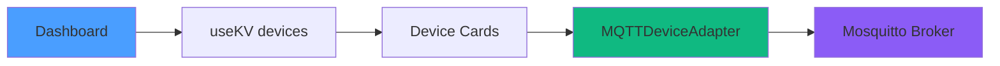
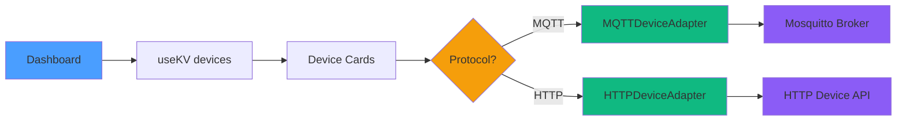

# Milestone 2.2.2: Dashboard Integration

## Overview

Integrate HTTP device support into the HomeHub Dashboard UI, enabling users to discover, monitor, and control HTTP/REST devices alongside existing MQTT devices.

**Estimated Time**: 4-5 hours
**Status**: 🚧 In Progress
**Dependencies**: Milestone 2.2.1 Complete ✅

---

## Goals

1. **Multi-Protocol Device Cards** - Display protocol badges (MQTT/HTTP) on device cards
2. **Unified Discovery** - Single "Add Device" flow for all protocol types
3. **Connection Status** - Real-time online/offline indicators for HTTP devices
4. **Protocol-Agnostic Controls** - Same UI for toggling MQTT or HTTP devices
5. **Settings Integration** - Configure HTTP endpoints, polling intervals, authentication

---

## Architecture Changes

### Before (MQTT Only)



### After (Multi-Protocol)



---

## Implementation Tasks

### Task 1: Update Device Type Definition

**File**: `src/types/index.ts`

**Changes**:

```typescript
export interface Device {
  id: string
  name: string
  type: 'light' | 'thermostat' | 'security' | 'sensor'
  room: string
  status: 'online' | 'offline' | 'warning' | 'error'
  enabled: boolean
  value?: number
  unit?: string
  lastSeen?: Date
  batteryLevel?: number
  signalStrength?: number

  // NEW: Multi-protocol support
  protocol: 'mqtt' | 'http' // Required field
  config?: {
    // MQTT-specific
    mqttTopic?: string
    mqttClientId?: string

    // HTTP-specific
    httpEndpoint?: string
    httpPreset?: 'shelly' | 'tplink' | 'hue' | 'generic'
    httpAuth?: {
      type: 'basic' | 'bearer' | 'apikey' | 'custom'
      username?: string
      password?: string
      token?: string
      apiKey?: string
      headers?: Record<string, string>
    }
    pollInterval?: number // Polling interval in ms
  }
}
```

**Why**: Device objects need to store protocol-specific configuration

---

### Task 2: Protocol Badge Component

**File**: `src/components/ui/protocol-badge.tsx` (NEW)

**Purpose**: Visual indicator for device protocol (MQTT/HTTP)

**Implementation**:

```tsx
import { Badge } from '@/components/ui/badge'
import { WifiHigh, CloudArrowUp } from '@phosphor-icons/react'

interface ProtocolBadgeProps {
  protocol: 'mqtt' | 'http'
  className?: string
}

export function ProtocolBadge({ protocol, className }: ProtocolBadgeProps) {
  return (
    <Badge variant={protocol === 'mqtt' ? 'secondary' : 'outline'} className={className}>
      {protocol === 'mqtt' ? (
        <>
          <CloudArrowUp weight="regular" className="mr-1 h-3 w-3" />
          MQTT
        </>
      ) : (
        <>
          <WifiHigh weight="regular" className="mr-1 h-3 w-3" />
          HTTP
        </>
      )}
    </Badge>
  )
}
```

**Design**:

- MQTT: Cloud icon (pub/sub pattern)
- HTTP: WiFi icon (request/response)
- Subtle styling (no distraction from main content)

---

### Task 3: Update Dashboard Device Cards

**File**: `src/components/Dashboard.tsx`

**Changes**:

1. **Add Protocol Badge** to device cards:

```tsx
import { ProtocolBadge } from '@/components/ui/protocol-badge'

// Inside device card render
;<Card className="...">
  <CardHeader className="flex flex-row items-center justify-between">
    <div>
      <CardTitle>{device.name}</CardTitle>
      <ProtocolBadge protocol={device.protocol} className="mt-1" />
    </div>
    {/* ... rest of card ... */}
  </CardHeader>
</Card>
```

2. **Update Device Registry Hook** to handle multi-protocol:

```tsx
const deviceRegistry = useMemo(() => {
  const registry = new DeviceRegistry()

  // Initialize MQTT adapter
  const mqttAdapter = new MQTTDeviceAdapter({
    brokerUrl: 'ws://localhost:9001',
    username: 'homehub',
    password: 'homehub123',
  })
  registry.registerAdapter('mqtt', mqttAdapter)

  // Initialize HTTP adapter (NEW)
  const httpAdapter = new HTTPDeviceAdapter()
  registry.registerAdapter('http', httpAdapter)

  return registry
}, [])
```

3. **Protocol-Agnostic Device Control**:

```tsx
const toggleDevice = async (deviceId: string) => {
  const device = devices.find(d => d.id === deviceId)
  if (!device) return

  try {
    // DeviceRegistry automatically routes to correct adapter
    const adapter = deviceRegistry.getAdapter(device.protocol)
    await adapter.setState(device.id, { enabled: !device.enabled })

    // Optimistic update
    setDevices(prev => prev.map(d => (d.id === deviceId ? { ...d, enabled: !d.enabled } : d)))

    toast.success(`${device.name} ${!device.enabled ? 'turned on' : 'turned off'}`)
  } catch (error) {
    toast.error(`Failed to control ${device.name}`)
    console.error(error)
  }
}
```

---

### Task 4: Add Device Discovery Flow

**File**: `src/components/Dashboard.tsx` (Add Device Dialog)

**Changes**:

1. **Add Protocol Selection Step**:

```tsx
<Select onValueChange={value => setSelectedProtocol(value)}>
  <SelectTrigger>
    <SelectValue placeholder="Select protocol" />
  </SelectTrigger>
  <SelectContent>
    <SelectItem value="mqtt">
      <CloudArrowUp className="mr-2 inline" />
      MQTT (Mosquitto)
    </SelectItem>
    <SelectItem value="http">
      <WifiHigh className="mr-2 inline" />
      HTTP/REST
    </SelectItem>
  </SelectContent>
</Select>
```

2. **Conditional Configuration Forms**:

```tsx
{
  selectedProtocol === 'mqtt' && (
    <div className="space-y-4">
      <Label>MQTT Topic</Label>
      <Input placeholder="homehub/devices/light-1" />
    </div>
  )
}

{
  selectedProtocol === 'http' && (
    <div className="space-y-4">
      <Label>Device Preset</Label>
      <Select>
        <SelectItem value="shelly">Shelly Gen2</SelectItem>
        <SelectItem value="tplink">TPLink Kasa</SelectItem>
        <SelectItem value="hue">Philips Hue</SelectItem>
        <SelectItem value="generic">Generic REST API</SelectItem>
      </Select>

      <Label>Endpoint URL</Label>
      <Input placeholder="http://192.168.1.100:8001" />

      <Label>Poll Interval (seconds)</Label>
      <Input type="number" defaultValue="5" />
    </div>
  )
}
```

3. **Auto-Discovery for HTTP** (scan local network):

```tsx
const discoverHTTPDevices = async () => {
  setDiscovering(true)
  try {
    const httpAdapter = deviceRegistry.getAdapter('http') as HTTPDeviceAdapter
    const discovered = await httpAdapter.discoverDevices({
      ipRange: '192.168.1.0/24', // User's local network
      ports: [80, 8001, 8080, 9999], // Common device ports
      timeout: 3000,
    })

    setDiscoveredDevices(discovered)
    toast.success(`Found ${discovered.length} HTTP devices`)
  } catch (error) {
    toast.error('Discovery failed')
  } finally {
    setDiscovering(false)
  }
}
```

---

### Task 5: Connection Status Indicators

**File**: `src/components/Dashboard.tsx`

**Purpose**: Show real-time online/offline status for HTTP devices

**Implementation**:

1. **Add Connection Monitoring**:

```tsx
useEffect(() => {
  const httpAdapter = deviceRegistry.getAdapter('http') as HTTPDeviceAdapter

  // Start polling for all HTTP devices
  devices
    .filter(d => d.protocol === 'http')
    .forEach(device => {
      httpAdapter.connect(device.id, {
        endpoint: device.config?.httpEndpoint || '',
        preset: device.config?.httpPreset || 'generic',
        pollInterval: device.config?.pollInterval || 5000,
      })
    })

  // Listen for state updates
  const unsubscribe = httpAdapter.subscribe((deviceId, state) => {
    setDevices(prev =>
      prev.map(d => (d.id === deviceId ? { ...d, ...state, status: 'online' } : d))
    )
  })

  return () => {
    unsubscribe()
    // Disconnect all HTTP devices
    devices.filter(d => d.protocol === 'http').forEach(d => httpAdapter.disconnect(d.id))
  }
}, [devices, deviceRegistry])
```

2. **Visual Status Indicator**:

```tsx
<div className="flex items-center gap-2">
  <div
    className={cn(
      'h-2 w-2 rounded-full',
      device.status === 'online' && 'animate-pulse bg-green-500',
      device.status === 'offline' && 'bg-red-500'
    )}
  />
  <span className="text-muted-foreground text-xs">
    {device.status === 'online' ? 'Connected' : 'Offline'}
  </span>
</div>
```

---

### Task 6: Settings Integration

**File**: `src/components/Settings.tsx`

**Changes**:

1. **HTTP Configuration Section**:

```tsx
<Card>
  <CardHeader>
    <CardTitle>HTTP Device Settings</CardTitle>
  </CardHeader>
  <CardContent className="space-y-4">
    <div>
      <Label>Default Poll Interval</Label>
      <Input
        type="number"
        defaultValue={httpPollInterval}
        onChange={e => setHttpPollInterval(Number(e.target.value))}
      />
      <p className="text-muted-foreground mt-1 text-xs">
        How often to check HTTP device status (milliseconds)
      </p>
    </div>

    <div>
      <Label>Request Timeout</Label>
      <Input
        type="number"
        defaultValue={httpTimeout}
        onChange={e => setHttpTimeout(Number(e.target.value))}
      />
      <p className="text-muted-foreground mt-1 text-xs">
        Maximum time to wait for HTTP response (milliseconds)
      </p>
    </div>

    <div>
      <Label>Retry Attempts</Label>
      <Input
        type="number"
        defaultValue={httpRetries}
        onChange={e => setHttpRetries(Number(e.target.value))}
      />
      <p className="text-muted-foreground mt-1 text-xs">
        Number of retry attempts for failed requests
      </p>
    </div>
  </CardContent>
</Card>
```

---

## Testing Checklist

### Unit Tests (Manual)

- [ ] **Protocol Badge Rendering**
  - MQTT badge shows cloud icon + "MQTT" text
  - HTTP badge shows wifi icon + "HTTP" text
  - Styling matches design system

- [ ] **Device Card Protocol Display**
  - Badge appears on all device cards
  - Correct protocol shown for each device

- [ ] **Add Device Flow**
  - Protocol selection dropdown works
  - MQTT form shows MQTT-specific fields
  - HTTP form shows HTTP-specific fields
  - Form validation prevents invalid submissions

- [ ] **Device Control**
  - Toggling MQTT device works
  - Toggling HTTP device works
  - Both protocols use same UI

- [ ] **Connection Status**
  - HTTP devices show "Connected" when online
  - Devices show "Offline" when unreachable
  - Status updates in real-time

---

### Integration Tests

**Test 1: Mixed Protocol Dashboard**

1. Add 2 MQTT devices (lights)
2. Add 2 HTTP devices (Shelly switches)
3. Verify all 4 devices display correctly
4. Toggle each device, confirm state changes

**Test 2: HTTP Device Discovery**

1. Start 3 virtual HTTP devices (Shelly, TPLink, Hue)
2. Click "Discover Devices" button
3. Verify all 3 devices found
4. Add discovered devices to dashboard
5. Confirm they work

**Test 3: Connection Monitoring**

1. Add HTTP device
2. Stop virtual device server
3. Verify device shows "Offline" status
4. Restart virtual device server
5. Verify device reconnects automatically

**Test 4: Settings Persistence**

1. Change HTTP poll interval to 10 seconds
2. Refresh page
3. Verify setting persisted
4. Confirm devices use new interval

---

## Success Metrics

- ✅ All existing MQTT functionality still works
- ✅ HTTP devices display alongside MQTT devices
- ✅ Protocol badges visible on all device cards
- ✅ Single "Add Device" flow supports both protocols
- ✅ Connection status updates in real-time
- ✅ Settings page controls HTTP adapter behavior
- ✅ Zero TypeScript errors
- ✅ Zero console errors during normal operation

---

## Files to Modify

| File                                   | Changes                                 | Lines |
| -------------------------------------- | --------------------------------------- | ----- |
| `src/types/index.ts`                   | Add protocol field + config             | ~30   |
| `src/components/ui/protocol-badge.tsx` | NEW component                           | ~40   |
| `src/components/Dashboard.tsx`         | Protocol badges, multi-protocol control | ~150  |
| `src/components/Settings.tsx`          | HTTP settings section                   | ~80   |
| `src/constants/mock-data.ts`           | Add protocol to mock devices            | ~50   |

**Estimated Total**: ~350 lines of new/modified code

---

## Rollout Plan

### Phase 1: Foundation (1-2 hours)

1. Update Device type definition
2. Create ProtocolBadge component
3. Update mock data with protocols

### Phase 2: Dashboard Integration (2-3 hours)

4. Add protocol badges to device cards
5. Implement multi-protocol device control
6. Add protocol selection to "Add Device" flow
7. Implement connection status monitoring

### Phase 3: Settings & Testing (1 hour)

8. Add HTTP settings panel
9. Manual testing of all features
10. Integration tests with virtual devices

---

## Next Milestone: 2.2.3 - Multi-Protocol Discovery

After Dashboard Integration, we'll focus on:

- Network scanning for HTTP devices
- mDNS/Bonjour discovery
- QR code setup for easy onboarding
- Bulk device import

**Estimated Time**: 3-4 hours

---

## References

- [Milestone 2.2.1 Complete](./MILESTONE_2.2.1_COMPLETE.md)
- [HTTP Adapter Quickstart](./HTTP_ADAPTER_QUICKSTART.md)
- [Phase 2.2 Plan](./PHASE_2.2_PLAN.md)
