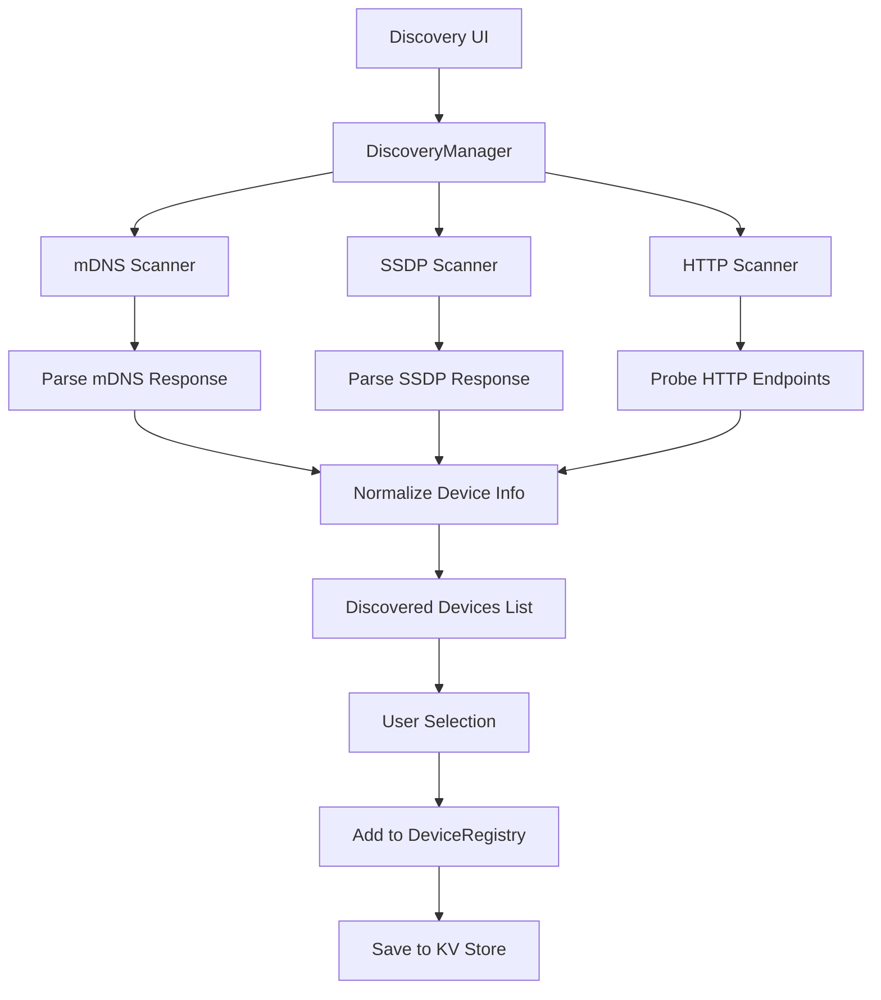

# Milestone 2.2.3: Multi-Protocol Discovery - Implementation Plan

**Date Started**: October 10, 2025
**Status**: 🚧 **IN PROGRESS**
**Estimated Time**: 4-6 hours

---

## Overview

Implement automatic network discovery for HTTP devices using multiple discovery protocols (mDNS, SSDP, HTTP probing). Enable users to find and add smart home devices without manual configuration.

## Discovery Methods

### 1. mDNS/Bonjour Discovery

**Target Devices**: Shelly, HomeKit, Sonos
**Protocol**: Multicast DNS (port 5353)
**Service Types**:

- `_http._tcp` - Generic HTTP devices
- `_shelly._tcp` - Shelly devices
- `_hap._tcp` - HomeKit accessories

### 2. SSDP/UPnP Discovery

**Target Devices**: Philips Hue, TP-Link, Generic UPnP
**Protocol**: Simple Service Discovery Protocol (port 1900)
**Search Targets**:

- `ssdp:all` - All UPnP devices
- `urn:schemas-upnp-org:device:Basic:1` - Basic devices
- Custom: Hue bridge, TP-Link smart plugs

### 3. HTTP Network Scan

**Target Devices**: Any HTTP-accessible device
**Method**: HTTP GET probing on common ports
**Ports**: 80, 8080, 443, 8443, 8081, 8008
**Detection**: Check for known API endpoints

## Architecture



## Implementation Steps

### Phase 1: Discovery Services (2-3 hours)

#### Task 1.1: Create Discovery Manager

**File**: `src/services/discovery/DiscoveryManager.ts`

```typescript
export class DiscoveryManager {
  private scanners: DiscoveryScanner[] = []

  registerScanner(scanner: DiscoveryScanner): void
  async discover(protocol?: string): Promise<DiscoveredDevice[]>
  async discoverAll(): Promise<DiscoveredDevice[]>
}
```

#### Task 1.2: mDNS Scanner

**File**: `src/services/discovery/MDNSScanner.ts`

**Dependencies**:

- `multicast-dns` for Node.js backend
- Web browser limitation: Cannot send mDNS queries directly
- **Solution**: Use HTTP proxy or existing mDNS responder

**Alternative for Browser**:

- Poll known endpoints (Shelly devices respond to HTTP)
- Use WebSocket to backend service
- Local network HTTP scanning

#### Task 1.3: SSDP Scanner

**File**: `src/services/discovery/SSDPScanner.ts`

**Dependencies**:

- `node-ssdp` for Node.js
- Browser limitation: Cannot send UDP packets
- **Solution**: Backend service or HTTP polling

#### Task 1.4: HTTP Network Scanner

**File**: `src/services/discovery/HTTPScanner.ts`

```typescript
export class HTTPScanner implements DiscoveryScanner {
  async scan(ipRange: string = '192.168.1.0/24'): Promise<DiscoveredDevice[]> {
    const devices: DiscoveredDevice[] = []
    const commonPorts = [80, 8080, 443, 8081]

    // Generate IP list from CIDR
    const ips = this.expandIPRange(ipRange)

    // Probe each IP on common ports
    for (const ip of ips) {
      for (const port of commonPorts) {
        const device = await this.probeDevice(ip, port)
        if (device) devices.push(device)
      }
    }

    return devices
  }

  private async probeDevice(ip: string, port: number): Promise<DiscoveredDevice | null> {
    try {
      // Try Shelly endpoint
      const shellyInfo = await this.tryEndpoint(`http://${ip}:${port}/shelly`)
      if (shellyInfo) return this.parseShellyDevice(shellyInfo, ip, port)

      // Try TP-Link endpoint
      const tplinkInfo = await this.tryEndpoint(`http://${ip}:${port}/api/system/info`)
      if (tplinkInfo) return this.parseTPLinkDevice(tplinkInfo, ip, port)

      // Try generic endpoint
      const genericInfo = await this.tryEndpoint(`http://${ip}:${port}/`)
      if (genericInfo) return this.parseGenericDevice(genericInfo, ip, port)

      return null
    } catch (error) {
      return null
    }
  }
}
```

### Phase 2: Discovery UI (1-2 hours)

#### Task 2.1: Discovery Dialog Component

**File**: `src/components/DeviceDiscovery.tsx`

```tsx
export function DeviceDiscovery() {
  const [isScanning, setIsScanning] = useState(false)
  const [discovered, setDiscovered] = useState<DiscoveredDevice[]>([])
  const [selectedProtocol, setSelectedProtocol] = useState<string>('all')

  const handleScan = async () => {
    setIsScanning(true)
    try {
      const manager = new DiscoveryManager()
      const devices = await manager.discoverAll()
      setDiscovered(devices)
      toast.success(`Found ${devices.length} devices`)
    } catch (error) {
      toast.error('Discovery failed')
    } finally {
      setIsScanning(false)
    }
  }

  return (
    <Dialog>
      <DialogTrigger asChild>
        <Button>
          <MagnifyingGlass className="mr-2" />
          Discover Devices
        </Button>
      </DialogTrigger>

      <DialogContent className="max-w-2xl">
        <DialogHeader>
          <DialogTitle>Discover Devices</DialogTitle>
          <DialogDescription>Scan your network for smart home devices</DialogDescription>
        </DialogHeader>

        <Tabs value={selectedProtocol} onValueChange={setSelectedProtocol}>
          <TabsList>
            <TabsTrigger value="all">All</TabsTrigger>
            <TabsTrigger value="shelly">Shelly</TabsTrigger>
            <TabsTrigger value="tplink">TP-Link</TabsTrigger>
            <TabsTrigger value="hue">Philips Hue</TabsTrigger>
          </TabsList>
        </Tabs>

        <Button onClick={handleScan} disabled={isScanning} className="w-full">
          {isScanning ? (
            <>
              <Spinner className="mr-2" />
              Scanning...
            </>
          ) : (
            <>
              <MagnifyingGlass className="mr-2" />
              Start Scan
            </>
          )}
        </Button>

        <DiscoveredDeviceList devices={discovered} onAdd={handleAddDevice} />
      </DialogContent>
    </Dialog>
  )
}
```

#### Task 2.2: Discovered Device List

**File**: `src/components/DiscoveredDeviceList.tsx`

```tsx
export function DiscoveredDeviceList({
  devices,
  onAdd,
}: {
  devices: DiscoveredDevice[]
  onAdd: (device: DiscoveredDevice) => void
}) {
  if (devices.length === 0) {
    return (
      <div className="text-muted-foreground py-8 text-center">
        No devices found. Click "Start Scan" to search your network.
      </div>
    )
  }

  return (
    <div className="max-h-96 space-y-2 overflow-y-auto">
      {devices.map(device => (
        <Card key={device.id} className="p-4">
          <div className="flex items-center justify-between">
            <div className="flex items-center gap-3">
              <div className="bg-primary/10 flex h-10 w-10 items-center justify-center rounded-lg">
                {getDeviceIcon(device.type)}
              </div>
              <div>
                <h4 className="font-medium">{device.name}</h4>
                <p className="text-muted-foreground text-sm">
                  {device.protocol.toUpperCase()} • {device.metadata?.ip}
                </p>
              </div>
            </div>

            <Button onClick={() => onAdd(device)}>
              <Plus className="mr-2 h-4 w-4" />
              Add
            </Button>
          </div>
        </Card>
      ))}
    </div>
  )
}
```

### Phase 3: Integration (1 hour)

#### Task 3.1: Add Discovery to Dashboard

**File**: `src/components/Dashboard.tsx`

```tsx
// Import discovery component
import { DeviceDiscovery } from './DeviceDiscovery'

// Add button to Dashboard header
;<div className="flex items-center gap-2">
  <DeviceDiscovery />
  <Button variant="outline">
    <GearIcon className="mr-2" />
    Settings
  </Button>
</div>
```

#### Task 3.2: Handle Discovered Devices

**File**: `src/components/DeviceDiscovery.tsx`

```typescript
const handleAddDevice = async (discovered: DiscoveredDevice) => {
  // Convert discovered device to Device format
  const newDevice: Device = {
    id: discovered.id,
    name: discovered.name,
    type: discovered.type,
    room: 'uncategorized',
    protocol: discovered.protocol,
    status: 'online',
    enabled: false,
    config: {
      httpEndpoint: `http://${discovered.metadata.ip}:${discovered.metadata.port}`,
      httpPreset: discovered.metadata.preset,
    },
    capabilities: discovered.capabilities,
    metadata: discovered.metadata,
  }

  // Add to devices list
  const updatedDevices = [...devices, newDevice]
  await setDevices(updatedDevices)

  // Register with adapter
  const adapter = deviceRegistry.getAdapter(newDevice.protocol)
  if (adapter) {
    await adapter.connect()
  }

  toast.success(`Added ${newDevice.name}`)
}
```

### Phase 4: Testing (1 hour)

#### Test Cases

1. **HTTP Scanner Test**
   - [ ] Finds virtual device on localhost:8001
   - [ ] Identifies device as Shelly Plus 1
   - [ ] Extracts MAC address and model info
   - [ ] Returns correct capabilities

2. **Discovery UI Test**
   - [ ] Dialog opens/closes correctly
   - [ ] Scan button shows loading state
   - [ ] Found devices display with info
   - [ ] Add button adds device to Dashboard
   - [ ] Device persists after refresh

3. **Integration Test**
   - [ ] Discovered device appears in Dashboard
   - [ ] Toggle works on discovered device
   - [ ] Device state syncs correctly
   - [ ] Multiple devices can be added

4. **Error Handling Test**
   - [ ] Network timeout handled gracefully
   - [ ] Invalid responses ignored
   - [ ] User sees error toast on failure
   - [ ] Partial results still displayed

## Browser Limitations & Solutions

### Problem: mDNS/SSDP Require UDP

Browsers cannot send UDP packets for security reasons.

### Solutions:

#### Option 1: HTTP Scanner Only (Simplest)

- Use HTTP probing on common ports
- Check known endpoints (Shelly, TP-Link, etc.)
- **Pros**: Works entirely in browser
- **Cons**: Slower, less comprehensive

#### Option 2: Backend Service (Most Robust)

- Create Node.js discovery service
- Expose HTTP API for browser
- Use proper mDNS/SSDP libraries
- **Pros**: Full protocol support
- **Cons**: Requires backend

#### Option 3: Browser Extension (Future)

- Chrome/Firefox extension with native access
- **Pros**: Direct protocol access
- **Cons**: Requires installation

**Recommendation**: Start with **Option 1** (HTTP Scanner), add **Option 2** later if needed.

## Implementation Priority

### MVP (Minimum Viable Product)

1. ✅ HTTP Scanner for Shelly devices
2. ✅ Discovery UI with scan button
3. ✅ Add discovered devices to Dashboard
4. ✅ Persist devices to KV store

### Nice to Have

- mDNS scanner (backend service)
- SSDP scanner (backend service)
- Advanced filtering by device type
- Network range configuration UI
- Discovery history/cache

### Future Enhancements

- Continuous background scanning
- Device online/offline detection
- Automatic firmware version check
- Suggested room assignment based on device name

## Files to Create

```
src/services/discovery/
├── DiscoveryManager.ts       (Manager class)
├── DiscoveryScanner.ts        (Interface)
├── HTTPScanner.ts             (HTTP probing)
├── index.ts                   (Exports)
└── types.ts                   (Discovery types)

src/components/
├── DeviceDiscovery.tsx        (Main dialog)
└── DiscoveredDeviceList.tsx   (Results list)
```

## Success Criteria

✅ HTTP scanner finds devices on localhost
✅ Discovery UI displays found devices
✅ User can add devices from discovery
✅ Devices persist after page refresh
✅ Added devices work immediately
✅ Error handling is comprehensive
✅ Performance is acceptable (<30s scan)
✅ Documentation is complete

## Next Steps

1. Create discovery service files
2. Implement HTTP scanner
3. Build discovery UI components
4. Integrate with Dashboard
5. Test with virtual device
6. Document discovery process
7. (Optional) Add backend service for mDNS/SSDP

---

**Ready to start implementation!** 🚀

Shall I begin with the HTTP Scanner implementation?
