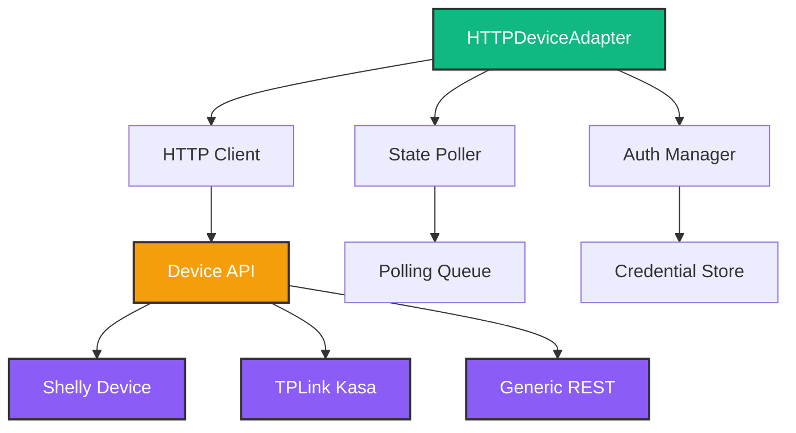
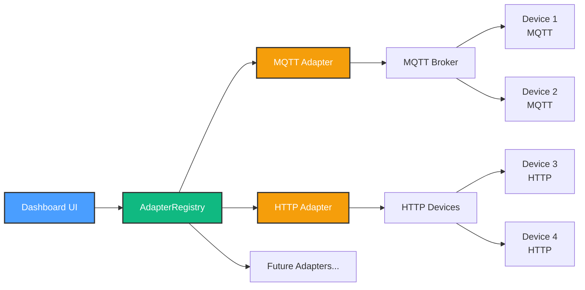
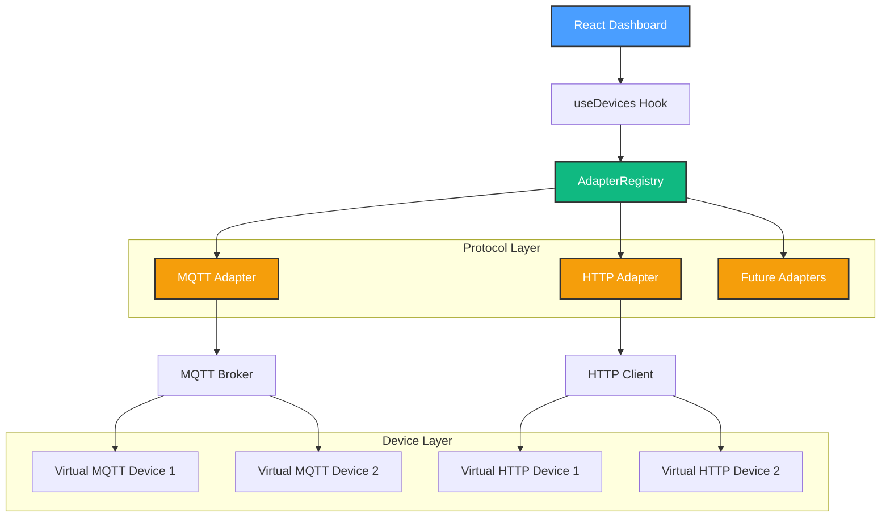

# Phase 2.2: Device Abstraction Layer - Implementation Plan

**Phase**: 2.2 - Device Protocol Integration
**Status**: 📋 Planning
**Estimated Duration**: 2-3 weeks
**Prerequisites**: Phase 2.1 Complete (MQTT foundation)

---

## 🎯 Phase Overview

**Goal**: Create a protocol-agnostic device management system that supports multiple communication protocols (MQTT, HTTP/REST, and future Zigbee/Z-Wave) through a unified interface.

**Why This Matters**:

- Most smart devices don't use MQTT exclusively
- Many devices have HTTP/REST APIs (Philips Hue, TPLink Kasa, Shelly Gen2)
- Need flexible architecture for future protocols
- Enable mixing different device types in one home

---

## 📦 Milestones

### Milestone 2.2.1: Core Adapter Interface (⏱️ 3-4 hours)

**Objective**: Design protocol-agnostic interface that all adapters must implement

**Deliverables**:

1. `DeviceAdapter` interface (`src/services/adapters/base-adapter.ts`)
2. `AdapterCapabilities` type definition
3. `AdapterRegistry` service
4. Architecture documentation

**Key Interfaces**:

```typescript
// Protocol-agnostic adapter interface
interface DeviceAdapter {
  // Lifecycle
  initialize(): Promise<void>
  shutdown(): Promise<void>

  // Connection
  connect(): Promise<void>
  disconnect(): Promise<void>
  isConnected(): boolean

  // Device Management
  discoverDevices(timeout?: number): Promise<Device[]>
  getDevice(deviceId: string): Promise<Device | null>

  // Device Control
  sendCommand(deviceId: string, command: DeviceCommand): Promise<void>
  getState(deviceId: string): Promise<DeviceState>

  // Events
  on(event: AdapterEvent, handler: AdapterEventHandler): void
  off(event: AdapterEvent, handler: AdapterEventHandler): void

  // Metadata
  getProtocolType(): ProtocolType
  getCapabilities(): AdapterCapabilities
  getSupportedDeviceTypes(): DeviceType[]
}

// Adapter capabilities
interface AdapterCapabilities {
  supportsDiscovery: boolean // Can auto-discover devices
  supportsStatePolling: boolean // Requires polling for state
  supportsPushUpdates: boolean // Receives real-time updates
  supportsScenes: boolean // Native scene support
  requiresAuthentication: boolean // Needs credentials
  requiresLocalNetwork: boolean // Must be on same network
}

// Protocol types
type ProtocolType = 'mqtt' | 'http' | 'websocket' | 'zigbee' | 'zwave' | 'ble'
```

**Success Criteria**:

- Interface supports all Phase 2.1 MQTT functionality
- Extensible for future protocols
- Clear separation of concerns
- Well-documented with examples

---

### Milestone 2.2.2: HTTP/REST Adapter (⏱️ 8-10 hours)

**Objective**: Implement adapter for IP-based devices with REST APIs

**Deliverables**:

1. `HTTPDeviceAdapter` class (`src/services/adapters/http-adapter.ts`)
2. Device-specific implementations (Shelly, TPLink, Generic)
3. Authentication handling (Basic, Bearer, API Key)
4. State polling service
5. Error handling and retry logic

**Architecture**:



**Implementation Details**:

```typescript
// HTTP adapter configuration
interface HTTPAdapterConfig {
  baseUrl: string
  authType: 'none' | 'basic' | 'bearer' | 'apikey'
  credentials?: {
    username?: string
    password?: string
    token?: string
    apiKey?: string
  }
  pollingInterval?: number // Default: 5000ms
  timeout?: number // Default: 10000ms
  retryAttempts?: number // Default: 3
}

// Example: Shelly Gen2 device
class ShellyHTTPAdapter implements DeviceAdapter {
  private config: HTTPAdapterConfig
  private poller: StatePoller

  async discoverDevices(): Promise<Device[]> {
    // mDNS discovery or manual IP configuration
    const response = await this.httpClient.get('/shelly')
    return this.parseDevices(response.data)
  }

  async sendCommand(deviceId: string, command: DeviceCommand): Promise<void> {
    // Shelly API: /rpc/Switch.Set?id=0&on=true
    const endpoint = this.buildEndpoint(deviceId, command)
    await this.httpClient.post(endpoint, command.payload)
  }

  async getState(deviceId: string): Promise<DeviceState> {
    // Shelly API: /rpc/Switch.GetStatus?id=0
    const response = await this.httpClient.get(`/rpc/Switch.GetStatus?id=${deviceId}`)
    return this.parseState(response.data)
  }
}
```

**Supported Devices** (examples):

- Shelly Gen2 (REST API)
- TPLink Kasa (local API)
- Philips Hue Bridge
- Generic HTTP/JSON devices

**Success Criteria**:

- Control virtual HTTP device from Dashboard
- State polling works reliably (<5s latency)
- Authentication works for all types
- Graceful error handling for network issues
- 95%+ command success rate

---

### Milestone 2.2.3: Adapter Registry (⏱️ 4-5 hours)

**Objective**: Central service to manage multiple adapters and route commands

**Deliverables**:

1. `AdapterRegistry` service (`src/services/adapters/adapter-registry.ts`)
2. Adapter lifecycle management
3. Command routing logic
4. Multi-protocol device discovery

**Architecture**:



**Key Features**:

```typescript
class AdapterRegistry {
  private adapters: Map<string, DeviceAdapter>
  private deviceToAdapter: Map<string, string> // deviceId -> adapterId

  // Register adapters
  registerAdapter(adapterId: string, adapter: DeviceAdapter): void
  unregisterAdapter(adapterId: string): void

  // Device management
  async discoverAllDevices(): Promise<Device[]> {
    // Run discovery on all registered adapters in parallel
    const results = await Promise.all(
      Array.from(this.adapters.values()).map(a => a.discoverDevices())
    )
    return results.flat()
  }

  // Command routing
  async sendCommand(deviceId: string, command: DeviceCommand): Promise<void> {
    const adapterId = this.deviceToAdapter.get(deviceId)
    if (!adapterId) throw new Error(`No adapter for device: ${deviceId}`)

    const adapter = this.adapters.get(adapterId)
    await adapter.sendCommand(deviceId, command)
  }

  // State aggregation
  async getAllDeviceStates(): Promise<Map<string, DeviceState>> {
    // Collect states from all adapters
  }
}
```

**Success Criteria**:

- Manage 2+ adapters simultaneously (MQTT + HTTP)
- Route commands to correct adapter
- Aggregate device lists from all sources
- Handle adapter initialization failures gracefully

---

### Milestone 2.2.4: Virtual HTTP Devices (⏱️ 5-6 hours)

**Objective**: Create testing infrastructure for REST API devices

**Deliverables**:

1. Mock HTTP server (`scripts/http-virtual-device.js`)
2. Virtual device types (lights, thermostats, switches)
3. Simulated REST API endpoints
4. Launch script for multi-device testing

**Architecture**:

```typescript
// Express-based mock server
class VirtualHTTPDevice {
  private app: Express
  private state: DeviceState

  constructor(config: VirtualDeviceConfig) {
    this.app = express()
    this.setupRoutes()
  }

  // Shelly-compatible endpoints
  private setupRoutes() {
    // Device info
    this.app.get('/shelly', (req, res) => {
      res.json({
        name: this.config.name,
        type: this.config.type,
        mac: this.config.mac,
        fw: '1.0.0',
      })
    })

    // Get status
    this.app.get('/rpc/Switch.GetStatus', (req, res) => {
      res.json({
        id: 0,
        output: this.state.enabled,
        source: 'http',
      })
    })

    // Set state
    this.app.post('/rpc/Switch.Set', (req, res) => {
      const { on } = req.query
      this.state.enabled = on === 'true'
      res.json({ was_on: !this.state.enabled })
    })
  }

  start(port: number): void {
    this.app.listen(port, () => {
      console.log(`Virtual device "${this.config.name}" on port ${port}`)
    })
  }
}
```

**Launch Script** (`scripts/launch-http-devices.js`):

```bash
node scripts/launch-http-devices.js --preset full-house
# Launches:
# - Living Room Light (port 8001)
# - Bedroom Light (port 8002)
# - Kitchen Light (port 8003)
# - Thermostat (port 8004)
```

**Success Criteria**:

- Launch 5+ virtual HTTP devices
- Respond to GET/POST requests correctly
- Maintain state across requests
- Support Shelly Gen2 API format

---

### Milestone 2.2.5: MQTT Adapter Refactor (⏱️ 3-4 hours)

**Objective**: Refactor existing MQTT implementation to use new DeviceAdapter interface

**Deliverables**:

1. Updated `MQTTDeviceAdapter` class
2. Maintain backward compatibility
3. Update service layer integration
4. Migration documentation

**Changes Required**:

```typescript
// Before (Phase 2.1)
class MQTTDeviceAdapter {
  connect(): void
  sendCommand(topic: string, message: string): void
  // ... custom methods
}

// After (Phase 2.2)
class MQTTDeviceAdapter implements DeviceAdapter {
  // Standard interface methods
  async initialize(): Promise<void>
  async connect(): Promise<void>
  async sendCommand(deviceId: string, command: DeviceCommand): Promise<void>

  // Protocol-specific methods (private)
  private buildTopic(deviceId: string, type: 'command' | 'state'): string
  private parseMessage(topic: string, message: Buffer): DeviceStateUpdate

  // Required interface implementations
  getProtocolType(): ProtocolType {
    return 'mqtt'
  }
  getCapabilities(): AdapterCapabilities {
    return {
      supportsDiscovery: true,
      supportsStatePolling: false,
      supportsPushUpdates: true,
      supportsScenes: false,
      requiresAuthentication: false,
      requiresLocalNetwork: true,
    }
  }
}
```

**Success Criteria**:

- All Phase 2.1 functionality preserved
- Zero breaking changes to existing code
- Implements full DeviceAdapter interface
- Tests still pass (5/5)

---

### Milestone 2.2.6: Dashboard Multi-Protocol Support (⏱️ 4-5 hours)

**Objective**: Update UI to show device protocols and handle different adapters

**Deliverables**:

1. Protocol badge in device cards
2. Adapter-specific configuration UI
3. Multi-protocol device discovery
4. Updated React hooks

**UI Changes**:

```tsx
// Device card with protocol indicator
<Card>
  <div className="flex items-center gap-2">
    <Lightbulb className="text-primary" />
    <span>Living Room Light</span>
    <Badge variant="secondary">{device.protocol.toUpperCase()}</Badge>
  </div>

  {/* Protocol-specific status */}
  {device.protocol === 'mqtt' && (
    <span className="text-muted-foreground text-xs">Signal: {device.signalStrength}%</span>
  )}
  {device.protocol === 'http' && (
    <span className="text-muted-foreground text-xs">Last poll: {formatTime(device.lastPoll)}</span>
  )}
</Card>
```

**Enhanced Hooks**:

```typescript
// Updated hook for multi-protocol support
function useDevices() {
  const [devices, setDevices] = useKV<Device[]>('devices', [])
  const registry = AdapterRegistry.getInstance()

  const discoverDevices = async () => {
    // Discover from all adapters
    const discovered = await registry.discoverAllDevices()

    // Merge with existing devices
    const merged = mergeDevices(devices, discovered)
    setDevices(merged)

    toast.success(`Discovered ${discovered.length} devices`)
  }

  const toggleDevice = async (deviceId: string) => {
    const device = devices.find(d => d.id === deviceId)
    if (!device) return

    // Optimistic update
    setDevices(prev => prev.map(d => (d.id === deviceId ? { ...d, enabled: !d.enabled } : d)))

    // Route to correct adapter
    await registry.sendCommand(deviceId, {
      type: 'toggle',
      value: !device.enabled,
    })
  }

  return { devices, discoverDevices, toggleDevice }
}
```

**Success Criteria**:

- Display devices from multiple protocols
- Show protocol-specific information
- Discovery works for all adapters
- Seamless UX (user doesn't care about protocol)

---

### Milestone 2.2.7: Integration Testing (⏱️ 3-4 hours)

**Objective**: Comprehensive tests for multi-protocol scenarios

**Deliverables**:

1. Test script (`scripts/test-multi-protocol.js`)
2. MQTT + HTTP device scenarios
3. Adapter failover tests
4. Performance benchmarks

**Test Scenarios**:

```javascript
// Test 1: Multi-protocol discovery
async function testMultiProtocolDiscovery() {
  // Start MQTT virtual devices
  await startMQTTDevices(3)

  // Start HTTP virtual devices
  await startHTTPDevices(3)

  // Discover all
  const devices = await registry.discoverAllDevices()

  assert(devices.length === 6, 'Should find 6 devices')
  assert(devices.filter(d => d.protocol === 'mqtt').length === 3, '3 MQTT devices')
  assert(devices.filter(d => d.protocol === 'http').length === 3, '3 HTTP devices')
}

// Test 2: Cross-protocol control
async function testCrossProtocolControl() {
  // Toggle MQTT device
  await registry.sendCommand('mqtt-device-1', { type: 'toggle' })
  await sleep(500)

  // Toggle HTTP device
  await registry.sendCommand('http-device-1', { type: 'toggle' })
  await sleep(500)

  // Verify states
  const states = await registry.getAllDeviceStates()
  assert(states.get('mqtt-device-1').enabled === true)
  assert(states.get('http-device-1').enabled === true)
}

// Test 3: Adapter failover
async function testAdapterFailover() {
  // Stop MQTT broker
  await stopMQTTBroker()

  // HTTP devices should still work
  await registry.sendCommand('http-device-1', { type: 'toggle' })

  // Restart MQTT
  await startMQTTBroker()

  // Both protocols should work
  assert(registry.getAdapter('mqtt').isConnected() === true)
  assert(registry.getAdapter('http').isConnected() === true)
}
```

**Success Criteria**:

- 10/10 integration tests passing
- MQTT + HTTP work simultaneously
- Adapter failures don't affect other adapters
- <1s command latency across protocols

---

## 📊 Phase 2.2 Metrics

### Code Estimates

| Milestone                  | Estimated Lines | Files  |
| -------------------------- | --------------- | ------ |
| 2.2.1 Core Interface       | 300             | 3      |
| 2.2.2 HTTP Adapter         | 800             | 5      |
| 2.2.3 Adapter Registry     | 400             | 2      |
| 2.2.4 Virtual HTTP Devices | 600             | 3      |
| 2.2.5 MQTT Refactor        | 200 (changes)   | 2      |
| 2.2.6 Dashboard Updates    | 300             | 4      |
| 2.2.7 Integration Tests    | 400             | 2      |
| **Total**                  | **3,000**       | **21** |

### Success Metrics

- ✅ Support 2+ protocols (MQTT + HTTP)
- ✅ Control 10+ devices across protocols
- ✅ <1s command latency for all protocols
- ✅ 95%+ command success rate
- ✅ Graceful adapter failover
- ✅ Zero breaking changes to Phase 2.1
- ✅ All tests passing (15+ scenarios)

---

## 🗺️ Architecture Overview



---

## 🎯 Deliverables Summary

By the end of Phase 2.2, you will have:

1. **Protocol-Agnostic Architecture**
   - DeviceAdapter interface for all protocols
   - Adapter registry for multi-protocol management
   - Clean separation of concerns

2. **HTTP/REST Support**
   - Full REST API device support
   - State polling for devices without push updates
   - Authentication handling (Basic, Bearer, API Key)
   - Shelly Gen2 compatibility

3. **Testing Infrastructure**
   - Virtual HTTP device server
   - Multi-protocol test scenarios
   - Integration test suite (15+ tests)

4. **Enhanced Dashboard**
   - Protocol badges on device cards
   - Multi-protocol device discovery
   - Unified control experience

5. **Documentation**
   - Architecture diagrams (Mermaid)
   - API reference for adapters
   - Testing guides
   - Migration notes

---

## 🚀 Getting Started

### Recommended Order

1. Start with **Milestone 2.2.1** (Core Interface)
   - Design the DeviceAdapter interface
   - Get feedback on architecture
   - Establish patterns for Phase 2

2. Build **Milestone 2.2.4** (Virtual Devices)
   - Create testable HTTP devices early
   - Enables parallel development

3. Implement **Milestone 2.2.2** (HTTP Adapter)
   - Reference implementation
   - Validate interface design

4. Create **Milestone 2.2.3** (Adapter Registry)
   - Connect the pieces
   - Enable multi-protocol control

5. Refactor **Milestone 2.2.5** (MQTT Adapter)
   - Ensure backward compatibility
   - Validate interface completeness

6. Update **Milestone 2.2.6** (Dashboard)
   - User-facing changes
   - Polish the experience

7. Test **Milestone 2.2.7** (Integration)
   - Validate everything works together
   - Catch edge cases

### First Steps

```powershell
# 1. Create directory structure
mkdir src/services/adapters

# 2. Start with interface design
code src/services/adapters/base-adapter.ts

# 3. Review existing MQTT code for patterns
code src/services/mqtt/mqtt-client.service.ts

# 4. Begin implementation
npm run dev
```

---

## 📚 Reference Materials

- **Phase 2.1 Documentation**: `docs/PHASE_2.1_COMPLETE.md`
- **MQTT Service Layer**: `src/services/mqtt/`
- **Device Types**: `src/types/mqtt.types.ts`
- **Virtual Devices**: `scripts/mqtt-virtual-device.js`

---

**Ready to start Phase 2.2?** 🚀

Let me know which milestone you'd like to begin with, or if you have questions about the architecture!
