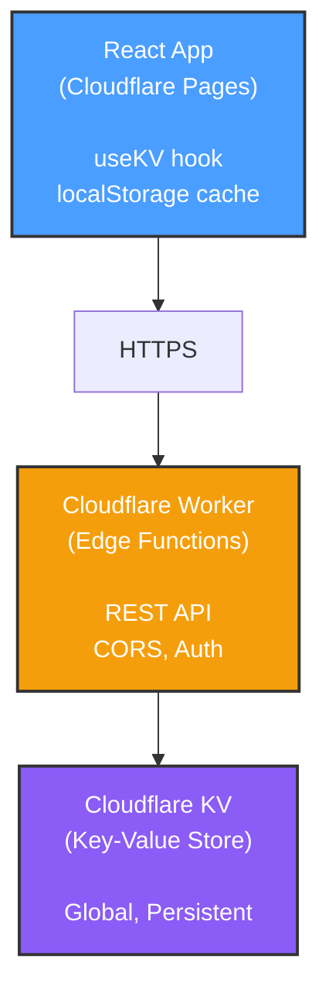

# HomeHub Cloudflare Deployment Guide

## Prerequisites

1. **Cloudflare Account**: Sign up at <https://cloudflare.com>
2. **Wrangler CLI**: Install globally

   ```bash
   npm install -g wrangler
   ```

3. **Node.js**: Version 18 or higher

## Step 1: Deploy Cloudflare Worker

### 1.1 Navigate to workers directory

```bash
cd workers
```

### 1.2 Install dependencies

```bash
npm install
```

### 1.3 Login to Cloudflare

```bash
wrangler login
```

### 1.4 Create KV Namespace

```bash
# Production namespace
wrangler kv:namespace create "HOMEHUB_KV"

# Preview namespace (for local dev)
wrangler kv:namespace create "HOMEHUB_KV" --preview
```

**Important**: Copy the namespace IDs from the output.

### 1.5 Update wrangler.toml

Edit `workers/wrangler.toml` and replace the namespace IDs:

```toml
kv_namespaces = [
  { binding = "HOMEHUB_KV", id = "YOUR_PRODUCTION_ID", preview_id = "YOUR_PREVIEW_ID" }
]
```

### 1.6 Deploy Worker

```bash
npm run deploy
```

**Save the Worker URL** from the output (e.g., `https://homehub-kv-worker.your-subdomain.workers.dev`)

### 1.7 Test Worker

```bash
curl https://your-worker-url.workers.dev/health
```

Should return:

```json
{
  "status": "healthy",
  "environment": "production",
  "timestamp": 1234567890
}
```

## Step 2: Configure React App

### 2.1 Create .env file

```bash
cd ..  # Back to root directory
cp .env.example .env
```

### 2.2 Update .env

Edit `.env` with your Worker URL:

```env
VITE_KV_API_URL=https://homehub-kv-worker.your-subdomain.workers.dev
# VITE_KV_AUTH_TOKEN=your-optional-token
```

### 2.3 Test locally

```bash
# Terminal 1: Run worker locally
cd workers
npm run dev

# Terminal 2: Run React app
cd ..
npm run dev
```

Open <http://localhost:5173> and verify the app works.

## Step 3: Deploy to Cloudflare Pages

### 3.1 Remove Spark dependency

```bash
npm uninstall @github/spark
```

### 3.2 Build the app

```bash
npm run build
```

### 3.3 Create Cloudflare Pages project

**Via Dashboard**:

1. Go to <https://dash.cloudflare.com>
2. Navigate to **Workers & Pages** → **Create application** → **Pages**
3. Connect your GitHub repository
4. Configure build settings:
   - **Build command**: `npm run build`
   - **Build output directory**: `dist`
   - **Node version**: 20

**Via Wrangler CLI**:

```bash
wrangler pages deploy dist --project-name homehub
```

### 3.4 Set environment variables

In Cloudflare Pages dashboard:

1. Go to your project → **Settings** → **Environment variables**
2. Add:
   - **VITE_KV_API_URL**: `https://your-worker-url.workers.dev`
   - **VITE_KV_AUTH_TOKEN**: (optional) your auth token

### 3.5 Redeploy

```bash
npm run deploy
```

## Step 4: Verify Deployment

### 4.1 Test Worker endpoints

```bash
# Get health
curl https://your-worker-url.workers.dev/health

# Set a test value
curl -X POST https://your-worker-url.workers.dev/kv/test \
  -H "Content-Type: application/json" \
  -d '{"value": "Hello Cloudflare!"}'

# Get the test value
curl https://your-worker-url.workers.dev/kv/test
```

### 4.2 Test React app

1. Open your Cloudflare Pages URL (e.g., `https://homehub.pages.dev`)
2. Add/edit devices, rooms, scenes
3. Refresh the page - data should persist
4. Check browser DevTools → Network tab for KV API calls

## Step 5: Optional Security

### 5.1 Add authentication to Worker

Edit `workers/src/index.ts` and uncomment auth check:

```typescript
if (!checkAuth(request, env)) {
  return errorResponse('Unauthorized', 401)
}
```

### 5.2 Set AUTH_TOKEN secret

```bash
cd workers
wrangler secret put AUTH_TOKEN
# Enter your secure token when prompted
```

### 5.3 Update React app .env

```env
VITE_KV_AUTH_TOKEN=your-secure-token
```

### 5.4 Redeploy both

```bash
# Redeploy worker
cd workers
npm run deploy

# Redeploy pages
cd ..
npm run deploy
```

## Architecture Overview



## Costs

**Free Tier** (sufficient for personal use):

- **Workers**: 100,000 requests/day
- **KV**: 100,000 reads/day, 1,000 writes/day, 1GB storage
- **Pages**: 500 builds/month, unlimited bandwidth

**Paid Plan** ($5/month if needed):

- **Workers**: 10 million requests/month
- **KV**: Unlimited reads/writes, 1GB storage included
- **Pages**: Unlimited builds

## Troubleshooting

### Worker not responding

```bash
cd workers
wrangler tail  # Watch live logs
```

### KV data not persisting

1. Check Worker logs: `wrangler tail`
2. Verify KV namespace binding in `wrangler.toml`
3. Test directly: `curl -X POST https://your-worker/kv/test -d '{"value":"test"}'`

### CORS errors

- Ensure Worker is deployed (not just local dev)
- Check `VITE_KV_API_URL` is correct in Pages environment variables

### Build failures

```bash
# Clear cache
rm -rf node_modules dist .vite
npm install
npm run build
```

## Migration Complete! 🎉

Your HomeHub is now running on Cloudflare infrastructure:

- ✅ No GitHub Spark dependency
- ✅ Full control over backend
- ✅ Edge network performance
- ✅ Integrated with Cloudflare ecosystem
- ✅ Free tier for development

**Next Steps**:

1. Add custom domain in Cloudflare Pages
2. Enable Cloudflare Analytics
3. Set up Cloudflare Tunnel for local dev (optional)
4. Implement device protocol integration (Phase 2)
