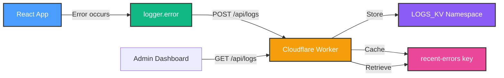

# Cloudflare Logging Setup Guide

**Purpose**: Configure centralized error logging using Cloudflare Workers KV
**Benefits**: No external dependencies, integrated infrastructure, 30-day retention
**Status**: Logger implementation complete, KV namespace setup needed

---

## 📋 Overview

HomeHub uses Cloudflare Workers KV to store application logs in production. This provides:

- ✅ **Zero External Dependencies**: No Sentry, LogRocket, or other 3rd party services
- ✅ **Integrated Infrastructure**: Uses your existing Cloudflare stack
- ✅ **Automatic Retention**: Logs expire after 30 days (configurable)
- ✅ **Fast Queries**: Recent errors cached for quick access
- ✅ **Global CDN**: Logs available from all Cloudflare edge locations
- ✅ **Generous Free Tier**: 100,000 reads/day, 1,000 writes/day

---

## 🏗️ Architecture



**Flow**:

1. App logs error via `logger.error()`
2. Logger sends POST request to `/api/logs` (production only)
3. Worker stores log in `LOGS_KV` with timestamp-based key
4. Worker updates `recent-errors` cache (last 100 errors)
5. Admin dashboard fetches logs via GET `/api/logs`

---

## 🚀 Setup Instructions

### Step 1: Create LOGS_KV Namespace

```bash
# Navigate to workers directory
cd workers

# Create production namespace
wrangler kv:namespace create "LOGS_KV"

# Output will be:
# 🌀 Creating namespace with title "homehub-LOGS_KV"
# ✨ Success! Add the following to your wrangler.toml:
# [[kv_namespaces]]
# binding = "LOGS_KV"
# id = "abc123..."

# Create preview namespace for development
wrangler kv:namespace create "LOGS_KV" --preview

# Output will be:
# 🌀 Creating namespace with title "homehub-LOGS_KV_preview"
# ✨ Success! Add the following to your wrangler.toml:
# [[kv_namespaces]]
# binding = "LOGS_KV"
# preview_id = "def456..."
```

### Step 2: Update wrangler.toml

Add the LOGS_KV namespace binding to `workers/wrangler.toml`:

```toml
name = "homehub-worker"
main = "src/index.ts"
compatibility_date = "2024-01-01"

# Existing namespace
[[kv_namespaces]]
binding = "HOMEHUB_KV"
id = "your-existing-kv-id"
preview_id = "your-existing-preview-id"

# NEW: Add logs namespace
[[kv_namespaces]]
binding = "LOGS_KV"
id = "abc123..."  # From Step 1 output
preview_id = "def456..."  # From Step 1 output
```

### Step 3: Add App Version to Environment

Create or update `.env` in the project root:

```env
# App version for log tracking
VITE_APP_VERSION=1.0.0

# Other existing env vars...
```

Update `.env.production`:

```env
VITE_APP_VERSION=1.0.0
```

### Step 4: Deploy Worker

```bash
# Deploy updated worker with new KV binding
cd workers
wrangler deploy

# Output:
# ✨ Success! Uploaded worker 'homehub-worker'
# 🌎 https://homehub-worker.your-account.workers.dev
```

### Step 5: Test Logging Endpoint

```bash
# Test POST /api/logs
curl -X POST https://homehub-worker.your-account.workers.dev/api/logs \
  -H "Content-Type: application/json" \
  -d '{
    "level": "error",
    "message": "Test error from curl",
    "context": { "test": true },
    "timestamp": "2025-10-12T10:00:00Z",
    "url": "https://homehub.example.com/dashboard",
    "userAgent": "Mozilla/5.0...",
    "appVersion": "1.0.0"
  }'

# Expected response:
# {"success":true}

# Test GET /api/logs (retrieve recent errors)
curl https://homehub-worker.your-account.workers.dev/api/logs

# Expected response:
# {
#   "errors": [
#     {
#       "level": "error",
#       "message": "Test error from curl",
#       "context": { "test": true },
#       "timestamp": "2025-10-12T10:00:00Z",
#       ...
#     }
#   ],
#   "count": 1
# }
```

### Step 6: Verify Production Logging

1. **Build production app**:

   ```bash
   npm run build
   ```

2. **Preview production build locally**:

   ```bash
   npm run preview
   ```

3. **Trigger an error** (e.g., try to control a device when offline)

4. **Check logs in Cloudflare Dashboard**:
   - Go to Cloudflare Dashboard → Workers & Pages → KV
   - Select `LOGS_KV` namespace
   - Look for keys starting with `log:2025-10-12...`
   - Check `recent-errors` key for cached errors

5. **Or query via API**:

   ```bash
   curl https://homehub-worker.your-account.workers.dev/api/logs
   ```

---

## 📊 Log Structure

### Log Entry Format

```typescript
interface LogEntry {
  level: 'warn' | 'error' // Log severity
  message: string // Error message
  context?: {
    // Optional structured context
    error?: {
      // If Error object
      message: string
      stack?: string
      name: string
    }
    [key: string]: any // Additional context
  }
  timestamp: string // ISO 8601 timestamp
  userAgent?: string // Browser user agent
  url?: string // Page URL where error occurred
  appVersion?: string // App version from env
}
```

### Example Stored Log

```json
{
  "level": "error",
  "message": "Failed to toggle device",
  "context": {
    "error": {
      "message": "Network request failed",
      "stack": "Error: Network request failed\n    at toggleDevice...",
      "name": "Error"
    },
    "deviceId": "hue-light-1",
    "deviceName": "Living Room Light"
  },
  "timestamp": "2025-10-12T14:32:15.123Z",
  "userAgent": "Mozilla/5.0 (Windows NT 10.0; Win64; x64)...",
  "url": "https://homehub.example.com/dashboard",
  "appVersion": "1.0.0"
}
```

### KV Storage Keys

- **Individual Logs**: `log:2025-10-12T14:32:15.123Z:abc123`
  - Timestamp-based for easy querying
  - Random suffix for uniqueness
  - TTL: 30 days (2,592,000 seconds)

- **Recent Errors Cache**: `recent-errors`
  - Array of last 100 errors
  - No TTL (permanent, updated on each error)
  - Fast retrieval for dashboards

---

## 🔍 Querying Logs

### Via API Endpoint

```javascript
// Fetch recent errors in your app
fetch('/api/logs')
  .then(res => res.json())
  .then(data => {
    console.log(`Found ${data.count} recent errors`)
    data.errors.forEach(error => {
      console.log(`[${error.timestamp}] ${error.level}: ${error.message}`)
    })
  })
```

### Via Cloudflare Dashboard

1. Go to **Cloudflare Dashboard** → **Workers & Pages** → **KV**
2. Select **LOGS_KV** namespace
3. Browse keys or search by prefix (e.g., `log:2025-10-12`)
4. Click key to view JSON content

### Via Wrangler CLI

```bash
# List all log keys
wrangler kv:key list --namespace-id=YOUR_LOGS_KV_ID

# Get specific log
wrangler kv:key get "log:2025-10-12T14:32:15.123Z:abc123" \
  --namespace-id=YOUR_LOGS_KV_ID

# Get recent errors cache
wrangler kv:key get "recent-errors" \
  --namespace-id=YOUR_LOGS_KV_ID
```

---

## 🛠️ Configuration Options

### Adjust Log Retention Period

Edit `workers/src/index.ts`, line ~195:

```typescript
await env.LOGS_KV.put(logKey, JSON.stringify(logEntry), {
  expirationTtl: 60 * 60 * 24 * 30, // 30 days (change here)
})
```

**Options**:

- `60 * 60 * 24 * 7` = 7 days (1 week)
- `60 * 60 * 24 * 30` = 30 days (1 month) - **default**
- `60 * 60 * 24 * 90` = 90 days (3 months)

### Adjust Recent Errors Cache Size

Edit `workers/src/index.ts`, line ~203:

```typescript
// Keep last 100 errors
errors.unshift(logEntry)
if (errors.length > 100) {
  // Change this number
  errors.pop()
}
```

### Filter Log Levels

Edit `src/lib/logger.ts`, line ~96:

```typescript
// Only send warn/error levels to reduce noise
if (level !== 'warn' && level !== 'error') return

// To also log info:
// if (level === 'debug') return
```

---

## 📈 Monitoring & Analytics

### Cloudflare Workers Analytics

Access built-in metrics:

1. **Cloudflare Dashboard** → **Workers & Pages** → **homehub-worker**
2. **Metrics** tab

**Available Metrics**:

- Request count (per hour/day)
- Success rate (2xx responses)
- Error rate (5xx responses)
- CPU time per request
- Invocation count

### KV Analytics

Access KV storage metrics:

1. **Cloudflare Dashboard** → **Workers & Pages** → **KV**
2. Select **LOGS_KV** namespace
3. **Metrics** tab

**Available Metrics**:

- Read operations (per day)
- Write operations (per day)
- Delete operations (per day)
- Storage used (GB)

### Custom Error Dashboard

Create `src/components/ErrorMonitor.tsx`:

```typescript
import { useEffect, useState } from 'react'
import { Card, CardContent, CardHeader, CardTitle } from '@/components/ui/card'
import { Badge } from '@/components/ui/badge'

interface LogEntry {
  level: 'warn' | 'error'
  message: string
  timestamp: string
  url?: string
  context?: any
}

export function ErrorMonitor() {
  const [errors, setErrors] = useState<LogEntry[]>([])
  const [loading, setLoading] = useState(true)

  useEffect(() => {
    fetch('/api/logs')
      .then(res => res.json())
      .then(data => {
        setErrors(data.errors || [])
        setLoading(false)
      })
      .catch(err => {
        console.error('Failed to fetch logs:', err)
        setLoading(false)
      })
  }, [])

  if (loading) {
    return <div>Loading error logs...</div>
  }

  return (
    <Card>
      <CardHeader>
        <CardTitle>Recent Errors ({errors.length})</CardTitle>
      </CardHeader>
      <CardContent className="space-y-4">
        {errors.length === 0 ? (
          <p className="text-muted-foreground">No errors recorded 🎉</p>
        ) : (
          errors.map((error, idx) => (
            <div
              key={`${error.timestamp}-${idx}`}
              className="border-l-4 border-destructive pl-4 py-2"
            >
              <div className="flex items-center gap-2 mb-1">
                <Badge variant={error.level === 'error' ? 'destructive' : 'warning'}>
                  {error.level}
                </Badge>
                <span className="font-mono text-xs text-muted-foreground">
                  {new Date(error.timestamp).toLocaleString()}
                </span>
              </div>
              <p className="font-medium">{error.message}</p>
              {error.url && (
                <p className="text-sm text-muted-foreground truncate">{error.url}</p>
              )}
              {error.context && (
                <details className="mt-2">
                  <summary className="cursor-pointer text-sm text-muted-foreground">
                    Show context
                  </summary>
                  <pre className="mt-2 p-2 bg-muted rounded text-xs overflow-x-auto">
                    {JSON.stringify(error.context, null, 2)}
                  </pre>
                </details>
              )}
            </div>
          ))
        )}
      </CardContent>
    </Card>
  )
}
```

Add to `App.tsx` as an admin tab or settings section.

---

## 🔐 Security Considerations

### Authentication

The Worker currently accepts all requests to `/api/logs`. For production, consider:

1. **Add API Key Authentication**:

   ```typescript
   // In workers/src/index.ts
   if (path === '/api/logs' && request.method === 'POST') {
     const apiKey = request.headers.get('X-API-Key')
     if (apiKey !== env.LOG_API_KEY) {
       return errorResponse('Unauthorized', 401)
     }
     // ... rest of handler
   }
   ```

2. **Update logger.ts**:

   ```typescript
   await fetch('/api/logs', {
     method: 'POST',
     headers: {
       'Content-Type': 'application/json',
       'X-API-Key': import.meta.env.VITE_LOG_API_KEY,
     },
     body: JSON.stringify(logData),
   })
   ```

3. **Set in wrangler.toml**:

   ```toml
   [vars]
   LOG_API_KEY = "your-secure-random-key-here"
   ```

### Rate Limiting

Prevent abuse by limiting log submissions:

```typescript
// In workers/src/index.ts, add rate limiting
const RATE_LIMIT = 100 // Max logs per minute per IP
const rateLimitKey = `rate:${request.headers.get('CF-Connecting-IP')}`

const count = await env.LOGS_KV.get(rateLimitKey)
if (count && parseInt(count) > RATE_LIMIT) {
  return errorResponse('Rate limit exceeded', 429)
}

await env.LOGS_KV.put(rateLimitKey, String(parseInt(count || '0') + 1), {
  expirationTtl: 60, // Reset after 1 minute
})
```

---

## 🐛 Troubleshooting

### Logs Not Appearing

1. **Check Worker deployment**:

   ```bash
   wrangler tail
   # Then trigger error in app, watch for POST /api/logs requests
   ```

2. **Verify KV namespace binding**:

   ```bash
   wrangler kv:namespace list
   # Confirm LOGS_KV exists with correct ID in wrangler.toml
   ```

3. **Check browser network tab**:
   - Open DevTools → Network
   - Trigger error
   - Look for POST request to `/api/logs`
   - Check response status (should be 200)

4. **Verify production build**:

   ```bash
   # Logger only sends in production
   npm run build
   npm run preview
   # Dev mode (npm run dev) won't send logs
   ```

### CORS Errors

If seeing CORS errors when fetching logs:

1. **Update Worker CORS headers** in `workers/src/index.ts`:

   ```typescript
   const corsHeaders = {
     'Access-Control-Allow-Origin': 'https://your-production-domain.com',
     // Or '*' for development (less secure)
   }
   ```

### Worker Quota Exceeded

Cloudflare Free tier limits:

- **100,000 requests/day** to Worker
- **1,000 KV writes/day**

If exceeded:

1. Reduce log frequency (increase log level threshold)
2. Implement client-side sampling (log 10% of errors)
3. Upgrade to Workers Paid plan ($5/month)

**Sampling Example**:

```typescript
// In logger.ts
if (Math.random() > 0.1) return // Only log 10% of errors
```

---

## 📝 Summary Checklist

- [ ] Create LOGS_KV namespace (`wrangler kv:namespace create`)
- [ ] Update `wrangler.toml` with namespace IDs
- [ ] Add `VITE_APP_VERSION` to `.env`
- [ ] Deploy Worker (`wrangler deploy`)
- [ ] Test logging endpoint (curl POST/GET `/api/logs`)
- [ ] Build production app (`npm run build`)
- [ ] Verify logs appear in Cloudflare Dashboard
- [ ] (Optional) Create ErrorMonitor dashboard component
- [ ] (Optional) Add authentication for `/api/logs` endpoint

---

**Next Steps**: See `LOGGING_AND_ERROR_HANDLING_TODO.md` for remaining error handling improvements.
