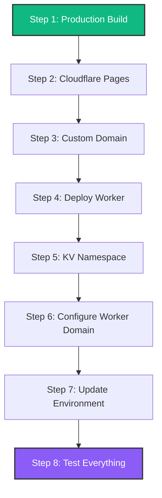

# HomeHub Deployment Guide

**Custom Domain**: `homehub.andernet.dev`
**Worker Domain**: `homehub-worker.andernet.dev`
**Date**: October 12, 2025

---

## 🎯 Pre-Deployment Checklist

Before deploying, ensure you have:

- ✅ Cloudflare account with `andernet.dev` domain configured
- ✅ GitHub repo pushed to `and3rn3t/homehub`
- ✅ Node.js 20+ installed locally
- ✅ Wrangler CLI installed (`npm install -g wrangler`)
- ✅ Logged into Wrangler (`wrangler login`)

---

## 📋 Deployment Steps Overview



---

## Step 1: Production Build ⚙️

Build your app with all optimizations:

```powershell
# Run production build
npm run build

# Expected output:
# ✓ built in 30-35s
# dist/ folder created with minified assets
# ~130 KB gzipped total bundle size
```

**Verification:**

```powershell
# Check dist/ folder exists
ls dist/

# Should see:
# - index.html
# - assets/ (CSS, JS chunks)
```

**Mark as complete:**

```powershell
# Update todo list
✅ Deploy Step 1: Production Build
```

---

## Step 2: Deploy to Cloudflare Pages 🌐

### Option A: Automatic Deployment (Recommended)

1. **Go to Cloudflare Dashboard** → **Pages** → **Create a project**

2. **Connect to Git**:
   - Select **GitHub**
   - Authorize Cloudflare
   - Choose `and3rn3t/homehub` repository

3. **Configure Build Settings**:

   ```
   Project name:        homehub
   Production branch:   main
   Build command:       npm run build
   Build output dir:    dist
   ```

4. **Environment Variables** (leave empty for now - we'll add later):

   ```
   # Will add in Step 7:
   # VITE_KV_API_URL
   # VITE_APP_VERSION
   ```

5. **Click "Save and Deploy"**

6. **Wait for deployment** (~2-3 minutes)
   - Initial URL: `homehub.pages.dev`

### Option B: Manual Deployment (CLI)

```powershell
# Install Wrangler Pages support
npm install -g wrangler

# Deploy
wrangler pages deploy dist --project-name=homehub

# Follow prompts to create project
```

**Mark as complete:**

```powershell
✅ Deploy Step 2: Cloudflare Pages
# Initial URL: https://homehub.pages.dev
```

---

## Step 3: Configure Custom Domain (Pages) 🌍

1. **Go to Cloudflare Pages Dashboard**
   - Select `homehub` project
   - Click **Custom domains** tab

2. **Add Custom Domain**:

   ```
   Domain: homehub.andernet.dev
   ```

3. **DNS Configuration** (automatic):
   - Cloudflare will create a CNAME record
   - Points to `homehub.pages.dev`
   - No manual DNS changes needed (since `andernet.dev` is in Cloudflare)

4. **Wait for SSL Certificate** (~5-10 minutes)
   - Status: "Pending" → "Active"
   - HTTPS automatically enabled

5. **Verify**:

   ```powershell
   # Should load your app with HTTPS
   curl https://homehub.andernet.dev
   ```

**Mark as complete:**

```powershell
✅ Deploy Step 3: Custom Domain
# Live at: https://homehub.andernet.dev
```

---

## Step 4: Deploy Cloudflare Worker 🛠️

### 4A: Create KV Namespace First

```powershell
# Navigate to workers directory
cd workers

# Create production namespace
wrangler kv:namespace create "HOMEHUB_KV"

# Output example:
# 🌀 Creating namespace with title "homehub-kv-worker-HOMEHUB_KV"
# ✨ Success!
# Add the following to your configuration file in your kv_namespaces array:
# { binding = "HOMEHUB_KV", id = "abc123def456..." }

# Create preview namespace (for wrangler dev)
wrangler kv:namespace create "HOMEHUB_KV" --preview

# Output example:
# { binding = "HOMEHUB_KV", preview_id = "def456abc123..." }
```

**Save these IDs** - you'll need them next!

### 4B: Update wrangler.toml

Edit `workers/wrangler.toml`:

```toml
name = "homehub-kv-worker"
main = "src/index.ts"
compatibility_date = "2024-10-09"

# KV Namespace Bindings
kv_namespaces = [
  { binding = "HOMEHUB_KV", id = "YOUR_PRODUCTION_ID", preview_id = "YOUR_PREVIEW_ID" },
  { binding = "LOGS_KV", id = "YOUR_LOGS_ID", preview_id = "YOUR_LOGS_PREVIEW_ID" }
]

# Worker settings
[build]
command = "npm run build"

[env.production]
vars = { ENVIRONMENT = "production" }

# Custom domain route (configure after worker is deployed)
# We'll add this in Step 6
```

**Replace placeholders:**

- `YOUR_PRODUCTION_ID` - from Step 4A output
- `YOUR_PREVIEW_ID` - from Step 4A preview output
- `YOUR_LOGS_ID` - create with `wrangler kv:namespace create "LOGS_KV"`
- `YOUR_LOGS_PREVIEW_ID` - create with `wrangler kv:namespace create "LOGS_KV" --preview`

### 4C: Deploy Worker

```powershell
# Still in workers/ directory
npm run build  # Build TypeScript first

# Deploy to Cloudflare
wrangler deploy

# Output:
# ✨ Success! Uploaded 1 file (x.xx sec)
# Published homehub-kv-worker
# https://homehub-kv-worker.<your-subdomain>.workers.dev
```

**Verify worker is running:**

```powershell
# Test health endpoint
curl https://homehub-kv-worker.<your-subdomain>.workers.dev/api/health

# Expected: {"status":"ok","timestamp":"2025-10-12T..."}
```

**Mark as complete:**

```powershell
✅ Deploy Step 4: Cloudflare Worker
# Worker URL: https://homehub-kv-worker.<your-subdomain>.workers.dev
```

---

## Step 5: Create LOGS_KV Namespace (Optional) 📊

If you want logging enabled immediately (or skip and do later per `POST_DEPLOYMENT_LOGGING_SETUP.md`):

```powershell
# Create LOGS_KV namespace
cd workers
wrangler kv:namespace create "LOGS_KV"
wrangler kv:namespace create "LOGS_KV" --preview

# Update wrangler.toml with the new IDs (see Step 4B above)

# Redeploy worker
wrangler deploy
```

**Skip this for now?** No problem! The logger code won't break - it just won't send logs until LOGS_KV is configured. See `POST_DEPLOYMENT_LOGGING_SETUP.md` for post-deployment setup.

---

## Step 6: Configure Worker Custom Domain 🌐

Now let's set up `homehub-worker.andernet.dev`:

### Option A: Via Cloudflare Dashboard (Recommended)

1. **Go to Cloudflare Dashboard** → **Workers & Pages**
2. **Click your worker** (`homehub-kv-worker`)
3. **Settings** → **Triggers** → **Custom Domains**
4. **Add Custom Domain**:

   ```
   Domain: homehub-worker.andernet.dev
   ```

5. **Cloudflare auto-creates DNS** (CNAME to workers.dev)
6. **Wait for SSL** (~5-10 minutes)

### Option B: Via wrangler.toml (Advanced)

Edit `workers/wrangler.toml` and add:

```toml
# Custom domain route
routes = [
  { pattern = "homehub-worker.andernet.dev/*", custom_domain = true }
]
```

Then redeploy:

```powershell
wrangler deploy
```

**Verify custom domain:**

```powershell
# Test worker on custom domain
curl https://homehub-worker.andernet.dev/api/health

# Expected: {"status":"ok","timestamp":"..."}
```

**Mark as complete:**

```powershell
✅ Deploy Step 6: Worker Custom Domain
# Worker URL: https://homehub-worker.andernet.dev
```

---

## Step 7: Update Environment Variables 🔧

Now configure your Pages app to use the custom worker domain:

### 7A: Create .env.production

Create `c:\git\homehub\.env.production`:

```bash
# Production Environment Variables

# Worker API URL (custom domain)
VITE_KV_API_URL=https://homehub-worker.andernet.dev

# App version (for logging)
VITE_APP_VERSION=1.0.0

# Optional: Worker authentication token (if you add auth later)
# VITE_KV_AUTH_TOKEN=your-secret-token
```

### 7B: Add to Cloudflare Pages

1. **Go to Pages Dashboard** → `homehub` project
2. **Settings** → **Environment variables**
3. **Add variable** (Production):

   ```
   Name:  VITE_KV_API_URL
   Value: https://homehub-worker.andernet.dev
   ```

4. **Add variable** (Production):

   ```
   Name:  VITE_APP_VERSION
   Value: 1.0.0
   ```

### 7C: Rebuild Pages

```powershell
# Trigger new deployment with env vars
# Option 1: Push to GitHub (automatic rebuild)
git add .env.production
git commit -m "Add production environment variables"
git push

# Option 2: Manual rebuild in Pages dashboard
# Pages → homehub → Deployments → "Retry deployment"
```

**Mark as complete:**

```powershell
✅ Deploy Step 7: Environment Variables
# App now communicates with: https://homehub-worker.andernet.dev
```

---

## Step 8: Post-Deployment Testing 🧪

### Test Checklist

Visit `https://homehub.andernet.dev` and verify:

#### Basic Functionality

- [ ] App loads without errors
- [ ] Theme toggle works (light/dark mode)
- [ ] iOS 26 tab bar animates smoothly
- [ ] All 11 tabs navigate correctly

#### Dashboard Tab

- [ ] Devices render (22 Philips Hue lights + virtual devices)
- [ ] Device cards show status (online/offline)
- [ ] Toggle switches work (turn lights on/off)
- [ ] Brightness sliders work (if applicable)
- [ ] Favorite button works

#### Rooms Tab

- [ ] 7 rooms render with device counts
- [ ] Room cards clickable
- [ ] Device list shows per room
- [ ] Room statistics dashboard displays

#### Scenes Tab

- [ ] Scene cards render (12+ scenes)
- [ ] Scene activation works
- [ ] Scene creation dialog opens
- [ ] Active scene indicator shows

#### Automations Tab

- [ ] Automation list renders (15+ rules)
- [ ] Toggle automation on/off works
- [ ] Flow Designer opens
- [ ] Schedule Builder opens

#### Device Monitor Tab

- [ ] Device list renders
- [ ] Real-time updates work
- [ ] Signal strength indicators show
- [ ] Battery levels display (if applicable)

#### Energy Tab

- [ ] Charts render (energy usage over time)
- [ ] Current consumption shows
- [ ] Monthly/weekly views toggle

#### Security Tab

- [ ] Camera grid renders (7 cameras)
- [ ] Camera status shows (recording/idle/offline)
- [ ] Security events list displays

#### Settings Tab

- [ ] User profile loads
- [ ] Settings save correctly
- [ ] Theme persists across sessions

#### Network/API Tests

- [ ] Open DevTools → Network tab
- [ ] Verify API calls to `homehub-worker.andernet.dev`
- [ ] Check for 200 OK responses
- [ ] No CORS errors in console
- [ ] KV store read/write works

#### Performance Tests

- [ ] Lighthouse score > 90 (Performance)
- [ ] First Contentful Paint < 1s
- [ ] Time to Interactive < 2s
- [ ] Bundle size ~130 KB gzipped

### Debugging Common Issues

#### Issue: "Failed to fetch" errors

**Symptom**: API calls to worker fail with CORS or network errors

**Fix**:

```powershell
# 1. Verify worker is accessible
curl https://homehub-worker.andernet.dev/api/health

# 2. Check CORS headers in worker (should be present)
# workers/src/index.ts line ~40
'Access-Control-Allow-Origin': '*'

# 3. Verify env var is set
# Pages → Settings → Environment variables
# VITE_KV_API_URL should be https://homehub-worker.andernet.dev
```

#### Issue: Custom domain not working

**Symptom**: `homehub.andernet.dev` shows "Page not found"

**Fix**:

```powershell
# 1. Check DNS propagation
nslookup homehub.andernet.dev

# 2. Verify CNAME in Cloudflare DNS
# Should point to: homehub.pages.dev

# 3. Check SSL certificate status
# Pages → Custom domains → homehub.andernet.dev
# Status should be "Active" (not "Pending")

# 4. Clear Cloudflare cache
# Dashboard → Caching → Purge Everything
```

#### Issue: KV store not persisting data

**Symptom**: Device states don't save across sessions

**Fix**:

```powershell
# 1. Verify KV namespace ID in wrangler.toml
cd workers
wrangler kv:namespace list

# 2. Check worker logs
wrangler tail

# 3. Test KV directly
curl -X POST https://homehub-worker.andernet.dev/api/kv \
  -H "Content-Type: application/json" \
  -d '{"key":"test","value":"hello"}'

# 4. Retrieve test value
curl https://homehub-worker.andernet.dev/api/kv?key=test
```

#### Issue: Environment variables not loading

**Symptom**: `import.meta.env.VITE_KV_API_URL` is undefined

**Fix**:

```powershell
# 1. Verify .env.production exists
cat .env.production

# 2. Check Pages environment variables
# Dashboard → Pages → homehub → Settings → Environment variables

# 3. Rebuild Pages after adding env vars
# Push commit or manual "Retry deployment"

# 4. Verify in browser console
console.log(import.meta.env.VITE_KV_API_URL)
# Should show: https://homehub-worker.andernet.dev
```

**Mark as complete:**

```powershell
✅ Deploy Step 8: Post-Deployment Testing
# All features verified working in production!
```

---

## 🎉 Deployment Complete

### Your Live URLs

**Frontend (Pages):**

- Custom Domain: https://homehub.andernet.dev
- Cloudflare URL: https://homehub.pages.dev

**Backend (Worker):**

- Custom Domain: https://homehub-worker.andernet.dev
- Cloudflare URL: https://homehub-kv-worker.<your-subdomain>.workers.dev

### What's Next?

1. **Monitor Performance**:
   - Cloudflare Analytics (Pages dashboard)
   - Worker metrics (Workers dashboard)

2. **Optional: Add Logging** (15-30 min):
   - Follow `POST_DEPLOYMENT_LOGGING_SETUP.md`
   - Configure LOGS_KV namespace
   - Start capturing production errors

3. **Continuous Deployment**:
   - Push to `main` branch → Auto-deploy to Pages
   - Update worker: `cd workers && wrangler deploy`

4. **Future Enhancements**:
   - Add authentication (Cloudflare Access)
   - Enable preview deployments (branch previews)
   - Set up staging environment
   - Add monitoring/alerting

---

## 📊 Architecture Overview

```
┌─────────────────────────────────────────────────────┐
│                                                     │
│  User Browser                                       │
│  ↓ HTTPS                                            │
│  homehub.andernet.dev (Cloudflare Pages)            │
│  ├── index.html                                     │
│  ├── /assets/*.js (130 KB gzipped)                  │
│  └── /assets/*.css (57 KB gzipped)                  │
│                                                     │
│  ↓ API Calls (fetch)                                │
│  homehub-worker.andernet.dev (Cloudflare Worker)    │
│  ├── GET  /api/kv?key=devices                       │
│  ├── POST /api/kv (save device state)               │
│  ├── GET  /api/logs (optional logging)              │
│  └── POST /api/logs (optional logging)              │
│                                                     │
│  ↓ KV Store                                         │
│  HOMEHUB_KV (Cloudflare KV)                         │
│  ├── devices: [22 Hue lights + virtual devices]     │
│  ├── rooms: [7 rooms with assignments]              │
│  ├── scenes: [12+ scene definitions]                │
│  ├── automations: [15+ automation rules]            │
│  └── user-preferences: [theme, favorites, etc.]     │
│                                                     │
│  LOGS_KV (Optional - Cloudflare KV)                 │
│  ├── log:2025-10-12T...: [error entries]            │
│  └── recent-errors: [last 100 errors cached]        │
│                                                     │
└─────────────────────────────────────────────────────┘
```

---

## 🔒 Security Considerations

### Current Setup (Development)

- ✅ HTTPS enforced (Cloudflare SSL)
- ✅ CORS configured for API access
- ⚠️ No authentication (open to public)
- ⚠️ No rate limiting

### Production Hardening (Optional)

#### 1. Add Authentication

```typescript
// workers/src/index.ts
const AUTH_TOKEN = env.SECRET_TOKEN // Set in wrangler.toml secrets

if (request.headers.get('Authorization') !== `Bearer ${AUTH_TOKEN}`) {
  return new Response('Unauthorized', { status: 401 })
}
```

#### 2. Enable Rate Limiting

```typescript
// Use Cloudflare Rate Limiting API
// Or implement simple in-memory rate limiting in worker
```

#### 3. Restrict CORS Origins

```typescript
// Change from '*' to specific domain
'Access-Control-Allow-Origin': 'https://homehub.andernet.dev'
```

#### 4. Use Cloudflare Access (Zero Trust)

- Protect Pages app behind login
- Integrate with Google/GitHub SSO
- Free tier: 50 users

---

## 📞 Need Help?

### Useful Commands

```powershell
# Check Pages deployment status
wrangler pages deployment list --project-name=homehub

# Stream worker logs live
cd workers
wrangler tail

# List KV namespaces
wrangler kv:namespace list

# View KV keys
wrangler kv:key list --namespace-id=YOUR_NAMESPACE_ID

# Get KV value
wrangler kv:key get "devices" --namespace-id=YOUR_NAMESPACE_ID

# Delete KV key
wrangler kv:key delete "test" --namespace-id=YOUR_NAMESPACE_ID

# Rollback Pages deployment
# Dashboard → Pages → homehub → Deployments → "..." → Rollback
```

### Resources

- **Cloudflare Pages Docs**: https://developers.cloudflare.com/pages/
- **Cloudflare Workers Docs**: https://developers.cloudflare.com/workers/
- **Wrangler CLI Docs**: https://developers.cloudflare.com/workers/wrangler/
- **KV Storage Docs**: https://developers.cloudflare.com/kv/
- **Custom Domains Guide**: https://developers.cloudflare.com/pages/configuration/custom-domains/

### Support Channels

- **Cloudflare Community**: https://community.cloudflare.com/
- **Discord**: https://discord.gg/cloudflaredev
- **GitHub Issues**: https://github.com/and3rn3t/homehub/issues

---

## ✅ Deployment Checklist

Before you start:

- [ ] Cloudflare account active
- [ ] `andernet.dev` domain in Cloudflare
- [ ] Wrangler CLI installed + logged in
- [ ] GitHub repo up to date

Step 1: Production Build

- [ ] `npm run build` succeeds
- [ ] `dist/` folder created

Step 2: Cloudflare Pages

- [ ] Project created in Pages dashboard
- [ ] GitHub connected
- [ ] Build settings configured
- [ ] Initial deployment successful

Step 3: Custom Domain (Pages)

- [ ] `homehub.andernet.dev` added
- [ ] DNS CNAME created (automatic)
- [ ] SSL certificate active
- [ ] Site loads on custom domain

Step 4: Deploy Worker

- [ ] HOMEHUB_KV namespace created
- [ ] wrangler.toml updated with IDs
- [ ] `wrangler deploy` succeeds
- [ ] Worker health endpoint responds

Step 5: Worker Custom Domain

- [ ] `homehub-worker.andernet.dev` added
- [ ] DNS configured (automatic)
- [ ] SSL certificate active
- [ ] API endpoints accessible

Step 6: Environment Variables

- [ ] `.env.production` created
- [ ] Variables added to Pages dashboard
- [ ] Pages rebuilt with new env vars
- [ ] `VITE_KV_API_URL` points to worker

Step 7: Testing

- [ ] All tabs load without errors
- [ ] Device control works
- [ ] KV store persists data
- [ ] No console errors
- [ ] Performance acceptable

Optional: Logging Setup

- [ ] LOGS_KV namespace created (if desired)
- [ ] wrangler.toml updated
- [ ] Worker redeployed
- [ ] Test logs captured

---

**Ready to deploy!** 🚀 Start with Step 1 and work through each section. Come back to this guide if you hit any issues!
