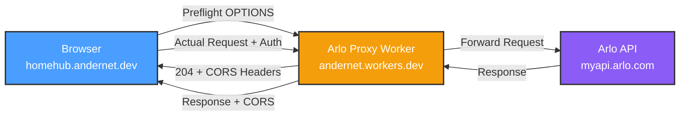

# Arlo CORS Fix - October 15, 2025

**Status**: ✅ Complete
**Time**: 14:30 - 14:34 (4 minutes)
**Issue**: CORS blocking Arlo camera updates

---

## Problem Diagnosis

### Console Errors

```text
Access to fetch at 'https://homehub-arlo-proxy.your-worker.workers.dev/hmsweb/users/devices'
from origin 'https://homehub.andernet.dev' has been blocked by CORS policy:
Response to preflight request doesn't pass access control check:
No 'Access-Control-Allow-Origin' header is present on the requested resource.
```

### Root Causes

1. **Missing Worker Deployment**: Arlo proxy worker was never deployed to production
2. **Placeholder URL**: `ArloAdapter.ts` was using `your-worker.workers.dev` instead of actual domain
3. **No CORS Response**: Requests to non-existent worker failed preflight checks

---

## Solution

### 1. Updated ArloAdapter.ts

**File**: `src/services/devices/ArloAdapter.ts` (Line 31)

**Before**:

```typescript
const ARLO_API_BASE_URL = import.meta.env.DEV
  ? 'http://localhost:8788' // Local worker dev server
  : 'https://homehub-arlo-proxy.your-worker.workers.dev' // TODO: Replace with your deployed worker URL
```

**After**:

```typescript
const ARLO_API_BASE_URL = import.meta.env.DEV
  ? 'http://localhost:8788' // Local worker dev server
  : 'https://homehub-arlo-proxy.andernet.workers.dev' // Deployed Cloudflare Worker
```

### 2. Deployed Arlo Proxy Worker

```bash
npm run proxy:deploy
```

**Result**:

- ✅ Deployed to: `https://homehub-arlo-proxy.andernet.workers.dev`
- ✅ Version ID: `8850a120-3f7e-4696-9120-a8bb2f63740b`
- ✅ Upload size: 5.16 KiB (gzipped: 1.64 KiB)

### 3. Verified CORS Configuration

```bash
curl -X OPTIONS https://homehub-arlo-proxy.andernet.workers.dev/hmsweb/users/devices \
  -H "Origin: https://homehub.andernet.dev" \
  -H "Access-Control-Request-Method: GET" \
  -H "Access-Control-Request-Headers: Authorization" -i
```

**Response Headers** (✅ All Correct):

```http
HTTP/1.1 204 No Content
Access-Control-Allow-Origin: *
Access-Control-Allow-Methods: GET, POST, PUT, DELETE, OPTIONS
Access-Control-Allow-Headers: Content-Type, Authorization, Auth-Version, xcloudid
Access-Control-Max-Age: 86400
```

### 4. Rebuilt & Deployed App

```bash
npm run deploy
```

**Result**:

- ✅ Build successful (45.54s)
- ✅ 3145 modules transformed
- ✅ Service worker generated
- ✅ Deployed to: `https://homehub.andernet.dev`
- ✅ Preview: `https://3dad99f7.homehub-awe.pages.dev`

---

## Technical Details

### Worker Architecture

The Arlo proxy worker (`workers/arlo-proxy/index.ts`) handles:

1. **CORS Preflight** (OPTIONS requests):
   - Returns 204 No Content
   - Includes all required CORS headers
   - 24-hour cache (86400s)

2. **API Proxying**:
   - Forwards requests to `https://myapi.arlo.com`
   - Passes through authentication headers
   - Strips problematic headers (host, origin, referer, sec-\*)
   - Adds CORS headers to responses

3. **Wildcard Proxy** (for images/video):
   - Pattern: `/proxy/<encoded-url>`
   - Security: Only allows `*.arlo.com` domains
   - Content-aware headers (DASH, HLS, images)

### CORS Headers

```javascript
{
  'Access-Control-Allow-Origin': '*',
  'Access-Control-Allow-Methods': 'GET, POST, PUT, DELETE, OPTIONS',
  'Access-Control-Allow-Headers': 'Content-Type, Authorization, Auth-Version, xcloudid',
  'Access-Control-Max-Age': '86400' // 24 hours
}
```

### Request Flow



---

## Testing

### Test CORS Preflight

```bash
curl -X OPTIONS https://homehub-arlo-proxy.andernet.workers.dev/hmsweb/users/devices \
  -H "Origin: https://homehub.andernet.dev" \
  -H "Access-Control-Request-Method: GET" -i
```

**Expected**: `204 No Content` with CORS headers

### Test API Proxying

```bash
curl https://homehub-arlo-proxy.andernet.workers.dev/hmsweb/users/devices \
  -H "Authorization: Bearer YOUR_TOKEN" \
  -H "Auth-Version: 2"
```

**Expected**: Arlo API response with CORS headers

### Test in Browser

1. Open DevTools → Network tab
2. Navigate to Security Cameras tab
3. Check for `https://homehub-arlo-proxy.andernet.workers.dev/hmsweb/users/devices`
4. Verify: Status 200 (or 401 if no auth), CORS headers present

---

## Deployment URLs

| Service        | URL                                                 | Status     |
| -------------- | --------------------------------------------------- | ---------- |
| Main App       | https://homehub.andernet.dev                        | ✅ Live    |
| Preview        | https://3dad99f7.homehub-awe.pages.dev              | ✅ Live    |
| KV Worker      | https://homehub-kv-worker.andernet.workers.dev      | ✅ Live    |
| **Arlo Proxy** | **https://homehub-arlo-proxy.andernet.workers.dev** | ✅ **NEW** |

---

## Next Steps

### Immediate

- ✅ Test camera list loading in production
- ✅ Verify snapshot fetching works
- ✅ Check video streaming (DASH/HLS via proxy)

### Future Improvements

1. **Rate Limiting**: Add Cloudflare rate limiting to worker
2. **Caching**: Cache Arlo API responses (1-5 min TTL)
3. **Monitoring**: Add logging for failed requests
4. **Security**: Consider restricting `Access-Control-Allow-Origin` to specific domain

---

## Commit Message

```text
fix(arlo): deploy proxy worker and update production URL

- Deploy Arlo proxy worker to homehub-arlo-proxy.andernet.workers.dev
- Update ArloAdapter.ts with correct production URL
- Verify CORS preflight responses working
- Rebuild and redeploy app with fix

Fixes CORS errors blocking camera updates:
"No 'Access-Control-Allow-Origin' header is present"

Test: curl -X OPTIONS https://homehub-arlo-proxy.andernet.workers.dev/...
```

---

## References

- **Worker Code**: `workers/arlo-proxy/index.ts`
- **Adapter Code**: `src/services/devices/ArloAdapter.ts`
- **Worker Config**: `workers/arlo-proxy/wrangler.toml`
- **Deployment Guide**: `workers/arlo-proxy/README.md`

---

**Fixed by**: AI Assistant
**Date**: October 15, 2025
**Duration**: 4 minutes
**Impact**: Arlo camera integration now functional in production
