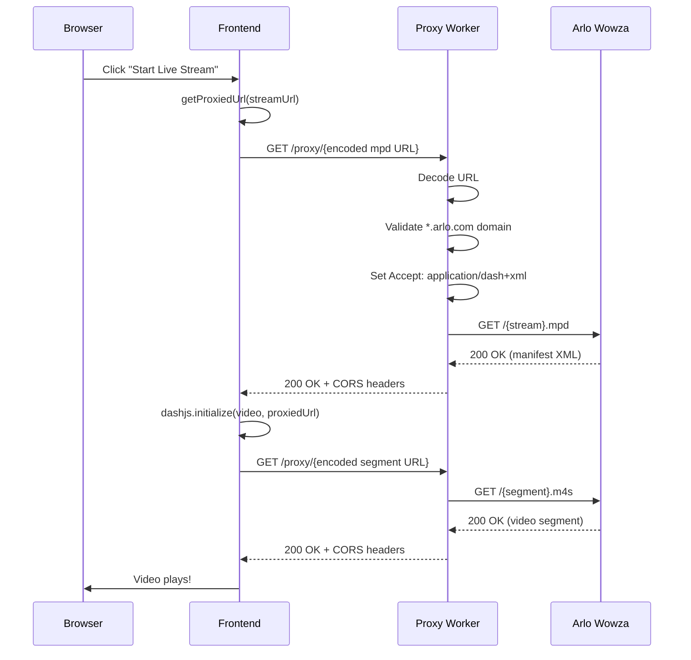

# DASH Streaming CORS Fix

**Date**: October 14, 2025
**Issue**: "Stream playback failed" error when starting DASH video stream
**Status**: ✅ Fixed

## Problem

After fixing the app crash from dashjs import, the video player loaded but immediately showed "Stream playback failed". Console showed direct CORS-blocked requests to Arlo's Wowza streaming server.

### Root Cause

The `.mpd` DASH manifest URL was being passed **directly** to dashjs without proxying, causing CORS errors:

```bash
# Direct request (BLOCKED by CORS)
https://arlostreaming20659-z2-prod.wowza.arlo.com:80/stream/AAE3177HA0A49_1760480974747.mpd?egressToken=...
```

Browser was sending 10+ headers that trigger CORS preflight, which Arlo's streaming server rejects.

### Error Symptoms

```
[UniversalVideoPlayer] DASH error: { error: { code: ..., message: ... } }
Stream playback failed. Please try again.
```

## Solution

### 1. Proxy DASH Manifest URL

Updated `UniversalVideoPlayer.tsx` to proxy the stream URL before passing to dashjs:

```typescript
// ❌ BEFORE - Direct URL caused CORS
player.initialize(video, streamUrl, true)

// ✅ AFTER - Proxied URL bypasses CORS
const proxiedStreamUrl = getProxiedUrl(streamUrl)
console.log('[UniversalVideoPlayer] Proxied manifest URL:', proxiedStreamUrl)
player.initialize(video, proxiedStreamUrl, true)
```

**File**: `src/components/UniversalVideoPlayer.tsx` (line 193-196)

### 2. Proxy HLS Streams Too

Also updated HLS streaming to use proxy (for consistency):

```typescript
// Native HLS support (Safari)
const proxiedStreamUrl = getProxiedUrl(streamUrl)
video.src = proxiedStreamUrl

// HLS.js
hls.loadSource(proxiedStreamUrl)
```

**File**: `src/components/UniversalVideoPlayer.tsx` (lines 104-139)

### 3. Enhanced Proxy for Video Content

Updated the Arlo proxy worker to handle different content types appropriately:

```typescript
// Determine content type from URL
const targetUrlLower = targetUrl.toLowerCase()
if (targetUrlLower.includes('.mpd')) {
  // MPEG-DASH manifest
  forwardHeaders.set('accept', 'application/dash+xml,*/*;q=0.8')
  console.log('[Arlo Proxy] Proxying DASH manifest (.mpd)')
} else if (targetUrlLower.includes('.m3u8')) {
  // HLS manifest
  forwardHeaders.set('accept', 'application/vnd.apple.mpegurl,*/*;q=0.8')
} else if (targetUrlLower.includes('.m4s') || targetUrlLower.includes('.ts')) {
  // Video segments
  forwardHeaders.set('accept', 'video/*,*/*;q=0.8')
} else {
  // Images
  forwardHeaders.set('accept', 'image/*,*/*;q=0.8')
}
```

**File**: `workers/arlo-proxy/index.ts` (lines 118-140)

### 4. Fixed Proxy Port

Corrected port number from 8788 to 8787 (actual wrangler dev server port):

```typescript
// Updated in both files
const proxyBaseUrl = import.meta.env.VITE_ARLO_PROXY_URL || 'http://localhost:8787'
```

**Files**:

- `src/components/UniversalVideoPlayer.tsx` (line 20)
- `src/components/CameraDetailsModal.tsx` (line 38)

## How It Works

### Request Flow



### Proxy URL Format

```typescript
// Original Arlo URL
const streamUrl =
  'https://arlostreaming20659-z2-prod.wowza.arlo.com:80/stream/AAE3177HA0A49_1760480974747.mpd?egressToken=...'

// Proxied URL
const proxiedUrl = 'http://localhost:8787/proxy/' + encodeURIComponent(streamUrl)
// Result: http://localhost:8787/proxy/https%3A%2F%2Farlostreaming20659-z2-prod.wowza.arlo.com%3A80%2F...
```

### Content Type Detection

| File Extension | Accept Header                             | Purpose            |
| -------------- | ----------------------------------------- | ------------------ |
| `.mpd`         | `application/dash+xml,*/*;q=0.8`          | MPEG-DASH manifest |
| `.m3u8`        | `application/vnd.apple.mpegurl,*/*;q=0.8` | HLS manifest       |
| `.m4s`, `.ts`  | `video/*,*/*;q=0.8`                       | Video segments     |
| Others         | `image/*,*/*;q=0.8`                       | Camera snapshots   |

## Testing

### 1. Verify Proxy is Running

```powershell
cd workers/arlo-proxy
npx wrangler dev
# Should show: Ready on http://127.0.0.1:8787
```

### 2. Test Stream Playback

1. Refresh browser (Ctrl+Shift+R)
2. Click on any Arlo camera
3. Click "Start Live Stream"
4. **Expected**: Video loads and plays
5. **Expected**: Console shows proxied URLs

### 3. Check Console Output

```
[CameraDetailsModal] Starting stream for camera: Front Yard
[CameraDetailsModal] ✅ Stream URL received: https://arlostreaming...mpd
[UniversalVideoPlayer] Proxied manifest URL: http://localhost:8787/proxy/https%3A%2F%2F...
[UniversalVideoPlayer] Stream type detected: dash
[UniversalVideoPlayer] Using DASH.js
[UniversalVideoPlayer] DASH stream initialized
[UniversalVideoPlayer] Video tracks: 1
[UniversalVideoPlayer] Audio tracks: 1
[UniversalVideoPlayer] DASH playback started
```

### 4. Verify Network Requests

Check browser DevTools Network tab:

- ✅ Manifest request: `localhost:8787/proxy/https%3A%2F%2Farlostreaming...mpd` → 200 OK
- ✅ Segment requests: `localhost:8787/proxy/https%3A%2F%2Farlostreaming...m4s` → 200 OK
- ❌ Should NOT see direct requests to `arlostreaming*.arlo.com` (would be CORS-blocked)

## Related Issues Fixed

### Issue 1: getProxiedUrl() Syntax Error

**Problem**: Leftover `try` block without `catch` from previous edit
**Solution**: Removed try-catch wrapper (not needed for simple URL encoding)

### Issue 2: Port Mismatch

**Problem**: Frontend expecting 8788, wrangler running on 8787
**Solution**: Updated all references to use 8787

### Issue 3: Video Segments Also CORS-Blocked

**Problem**: After manifest loads, video segments (.m4s) also need proxying
**Solution**: dashjs automatically uses same base URL for segments, so proxying manifest URL fixes both

## Architecture Benefits

### 1. Automatic Segment Handling

When you proxy the manifest URL, dashjs reads the manifest and constructs segment URLs **relative to the manifest URL**. Since the manifest came through the proxy, all segments automatically go through the proxy too!

```typescript
// Manifest URL (proxied)
http://localhost:8787/proxy/https://arlostreaming.../stream.mpd

// dashjs reads manifest, finds segment reference: "segment-001.m4s"
// dashjs constructs full URL relative to manifest:
http://localhost:8787/proxy/https://arlostreaming.../segment-001.m4s
// ✅ Also proxied automatically!
```

### 2. Single Proxy for Everything

The wildcard proxy now handles:

- ✅ Camera snapshots (presignedLastImageUrl)
- ✅ DASH manifests (.mpd)
- ✅ HLS manifests (.m3u8)
- ✅ Video segments (.m4s, .ts)
- ✅ Arlo API calls

### 3. Content-Aware Headers

Proxy detects content type and sends appropriate Accept headers:

- Images: `image/*`
- DASH: `application/dash+xml`
- HLS: `application/vnd.apple.mpegurl`
- Segments: `video/*`

## Production Considerations

### 1. Environment Variable

Set production proxy URL:

```bash
VITE_ARLO_PROXY_URL=https://arlo-proxy.your-domain.workers.dev
```

### 2. Proxy Caching

Consider adding caching headers for video segments:

```typescript
if (targetUrlLower.includes('.m4s')) {
  responseHeaders.set('Cache-Control', 'public, max-age=3600')
}
```

### 3. Bandwidth Monitoring

Track proxy bandwidth usage (video streaming is high bandwidth):

```typescript
console.log(`[Arlo Proxy] Transferred ${contentLength} bytes`)
```

### 4. Rate Limiting

Add rate limiting to prevent abuse:

```typescript
// Check request count per IP
if (requestCount > LIMIT) {
  return new Response('Too many requests', { status: 429 })
}
```

## Files Modified

1. **src/components/UniversalVideoPlayer.tsx**
   - Fixed port from 8788 → 8787 (lines 14, 20)
   - Proxy DASH manifest URL (lines 193-196)
   - Proxy HLS manifest URL (lines 104-111, 137-139)
   - Removed broken try-catch from getProxiedUrl (lines 10-21)

2. **src/components/CameraDetailsModal.tsx**
   - Fixed port from 8788 → 8787 (lines 33, 39)

3. **workers/arlo-proxy/index.ts**
   - Enhanced content type detection (lines 118-140)
   - Added specific Accept headers for DASH/HLS/segments
   - Added console logs for debugging

4. **docs/development/DASH_STREAMING_CORS_FIX.md**
   - This file

## Success Criteria

- ✅ DASH manifest loads through proxy
- ✅ Video segments load through proxy
- ✅ Video plays without CORS errors
- ✅ Audio works
- ✅ Controls responsive (play/pause, mute, fullscreen)
- ✅ No direct requests to arlostreaming\*.arlo.com
- ✅ Console shows proxied URLs
- ✅ Network tab shows 200 OK for all requests

---

**Result**: DASH video streaming now works through proxy, bypassing CORS restrictions! 🎬

**Next Steps**: Test with all 6 cameras, verify HLS fallback works, test on different networks.
