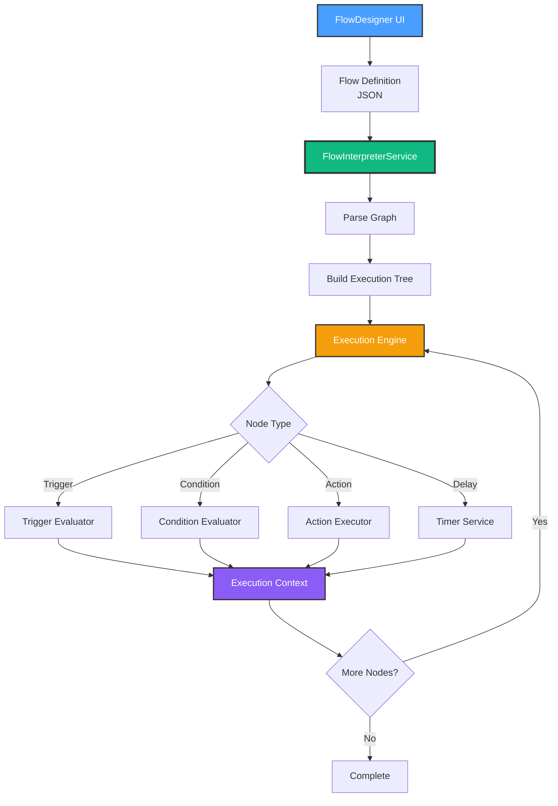
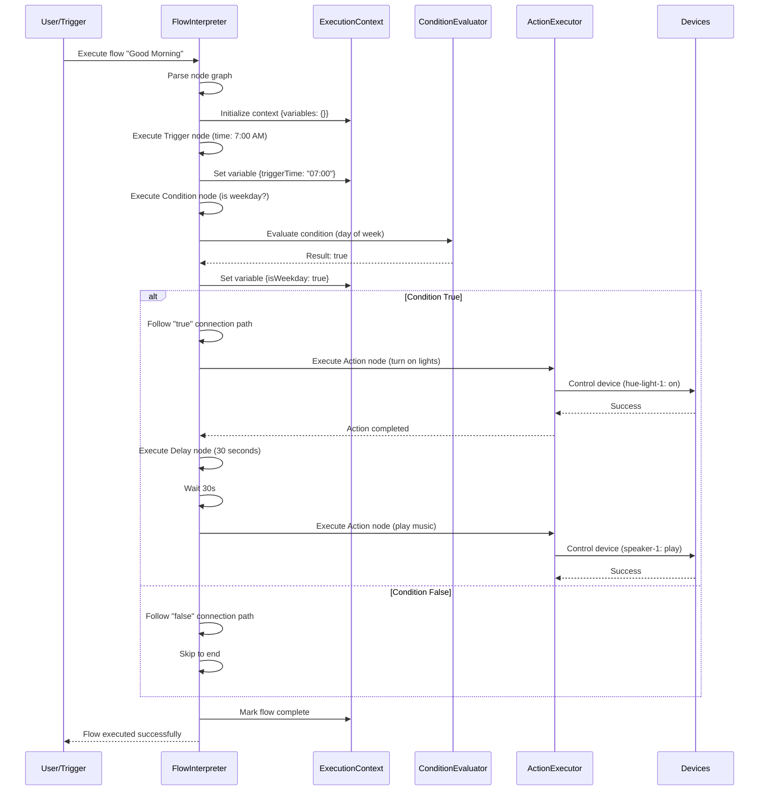

# Milestone 3.4: Flow Designer Execution - Implementation Plan

**Date**: October 11, 2025
**Milestone**: 3.4 - Flow Designer Execution Engine
**Status**: 🚀 Starting Implementation
**Estimated Duration**: 1-2 days
**Complexity**: Medium-High

---

## 🎯 Objective

Build a **visual flow interpretation engine** that executes node-based automation flows like traditional code, with support for:

1. **Node Graph Traversal** - Execute flows by following node connections
2. **Data Passing** - Pass variables between nodes (trigger → condition → action)
3. **Conditional Branching** - Support if/else logic with condition nodes
4. **Loops** - Support for-each and while loops
5. **Debug Mode** - Step-through execution with breakpoints

---

## 📊 Current State Analysis

### What Already Exists ✅

1. **FlowDesigner Component** (`src/components/FlowDesigner.tsx` - 674 lines)
   - Visual canvas for drag-and-drop flow creation
   - Node palette with trigger, condition, action, delay types
   - Node connection drawing
   - Flow persistence to KV store

2. **FlowExecutor Component** (`src/components/FlowExecutor.tsx` - 315 lines)
   - Basic flow execution logic (placeholder)
   - React hook: `useFlowExecutor()`
   - Simple node traversal
   - Toast notifications

3. **Type Definitions** (`src/types/automation.types.ts`)
   - `FlowNode` interface with id, type, subtype, label, icon, position, data, connections
   - `Flow` interface with id, name, description, nodes, enabled, created
   - `FlowNodeType` = 'trigger' | 'condition' | 'action' | 'delay'

4. **Node Types Defined**:
   - **Triggers**: time, location, device state
   - **Conditions**: time_range, temperature, presence
   - **Actions**: light, lock, thermostat, scene
   - **Delays**: wait/pause

### What's Missing ❌

1. **Flow Interpreter Service** - Convert node graph to executable code
2. **Execution Context** - Track variables, state, and current position in flow
3. **Conditional Logic** - Evaluate condition nodes and branch accordingly
4. **Loop Support** - Execute subgraphs multiple times
5. **Data Flow** - Pass outputs from one node to inputs of next
6. **Error Handling** - Handle node failures, infinite loops, deadlocks
7. **Debug Mode** - Breakpoints, step-through, variable inspection
8. **Integration** - Connect to ActionExecutor, SchedulerService, ConditionEvaluator

---

## 🏗️ Architecture Design

### System Overview



### Data Flow Example



---

## 📝 Implementation Tasks

### Task 1: Create FlowInterpreterService ⏱️ 2-3 hours

**File**: `src/services/automation/flow-interpreter.service.ts`

**Features**:

- Singleton pattern (like other services)
- Graph parsing and validation
- Execution tree building
- Node traversal logic
- Circular dependency detection
- Dead code elimination

**Key Methods**:

```typescript
class FlowInterpreterService {
  // Parse flow into executable format
  parseFlow(flow: Flow): ExecutionGraph

  // Validate flow structure
  validateFlow(flow: Flow): ValidationResult

  // Execute entire flow
  async executeFlow(flow: Flow, context: ExecutionContext): Promise<FlowResult>

  // Execute single node
  private async executeNode(node: FlowNode, context: ExecutionContext): Promise<NodeResult>

  // Find next nodes to execute
  private getNextNodes(node: FlowNode, context: ExecutionContext): FlowNode[]

  // Detect circular dependencies
  private detectCycles(flow: Flow): string[]

  // Build execution order (topological sort)
  private buildExecutionOrder(flow: Flow): FlowNode[]
}
```

---

### Task 2: Extend ExecutionContext ⏱️ 1 hour

**File**: `src/services/automation/types.ts` (update existing)

**Add**:

```typescript
export interface ExecutionContext {
  // Existing
  flowId: string
  executionId: string
  timestamp: string

  // NEW: Variable storage
  variables: Record<string, any>

  // NEW: Execution state
  currentNodeId: string | null
  visitedNodes: Set<string>
  executionStack: string[]

  // NEW: Branching logic
  branchConditions: Record<string, boolean>

  // NEW: Loop state
  loopCounters: Record<string, number>
  loopMaxIterations: Record<string, number>

  // NEW: Debug mode
  debugMode: boolean
  breakpoints: Set<string>
  stepMode: boolean

  // NEW: Performance tracking
  nodeExecutionTimes: Record<string, number>
  totalExecutionTime: number
}

export interface FlowResult {
  success: boolean
  flowId: string
  executionId: string
  executedNodes: string[]
  failedNodes: string[]
  variables: Record<string, any>
  executionTime: number
  error?: string
}

export interface NodeResult {
  success: boolean
  nodeId: string
  output: any
  executionTime: number
  error?: string
}

export interface ValidationResult {
  valid: boolean
  errors: string[]
  warnings: string[]
}

export interface ExecutionGraph {
  flow: Flow
  rootNodes: FlowNode[]
  nodeMap: Map<string, FlowNode>
  adjacencyList: Map<string, string[]>
  executionOrder: FlowNode[]
}
```

---

### Task 3: Implement Node Execution Logic ⏱️ 3-4 hours

**Features**:

- Execute each node type with specific logic
- Pass data between nodes via context variables
- Handle node-specific configurations

#### Trigger Node Execution

```typescript
private async executeTriggerNode(
  node: FlowNode,
  context: ExecutionContext
): Promise<NodeResult> {
  // Trigger nodes set initial variables
  switch (node.subtype) {
    case 'time':
      context.variables.triggerTime = node.data.time
      context.variables.triggerDays = node.data.days
      break

    case 'device':
      context.variables.deviceId = node.data.deviceId
      context.variables.deviceState = node.data.state
      break

    case 'location':
      context.variables.latitude = node.data.latitude
      context.variables.longitude = node.data.longitude
      break
  }

  return {
    success: true,
    nodeId: node.id,
    output: context.variables,
    executionTime: 0
  }
}
```

#### Condition Node Execution

```typescript
private async executeConditionNode(
  node: FlowNode,
  context: ExecutionContext
): Promise<NodeResult> {
  let conditionResult = false

  switch (node.subtype) {
    case 'time_range':
      const currentTime = new Date().getHours()
      const startHour = node.data.startTime.split(':')[0]
      const endHour = node.data.endTime.split(':')[0]
      conditionResult = currentTime >= startHour && currentTime < endHour
      break

    case 'temperature':
      const temp = context.variables.temperature || 72
      const threshold = node.data.threshold
      const operator = node.data.operator
      conditionResult = this.compareValues(temp, threshold, operator)
      break

    case 'presence':
      const isHome = context.variables.isHome || false
      conditionResult = isHome === node.data.expectedPresence
      break
  }

  // Store result for branching
  context.branchConditions[node.id] = conditionResult

  return {
    success: true,
    nodeId: node.id,
    output: conditionResult,
    executionTime: 5
  }
}
```

#### Action Node Execution

```typescript
private async executeActionNode(
  node: FlowNode,
  context: ExecutionContext
): Promise<NodeResult> {
  const actionExecutor = ActionExecutorService.getInstance()

  // Convert node data to AutomationAction format
  const action: AutomationAction = {
    deviceId: node.data.deviceId,
    action: this.mapActionType(node.subtype),
    value: node.data.value
  }

  const startTime = Date.now()

  try {
    // Execute via ActionExecutor (reuse existing logic!)
    await actionExecutor.performAction(action.deviceId, action)

    return {
      success: true,
      nodeId: node.id,
      output: { deviceId: action.deviceId, state: 'controlled' },
      executionTime: Date.now() - startTime
    }
  } catch (error) {
    return {
      success: false,
      nodeId: node.id,
      output: null,
      executionTime: Date.now() - startTime,
      error: error.message
    }
  }
}
```

#### Delay Node Execution

```typescript
private async executeDelayNode(
  node: FlowNode,
  context: ExecutionContext
): Promise<NodeResult> {
  const delayMs = node.data.delay || 1000

  const startTime = Date.now()
  await new Promise(resolve => setTimeout(resolve, delayMs))

  return {
    success: true,
    nodeId: node.id,
    output: { delayed: delayMs },
    executionTime: Date.now() - startTime
  }
}
```

---

### Task 4: Implement Conditional Branching ⏱️ 2 hours

**Features**:

- Evaluate condition node results
- Follow "true" or "false" connection paths
- Support multiple output connections

**Logic**:

```typescript
private getNextNodes(
  node: FlowNode,
  context: ExecutionContext,
  flow: Flow
): FlowNode[] {
  // If this is a condition node, check branch result
  if (node.type === 'condition') {
    const conditionResult = context.branchConditions[node.id]

    // Assume first connection is "true", second is "false"
    const targetNodeId = conditionResult
      ? node.connections[0]  // True path
      : node.connections[1]  // False path

    if (!targetNodeId) return []

    const nextNode = flow.nodes.find(n => n.id === targetNodeId)
    return nextNode ? [nextNode] : []
  }

  // For other nodes, follow all connections
  return node.connections
    .map(connId => flow.nodes.find(n => n.id === connId))
    .filter(n => n !== undefined) as FlowNode[]
}
```

**Visual Representation**:

```
[Trigger: Time 7:00 AM]
        ↓
[Condition: Is Weekday?]
        ↓
    True ←──→ False
        ↓           ↓
[Action: Lights On]  [Action: Sleep Mode]
```

---

### Task 5: Add Loop Support ⏱️ 2 hours

**Features**:

- For-each loops over arrays
- While loops with max iteration limits
- Loop counter tracking

**Implementation**:

```typescript
private async executeLoopNode(
  node: FlowNode,
  context: ExecutionContext
): Promise<NodeResult> {
  const loopType = node.data.loopType // 'for-each' | 'while'
  const maxIterations = node.data.maxIterations || 10

  if (loopType === 'for-each') {
    const items = context.variables[node.data.arrayVariable] || []

    for (let i = 0; i < Math.min(items.length, maxIterations); i++) {
      context.variables.currentItem = items[i]
      context.variables.currentIndex = i
      context.loopCounters[node.id] = i

      // Execute loop body (nodes connected to this node)
      const bodyNodes = this.getNextNodes(node, context, flow)
      for (const bodyNode of bodyNodes) {
        await this.executeNode(bodyNode, context)
      }
    }
  }

  return {
    success: true,
    nodeId: node.id,
    output: { iterations: context.loopCounters[node.id] },
    executionTime: 0
  }
}
```

---

### Task 6: Add Debug Mode ⏱️ 1-2 hours

**Features**:

- Set breakpoints on specific nodes
- Step-through execution (pause between nodes)
- Variable inspection at each step
- Execution timeline visualization

**Implementation**:

```typescript
private async executeNode(
  node: FlowNode,
  context: ExecutionContext
): Promise<NodeResult> {
  // Check for breakpoint
  if (context.debugMode && context.breakpoints.has(node.id)) {
    console.log('🔴 Breakpoint hit:', node.id, node.label)
    console.log('📊 Variables:', context.variables)

    // Pause execution (wait for debugger to continue)
    await this.waitForDebuggerContinue(context.executionId)
  }

  // Step mode: pause after each node
  if (context.debugMode && context.stepMode) {
    console.log('⏸️ Step mode: Paused after', node.label)
    await this.waitForDebuggerStep(context.executionId)
  }

  // ... rest of execution logic
}
```

---

### Task 7: Integration with Existing Services ⏱️ 1 hour

**Connect**:

- `ActionExecutorService` - Execute action nodes
- `SchedulerService` - Schedule flow execution
- `ConditionEvaluatorService` - Evaluate condition nodes
- `DeviceManager` - Get device states for conditions

**Example**:

```typescript
// In FlowInterpreterService
private async executeActionNode(node: FlowNode, context: ExecutionContext) {
  const actionExecutor = ActionExecutorService.getInstance()

  // Reuse existing action execution logic
  const result = await actionExecutor.execute(
    this.convertToAutomation(node, context),
    'sequential'
  )

  return {
    success: result.success,
    nodeId: node.id,
    output: result,
    executionTime: result.executionTime
  }
}
```

---

### Task 8: Create React Hook ⏱️ 1 hour

**File**: `src/hooks/use-flow-interpreter.ts`

**Features**:

- React integration for FlowInterpreterService
- Flow execution trigger
- Execution status tracking
- Debug controls

**Implementation**:

```typescript
export function useFlowInterpreter() {
  const [flows, setFlows] = useKV<Flow[]>('automation-flows', [])
  const [activeExecutions, setActiveExecutions] = useState<ExecutionContext[]>([])
  const interpreterRef = useRef(FlowInterpreterService.getInstance())

  const executeFlow = useCallback(
    async (flowId: string) => {
      const flow = flows.find(f => f.id === flowId)
      if (!flow) {
        toast.error('Flow not found')
        return
      }

      const context: ExecutionContext = {
        flowId,
        executionId: `exec-${Date.now()}`,
        timestamp: new Date().toISOString(),
        variables: {},
        currentNodeId: null,
        visitedNodes: new Set(),
        executionStack: [],
        branchConditions: {},
        loopCounters: {},
        loopMaxIterations: {},
        debugMode: false,
        breakpoints: new Set(),
        stepMode: false,
        nodeExecutionTimes: {},
        totalExecutionTime: 0,
      }

      setActiveExecutions(prev => [...prev, context])

      try {
        const result = await interpreterRef.current.executeFlow(flow, context)

        if (result.success) {
          toast.success(`Flow "${flow.name}" completed`, {
            description: `Executed ${result.executedNodes.length} nodes in ${result.executionTime}ms`,
          })
        } else {
          toast.error(`Flow "${flow.name}" failed`, {
            description: result.error,
          })
        }

        return result
      } finally {
        setActiveExecutions(prev => prev.filter(e => e.executionId !== context.executionId))
      }
    },
    [flows]
  )

  return {
    executeFlow,
    activeExecutions,
    isExecuting: activeExecutions.length > 0,
  }
}
```

---

### Task 9: Update FlowDesigner UI ⏱️ 1 hour

**Add**:

- "Execute Flow" button (test flow immediately)
- Debug controls (breakpoints, step mode)
- Execution visualization (highlight active nodes)
- Variable inspector panel

**Example**:

```tsx
// In FlowDesigner.tsx
const { executeFlow, activeExecutions, isExecuting } = useFlowInterpreter()

const handleExecuteFlow = async () => {
  if (!selectedFlow) return

  await executeFlow(selectedFlow.id)
}

return (
  <div>
    {/* ... existing designer UI ... */}

    <Button onClick={handleExecuteFlow} disabled={isExecuting}>
      {isExecuting ? 'Executing...' : 'Test Flow'}
    </Button>

    {activeExecutions.length > 0 && (
      <Card>
        <CardHeader>
          <CardTitle>Active Executions</CardTitle>
        </CardHeader>
        <CardContent>
          {activeExecutions.map(exec => (
            <div key={exec.executionId}>
              Flow: {exec.flowId} | Node: {exec.currentNodeId}
              <pre>{JSON.stringify(exec.variables, null, 2)}</pre>
            </div>
          ))}
        </CardContent>
      </Card>
    )}
  </div>
)
```

---

## 🧪 Testing Plan

### Test 1: Linear Flow (No Branching)

**Flow**:

```
[Trigger: Time 7:00 AM]
        ↓
[Action: Turn on bedroom light]
        ↓
[Delay: 10 seconds]
        ↓
[Action: Turn on kitchen light]
```

**Expected**:

- Execute nodes in order: trigger → action 1 → delay → action 2
- Total time: ~10 seconds + device latency
- Both lights turn on

---

### Test 2: Conditional Branch

**Flow**:

```
[Trigger: Time 7:00 AM]
        ↓
[Condition: Is weekday?]
        ↓
    True ←──→ False
        ↓           ↓
[Action: Lights On]  [Action: Sleep Mode]
```

**Expected**:

- Monday-Friday: Lights turn on
- Saturday-Sunday: Sleep mode activated
- Only one branch executes

---

### Test 3: Loop

**Flow**:

```
[Trigger: Manual]
        ↓
[Loop: For each room]
        ↓
[Action: Turn off lights in room]
```

**Expected**:

- Loop executes once per room
- All lights turn off sequentially
- Loop counter increments correctly

---

### Test 4: Complex Graph

**Flow**:

```
[Trigger: Temperature > 75°F]
        ↓
[Condition: Is daytime?]
        ↓
    True ←──→ False
        ↓           ↓
[Action: AC On]  [Action: Open Window]
        ↓           ↓
        └──── [Delay: 5 min] ────┘
                    ↓
        [Action: Send notification]
```

**Expected**:

- Condition branches correctly
- Paths converge at delay node
- Notification sent after delay

---

### Test 5: Error Handling

**Flow**:

```
[Trigger: Time 8:00 AM]
        ↓
[Action: Turn on offline device] ❌ FAILS
        ↓
[Action: Turn on backup light]
```

**Expected**:

- First action fails gracefully
- Second action still executes
- Error logged but flow continues

---

## 📊 Success Metrics

| Metric                  | Target                           | Measurement               |
| ----------------------- | -------------------------------- | ------------------------- |
| **Flow Execution Time** | <1000ms for simple flows         | Time from start to finish |
| **Node Execution**      | All nodes execute correctly      | No skipped nodes          |
| **Branching Accuracy**  | 100% correct path selection      | Condition evaluation      |
| **Loop Iterations**     | Correct count, no infinite loops | Loop counter validation   |
| **Error Recovery**      | Graceful handling, no crashes    | Failed node tests         |
| **Memory Usage**        | <20MB for complex flows          | Browser profiling         |
| **TypeScript Errors**   | 0 errors                         | `tsc --noEmit`            |

---

## 📝 Implementation Order

### Phase 1: Core Engine (Day 1)

1. ✅ Create FlowInterpreterService skeleton
2. ✅ Implement graph parsing
3. ✅ Implement linear execution (no branches)
4. ✅ Add ExecutionContext types
5. ✅ Test with simple flow

### Phase 2: Advanced Features (Day 1-2)

6. ✅ Add conditional branching logic
7. ✅ Implement loop support
8. ✅ Add error handling
9. ✅ Test with complex flows

### Phase 3: Integration & Polish (Day 2)

10. ✅ Create React hook
11. ✅ Update FlowDesigner UI
12. ✅ Add debug mode
13. ✅ Integration with existing services
14. ✅ Final testing

---

## 🚀 Next Steps After Completion

1. **Deploy to production** - Test with real users
2. **Add flow templates** - Pre-built common flows
3. **Flow marketplace** - Share flows with community
4. **Advanced node types** - API calls, webhooks, etc.
5. **AI flow generation** - "Create a flow that..." → auto-generate
6. **Move to Milestone 3.5** - Geofencing

---

## 📚 References

- **Phase 3 Master Plan**: `docs/development/PHASE_3_AUTOMATION_ENGINE_PLAN.md`
- **ActionExecutor**: `docs/development/MILESTONE_3.3_ACTION_EXECUTOR_COMPLETE.md`
- **FlowDesigner**: `src/components/FlowDesigner.tsx`
- **Type Definitions**: `src/types/automation.types.ts`

---

*Last Updated: October 11, 2025*
*Author: GitHub Copilot*
*Project: HomeHub - DIY Home Automation Framework*
