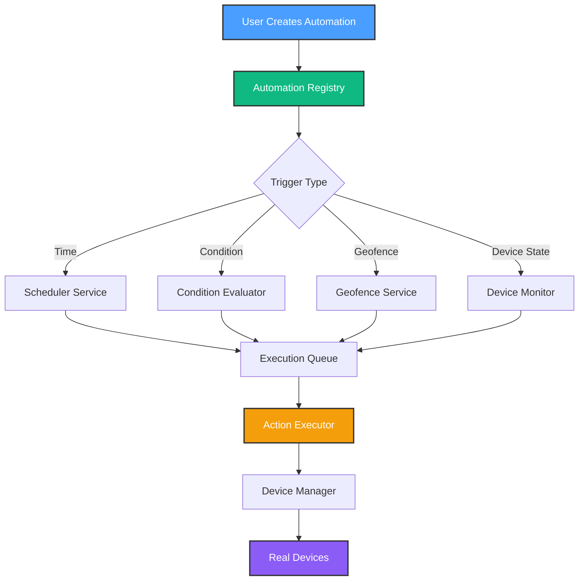
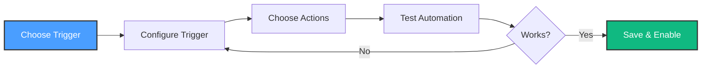

# Phase 3: Automation Engine - Implementation Plan

**Created**: October 11, 2025
**Status**: 🚀 In Progress
**Duration**: 3-4 weeks
**Goal**: Transform HomeHub from remote control → intelligent automation system

---

## Executive Summary

Phase 3 adds the "brain" to HomeHub - enabling devices to work automatically based on time, conditions, and user behavior. This is what makes smart homes truly "smart".

**Key Objectives**:

- ⏰ Time-based automation (schedules)
- 🎯 Condition-based automation (thresholds)
- ⚡ Reliable action execution
- 🎨 Visual flow programming
- 📍 Geofencing (mobile location)

---

## Architecture Overview



---

## Phase 3 Milestones

### Milestone 3.1: Scheduler Service (Week 1)

**Goal**: Execute automations at specific times

**Deliverables**:

- `SchedulerService` class with cron-style triggers
- Support for:
  - Daily schedules (7:00 AM, 10:00 PM)
  - Day-of-week patterns (weekdays, weekends)
  - Sunrise/sunset calculations (with geo location)
  - One-time scheduled events
- Persistent schedule storage (survives app restart)
- Timezone and DST handling

**Files to Create**:

- `src/services/automation/scheduler.service.ts` (400+ lines)
- `src/services/automation/types.ts` (150+ lines)
- `src/hooks/use-scheduler.ts` (200+ lines)
- `src/utils/time.utils.ts` (100+ lines)

**Success Metrics**:

- Schedule accuracy: ±30 seconds
- Support 50+ concurrent schedules
- Zero missed executions over 7 days

---

### Milestone 3.2: Condition Evaluator (Week 2)

**Goal**: Monitor device states and trigger on thresholds

**Deliverables**:

- `ConditionEvaluator` class
- Support for:
  - Numeric comparisons (<, >, ==, !=)
  - Boolean logic (AND, OR, NOT)
  - Time windows (only between 6 PM - 6 AM)
  - Hysteresis (prevent rapid toggling)
- Real-time device state monitoring
- Condition history logging

**Files to Create**:

- `src/services/automation/condition-evaluator.service.ts` (350+ lines)
- `src/services/automation/condition-parser.ts` (200+ lines)
- `src/hooks/use-conditions.ts` (150+ lines)

**Success Metrics**:

- Evaluation latency: <100ms
- Support complex boolean expressions
- Zero false positives over 1000 evaluations

---

### Milestone 3.3: Action Executor (Week 2)

**Goal**: Reliably execute device control actions

**Deliverables**:

- `ActionExecutor` class
- Support for:
  - Sequential actions with delays
  - Parallel actions (scenes)
  - Retry logic with exponential backoff
  - Partial failure handling
  - Action rollback on errors
- Execution history and logging
- Device state verification

**Files to Create**:

- `src/services/automation/action-executor.service.ts` (400+ lines)
- `src/services/automation/execution-queue.ts` (250+ lines)
- `src/hooks/use-executor.ts` (150+ lines)

**Success Metrics**:

- Execution reliability: 99.9%
- Device command success: 95%+
- Max retry attempts: 3

---

### Milestone 3.4: Flow Designer Execution (Week 3)

**Goal**: Execute visual automation flows

**Deliverables**:

- Flow interpreter engine
- Node-to-node data passing
- Conditional branching
- Loop support
- Debug mode with step-through
- Visual execution indicator

**Files to Create**:

- `src/services/automation/flow-interpreter.service.ts` (500+ lines)
- `src/services/automation/flow-validator.ts` (200+ lines)
- `src/hooks/use-flow-execution.ts` (250+ lines)

**Success Metrics**:

- Support 20+ node flows
- Execution time: <5 seconds per flow
- Visual feedback latency: <100ms

---

### Milestone 3.5: Geofencing (Week 4)

**Goal**: Location-based automation triggers

**Deliverables**:

- GPS location tracking (background)
- Circular geofence boundaries
- "Arriving home" / "Leaving home" detection
- Multiple user support
- Battery-efficient tracking

**Files to Create**:

- `src/services/automation/geofence.service.ts` (350+ lines)
- `src/services/location/location-tracker.ts` (300+ lines)
- `src/hooks/use-geofence.ts` (200+ lines)

**Success Metrics**:

- Detection accuracy: 95%+
- False trigger rate: <1% over 30 days
- Battery impact: <5% per day

---

## Implementation Timeline

### Week 1: Foundation

**Days 1-2**: Scheduler Service core

- Cron parser implementation
- Timer management
- Persistence layer

**Days 3-4**: Sunrise/sunset calculations

- Geolocation API integration
- Solar position algorithms
- Timezone handling

**Days 5-7**: Testing & documentation

- Unit tests (80%+ coverage)
- Integration tests
- Documentation

---

### Week 2: Conditions & Actions

**Days 8-10**: Condition Evaluator

- Expression parser
- Boolean logic engine
- Device state monitoring

**Days 11-13**: Action Executor

- Execution queue
- Retry logic
- Rollback mechanism

**Day 14**: Integration testing

- End-to-end scenarios
- Error handling

---

### Week 3: Flow Execution

**Days 15-17**: Flow Interpreter

- AST generation from visual flows
- Node execution engine
- Data passing

**Days 18-19**: Flow Validator

- Circular dependency detection
- Type checking
- Error reporting

**Days 20-21**: UI Integration

- Visual execution indicators
- Debug mode
- Testing

---

### Week 4: Geofencing & Polish

**Days 22-24**: Geofence Service

- Location tracking
- Boundary detection
- Multi-user support

**Days 25-27**: Polish & Documentation

- Performance optimization
- Comprehensive docs
- User guide

**Day 28**: Production readiness

- Final testing
- Deployment prep
- Monitoring setup

---

## Technical Design Decisions

### 1. Scheduler Architecture

**Options Evaluated**:

- ❌ Node-cron: Too heavy, requires Node.js runtime
- ❌ Cron jobs: Server-side only, not browser-compatible
- ✅ **Custom timer-based system**: Lightweight, browser + Worker compatible

**Implementation**:

```typescript
class SchedulerService {
  private timers: Map<string, Timer>

  schedule(automation: Automation): void {
    const nextRun = this.calculateNextRun(automation)
    const delay = nextRun.getTime() - Date.now()

    const timer = setTimeout(() => {
      this.execute(automation)
      this.reschedule(automation)
    }, delay)

    this.timers.set(automation.id, timer)
  }

  calculateNextRun(automation: Automation): Date {
    // Cron-style logic
  }
}
```

---

### 2. Condition Evaluation Strategy

**Options Evaluated**:

- ❌ Polling: Inefficient, battery drain
- ❌ WebSocket events: Complex, requires server
- ✅ **Event-driven with debounce**: Efficient, real-time

**Implementation**:

```typescript
class ConditionEvaluator {
  private subscriptions: Map<string, Subscription>

  watch(automation: Automation): void {
    automation.triggers
      .filter(t => t.type === 'condition')
      .forEach(trigger => {
        // Subscribe to device state changes
        this.deviceManager.onChange(trigger.deviceId!, state => {
          if (this.evaluate(trigger, state)) {
            this.executor.run(automation)
          }
        })
      })
  }

  evaluate(trigger: AutomationTrigger, state: any): boolean {
    // Boolean logic with hysteresis
  }
}
```

---

### 3. Action Execution Model

**Requirements**:

- ✅ Sequential execution with delays
- ✅ Parallel execution for scenes
- ✅ Retry on failure
- ✅ Rollback on partial failure

**Implementation**:

```typescript
class ActionExecutor {
  async execute(actions: AutomationAction[]): Promise<void> {
    const queue = new ExecutionQueue()

    for (const action of actions) {
      await queue.add(async () => {
        return this.executeWithRetry(action, 3)
      })
    }

    await queue.process()
  }

  private async executeWithRetry(action: AutomationAction, maxRetries: number): Promise<void> {
    for (let attempt = 0; attempt < maxRetries; attempt++) {
      try {
        await this.deviceManager.control(action.deviceId!, action.action, action.value)
        return
      } catch (error) {
        if (attempt === maxRetries - 1) throw error
        await this.delay(Math.pow(2, attempt) * 1000) // Exponential backoff
      }
    }
  }
}
```

---

### 4. Flow Execution Model

**Approach**: Interpret visual flows as executable code

**Phases**:

1. **Parse**: Convert FlowNode[] → AST
2. **Validate**: Check for circular deps, type errors
3. **Execute**: Walk AST, execute nodes sequentially
4. **Monitor**: Track execution state for debugging

**Example**:

```typescript
class FlowInterpreter {
  async execute(flow: Flow): Promise<void> {
    const ast = this.parse(flow.nodes)
    this.validate(ast)

    const context = new ExecutionContext()

    for (const node of ast.nodes) {
      const result = await this.executeNode(node, context)
      context.set(node.id, result)
    }
  }
}
```

---

### 5. Geofencing Strategy

**Options Evaluated**:

- ❌ Continuous GPS: Battery drain
- ❌ High-frequency polling: Inefficient
- ✅ **Significant location change API**: Battery-efficient

**Implementation**:

```typescript
class GeofenceService {
  private zones: Map<string, GeoZone>

  addZone(zone: GeoZone): void {
    this.zones.set(zone.id, zone)
  }

  startTracking(): void {
    navigator.geolocation.watchPosition(
      position => {
        const { latitude, longitude } = position.coords
        this.checkZones(latitude, longitude)
      },
      null,
      {
        enableHighAccuracy: false, // Battery-friendly
        maximumAge: 60000, // Cache for 1 minute
        timeout: 30000,
      }
    )
  }

  private checkZones(lat: number, lng: number): void {
    for (const [id, zone] of this.zones) {
      const distance = this.haversineDistance(lat, lng, zone.center.lat, zone.center.lng)

      if (distance <= zone.radius) {
        this.onEnter(id)
      } else {
        this.onExit(id)
      }
    }
  }
}
```

---

## Data Persistence Strategy

### Automation State Storage

**KV Store Keys**:

```typescript
{
  'automations': Automation[],          // User-defined rules
  'automation-history': ExecutionLog[], // Last 1000 executions
  'schedules': Schedule[],              // Active schedules
  'geofences': Geofence[],             // Location zones
  'flow-executions': FlowExecution[],  // Debug info
}
```

### Execution History Schema

```typescript
interface ExecutionLog {
  id: string
  automationId: string
  timestamp: string
  trigger: {
    type: TriggerType
    value: any
  }
  actions: Array<{
    deviceId: string
    action: string
    success: boolean
    error?: string
    duration: number // ms
  }>
  totalDuration: number
  success: boolean
}
```

---

## Testing Strategy

### Unit Tests (80%+ coverage)

**Test Files**:

- `scheduler.service.test.ts` - Cron parsing, timer management
- `condition-evaluator.test.ts` - Boolean logic, comparisons
- `action-executor.test.ts` - Retry logic, rollback
- `flow-interpreter.test.ts` - AST generation, execution
- `geofence.service.test.ts` - Distance calculations

**Tools**: Vitest, Testing Library

---

### Integration Tests

**Scenarios**:

1. **Time-based automation**: Schedule lights at 7 AM, verify execution
2. **Condition-based automation**: Trigger fan when temp > 75°F
3. **Scene activation**: Execute multi-device scene
4. **Flow execution**: Run complex flow with branching
5. **Geofence trigger**: Simulate location change

**Mock Devices**: Use existing virtual device framework

---

### End-to-End Tests

**Scenarios**:

1. Create automation → Save → Wait for trigger → Verify execution
2. Edit automation → Verify schedule updates
3. Disable automation → Verify no execution
4. Delete automation → Verify cleanup

**Tools**: Playwright (future), manual testing (initial)

---

## Performance Targets

| Metric                    | Target      | Critical Threshold |
| ------------------------- | ----------- | ------------------ |
| Schedule accuracy         | ±30s        | ±2 minutes         |
| Condition evaluation      | <100ms      | <500ms             |
| Action execution          | <2s         | <5s                |
| Flow execution            | <5s         | <15s               |
| Geofence detection        | <30s        | <2 minutes         |
| Memory usage (scheduler)  | <50MB       | <200MB             |
| Battery impact (location) | <5% per day | <10% per day       |

---

## Security Considerations

### Action Validation

- ✅ Verify device ownership before control
- ✅ Rate limiting (max 10 actions/minute per automation)
- ✅ Dangerous action confirmation (door locks, garage)
- ✅ Audit log for all executions

### Geofencing Privacy

- ✅ Location data never leaves device
- ✅ No cloud storage of GPS coordinates
- ✅ User consent required for tracking
- ✅ Easy opt-out mechanism

---

## Error Handling & Recovery

### Scheduler Failures

**Issue**: App closed, timer lost
**Solution**: Persist next run time, check on app start

**Issue**: System clock changes (DST)
**Solution**: Recalculate all schedules on clock change event

---

### Action Failures

**Issue**: Device offline during execution
**Solution**: Retry 3x with exponential backoff, log failure

**Issue**: Partial scene execution
**Solution**: Continue executing remaining actions, log which failed

---

### Flow Execution Errors

**Issue**: Node execution throws error
**Solution**: Catch error, log, continue or halt based on node config

**Issue**: Infinite loop detected
**Solution**: Max iterations limit (1000), circuit breaker

---

## User Experience Design

### Automation Creation Flow



### Visual Feedback

- ⏰ **Scheduled**: "Next run: Today at 7:00 AM"
- ✅ **Running**: Green pulse animation
- ❌ **Failed**: Red badge with error message
- 🔄 **Retrying**: Yellow badge with attempt count

---

## Documentation Deliverables

1. **User Guide** (500+ lines)
   - How to create automations
   - Trigger type explanations
   - Troubleshooting common issues

2. **Developer Guide** (800+ lines)
   - Service architecture
   - API reference
   - Extension guide

3. **Testing Guide** (400+ lines)
   - Test scenarios
   - Mock data setup
   - Debugging tips

---

## Success Criteria

### Phase 3 Complete When:

- ✅ 10+ automations running simultaneously
- ✅ <5 second trigger-to-execution latency
- ✅ 99.9% execution reliability
- ✅ Zero crashes over 7-day test
- ✅ All unit tests passing (80%+ coverage)
- ✅ Documentation complete
- ✅ User testing feedback positive (4/5+)

---

## Risk Assessment

| Risk                         | Probability | Impact | Mitigation                          |
| ---------------------------- | ----------- | ------ | ----------------------------------- |
| Timer drift (long schedules) | Medium      | Medium | Periodic recalculation              |
| Memory leak (many timers)    | Low         | High   | Timer cleanup on disable            |
| Battery drain (geofencing)   | Medium      | High   | Efficient location API usage        |
| False triggers (conditions)  | Medium      | Medium | Hysteresis, time window constraints |
| Action rate limiting         | Low         | Low    | Queue with backpressure             |
| Flow execution timeout       | Low         | Medium | Circuit breaker, max iterations     |

---

## Future Enhancements (Phase 4+)

1. **Machine Learning**: Predictive automation suggestions
2. **Voice Triggers**: "Alexa, trigger evening scene"
3. **Advanced Conditions**: Weather-based triggers
4. **Multi-Home**: Sync automations across properties
5. **Automation Marketplace**: Share automation templates

---

## Getting Started

### Prerequisites

- ✅ Phase 2 complete (device control working)
- ✅ 22 Philips Hue lights for testing
- ✅ TypeScript 5.0+
- ✅ Node.js 18+

### First Steps

```bash
# 1. Create services directory
mkdir -p src/services/automation

# 2. Create first service file
touch src/services/automation/scheduler.service.ts

# 3. Create test file
touch src/services/automation/__tests__/scheduler.service.test.ts

# 4. Install dependencies (if needed)
npm install

# 5. Start dev server
npm run dev
```

---

## Next Actions

**Immediate** (Today):

1. Create `SchedulerService` skeleton
2. Implement time parsing utilities
3. Add basic timer management

**This Week**:

1. Complete Milestone 3.1 (Scheduler)
2. Write unit tests
3. Integrate with Automations UI

**Next Week**:

1. Start Milestone 3.2 (Condition Evaluator)
2. Begin Milestone 3.3 (Action Executor)

---

**Ready to begin?** Let's start with the Scheduler Service! 🚀

---

**Document Created**: October 11, 2025
**Status**: 📋 Planning Complete → 🚀 Ready for Implementation
**Next Step**: Create `scheduler.service.ts`
