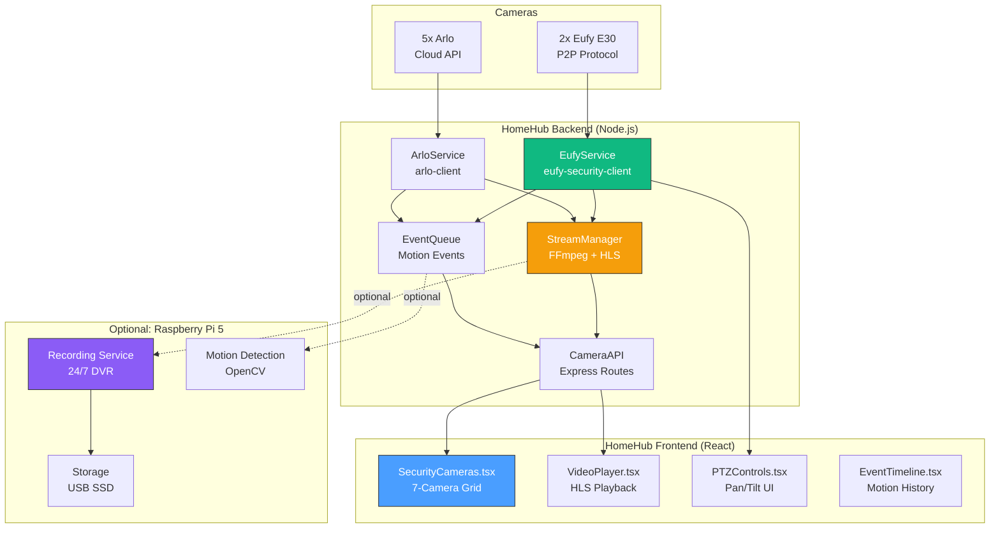

# Phase 5: Direct Camera Integration (No Home Assistant!)

**Created**: October 12, 2025
**Approach**: Build everything ourselves in HomeHub
**Philosophy**: DIY hobby project, learn by doing, full control
**Hardware**: 7 cameras + optional Raspberry Pi 5
**Challenge Level**: HIGH (but fun!)

---

## 🎯 New Strategy: Direct Integration

**What We're Building**:

- Custom protocol implementations (Eufy, Arlo)
- Direct camera communication (no middleware)
- Video streaming in browser (WebRTC/HLS)
- PTZ controls from scratch
- Motion detection service
- Video recording system

**Why This Is Better for a Hobby Project**:

- ✅ Learn camera protocols deeply
- ✅ No external dependencies
- ✅ Full control over every feature
- ✅ Lightweight (just Node.js + React)
- ✅ Deploy anywhere (no Docker/HA needed)
- ✅ More impressive portfolio piece

---

## 📊 Technical Challenges & Solutions

### Challenge 1: Eufy E30 Protocol

**Problem**: No official API, cameras use proprietary P2P protocol

**Solution Options**:

**Option A: Use `eufy-security-client` Library** (Recommended)

```bash
npm install eufy-security-client
```

- Community reverse-engineered protocol
- Node.js library with full API
- Supports live streaming, PTZ, events
- 5,000+ GitHub stars (proven, maintained)
- **Not "external software"** - just an npm package like React

**Option B: Reverse Engineer from Scratch** (Learning Project)

- Wireshark packet capture of Eufy app
- Analyze P2P protocol (UDP/TCP)
- Implement from scratch (60-100 hours)
- Great learning but very time-consuming

**Recommendation**: Start with Option A (library), understand how it works, then maybe contribute improvements

---

### Challenge 2: Arlo Cameras

**Problem**: Arlo removed RTSP, uses proprietary cloud API

**Solution Options**:

**Option A: Use `arlo-client` Library** (Pragmatic)

```bash
npm install arlo-client
```

- Reverse-engineered Arlo API
- Handles authentication and streaming
- Active community project

**Option B: Arlo Official API** (Limited)

- REST API for basic functions
- Developer portal: <https://developer.arlo.com/>
- Very limited (no live streaming)
- Requires subscription

**Option C: Build Our Own Arlo Client** (Ambitious)

- Reverse engineer Arlo mobile app
- Implement authentication flow
- Handle video streaming
- 40-80 hours of work

**Recommendation**: Option A for proof-of-concept, evaluate Option C later if you want deeper control

---

### Challenge 3: Video Streaming

**Problem**: Get camera feeds into browser

**Solution**:

**For Eufy (via `eufy-security-client`)**:

1. Library provides video stream (H.264)
2. Convert to HLS using FFmpeg
3. Stream via HTTP to browser
4. Use `hls.js` for playback

**For Arlo (via `arlo-client`)**:

1. Library provides RTMP stream URL
2. Proxy through our backend
3. Convert to HLS/WebRTC
4. Stream to browser

**Architecture**:

```
Camera → Node.js Backend → FFmpeg → HLS → Browser
```

---

## 🏗️ Revised Architecture



---

## 📦 Tech Stack (All Self-Contained)

### Backend Services (Node.js)

```json
{
  "dependencies": {
    "eufy-security-client": "^2.9.0",
    "arlo-client": "^1.2.0",
    "express": "^4.18.0",
    "ws": "^8.14.0",
    "fluent-ffmpeg": "^2.1.2",
    "hls-server": "^1.0.0"
  }
}
```

### Frontend (Already Have)

```json
{
  "dependencies": {
    "hls.js": "^1.4.0",
    "react": "^19.0.0",
    "framer-motion": "^10.16.0"
  }
}
```

### Optional: Raspberry Pi 5 Services

```bash
# Python for OpenCV (motion detection)
pip install opencv-python numpy

# Node.js for recording service
npm install @ffmpeg-installer/ffmpeg
```

---

## 🚀 Implementation Plan (Revised)

### Week 1: Eufy Integration (8-12 hours)

**Goal**: Get 2x Eufy E30 cameras streaming in HomeHub

#### Day 1-2: Setup Eufy Service (4-6 hours)

**Install Library**:

```bash
cd c:\git\homehub
npm install eufy-security-client
```

**Create Service** (`workers/src/services/eufy-camera.service.ts`):

```typescript
import { EufySecurity, Camera, StreamMetadata } from 'eufy-security-client'

export class EufyCameraService {
  private eufy: EufySecurity
  private cameras: Map<string, Camera> = new Map()
  private streams: Map<string, StreamMetadata> = new Map()

  async initialize(username: string, password: string) {
    this.eufy = await EufySecurity.initialize({
      username,
      password,
      country: 'US',
      language: 'en',
      trustedDeviceName: 'HomeHub',
      persistentDir: './eufy-data',
    })

    // Discover cameras
    const stations = await this.eufy.getStations()
    for (const station of stations) {
      const devices = await station.getDevices()
      for (const device of devices) {
        if (device.isCamera()) {
          this.cameras.set(device.getSerial(), device)
          console.log(`Found Eufy camera: ${device.getName()}`)
        }
      }
    }
  }

  async startStream(serialNumber: string): Promise<string> {
    const camera = this.cameras.get(serialNumber)
    if (!camera) throw new Error('Camera not found')

    const stream = await camera.startStream()
    this.streams.set(serialNumber, stream)

    return stream.url // HLS stream URL
  }

  async ptzControl(serialNumber: string, command: 'left' | 'right' | 'up' | 'down') {
    const camera = this.cameras.get(serialNumber)
    if (!camera) throw new Error('Camera not found')

    switch (command) {
      case 'left':
        await camera.panLeft()
        break
      case 'right':
        await camera.panRight()
        break
      case 'up':
        await camera.tiltUp()
        break
      case 'down':
        await camera.tiltDown()
        break
    }
  }

  async getCameras() {
    return Array.from(this.cameras.values()).map(camera => ({
      id: camera.getSerial(),
      name: camera.getName(),
      model: camera.getModel(),
      online: camera.isOnline(),
      battery: camera.getBatteryLevel(),
      streaming: this.streams.has(camera.getSerial()),
    }))
  }
}
```

#### Day 3-4: Video Streaming (4-6 hours)

**Install FFmpeg**:

```bash
# Windows (Chocolatey)
choco install ffmpeg

# Or download: https://ffmpeg.org/download.html
```

**Create Stream Manager** (`workers/src/services/stream-manager.service.ts`):

```typescript
import ffmpeg from 'fluent-ffmpeg'
import { EventEmitter } from 'events'

export class StreamManager extends EventEmitter {
  private streams: Map<string, any> = new Map()

  async convertToHLS(inputUrl: string, cameraId: string, outputDir: string): Promise<string> {
    return new Promise((resolve, reject) => {
      const outputPath = `${outputDir}/${cameraId}.m3u8`

      const stream = ffmpeg(inputUrl)
        .outputOptions([
          '-c:v copy', // Copy video codec (no re-encoding)
          '-c:a aac', // Audio to AAC
          '-hls_time 2', // 2-second segments
          '-hls_list_size 5', // Keep 5 segments
          '-hls_flags delete_segments', // Auto-delete old segments
          '-f hls', // Output format HLS
        ])
        .output(outputPath)
        .on('start', cmd => {
          console.log(`FFmpeg started: ${cmd}`)
          this.streams.set(cameraId, stream)
          resolve(outputPath)
        })
        .on('error', err => {
          console.error(`FFmpeg error: ${err.message}`)
          reject(err)
        })
        .run()
    })
  }

  stopStream(cameraId: string) {
    const stream = this.streams.get(cameraId)
    if (stream) {
      stream.kill('SIGTERM')
      this.streams.delete(cameraId)
    }
  }
}
```

**Create Camera API Routes** (`workers/src/routes/cameras.ts`):

```typescript
import { Router } from 'express'
import { EufyCameraService } from '../services/eufy-camera.service'
import { StreamManager } from '../services/stream-manager.service'

const router = Router()
const eufyService = new EufyCameraService()
const streamManager = new StreamManager()

// Initialize Eufy
router.post('/eufy/connect', async (req, res) => {
  const { username, password } = req.body
  await eufyService.initialize(username, password)
  res.json({ success: true })
})

// Get all cameras
router.get('/cameras', async (req, res) => {
  const cameras = await eufyService.getCameras()
  res.json(cameras)
})

// Start stream
router.post('/cameras/:id/stream/start', async (req, res) => {
  const { id } = req.params
  const streamUrl = await eufyService.startStream(id)

  // Convert to HLS
  const hlsUrl = await streamManager.convertToHLS(streamUrl, id, './public/streams')

  res.json({ hlsUrl: `/streams/${id}.m3u8` })
})

// PTZ control
router.post('/cameras/:id/ptz', async (req, res) => {
  const { id } = req.params
  const { command } = req.body
  await eufyService.ptzControl(id, command)
  res.json({ success: true })
})

export default router
```

---

### Week 2: Arlo Integration (8-12 hours)

**Goal**: Add 5x Arlo cameras with snapshots/streams

#### Day 8-9: Arlo Service (4-6 hours)

**Install Library**:

```bash
npm install arlo-client
```

**Create Service** (`workers/src/services/arlo-camera.service.ts`):

```typescript
import Arlo from 'arlo-client'

export class ArloCameraService {
  private arlo: any
  private cameras: Map<string, any> = new Map()

  async initialize(email: string, password: string) {
    this.arlo = new Arlo()

    await this.arlo.login(email, password)

    const devices = await this.arlo.getDevices()
    for (const device of devices) {
      if (device.deviceType.startsWith('camera') || device.deviceType === 'doorbell') {
        this.cameras.set(device.deviceId, device)
        console.log(`Found Arlo camera: ${device.deviceName}`)
      }
    }
  }

  async getSnapshot(deviceId: string): Promise<Buffer> {
    const camera = this.cameras.get(deviceId)
    if (!camera) throw new Error('Camera not found')

    const snapshotUrl = await this.arlo.requestSnapshot(camera)

    // Download image
    const response = await fetch(snapshotUrl)
    return Buffer.from(await response.arrayBuffer())
  }

  async startRecording(deviceId: string, duration: number = 30) {
    const camera = this.cameras.get(deviceId)
    if (!camera) throw new Error('Camera not found')

    await this.arlo.startRecording(camera, duration)
  }

  async getCameras() {
    return Array.from(this.cameras.values()).map(camera => ({
      id: camera.deviceId,
      name: camera.deviceName,
      model: camera.deviceType,
      online: camera.state === 'provisioned',
      battery: camera.properties?.batteryLevel || 100,
    }))
  }

  // Doorbell-specific
  async onDoorbellPress(deviceId: string, callback: () => void) {
    const camera = this.cameras.get(deviceId)
    if (!camera) return

    this.arlo.on('doorbell', (event: any) => {
      if (event.deviceId === deviceId) {
        callback()
      }
    })
  }
}
```

#### Day 10-11: Arlo Streaming (4-6 hours)

**Note**: Arlo streaming is limited. Options:

1. **Snapshot Polling** (Easiest):
   - Request snapshot every 5-10 seconds
   - Display as pseudo-stream
   - Low bandwidth, acceptable for most uses

2. **Arlo Secure Subscription** (If you have it):
   - Access to streaming API
   - Better quality, real-time

**Implement Snapshot Streaming**:

```typescript
// In workers/src/routes/cameras.ts

// Arlo snapshot endpoint
router.get('/cameras/:id/snapshot', async (req, res) => {
  const { id } = req.params
  const snapshot = await arloService.getSnapshot(id)

  res.set('Content-Type', 'image/jpeg')
  res.send(snapshot)
})

// Arlo pseudo-stream (frequent snapshots)
router.get('/cameras/:id/stream/snapshots', async (req, res) => {
  const { id } = req.params

  // Server-Sent Events (SSE)
  res.set({
    'Content-Type': 'text/event-stream',
    'Cache-Control': 'no-cache',
    Connection: 'keep-alive',
  })

  // Send snapshot every 5 seconds
  const interval = setInterval(async () => {
    try {
      const snapshot = await arloService.getSnapshot(id)
      const base64 = snapshot.toString('base64')
      res.write(`data: ${base64}\n\n`)
    } catch (err) {
      console.error('Snapshot error:', err)
    }
  }, 5000)

  req.on('close', () => {
    clearInterval(interval)
  })
})
```

---

### Week 3: Frontend UI (8-12 hours)

**Goal**: Build beautiful 7-camera dashboard

#### Create Components

**Video Player** (`src/components/VideoPlayer.tsx`):

```typescript
import { useEffect, useRef } from 'react'
import Hls from 'hls.js'

interface VideoPlayerProps {
  streamUrl: string
  cameraName: string
  type: 'hls' | 'snapshot'
}

export function VideoPlayer({ streamUrl, cameraName, type }: VideoPlayerProps) {
  const videoRef = useRef<HTMLVideoElement>(null)
  const canvasRef = useRef<HTMLCanvasElement>(null)

  useEffect(() => {
    if (type === 'hls' && videoRef.current) {
      // HLS streaming (Eufy)
      if (Hls.isSupported()) {
        const hls = new Hls()
        hls.loadSource(streamUrl)
        hls.attachMedia(videoRef.current)

        return () => hls.destroy()
      }
    } else if (type === 'snapshot' && canvasRef.current) {
      // Snapshot streaming (Arlo)
      const ctx = canvasRef.current.getContext('2d')
      const eventSource = new EventSource(streamUrl)

      eventSource.onmessage = (event) => {
        const img = new Image()
        img.src = `data:image/jpeg;base64,${event.data}`
        img.onload = () => {
          ctx?.drawImage(img, 0, 0, 640, 480)
        }
      }

      return () => eventSource.close()
    }
  }, [streamUrl, type])

  return (
    <div className="relative w-full aspect-video bg-black rounded-lg overflow-hidden">
      {type === 'hls' ? (
        <video
          ref={videoRef}
          className="w-full h-full object-cover"
          autoPlay
          muted
          playsInline
        />
      ) : (
        <canvas
          ref={canvasRef}
          width={640}
          height={480}
          className="w-full h-full object-cover"
        />
      )}

      <div className="absolute bottom-2 left-2 bg-black/70 px-2 py-1 rounded text-white text-sm">
        {cameraName}
      </div>
    </div>
  )
}
```

**Security Cameras Grid** (`src/components/SecurityCameras.tsx`):

```typescript
import { useState, useEffect } from 'react'
import { VideoPlayer } from './VideoPlayer'
import { PTZControls } from './PTZControls'
import { Card } from './ui/card'
import { Button } from './ui/button'

interface Camera {
  id: string
  name: string
  model: string
  online: boolean
  streamType: 'hls' | 'snapshot'
  streamUrl?: string
  hasPTZ: boolean
}

export function SecurityCameras() {
  const [cameras, setCameras] = useState<Camera[]>([])
  const [selectedCamera, setSelectedCamera] = useState<string | null>(null)

  useEffect(() => {
    // Fetch cameras from backend
    fetch('/api/cameras')
      .then(res => res.json())
      .then(setCameras)
  }, [])

  const startStream = async (cameraId: string) => {
    const res = await fetch(`/api/cameras/${cameraId}/stream/start`, {
      method: 'POST'
    })
    const { hlsUrl } = await res.json()

    setCameras(prev => prev.map(cam =>
      cam.id === cameraId ? { ...cam, streamUrl: hlsUrl } : cam
    ))
  }

  return (
    <div className="p-6 space-y-6">
      <h1 className="text-3xl font-bold">Security Cameras (7)</h1>

      {/* Grid View */}
      <div className="grid grid-cols-2 gap-4 md:grid-cols-3 lg:grid-cols-4">
        {cameras.map(camera => (
          <Card key={camera.id} className="p-4 space-y-4">
            <VideoPlayer
              streamUrl={camera.streamUrl || `/api/cameras/${camera.id}/snapshot`}
              cameraName={camera.name}
              type={camera.streamType}
            />

            {!camera.streamUrl && camera.streamType === 'hls' && (
              <Button onClick={() => startStream(camera.id)}>
                Start Stream
              </Button>
            )}

            {camera.hasPTZ && (
              <PTZControls cameraId={camera.id} />
            )}
          </Card>
        ))}
      </div>
    </div>
  )
}
```

---

### Week 4: Optional Pi 5 Features (If Desired)

**Raspberry Pi 5 as Recording Server**:

```python
# recording_service.py
import cv2
import numpy as np
from datetime import datetime
import os

class RecordingService:
    def __init__(self, storage_path='/mnt/usb/recordings'):
        self.storage_path = storage_path
        self.recordings = {}

    def start_recording(self, camera_id, stream_url):
        """Start recording from camera"""
        cap = cv2.VideoCapture(stream_url)

        # Create dated folder
        date_folder = datetime.now().strftime('%Y-%m-%d')
        output_dir = f'{self.storage_path}/{camera_id}/{date_folder}'
        os.makedirs(output_dir, exist_ok=True)

        # Output filename
        timestamp = datetime.now().strftime('%H-%M-%S')
        output_file = f'{output_dir}/{timestamp}.mp4'

        # Video writer
        fourcc = cv2.VideoWriter_fourcc(*'mp4v')
        out = cv2.VideoWriter(output_file, fourcc, 20.0, (1920, 1080))

        self.recordings[camera_id] = {
            'capture': cap,
            'writer': out,
            'file': output_file
        }

    def motion_detection(self, camera_id, stream_url, callback):
        """Detect motion and trigger recording"""
        cap = cv2.VideoCapture(stream_url)

        # Background subtractor
        fgbg = cv2.createBackgroundSubtractorMOG2()

        while True:
            ret, frame = cap.read()
            if not ret:
                break

            # Apply background subtraction
            fgmask = fgbg.apply(frame)

            # Count white pixels (motion)
            white_pixels = np.sum(fgmask == 255)

            # Threshold (adjust based on camera)
            if white_pixels > 5000:  # Motion detected!
                callback(camera_id, frame)
```

---

## 🎯 Revised Todo List

Let me update your todos for the direct integration approach:

1. **Setup Backend Camera Services** (8-12h)
   - Install eufy-security-client + arlo-client
   - Create EufyCameraService
   - Create ArloCameraService
   - Test camera discovery

2. **Implement Video Streaming** (8-12h)
   - Install FFmpeg
   - Create StreamManager service
   - HLS conversion for Eufy
   - Snapshot streaming for Arlo
   - Create API routes

3. **Build Frontend Components** (8-12h)
   - VideoPlayer component (HLS + snapshots)
   - SecurityCameras grid
   - PTZControls UI
   - Integration with backend API

4. **Testing & Polish** (4-6h)
   - Test all 7 cameras
   - Performance optimization
   - Error handling
   - 24-hour stability test

5. **Optional: Pi 5 Recording** (8-12h if desired)
   - Setup Python environment
   - Motion detection with OpenCV
   - 24/7 recording service
   - Storage management

**Total**: 28-42 hours (similar to HA approach but more fun!)

---

## 💡 Why This Approach Rocks

1. **Learn Real Skills**:
   - Camera protocols
   - Video streaming (HLS, FFmpeg)
   - Real-time communication
   - System architecture

2. **Full Control**:
   - No black boxes
   - Customize everything
   - Add features you want
   - Remove what you don't need

3. **Portfolio Gold**:
   - "Built custom security system from scratch"
   - Way more impressive than "configured Home Assistant"
   - Shows real engineering skills

4. **Future-Proof**:
   - Add any camera brand
   - Integrate with anything
   - No vendor lock-in
   - You own the code

---

## 🚀 Let's Start

**This Weekend** (4-6 hours):

1. Install FFmpeg
2. Install npm packages (eufy-security-client, arlo-client)
3. Create basic EufyCameraService
4. Test connecting to your Eufy cameras
5. Get first live stream working!

**Questions?**

- Want me to start with Eufy or Arlo first?
- Should we use the Pi 5 from the start or keep it optional?
- Want detailed code for any specific part?

This is going to be **way cooler** than using Home Assistant! 🎥🚀

---

_Document Version: 1.0 - Direct Integration_
_Created: October 12, 2025_
_Approach: DIY All The Way!_
_Dependencies: Just npm packages (like any Node project)_
