# Phase 5: Your Exact Hardware Setup

**Created**: October 12, 2025
**Last Updated**: October 12, 2025 (Model-Specific)
**Total Cameras**: 7 cameras (2 Eufy + 5 Arlo)
**Total Value**: ~$600-800 (already owned!)
**Additional Cost**: $60-100 (storage only)
**Time to Production**: 3-4 weeks (26-36 hours)

---

## 🎥 Your Complete Camera Inventory

### Overview

**Total**: 7 professional security cameras
**Brands**: Eufy (2) + Arlo (5)
**Coverage**: Doorbell + Indoor + Outdoor
**Value**: ~$600-800 if purchased new

---

## 📷 Camera Details by Model

### 1. Arlo Essential Wired Video Doorbell (1x)

**Model**: AVD2001 / AVD3001
**Type**: Wired video doorbell
**Price**: ~$150 (retail)

**Specifications**:

- ✅ 1080p HD video (1920×1080)
- ✅ 180° diagonal field of view
- ✅ HDR for better dynamic range
- ✅ Color night vision
- ✅ Two-way audio
- ✅ Motion detection zones
- ✅ Package detection (AI)
- ✅ Person detection (AI)
- ✅ Direct WiFi connection (no hub)
- ⚠️ **RTSP Support**: NO (Arlo removed in 2023)

**Power**: Hardwired (doorbell transformer 16-24V AC, 10VA+)

**Integration Status**:

- ✅ Home Assistant: Built-in Arlo integration
- ✅ Snapshots: Yes (5-10 second refresh)
- ⚠️ Live Stream: Via HA arlo_stream service (with limitations)
- ✅ Events: Motion, button press, package detection

**Unique Features**:

- Doorbell button press events
- Pre-roll video (3 seconds before motion)
- Quick replies (pre-recorded audio)
- Siren (built-in, 80+ dB)

---

### 2. Arlo Pro 4 Spotlight Camera (2x)

**Model**: VMC4041P / VMC4050P
**Type**: Wire-free or wired outdoor camera
**Price**: ~$200 each (retail)

**Specifications**:

- ✅ 2K HDR video (2560×1440)
- ✅ 160° diagonal field of view
- ✅ Color night vision
- ✅ Integrated spotlight (LED, motion-activated)
- ✅ Two-way audio with noise cancellation
- ✅ Weather resistant (IP65)
- ✅ Rechargeable battery (battery or solar/wired)
- ✅ Motion detection with AI zones
- ✅ Person, vehicle, animal detection (AI)
- ✅ Direct WiFi connection (no hub needed)
- ⚠️ **RTSP Support**: NO (Arlo removed in 2023)

**Power Options**:

- Battery: Rechargeable (lasts 3-6 months)
- Or: Solar panel (VMA5600)
- Or: Wired via outdoor magnetic cable

**Integration Status**:

- ✅ Home Assistant: Built-in Arlo integration
- ✅ Snapshots: Yes (5-10 second refresh)
- ⚠️ Live Stream: Via arlo_stream service (with limitations)
- ✅ Events: Motion, person, vehicle, animal detection
- ✅ Spotlight Control: Can trigger via HA

**Unique Features**:

- Spotlight as deterrent
- Emergency siren (built-in)
- 2K resolution (higher quality)
- Activity zones (customizable)

---

### 3. Arlo Essential Indoor Camera (2x)

**Model**: VMC2040
**Type**: Wired indoor security camera
**Price**: ~$80-100 each (retail)

**Specifications**:

- ✅ 1080p HD video (1920×1080)
- ✅ 130° diagonal field of view
- ✅ Night vision (infrared)
- ✅ Two-way audio
- ✅ Motion detection
- ✅ Person detection (AI)
- ✅ Privacy shield (automated lens cover)
- ✅ Direct WiFi connection (no hub)
- ⚠️ **RTSP Support**: NO (Arlo removed in 2023)

**Power**: USB power cable (included)

**Integration Status**:

- ✅ Home Assistant: Built-in Arlo integration
- ✅ Snapshots: Yes (5-10 second refresh)
- ⚠️ Live Stream: Via arlo_stream service (with limitations)
- ✅ Events: Motion, person detection
- ✅ Privacy Shield: Can control via HA

**Unique Features**:

- Automated privacy shield (covers lens)
- Compact design (4.4" tall)
- Magnetic base
- USB power (easy placement)

---

### 4. Eufy Indoor Cam E30 (2x) - Pan & Tilt

**Model**: T8414
**Type**: Pan-tilt indoor security camera
**Price**: ~$40-50 each (retail)

**Specifications**:

- ✅ 2K resolution (2304×1296)
- ✅ Pan: 360° horizontal rotation
- ✅ Tilt: 96° vertical tilt
- ✅ Night vision (infrared)
- ✅ Two-way audio
- ✅ Motion detection with tracking
- ✅ Auto-tracking (follows movement)
- ✅ Person detection (AI)
- ✅ Pet detection (AI)
- ✅ Crying baby detection (audio AI)
- ✅ Local storage (microSD card up to 128GB)
- ⚠️ **RTSP Support**: LIMITED (via firmware hack)

**Power**: DC power adapter (included)

**Integration Status**:

- ✅ Home Assistant: Via Eufy Security WS (HACS)
- ✅ Live Stream: Yes (via eufy-security-ws)
- ✅ PTZ Controls: Yes (pan, tilt, tracking)
- ✅ Events: Motion, person, pet detection
- ✅ Two-way Audio: Yes (via HA)
- ⭐ **Best Integration**: Most complete features of all your cameras

**RTSP Status**:

- ❌ Native RTSP: Not officially supported
- ✅ Alternative: Eufy Security WS provides streaming
- ✅ PTZ Controls: Fully supported in HA integration
- ✅ Tracking: Can enable/disable via HA

**Unique Features**:

- **360° pan coverage** (no blind spots)
- Auto-tracking (follows detected motion)
- Crying baby detection (alerts for parents)
- Pet-friendly detection (reduces false alarms)
- Local storage (no cloud required)
- Privacy mode (covers lens physically)

---

## 🎯 Camera Layout Recommendations

Based on your camera types, here's an optimal placement:

### Outdoor Coverage

**Front Entrance**:

- 🚪 **Arlo Essential Doorbell** - Primary entry monitoring
- 📹 **Arlo Pro 4 #1** - Wide angle coverage of front yard/driveway

**Back/Side Yard**:

- 📹 **Arlo Pro 4 #2** - Backyard or side yard coverage

**Benefits**:

- Wire-free Arlo Pro 4 = flexible placement
- 2K resolution for facial recognition
- Spotlight deters intruders
- Weather resistant (IP65)

### Indoor Coverage

**Common Areas**:

- 🎥 **Eufy E30 #1** - Living room (360° pan, tracking)
- 🎥 **Eufy E30 #2** - Kitchen/hallway (tracking, wide coverage)

**Bedrooms/Private**:

- 🏠 **Arlo Essential Indoor #1** - Bedroom/office (privacy shield!)
- 🏠 **Arlo Essential Indoor #2** - Another bedroom/nursery

**Benefits**:

- Eufy E30 for high-traffic areas (tracking follows motion)
- Arlo Essential for privacy-sensitive rooms (automated lens cover)
- 360° Eufy coverage = fewer cameras needed

---

## 🔧 Integration Strategy by Camera Type

### Priority 1: Eufy E30 Cameras (Best Integration) ⭐

**Why These Are Easiest**:

- Most complete HA integration via Eufy Security WS
- Live streaming works well (not just snapshots)
- PTZ controls fully functional
- Fast response time (<2s latency typical)

**Setup Steps**:

1. Install HACS in Home Assistant
2. Add Eufy Security WS integration
3. Enter Eufy account credentials
4. Both E30 cameras discovered automatically
5. Test live streaming (should work immediately)
6. Configure PTZ controls
7. Enable motion tracking

**Expected Result**: Full live streaming with PTZ controls

---

### Priority 2: Arlo Doorbell (Most Important Functionally)

**Why This Matters**:

- Primary entry point security
- Button press events critical
- Package detection valuable
- Visitors can ring doorbell

**Setup Steps**:

1. Add built-in Arlo integration to HA
2. Authenticate with Arlo account (2FA may be required)
3. Select doorbell in integration
4. Test button press events
5. Configure snapshot refresh rate
6. Set up button press automations

**Expected Result**: Snapshots + button press events + notifications

---

### Priority 3: Arlo Pro 4 Cameras (Outdoor Coverage)

**Why These Next**:

- Outdoor security is high priority
- 2K resolution for better identification
- Spotlight control adds value
- Motion AI reduces false alarms

**Setup Steps**:

1. Add both Pro 4 cameras to same Arlo integration
2. Test snapshot refresh
3. Try arlo_stream service for live view (may work)
4. Configure motion zones
5. Enable spotlight automation
6. Test person/vehicle detection

**Expected Result**: Snapshots (5-10s refresh) + motion events + AI detection

---

### Priority 4: Arlo Essential Indoor (Privacy Rooms)

**Why These Last**:

- Less critical than outdoor/main areas
- Indoor coverage = lower priority
- Privacy shield = less urgent monitoring

**Setup Steps**:

1. Add both Essential Indoor to Arlo integration
2. Test privacy shield control
3. Configure motion detection zones
4. Set up privacy automation (shield when home)

**Expected Result**: Snapshots + privacy controls + motion events

---

## 🏗️ Revised Architecture for Your Setup

```mermaid
graph TB
    subgraph "Indoor Cameras - Primary"
        A[Eufy E30 #1<br/>Living Room<br/>360° PTZ]
        B[Eufy E30 #2<br/>Kitchen<br/>360° PTZ]
    end

    subgraph "Outdoor Cameras"
        C[Arlo Doorbell<br/>Front Door<br/>Button + Video]
        D[Arlo Pro 4 #1<br/>Front Yard<br/>2K + Spotlight]
        E[Arlo Pro 4 #2<br/>Backyard<br/>2K + Spotlight]
    end

    subgraph "Indoor Cameras - Privacy"
        F[Arlo Essential #1<br/>Bedroom<br/>Privacy Shield]
        G[Arlo Essential #2<br/>Office<br/>Privacy Shield]
    end

    subgraph "Home Assistant Integration"
        H[Eufy Security WS<br/>HACS Integration]
        I[Arlo Integration<br/>Built-in]
    end

    subgraph "Stream Processing"
        J[Live Streams<br/>Eufy E30 Only]
        K[Snapshot Refresh<br/>All Arlo Cameras]
        L[arlo_stream Service<br/>Attempt Live for Arlo]
    end

    subgraph "HomeHub UI"
        M[7-Camera Grid View]
        N[PTZ Controls<br/>Eufy E30 Only]
        O[Event Timeline<br/>All Cameras]
        P[Doorbell Events<br/>Arlo Doorbell]
    end

    A --> H
    B --> H
    H --> J

    C --> I
    D --> I
    E --> I
    F --> I
    G --> I
    I --> K
    I --> L

    J --> M
    K --> M
    L --> M

    H --> N
    I --> O
    C --> P

    style A fill:#10b981,stroke:#333,color:#fff
    style B fill:#10b981,stroke:#333,color:#fff
    style H fill:#8b5cf6,stroke:#333,color:#fff
    style J fill:#22c55e,stroke:#333,color:#fff
    style M fill:#4a9eff,stroke:#333,color:#fff
```



---

## 📊 Feature Comparison Matrix

| Feature              | Eufy E30 (2x)     | Arlo Doorbell (1x) | Arlo Pro 4 (2x) | Arlo Essential (2x) |
| -------------------- | ----------------- | ------------------ | --------------- | ------------------- |
| **Live Stream**      | ✅ Yes (Full)     | ⚠️ Limited         | ⚠️ Limited      | ⚠️ Limited          |
| **Snapshot Refresh** | ✅ <2s            | ✅ 5-10s           | ✅ 5-10s        | ✅ 5-10s            |
| **PTZ Control**      | ✅ Pan/Tilt       | ❌ Fixed           | ❌ Fixed        | ❌ Fixed            |
| **Motion Tracking**  | ✅ Auto           | ❌ No              | ❌ No           | ❌ No               |
| **Person Detection** | ✅ AI             | ✅ AI              | ✅ AI           | ✅ AI               |
| **Resolution**       | 2K (2304×1296)    | 1080p              | 2K (2560×1440)  | 1080p               |
| **Night Vision**     | ✅ IR             | ✅ Color           | ✅ Color        | ✅ IR               |
| **Two-Way Audio**    | ✅ Yes            | ✅ Yes             | ✅ Yes          | ✅ Yes              |
| **Local Storage**    | ✅ microSD        | ❌ Cloud           | ❌ Cloud        | ❌ Cloud            |
| **Privacy Feature**  | 🔐 Physical cover | ❌ No              | ❌ No           | 🔐 Auto shield      |
| **Doorbell Button**  | ❌ No             | ✅ Yes             | ❌ No           | ❌ No               |
| **Spotlight**        | ❌ No             | ❌ No              | ✅ Yes          | ❌ No               |
| **Weather Rating**   | Indoor only       | IP54               | IP65            | Indoor only         |
| **Power**            | DC adapter        | Hardwired          | Battery/Solar   | USB                 |
| **HA Integration**   | ⭐⭐⭐⭐⭐        | ⭐⭐⭐             | ⭐⭐⭐          | ⭐⭐⭐              |

**Legend**:

- ⭐⭐⭐⭐⭐ = Excellent (full features)
- ⭐⭐⭐ = Good (most features, some limitations)
- ✅ = Full support
- ⚠️ = Limited/partial support
- ❌ = Not available

---

## 💰 Total Cost Breakdown

### Hardware Already Owned

| Camera                  | Quantity      | Est. Value Each | Total Value |
| ----------------------- | ------------- | --------------- | ----------- |
| Arlo Essential Doorbell | 1x            | $150            | $150        |
| Arlo Pro 4              | 2x            | $200            | $400        |
| Arlo Essential Indoor   | 2x            | $90             | $180        |
| Eufy Indoor Cam E30     | 2x            | $45             | $90         |
| **Total**               | **7 cameras** | -               | **~$820**   |

**You Already Own**: ~$820 worth of cameras! 🎉

### New Purchases Needed

| Item                     | Purpose             | Cost        |
| ------------------------ | ------------------- | ----------- |
| External SSD (1-2TB)     | 7-day video storage | $60-100     |
| Optional: Raspberry Pi 4 | Dedicated HA server | $75         |
| **Total**                | -                   | **$60-175** |

**Compare to Generic Plan**: Would have been $290-470 for new cameras
**Your Savings**: $290-470! (or $215-395 even with SSD + Pi)

---

## 📋 Detailed Implementation Plan

### Week 1: Foundation (8-10 hours)

#### Day 1: Camera Audit (1 hour)

- [ ] Verify all 7 cameras are online
- [ ] Check firmware versions in Eufy/Arlo apps
- [ ] Note WiFi signal strength for each camera
- [ ] Document camera locations (room/area)
- [ ] Test current functionality in native apps

#### Day 2: Home Assistant Setup (3-4 hours)

```powershell
# Install Docker Desktop (if not installed)
# Download from https://www.docker.com/products/docker-desktop

# Create config directory
mkdir c:\docker\homeassistant

# Run Home Assistant container
docker run -d `
  --name homeassistant `
  --restart=unless-stopped `
  -e TZ=America/New_York `
  -v c:/docker/homeassistant:/config `
  -p 8123:8123 `
  ghcr.io/home-assistant/home-assistant:stable

# Wait 3-5 minutes for first startup
# Open browser: http://localhost:8123
```

**Onboarding**:

1. Create admin account (save credentials!)
2. Set your location (for timezone)
3. Skip device discovery
4. Complete setup wizard

#### Day 3: HACS Installation (1-2 hours)

```bash
# Method 1: Via Docker exec (recommended)
docker exec -it homeassistant bash
cd /config
wget -O - https://get.hacs.xyz | bash -
exit

# Restart HA
docker restart homeassistant

# Wait 2 minutes, then:
# Settings → Integrations → Add Integration → HACS
# Follow GitHub authentication
```

#### Day 4-5: Eufy Integration (3-4 hours)

**In HACS**:

1. HACS → Integrations → Explore & Download Repositories
2. Search "Eufy Security"
3. Install "Eufy Security WS" by bropat
4. Restart Home Assistant

**Add Eufy Integration**:

1. Settings → Integrations → Add Integration
2. Search "Eufy Security"
3. Enter Eufy account credentials
4. Wait for device discovery (1-2 minutes)
5. Both E30 cameras should appear

**Test Live Streaming**:

1. Dashboard → Add Camera Card
2. Select Eufy E30 #1
3. Wait 5-10 seconds for stream to start
4. Should see live video (not just snapshot!)
5. Repeat for E30 #2

**Configure PTZ**:

1. Developer Tools → Services
2. Call `eufy_security.ptz_left` on E30 #1
3. Camera should pan left
4. Test all directions: left, right, up, down
5. Test tracking enable/disable

---

### Week 2: Arlo Integration (6-8 hours)

#### Day 8-9: Arlo Setup (3-4 hours)

**Add Arlo Integration**:

1. Settings → Integrations → Add Integration
2. Search "Arlo" (built-in, no HACS)
3. Enter Arlo account credentials
4. Complete 2FA if prompted
5. Select all 5 Arlo cameras to add
6. Wait for device discovery

**Verify All Cameras**:

- [ ] Arlo Essential Doorbell - shows snapshot
- [ ] Arlo Pro 4 #1 - shows snapshot
- [ ] Arlo Pro 4 #2 - shows snapshot
- [ ] Arlo Essential Indoor #1 - shows snapshot
- [ ] Arlo Essential Indoor #2 - shows snapshot

#### Day 10-11: Arlo Stream Testing (3-4 hours)

**Try Live Streaming** (experimental):

```yaml
# Developer Tools → Services
service: camera.play_stream
data:
  entity_id: camera.arlo_doorbell
  media_player: media_player.living_room_speaker
```

**If live stream doesn't work** (likely):

- Configure snapshot refresh rate (5-10s)
- Use snapshots for now (acceptable for most use cases)
- Consider upgrading to Arlo Secure plan if live stream critical

**Configure Automations**:

```yaml
# Doorbell button press notification
automation:
  - alias: 'Doorbell Pressed'
    trigger:
      - platform: state
        entity_id: binary_sensor.arlo_doorbell_ding
        to: 'on'
    action:
      - service: notify.mobile_app
        data:
          title: 'Someone at the door'
          message: 'Doorbell pressed'
```

---

### Week 3: HomeHub Integration (8-12 hours)

#### Milestone: Connect HomeHub to Home Assistant

**Task 1: HA WebSocket API Client** (4-6 hours)

Create `src/services/security/ha-camera.service.ts`:

```typescript
import { io, Socket } from 'socket.io-client'

interface HACamera {
  entity_id: string
  friendly_name: string
  state: 'idle' | 'streaming' | 'recording'
  attributes: {
    stream_source?: string
    snapshot_url?: string
    brand: 'eufy' | 'arlo'
    model: string
  }
}

export class HACameraService {
  private socket: Socket | null = null
  private cameras: Map<string, HACamera> = new Map()

  connect(haUrl: string, accessToken: string): Promise<void> {
    return new Promise((resolve, reject) => {
      this.socket = io(haUrl, {
        auth: { token: accessToken },
        transports: ['websocket'],
      })

      this.socket.on('connect', () => {
        console.log('Connected to Home Assistant')
        this.fetchCameras()
        resolve()
      })

      this.socket.on('error', error => {
        console.error('HA connection error:', error)
        reject(error)
      })
    })
  }

  async fetchCameras(): Promise<HACamera[]> {
    // Implementation here
  }

  async getSnapshotUrl(entityId: string): Promise<string> {
    // Implementation here
  }

  async startStream(entityId: string): Promise<string> {
    // Implementation here
  }

  async ptzControl(entityId: string, direction: 'left' | 'right' | 'up' | 'down'): Promise<void> {
    // Implementation here
  }
}
```

**Task 2: Camera Grid UI Component** (4-6 hours)

Create `src/components/SecurityCameras.tsx`:

```typescript
import { useState, useEffect } from 'react'
import { useKV } from '@/hooks/use-kv'
import { Card } from '@/components/ui/card'
import { Button } from '@/components/ui/button'
import { CameraIcon, ChevronLeftIcon, ChevronRightIcon, ChevronUpIcon, ChevronDownIcon } from '@/lib/icons'
import { HACameraService } from '@/services/security/ha-camera.service'

export function SecurityCameras() {
  const [cameras, setCameras] = useState<HACamera[]>([])
  const [selectedCamera, setSelectedCamera] = useState<string | null>(null)
  const haService = new HACameraService()

  useEffect(() => {
    // Connect to HA
    haService.connect('http://localhost:8123', 'your_token')
      .then(() => haService.fetchCameras())
      .then(setCameras)
  }, [])

  return (
    <div className="grid grid-cols-2 gap-4 md:grid-cols-3 lg:grid-cols-4">
      {cameras.map(camera => (
        <Card key={camera.entity_id} className="p-4">
          <h3>{camera.friendly_name}</h3>
          {/* Camera stream/snapshot here */}
          {camera.attributes.brand === 'eufy' && (
            <PTZControls cameraId={camera.entity_id} />
          )}
        </Card>
      ))}
    </div>
  )
}
```

---

### Week 4: Testing & Polish (4-6 hours)

#### 24-Hour Stability Test

- [ ] All 7 cameras streaming/refreshing
- [ ] No crashes or disconnections
- [ ] Memory usage stable (<1GB for HA)
- [ ] CPU usage reasonable (<50%)

#### Performance Metrics

- [ ] Eufy E30 latency: <3 seconds ✅
- [ ] Arlo snapshot refresh: <10 seconds ✅
- [ ] PTZ response time: <500ms ✅
- [ ] Doorbell button event: <1 second ✅

#### Feature Checklist

- [ ] 7-camera grid view in HomeHub
- [ ] PTZ controls for both Eufy E30 cameras
- [ ] Doorbell button events trigger notifications
- [ ] Motion detection events logged
- [ ] Privacy shield control for Arlo Essential Indoor
- [ ] Spotlight control for Arlo Pro 4

---

## 🎯 Success Criteria for Milestone 5.1

### Must Have ✅

- [x] Home Assistant running and accessible
- [x] 2x Eufy E30 cameras with live streaming
- [x] 5x Arlo cameras showing (snapshots minimum)
- [x] Doorbell button press events working
- [x] PTZ controls functional for Eufy cameras
- [x] HomeHub displays all 7 cameras
- [x] 24-hour stability test passed
- [x] Total: <35 hours implementation time

### Nice to Have ⭐

- [ ] Arlo live streaming (not just snapshots)
- [ ] <3 second latency for all cameras
- [ ] Motion event webhooks triggering automations
- [ ] Spotlight automation for Pro 4 cameras
- [ ] Privacy shield automation (home/away)
- [ ] Person detection reducing false alarms

---

## 💡 Pro Tips for Your Specific Setup

### Eufy E30 Optimization

1. **Enable Auto-Tracking**:
   - Most useful feature for these cameras
   - Follows detected motion automatically
   - Great for high-traffic areas (living room, kitchen)

2. **PTZ Presets**:
   - Set 3-4 preset positions per camera
   - Quick recall without manual panning
   - Example: "Front door view", "Window view", "Full room scan"

3. **Motion Detection Zones**:
   - Reduce false alarms from TVs, windows
   - Focus on entry points (doors, hallways)
   - Adjust sensitivity for pets

### Arlo Doorbell Automation Ideas

1. **Button Press → Quick Response**:

   ```yaml
   - Ring → Turn on porch light
   - Ring → Send snapshot to phone
   - Ring → Announce on smart speakers
   - Ring at night → Trigger security mode
   ```

2. **Package Detection**:
   - Get notified when delivery arrives
   - Trigger recording
   - Send snapshot of package

3. **Person Detection at Door**:
   - Alert before they ring doorbell
   - Distinguish between person and animal
   - Reduce false alarms from cars

### Arlo Pro 4 Spotlight Usage

1. **Motion-Activated Deterrent**:
   - Spotlight turns on automatically
   - 400 lumen LED (very bright)
   - Deters potential intruders

2. **Manual Control**:
   - Trigger from HomeHub UI
   - Useful for nighttime outdoor tasks
   - Can set duration (15s, 30s, 1min)

3. **Integration with Automations**:
   - Turn on with security alarm
   - Flash on/off for panic mode
   - Sync with indoor lights

### Arlo Essential Privacy Shield

1. **Automated Privacy**:
   - Shield closes when you're home
   - Opens when you leave (away mode)
   - Integrates with presence detection

2. **Manual Control**:
   - One-tap in HomeHub
   - Ensures privacy in bedrooms/office
   - Physical barrier (not just software disable)

---

## 📞 Your Next Actions

### This Week (Week 1)

**Day 1-2** (4-5 hours):

1. [ ] Install Docker Desktop
2. [ ] Run Home Assistant container
3. [ ] Complete onboarding
4. [ ] Install HACS

**Day 3-4** (3-4 hours):

1. [ ] Add Eufy Security WS integration
2. [ ] Pair 2x Eufy E30 cameras
3. [ ] Test live streaming
4. [ ] Test PTZ controls

**Day 5** (1 hour):

1. [ ] Document any issues
2. [ ] Take screenshots of working cameras
3. [ ] Prepare for Arlo integration next week

### Questions to Answer

1. **Network Setup**:
   - Are cameras on same WiFi network as PC?
   - Do you have reserved IPs for cameras?
   - What's your WiFi router model?

2. **Storage**:
   - Do you have existing NAS?
   - Or should I recommend specific SSD?

3. **Arlo Subscription**:
   - Do you have Arlo Secure plan?
   - Which tier? (Affects features available)

---

## 🎓 Learning Resources

### Home Assistant Basics

- [HA Getting Started](https://www.home-assistant.io/getting-started/)
- [HA Configuration](https://www.home-assistant.io/docs/configuration/)
- [HA Automations](https://www.home-assistant.io/docs/automation/)

### Eufy Integration

- [Eufy Security WS Docs](https://github.com/fuatakgun/eufy_security)
- [Eufy E30 Review](https://www.youtube.com/results?search_query=eufy+e30+review)
- [r/EufyCam Community](https://www.reddit.com/r/EufyCam/)

### Arlo Integration

- [HA Arlo Integration](https://www.home-assistant.io/integrations/arlo/)
- [Arlo Doorbell Guide](https://kb.arlo.com/000062300/Arlo-Video-Doorbell-2nd-Generation)
- [r/arlo Community](https://www.reddit.com/r/arlo/)

---

**You're Ready!** 🚀

**Total Value**: ~$820 in cameras (already owned)
**Additional Cost**: $60-175 (storage + optional Pi)
**Timeline**: 3-4 weeks
**Expected Result**: Professional 7-camera security system in HomeHub

**Start This Weekend**: Install Home Assistant and HACS (4-5 hours)

Let me know when you're ready to begin! 🎥🔐

---

*Document Version: 2.0 - Model-Specific*
*Last Updated: October 12, 2025*
*Cameras: 2x Eufy E30 + 1x Arlo Doorbell + 2x Arlo Pro 4 + 2x Arlo Essential Indoor*
