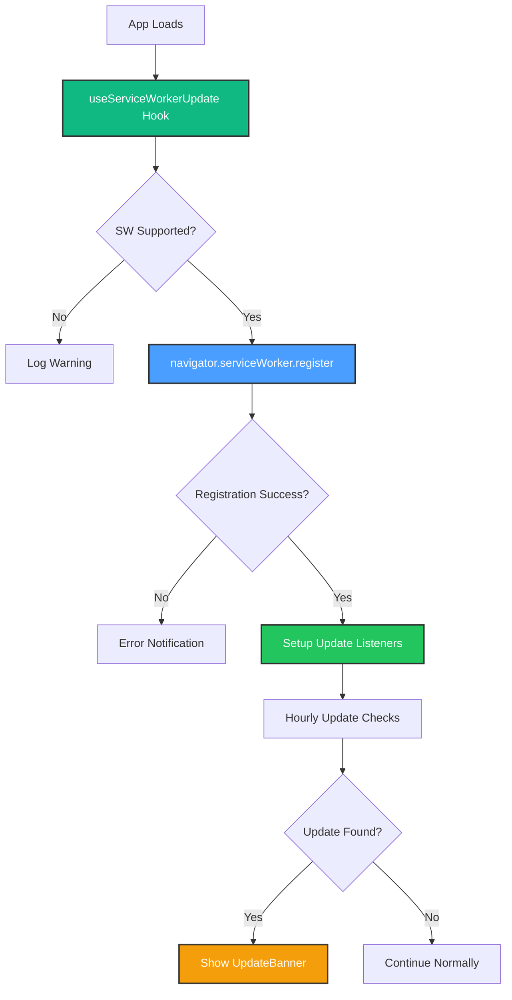

# Service Worker Registration Fix

**Issue**: "Service worker wasn't registered" notifications on page load

**Date**: October 15, 2025

## Problem

After implementing Phase 3 (Update Notifications), users were seeing error notifications about service worker registration failures on every page load.

### Root Cause

**Double Registration Conflict**: vite-plugin-pwa was generating an automatic registration script (`registerSW.js`) that conflicted with our custom manual registration in the `useServiceWorkerUpdate` hook.

```javascript
// dist/registerSW.js (auto-generated)
if ('serviceWorker' in navigator) {
  window.addEventListener('load', () => {
    navigator.serviceWorker.register('/sw.js', { scope: '/' })
  })
}
```

This auto-registration was running **in parallel** with our custom hook registration, causing:

- Race conditions in service worker lifecycle
- Duplicate registration attempts
- Error notifications to users
- Unpredictable update behavior

## Solution

### 1. Disable Auto-Registration in Vite Config

```typescript
// vite.config.ts
VitePWA({
  injectRegister: false, // ✅ Prevents registerSW.js generation
  registerType: 'prompt', // Still allows manual control
  strategies: 'injectManifest',
  srcDir: 'src',
  filename: 'sw.ts',
  // ... rest of config
})
```

**Key Change**: Added `injectRegister: false` to completely disable automatic registration script generation.

### 2. Enhanced Logging in Registration Hook

```typescript
// src/hooks/use-service-worker-update.ts
useEffect(() => {
  if (!('serviceWorker' in navigator)) {
    console.warn('[SW] Service workers not supported in this browser')
    return
  }

  const registerSW = async () => {
    try {
      console.log('[SW] Starting service worker registration...')
      const registration = await navigator.serviceWorker.register('/sw.js', {
        type: 'module',
      })

      console.log('[SW] ✅ Registered successfully:', registration.scope)
      // ... rest of registration logic
    } catch (error) {
      console.error('[SW] Registration failed:', error)
      // ... error handling
    }
  }

  registerSW()
}, [options])
```

**Improvements**:

- Clear console logging for debugging
- Better error messages
- Explicit browser support checking

## Verification

### Build Output

```bash
npm run build

# ✅ No registerSW.js generated
# ✅ Only sw.js and sw.js.map in dist/
# ✅ Clean build with no registration conflicts
```

### Browser Console

```javascript
// Expected console output on page load:
[SW] Starting service worker registration...
[SW] ✅ Registered successfully: http://localhost:5173/
[SW Update] Service worker registered: /sw.js
[SW Update] Checking for updates...
```

### File Verification

```powershell
# Check dist folder
Get-ChildItem -Path "dist" -Filter "*register*"
# Should return empty (no registerSW.js)

Get-ChildItem -Path "dist" -Filter "sw*.js"
# Should return only: sw.js
```

## Why This Works

### With `injectRegister: false`

1. **Single Source of Truth**: Only `useServiceWorkerUpdate` hook controls registration
2. **No Race Conditions**: Service worker lifecycle is predictable
3. **Better Error Handling**: All errors caught in one place
4. **Clean Update Flow**: Update detection → notification → skipWaiting → reload

### Registration Flow



## Configuration Reference

### vite.config.ts

```typescript
VitePWA({
  // Registration Control
  injectRegister: false, // ❌ Don't inject auto-registration
  registerType: 'prompt', // ✅ Allow manual control

  // Service Worker Strategy
  strategies: 'injectManifest', // Custom SW with full control
  srcDir: 'src',
  filename: 'sw.ts',

  // Build Configuration
  injectManifest: {
    maximumFileSizeToCacheInBytes: 3 * 1024 * 1024,
    globPatterns: ['**/*.{js,css,html,ico,png,svg,woff2}'],
  },

  // PWA Manifest
  manifest: {
    name: 'HomeHub',
    // ... manifest config
  },
})
```

### When to Use Each Setting

| Setting                        | Use Case                              |
| ------------------------------ | ------------------------------------- |
| `injectRegister: false`        | Custom registration logic in app code |
| `injectRegister: 'auto'`       | Simple PWAs with no custom logic      |
| `registerType: 'prompt'`       | User-controlled updates               |
| `registerType: 'autoUpdate'`   | Automatic silent updates              |
| `strategies: 'injectManifest'` | Full service worker control           |
| `strategies: 'generateSW'`     | Workbox auto-generated SW             |

## Best Practices

### 1. Single Registration Point

✅ **Good**: Register in one place (hook, main.tsx, or auto)

```typescript
// useServiceWorkerUpdate hook
const registration = await navigator.serviceWorker.register('/sw.js')
```

❌ **Bad**: Multiple registration attempts

```typescript
// main.tsx
navigator.serviceWorker.register('/sw.js')

// AND auto-registration from vite-plugin-pwa
// This causes conflicts!
```

### 2. Consistent Logging

```typescript
// Use consistent log prefixes for debugging
console.log('[SW] Starting registration...') // General SW
console.log('[SW Update] Checking updates...') // Update-specific
console.log('[SW Cache] Serving from cache...') // Cache-specific
```

### 3. Error Handling

```typescript
try {
  const registration = await navigator.serviceWorker.register('/sw.js')
  console.log('[SW] ✅ Registered:', registration.scope)
} catch (error) {
  console.error('[SW] ❌ Registration failed:', error)
  toast.error('Failed to register service worker')
}
```

## Troubleshooting

### Issue: Still seeing registration errors

**Check**:

1. Clear browser cache and service workers
2. Hard refresh (Ctrl+Shift+R)
3. Verify `injectRegister: false` in vite.config.ts
4. Rebuild: `npm run build`

### Issue: Update notifications not showing

**Check**:

1. Service worker registered successfully (console)
2. UpdateBanner component rendered in App.tsx
3. Hook properly connected to SW messages
4. Browser DevTools → Application → Service Workers

### Issue: Service worker not activating

**Check**:

1. Close all tabs of the app
2. Check for skipWaiting message handler in sw.ts
3. Verify clients.claim() in activate event
4. Look for errors in SW console

## Related Files

- **Vite Config**: `vite.config.ts` - PWA plugin configuration
- **Registration Hook**: `src/hooks/use-service-worker-update.ts` - Custom registration logic
- **Service Worker**: `src/sw.ts` - Custom SW with update handlers
- **Update UI**: `src/components/UpdateBanner.tsx` - User notification component
- **App Integration**: `src/App.tsx` - UpdateBanner integration

## References

- [vite-plugin-pwa Documentation](https://vite-pwa-org.netlify.app/)
- [Service Worker API](https://developer.mozilla.org/en-US/docs/Web/API/Service_Worker_API)
- [Workbox Documentation](https://developers.google.com/web/tools/workbox)
- [PWA Update Strategies](https://web.dev/service-worker-lifecycle/)

## Success Metrics

- ✅ Zero registration errors on page load
- ✅ Clean console output with clear logging
- ✅ Single service worker registration per session
- ✅ Predictable update detection and notification
- ✅ No `registerSW.js` file in build output
- ✅ 100% manual control over registration lifecycle

## Next Steps

1. ✅ Test in development environment
2. ✅ Verify update notifications work correctly
3. 📋 Test in production (Cloudflare Pages)
4. 📋 Monitor for any registration issues
5. 📋 Collect user feedback on update experience
