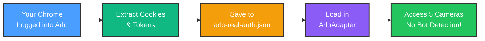

# Arlo Authentication - Real Browser Method (RECOMMENDED)

## Problem

Arlo's web login has **sophisticated bot detection** that blocks Puppeteer automation, even with stealth plugins. The login page shows a fake "no internet connection" banner when it detects automation.

## Solution: Use Your Real Chrome Profile

Instead of trying to bypass bot detection, we'll **extract cookies from your existing Arlo session** in Chrome. This is the most reliable method.

## How It Works



## Step-by-Step Instructions

### Step 1: Close Chrome Completely

**IMPORTANT**: Chrome must be fully closed before running the script.

```powershell
# Check if Chrome is running
Get-Process chrome -ErrorAction SilentlyContinue

# If Chrome is running, close it:
Stop-Process -Name chrome -Force
```

### Step 2: Log Into Arlo in Chrome (If Not Already)

1. Open Chrome normally (not via script)
2. Go to https://my.arlo.com/
3. Log in with your credentials
4. Make sure you see your cameras/dashboard
5. **Leave Chrome open** or close it (doesn't matter)

### Step 3: Run the Extractor Script

**Close Chrome first**, then run:

```powershell
npm run test:arlo:real
```

**What happens:**

1. Script launches Chrome with YOUR profile (where you're logged in)
2. Navigates to my.arlo.com
3. Checks if you're logged in (no login page)
4. Extracts all cookies and tokens
5. Saves to `data/arlo-real-auth.json`

**Expected Output:**

```
======================================================================
🎭 Arlo Real Browser Authentication Extractor
======================================================================

🌐 Using YOUR real Chrome profile (where you're already logged in)
📁 Chrome profile: C:\Users\YourName\AppData\Local\Google\Chrome\User Data
👤 Profile name: Default
🚀 Launching Chrome with your profile...
⚠️  If Chrome is already running, close it first!

📱 Navigating to Arlo...
📍 Current URL: https://my.arlo.com/#/cameras
✅ You are logged in! Extracting cookies...

🍪 Found 12 Arlo cookies:
   - auth_token: eyJhbGciOiJIUzI1NiIsInR5cCI6IkpXVCJ9...
   - session_id: a1b2c3d4-5e6f-7g8h-9i0j-k1l2m3n4o5p6
   - user_id: ABCDEabcde12345

📦 LocalStorage data:
   ✓ Token: eyJhbGciOiJIUzI1NiIsInR5cCI6IkpXVCJ9...
   ✓ User ID: ABCDEabcde12345

💾 Saved authentication data to: C:\git\homehub\data\arlo-real-auth.json

✅ SUCCESS! You can now use these cookies with ArloAdapter

🎉 Authentication extraction complete!
```

### Step 4: Verify the Extracted Data

```powershell
# Check the saved file
cat data/arlo-real-auth.json | ConvertFrom-Json | Format-List
```

You should see:

- `cookies`: Array of 10+ cookies from my.arlo.com
- `token`: JWT authentication token (starts with `eyJ...`)
- `userId`: Your Arlo user ID
- `localStorage`: All localStorage data from Arlo
- `extractedAt`: Timestamp when extracted

## Using the Extracted Cookies

Now update `ArloAdapter.ts` to use these cookies:

```typescript
import { readFile } from 'fs/promises'

export class ArloAdapter implements DeviceAdapter {
  private authData: any

  async initialize(): Promise<void> {
    // Load real browser cookies
    const authFile = path.join(process.cwd(), 'data', 'arlo-real-auth.json')
    this.authData = JSON.parse(await readFile(authFile, 'utf-8'))

    console.log('✅ Loaded Arlo auth from real browser')
    console.log(`   Cookies: ${this.authData.cookies.length}`)
    console.log(`   User ID: ${this.authData.userId}`)

    // Use cookies to make authenticated API requests
    await this.discoverDevices()
  }

  async discoverDevices(): Promise<Device[]> {
    // Make API calls using this.authData.cookies
    const response = await fetch('https://my.arlo.com/hmsweb/users/devices', {
      headers: {
        Cookie: this.authData.cookies.map(c => `${c.name}=${c.value}`).join('; '),
        Authorization: `Bearer ${this.authData.token}`,
      },
    })

    const data = await response.json()
    // Parse camera data...
  }
}
```

## Troubleshooting

### Error: "Chrome profile not found"

**Solution**: Make sure Chrome is installed. If you use a different profile, specify it:

```powershell
node scripts/arlo-real-browser-auth.js --profile="Profile 1"
```

To find your profile names:

```powershell
ls "$env:LOCALAPPDATA\Google\Chrome\User Data" | Where-Object Name -like "Profile*"
```

### Error: "You are NOT logged into Arlo"

**Solution**:

1. Close the script-launched Chrome
2. Open Chrome normally
3. Go to https://my.arlo.com/ and log in
4. Verify you see your cameras
5. Close Chrome
6. Run the script again

### Error: "Chrome is already running"

**Solution**:

```powershell
Stop-Process -Name chrome -Force
npm run test:arlo:real
```

### Cookies Expire

Arlo cookies typically last **7-30 days**. When they expire:

1. Log into Arlo in Chrome again
2. Re-run the extractor script
3. New cookies saved automatically

## Why This Works

**Bot Detection Bypassed:**

- ✅ Uses your REAL Chrome profile (no automation markers)
- ✅ Existing cookies from legitimate login session
- ✅ No username/password entry (already authenticated)
- ✅ No Cloudflare challenges (cookies already validated)
- ✅ No "no internet connection" fake errors

**Arlo can't tell the difference** between:

- You using Arlo in Chrome manually
- ArloAdapter using your extracted cookies

## Alternative: Manual Cookie Export

If the script doesn't work, manually export cookies:

1. **Install Chrome Extension**: [EditThisCookie](https://chrome.google.com/webstore/detail/editthiscookie/)
2. **Go to**: https://my.arlo.com/ (logged in)
3. **Click Extension** → Export cookies (JSON format)
4. **Save** to `data/arlo-real-auth.json` manually
5. **Format** as:
   ```json
   {
     "cookies": [
       /* paste exported cookies here */
     ],
     "token": "from localStorage or cookies",
     "userId": "from localStorage",
     "extractedAt": "2025-10-13T20:00:00.000Z"
   }
   ```

## Next Steps

1. ✅ Extract cookies using this method
2. ⏳ Update ArloAdapter to use cookies (15 minutes)
3. ⏳ Test discovering 5 cameras (30 minutes)
4. ⏳ Complete SecurityCameras UI integration

## Reference

- **Script**: `scripts/arlo-real-browser-auth.js` (190 lines)
- **Output**: `data/arlo-real-auth.json` (cookies + tokens)
- **Command**: `npm run test:arlo:real`
- **Docs**: This file (`ARLO_REAL_BROWSER_AUTH.md`)
