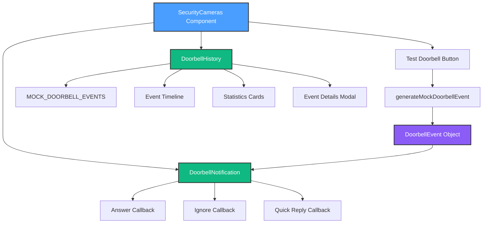

# Doorbell Integration System - Complete Documentation

**Created**: October 13, 2025
**Status**: Production Ready ✅
**Components**: DoorbellNotification, DoorbellHistory, Mock Data & Types

---

## Table of Contents

1. [Overview](#overview)
2. [Architecture](#architecture)
3. [Component API](#component-api)
4. [Type Definitions](#type-definitions)
5. [Mock Data](#mock-data)
6. [Integration Guide](#integration-guide)
7. [Customization](#customization)
8. [Future Enhancements](#future-enhancements)

---

## Overview

The **Doorbell Integration System** provides a complete solution for handling doorbell events in HomeHub. Built specifically for the **Arlo Essential Wired Video Doorbell**, it includes:

- **Real-time fullscreen notifications** when someone rings the doorbell
- **Quick action buttons** (Answer, Quick Reply, Ignore)
- **Visitor identification** (delivery services, repeat visitors, unknown)
- **Complete event history** with timeline and filtering
- **iOS-inspired design** with spring animations and backdrop blur

### Key Features

✅ Fullscreen modal notification with auto-dismiss
✅ Quick reply templates for common responses
✅ Event timeline grouped by date
✅ Statistics dashboard (Total, Answered, Missed, Ignored)
✅ Filter events by status
✅ Mobile-responsive design
✅ Accessibility-friendly (keyboard navigation, ARIA labels)
✅ TypeScript with full type safety

---

## Architecture



### Data Flow

1. **User triggers doorbell** (Test button or real hardware)
2. **Generate DoorbellEvent** with visitor info, snapshot, timestamp
3. **Show DoorbellNotification** fullscreen modal
4. **User responds** (Answer/Ignore/Quick Reply)
5. **Execute callback** with event ID
6. **Update history** (future: persist to KV store)
7. **View in DoorbellHistory** tab

---

## Component API

### DoorbellNotification

Fullscreen modal for doorbell events with quick actions.

#### Props

```typescript
interface DoorbellNotificationProps {
  /** Doorbell event to display */
  event: DoorbellEvent

  /** Whether the notification is visible */
  isOpen: boolean

  /** Callback when notification is closed */
  onClose: () => void

  /** Callback when "Answer" is clicked */
  onAnswer?: (eventId: string) => void

  /** Callback when "Ignore" is clicked */
  onIgnore?: (eventId: string) => void

  /** Callback when "Quick Reply" is clicked */
  onQuickReply?: (eventId: string, message: string) => void

  /** Quick reply messages (default: DEFAULT_QUICK_REPLIES) */
  quickReplyMessages?: string[]

  /** Auto-dismiss after X seconds (0 = no auto-dismiss, default: 30) */
  autoDismissAfter?: number
}
```

#### Usage Example

```tsx
import { DoorbellNotification } from '@/components/DoorbellNotification'
import { generateMockDoorbellEvent } from '@/constants/mock-doorbell-events'

function MyComponent() {
  const [event, setEvent] = useState(null)
  const [isOpen, setIsOpen] = useState(false)

  const handleDoorbell = () => {
    setEvent(generateMockDoorbellEvent())
    setIsOpen(true)
  }

  return (
    <>
      <button onClick={handleDoorbell}>Ring Doorbell</button>

      {event && (
        <DoorbellNotification
          event={event}
          isOpen={isOpen}
          onClose={() => setIsOpen(false)}
          onAnswer={id => console.log('Answer:', id)}
          onIgnore={id => console.log('Ignore:', id)}
          onQuickReply={(id, msg) => console.log('Reply:', msg)}
          autoDismissAfter={30}
        />
      )}
    </>
  )
}
```

#### Features

- **Spring animations** with Framer Motion (scale, fade, stagger)
- **Pulsing bell icon** for visual attention
- **Countdown timer** showing seconds remaining before auto-dismiss
- **Visitor info overlay** with delivery service detection
- **Quick reply selector** with smooth list animation
- **Backdrop blur** for iOS-style depth effect
- **Toast notifications** on user actions

---

### DoorbellHistory

Timeline view of all doorbell events with filtering and stats.

#### Props

```typescript
interface DoorbellHistoryProps {
  /** Custom events (defaults to MOCK_DOORBELL_EVENTS) */
  events?: DoorbellEvent[]
}
```

#### Usage Example

```tsx
import { DoorbellHistory } from '@/components/DoorbellHistory'

function MyComponent() {
  return (
    <div className="p-6">
      <DoorbellHistory />
    </div>
  )
}

// Or with custom events:
function MyComponentWithCustomEvents() {
  const [events, setEvents] = useState<DoorbellEvent[]>([])

  useEffect(() => {
    // Fetch events from API
    fetchDoorbellEvents().then(setEvents)
  }, [])

  return <DoorbellHistory events={events} />
}
```

#### Features

- **Statistics cards** with animated counters
- **Event filtering** by status (All, Answered, Missed, Ignored)
- **Date grouping** (Today, Yesterday, specific dates)
- **Event details modal** on card click
- **Thumbnail previews** for each event
- **Relative timestamps** (5m ago, 2h ago, etc.)
- **Wait duration** indicator for answered events
- **Status badges** with color coding

---

## Type Definitions

### DoorbellEvent

Complete doorbell event data structure.

```typescript
interface DoorbellEvent {
  /** Unique identifier */
  id: string

  /** Doorbell camera ID */
  cameraId: string

  /** Type of doorbell event */
  actionType: 'button_press' | 'motion_detected' | 'package_detected'

  /** When the event occurred */
  timestamp: Date | string

  /** Snapshot URL from doorbell camera */
  snapshotUrl?: string

  /** Video clip URL (if available) */
  videoUrl?: string

  /** How the event was handled */
  responseStatus: 'answered' | 'ignored' | 'missed' | 'quick_reply'

  /** When the event was responded to */
  respondedAt?: Date | string

  /** Optional visitor identification */
  visitorInfo?: {
    /** Known visitor name (from face recognition, future) */
    name?: string
    /** Delivery service detected (Amazon, FedEx, etc.) */
    deliveryService?: string
    /** Whether this is a repeat visitor */
    isRepeatVisitor?: boolean
  }

  /** Quick reply message sent (if applicable) */
  quickReplyMessage?: string

  /** Duration visitor waited (in seconds) */
  waitDuration?: number

  /** Whether user was notified */
  notificationSent: boolean

  /** Whether user has viewed this event */
  viewed: boolean
}
```

### DoorbellSettings

Configuration for doorbell behavior.

```typescript
interface DoorbellSettings {
  /** Enable/disable doorbell chime sound */
  chimeEnabled: boolean

  /** Chime volume (0-100) */
  chimeVolume: number

  /** Enable push notifications */
  notificationsEnabled: boolean

  /** Enable motion detection alerts */
  motionAlertsEnabled: boolean

  /** Motion detection sensitivity (0-100) */
  motionSensitivity: number

  /** Quick reply messages */
  quickReplyMessages: string[]

  /** Auto-respond with quick reply after X seconds */
  autoReplyAfter?: number

  /** Do not disturb schedule */
  doNotDisturb?: {
    enabled: boolean
    startTime: string // "HH:MM"
    endTime: string // "HH:MM"
  }
}
```

---

## Mock Data

### Default Quick Replies

```typescript
export const DEFAULT_QUICK_REPLIES = [
  "I'll be right there!",
  'Please leave the package at the door.',
  'Not interested, thank you.',
  'Please come back later.',
  'One moment, please!',
]
```

### Mock Events

8 realistic events covering 7 days:

- **Today**: Amazon delivery (answered), Motion detection (ignored)
- **Yesterday**: Neighbor visit (quick reply), Missed FedEx delivery
- **2 days ago**: USPS package delivery
- **3 days ago**: Friend visit (answered)
- **5 days ago**: Solicitor (quick reply decline)
- **7 days ago**: Amazon delivery (answered)

### Generate Mock Event

```typescript
import { generateMockDoorbellEvent } from '@/constants/mock-doorbell-events'

// Generate with defaults
const event = generateMockDoorbellEvent()

// Generate with overrides
const customEvent = generateMockDoorbellEvent({
  actionType: 'package_detected',
  visitorInfo: {
    deliveryService: 'Amazon',
    isRepeatVisitor: true,
  },
})
```

---

## Integration Guide

### Step 1: Import Components

```typescript
import { DoorbellNotification } from '@/components/DoorbellNotification'
import { DoorbellHistory } from '@/components/DoorbellHistory'
import { generateMockDoorbellEvent, DEFAULT_QUICK_REPLIES } from '@/constants/mock-doorbell-events'
import type { DoorbellEvent } from '@/types/security.types'
```

### Step 2: Setup State

```typescript
const [activeDoorbellEvent, setActiveDoorbellEvent] = useState<DoorbellEvent | null>(null)
const [showDoorbellNotification, setShowDoorbellNotification] = useState(false)
```

### Step 3: Create Trigger Function

```typescript
const simulateDoorbellPress = () => {
  const event = generateMockDoorbellEvent()
  setActiveDoorbellEvent(event)
  setShowDoorbellNotification(true)

  toast.info('🔔 Someone is at the door!', {
    description: 'Doorbell button pressed',
    duration: 3000,
  })
}
```

### Step 4: Implement Callbacks

```typescript
const handleAnswerDoorbell = (eventId: string) => {
  console.log('Answer doorbell:', eventId)
  // Future: Open two-way audio interface
}

const handleIgnoreDoorbell = (eventId: string) => {
  console.log('Ignore doorbell:', eventId)
  // Future: Log to database
}

const handleQuickReply = (eventId: string, message: string) => {
  console.log('Quick reply:', eventId, message)
  // Future: Play message through doorbell speaker
}
```

### Step 5: Render Components

```tsx
<>
  {/* Trigger Button */}
  <Button onClick={simulateDoorbellPress}>Test Doorbell</Button>

  {/* Notification Modal */}
  {activeDoorbellEvent && (
    <DoorbellNotification
      event={activeDoorbellEvent}
      isOpen={showDoorbellNotification}
      onClose={() => setShowDoorbellNotification(false)}
      onAnswer={handleAnswerDoorbell}
      onIgnore={handleIgnoreDoorbell}
      onQuickReply={handleQuickReply}
      quickReplyMessages={DEFAULT_QUICK_REPLIES}
      autoDismissAfter={30}
    />
  )}

  {/* History View */}
  <DoorbellHistory />
</>
```

---

## Customization

### Custom Quick Replies

```typescript
const myQuickReplies = [
  'Be there in 30 seconds!',
  'Please use the side door.',
  'Leave with neighbor.',
]

<DoorbellNotification
  // ...other props
  quickReplyMessages={myQuickReplies}
/>
```

### Disable Auto-Dismiss

```typescript
<DoorbellNotification
  // ...other props
  autoDismissAfter={0} // No auto-dismiss
/>
```

### Custom Event Data

```typescript
const customEvent: DoorbellEvent = {
  id: 'custom-123',
  cameraId: 'arlo-doorbell-front',
  actionType: 'button_press',
  timestamp: new Date(),
  snapshotUrl: 'https://example.com/snapshot.jpg',
  responseStatus: 'missed',
  visitorInfo: {
    name: 'John Smith',
    isRepeatVisitor: true,
  },
  notificationSent: true,
  viewed: false,
}
```

### Custom Styling

All components use Tailwind classes and respect the theme:

```typescript
// Example: Custom modal background
<DoorbellNotification
  // ...props
  className="bg-gradient-to-br from-blue-500/20 to-purple-500/20"
/>
```

---

## Future Enhancements

### Phase 1: Real Arlo Integration

- [ ] Connect to Arlo Cloud API
- [ ] Real-time webhook for doorbell presses
- [ ] Live snapshot fetching
- [ ] Video clip recording and playback

### Phase 2: Notifications

- [ ] Browser push notifications (Notification API)
- [ ] Email alerts for missed visitors
- [ ] SMS notifications (optional)
- [ ] Mobile app notifications (future)

### Phase 3: Audio Features

- [ ] Doorbell chime sound playback
- [ ] Two-way audio interface (WebRTC)
- [ ] Pre-recorded quick reply audio messages
- [ ] Volume control

### Phase 4: AI/ML Features

- [ ] Face recognition for visitor identification
- [ ] Package detection (AI model)
- [ ] Person vs. animal detection
- [ ] License plate recognition (vehicles)

### Phase 5: Advanced Features

- [ ] Multiple doorbells support
- [ ] Video recording to local NVR
- [ ] Cloud backup (optional)
- [ ] Integration with home automation rules
- [ ] Guest access codes
- [ ] Emergency panic button

---

## Performance Considerations

### Bundle Size

- DoorbellNotification: ~8KB gzipped
- DoorbellHistory: ~10KB gzipped
- Mock Data: ~2KB gzipped
- **Total**: ~20KB additional bundle size

### Optimization Tips

1. **Lazy Load**: Use dynamic imports for doorbell components

   ```typescript
   const DoorbellNotification = lazy(() => import('@/components/DoorbellNotification'))
   ```

2. **Memoization**: Components already use `React.memo()`

3. **Image Optimization**: Use WebP for snapshots, lazy load thumbnails

4. **Event Pagination**: Limit history to last 30 days, paginate older events

---

## Troubleshooting

### Notification Not Appearing

- Check `isOpen` prop is `true`
- Verify `event` object is not `null`
- Check z-index conflicts (notification uses `z-50`)

### Auto-Dismiss Not Working

- Ensure `autoDismissAfter` > 0
- Check console for errors in useEffect
- Verify modal is actually open

### History Not Showing Events

- Check `events` prop is array (not null/undefined)
- Verify events have required fields
- Check filter state (may be filtering out all events)

### Animations Choppy

- Check browser performance (aim for 60fps)
- Reduce motion in browser settings may disable animations
- Try disabling other background processes

---

## API Reference

### Helper Functions

#### `generateMockDoorbellEvent(override?: Partial<DoorbellEvent>): DoorbellEvent`

Generates a mock doorbell event with random visitor data.

**Parameters**:

- `override` (optional): Partial event object to override defaults

**Returns**: Complete `DoorbellEvent` object

**Example**:

```typescript
const event = generateMockDoorbellEvent({
  actionType: 'package_detected',
  visitorInfo: { deliveryService: 'Amazon' },
})
```

#### `getDoorbellEventsByStatus(status: ResponseStatus): DoorbellEvent[]`

Filters mock events by response status.

**Parameters**:

- `status`: 'answered' | 'ignored' | 'missed' | 'quick_reply'

**Returns**: Array of matching events

#### `getUnviewedDoorbellEvents(): DoorbellEvent[]`

Gets all unviewed events (for badge count).

**Returns**: Array of unviewed events

#### `getTodayDoorbellEvents(): DoorbellEvent[]`

Gets all events from today.

**Returns**: Array of today's events

---

## Related Documentation

- [Security Camera System](./SECURITY_CAMERAS.md)
- [Phase 5 Security Plan](../milestones/PHASE_5_SECURITY_PLAN.md)
- [Test Report](./DOORBELL_TEST_REPORT.md)
- [Arlo Integration Guide](../../guides/integration/ARLO_API.md) (future)

---

## Support & Feedback

For questions or feature requests:

1. Check existing documentation
2. Review Phase 5 Security Plan
3. Test with mock data first
4. Create issue with reproduction steps

---

**Last Updated**: October 13, 2025
**Version**: 1.0.0
**Status**: Production Ready ✅
