# Unit System Implementation Guide

**Status**: ✅ Complete
**Date**: January 2025
**Feature**: Metric/Imperial Unit Conversion System

## Overview

HomeHub now supports user-selectable unit preferences (Imperial/Metric) with automatic conversions throughout the application. Temperature values, distances, weights, speeds, and volumes are displayed according to user preference.

## Architecture


## Core Components

### 1. useUnits Hook (`src/hooks/use-units.ts`)

Central hook providing conversion functions and preference management.

**Key Functions**:

- `formatTemperature(fahrenheit: number): string` - Converts °F ↔ °C
- `formatDistance(miles: number): string` - Converts miles ↔ km
- `formatWeight(pounds: number): string` - Converts lbs ↔ kg
- `formatSpeed(mph: number): string` - Converts mph ↔ km/h
- `formatVolume(gallons: number): string` - Converts gallons ↔ liters

**Storage**: localStorage key `"unit-preferences"` with structure:

```typescript
interface UnitPreferences {
  system: 'imperial' | 'metric'
  temperature: 'fahrenheit' | 'celsius'
  distance: 'miles' | 'kilometers'
  weight: 'pounds' | 'kilograms'
  speed: 'mph' | 'kmh'
  volume: 'gallons' | 'liters'
}
```

**Usage Pattern**:

```tsx
import { useUnits } from '@/hooks/use-units'

function MyComponent() {
  const { formatTemperature, preferences } = useUnits()

  return <div>{formatTemperature(72)}</div> // Shows "72°F" or "22°C"
}
```

### 2. UnitSettings Component (`src/components/UnitSettings.tsx`)

UI for selecting unit preferences, integrated into Settings tab.

**Features**:

- Radio group for Imperial/Metric selection
- Live preview of current settings
- Animated card design with Framer Motion
- Toast notifications on preference change
- Shows examples of conversions

**Integration**: Added as 6th tab in `DeviceSettings.tsx`

### 3. Temperature Display Components

#### DeviceCardEnhanced (`src/components/DeviceCardEnhanced.tsx`)

- Displays device values with automatic temperature formatting
- Conditionally formats when `device.type === 'thermostat'`
- Uses `formatTemperature()` for real-time conversion

**Implementation**:

```tsx
{
  device.type === 'thermostat' && device.unit === '°F'
    ? formatTemperature(device.value)
    : `${device.value}${device.unit}`
}
```

#### NodeConfig (`src/components/NodeConfig.tsx`)

- Flow automation node configuration
- Dynamic labels showing current unit (°F or °C)
- Two locations updated:
  - Temperature condition trigger (line 209)
  - Thermostat action target (line 368)

**Implementation**:

```tsx
<Label htmlFor="temperature">
  Temperature ({preferences.temperature === 'fahrenheit' ? '°F' : '°C'})
</Label>
<div className="text-muted-foreground mt-1 text-sm">
  {formatTemperature(nodeData.temperature || 70)}
</div>
```

#### FlowExecutor (`src/components/FlowExecutor.tsx`)

- Singleton class for automation execution
- Private `formatTemperature()` method reads from localStorage
- Toast messages show formatted temperature

**Implementation**:

```typescript
private formatTemperature(value: number): string {
  const prefs = localStorage.getItem('unit-preferences')
  const preferences = prefs ? JSON.parse(prefs) : { temperature: 'fahrenheit' }

  if (preferences.temperature === 'celsius') {
    const celsius = Math.round(((value - 32) * 5) / 9)
    return `${celsius}°C`
  }
  return `${value}°F`
}
```

## Conversion Formulas

### Temperature

- **F → C**: `(F - 32) × 5/9`
- **C → F**: `(C × 9/5) + 32`

### Distance

- **Miles → Kilometers**: `miles × 1.60934`
- **Kilometers → Miles**: `km / 1.60934`

### Weight

- **Pounds → Kilograms**: `lbs / 2.20462`
- **Kilograms → Pounds**: `kg × 2.20462`

### Speed

- **MPH → KM/H**: `mph × 1.60934`
- **KM/H → MPH**: `kmh / 1.60934`

### Volume

- **Gallons → Liters**: `gallons × 3.78541`
- **Liters → Gallons**: `liters / 3.78541`

## Data Flow

```mermaid
sequenceDiagram
    participant User
    participant UnitSettings
    participant useUnits
    participant localStorage
    participant Component

    User->>UnitSettings: Select Metric
    UnitSettings->>useUnits: setPreferences({system: 'metric'})
    useUnits->>localStorage: Save preferences
    useUnits->>useUnits: Update state
    useUnits-->>Component: Trigger re-render
    Component->>useUnits: formatTemperature(72)
    useUnits-->>Component: "22°C"
    Component->>User: Display converted value
```



## Testing Checklist

### Manual Testing

- [x] Switch between Imperial/Metric in Settings
- [x] Verify localStorage persistence across refresh
- [x] Check DeviceCardEnhanced displays correct units
- [x] Test NodeConfig temperature sliders show correct units
- [x] Verify FlowExecutor toast messages use correct units
- [ ] Test with real thermostat devices (mock data currently)
- [ ] Verify all temperature sensors display correctly
- [ ] Test automation rules with temperature triggers

### Unit Test Cases

```typescript
// Temperature conversion
formatTemperature(32) // "32°F" (Imperial) or "0°C" (Metric)
formatTemperature(72) // "72°F" (Imperial) or "22°C" (Metric)
formatTemperature(100) // "100°F" (Imperial) or "38°C" (Metric)

// Distance conversion
formatDistance(1) // "1 mi" (Imperial) or "1.6 km" (Metric)
formatDistance(10) // "10 mi" (Imperial) or "16.1 km" (Metric)

// Weight conversion
formatWeight(1) // "1 lb" (Imperial) or "0.45 kg" (Metric)
formatWeight(150) // "150 lbs" (Imperial) or "68.0 kg" (Metric)
```

## Components Using Unit System

### Currently Integrated ✅

1. **DeviceCardEnhanced** - Device value display
2. **NodeConfig** - Flow automation temperature controls
3. **FlowExecutor** - Automation execution messages
4. **UnitSettings** - Preference UI
5. **DeviceSettings** - Settings container

### Future Integration 📋

1. **Energy Dashboard** - kWh usage (future Phase 4)
2. **InsightsDashboard** - Cost calculations (future Phase 4)
3. **DeviceMonitor** - Device metrics (future Phase 4)
4. **Scenes** - Scene descriptions with measurements
5. **Automations** - Automation descriptions

## Known Limitations

1. **Slider Ranges**: Temperature sliders still use Fahrenheit ranges (60-85°F)
   - Future: Convert slider min/max based on unit preference
   - Current: Celsius users see 60-85 range, displayed as 16-29°C

2. **Mock Data**: All device values are stored in Fahrenheit
   - Future: Store values in neutral format (Kelvin?) or always Celsius
   - Current: Works correctly with conversion on display

3. **Class Components**: FlowExecutor can't use hooks directly
   - Solution: Private method reads localStorage directly
   - Future: Consider refactoring to functional component

4. **Non-Temperature Units**: Distance, weight, speed, volume not yet used
   - Future Phase 4: Energy monitoring will use distance/weight
   - Future Phase 9: Mobile app will use all unit types

## Migration Guide for New Components

When adding temperature or measurement displays to a new component:

### Step 1: Import the Hook

```tsx
import { useUnits } from '@/hooks/use-units'
```

### Step 2: Destructure Functions

```tsx
const { formatTemperature, formatDistance, preferences } = useUnits()
```

### Step 3: Format Display Values

```tsx
// For temperature
{
  formatTemperature(device.temperature)
}

// For dynamic labels
;<Label>Temperature ({preferences.temperature === 'fahrenheit' ? '°F' : '°C'})</Label>

// For other measurements
{
  formatDistance(10)
} // "10 mi" or "16.1 km"
{
  formatWeight(150)
} // "150 lbs" or "68.0 kg"
```

### Step 4: Class Components (Special Case)

If you can't use hooks (class components, singletons):

```typescript
private formatTemperature(value: number): string {
  const prefs = localStorage.getItem('unit-preferences')
  const preferences = prefs ? JSON.parse(prefs) : { temperature: 'fahrenheit' }

  if (preferences.temperature === 'celsius') {
    const celsius = Math.round(((value - 32) * 5) / 9)
    return `${celsius}°C`
  }
  return `${value}°F`
}
```

## Performance Considerations

1. **localStorage Reads**: useUnits caches preferences in state
   - Single read on mount, updates on preference change
   - No performance impact from repeated formatting calls

2. **Conversion Math**: Simple arithmetic operations
   - No async operations, no API calls
   - Negligible performance cost

3. **Re-renders**: Preference changes trigger component re-renders
   - Expected behavior for live updates
   - Only affects components using useUnits

## Accessibility

- Unit abbreviations use proper symbols (°F, °C, km, kg)
- Labels clearly indicate current unit system
- Settings UI uses semantic HTML (RadioGroup, Label)
- Toast notifications announce preference changes
- Keyboard navigation supported throughout

## Related Files

### Core Implementation

- `src/hooks/use-units.ts` (200 lines) - Main hook
- `src/components/UnitSettings.tsx` (130 lines) - Settings UI
- `src/hooks/index.ts` - Hook exports

### Integration Points

- `src/components/DeviceCardEnhanced.tsx` (line 89, 251)
- `src/components/NodeConfig.tsx` (lines 38, 210, 369)
- `src/components/FlowExecutor.tsx` (lines 38-49, 278)
- `src/components/DeviceSettings.tsx` (Units tab)

### Documentation

- `docs/development/UNIT_SYSTEM_IMPLEMENTATION.md` (this file)
- `.github/instructions/copilot-instructions.md` (updated)

## Future Enhancements

### Phase 3: Automation Engine

- [ ] Convert temperature trigger thresholds dynamically
- [ ] Store automation thresholds in neutral unit
- [ ] Add unit validation to automation UI

### Phase 4: Energy & Monitoring

- [ ] Integrate distance/weight for energy calculations
- [ ] Support kWh vs BTU energy displays
- [ ] Add currency conversion for cost displays

### Phase 6: Multi-User

- [ ] Per-user unit preferences (override household default)
- [ ] User profile displays preferred units
- [ ] Admin can set household default unit system

### Phase 7: Voice & AI

- [ ] Natural language understanding of units ("set to 22 degrees")
- [ ] Voice feedback in user's preferred units
- [ ] AI suggestions respect unit preferences

### Phase 9: Mobile

- [ ] GPS-based automatic unit selection (country detection)
- [ ] Offline unit conversion support
- [ ] Widget displays in user's preferred units

## Success Metrics

✅ **Implementation Complete**:

- Unit system integrated into 3 core components
- Settings UI complete and functional
- localStorage persistence working
- Zero TypeScript errors
- All conversion functions tested

📊 **Phase Completion**: 100% for Phase 1 Unit System

- Basic implementation: ✅ Complete
- Temperature conversion: ✅ Complete
- Settings UI: ✅ Complete
- Documentation: ✅ Complete
- Future integrations: 📋 Planned for later phases

---

**Last Updated**: January 2025
**Contributors**: HomeHub Development Team
**Related Phases**: Phase 1 (Foundation), Phase 4 (Energy), Phase 6 (Multi-User)
