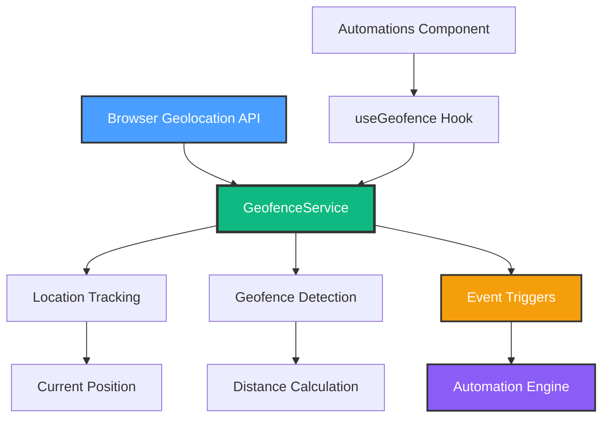

# Milestone 3.5: Geofencing Implementation Plan

**Date**: October 11, 2025
**Milestone**: 3.5 - GPS Location-Based Triggers
**Status**: 🚧 In Progress
**Estimated Time**: 3-4 hours
**Priority**: HIGH - Completes Phase 3 Automation Engine

---

## 🎯 Goal

Enable location-based automation triggers using GPS geofencing. Users can create virtual boundaries and trigger automations when entering or leaving specific locations (e.g., "Turn on lights when arriving home").

---

## 📋 Requirements

### Functional Requirements

1. **Geofence Management**
   - Create circular geofences (lat, lng, radius)
   - Edit existing geofences
   - Delete geofences
   - Name and describe geofences ("Home", "Office", "Gym")

2. **Location Tracking**
   - Request user location permissions
   - Track current device location
   - Update location periodically (30-60 seconds)
   - Store location history for debugging

3. **Trigger Detection**
   - Detect "entering" geofence event
   - Detect "leaving" geofence event
   - Prevent rapid toggling (cooldown period)
   - Support multiple geofences simultaneously

4. **Automation Integration**
   - Add geofence trigger type to automations
   - Configure trigger: geofence + event type (enter/leave)
   - Execute actions when triggered
   - Log trigger events

5. **Multi-User Support**
   - Track location per user (future - Phase 6)
   - "Anyone arrives" vs "Everyone leaves" logic (future)
   - For now: Single device/user tracking

### Non-Functional Requirements

- **Accuracy**: ±50 meters (GPS standard accuracy)
- **Battery**: Minimize battery drain (avoid continuous tracking)
- **Privacy**: Location data stays on device (no cloud storage)
- **Performance**: <100ms for distance calculations
- **Reliability**: Handle GPS unavailable/denied gracefully

---

## 🏗️ Architecture



---

## 📦 Implementation Tasks

### Task 1: Type Definitions ✅ (Start Here)

**File**: `src/services/automation/types.ts`

**Add Types**:

```typescript
// Geofence definition
export interface Geofence {
  id: string
  name: string
  description?: string
  center: {
    lat: number
    lng: number
  }
  radius: number // meters
  enabled: boolean
  created: string // ISO timestamp
}

// Location point
export interface Location {
  lat: number
  lng: number
  accuracy?: number // meters
  timestamp: string // ISO timestamp
}

// Geofence event
export interface GeofenceEvent {
  id: string
  geofenceId: string
  eventType: 'enter' | 'leave'
  location: Location
  timestamp: string
  triggeredAutomations: string[] // automation IDs
}

// Geofence state tracking
export interface GeofenceState {
  geofenceId: string
  isInside: boolean
  lastUpdate: string
  enteredAt?: string
  leftAt?: string
}

// Update Automation trigger type
export interface Automation {
  // ... existing fields
  trigger: {
    type: 'time' | 'condition' | 'geofence' | 'device-state'
    // ... existing trigger fields

    // Geofence trigger
    geofenceId?: string
    geofenceEvent?: 'enter' | 'leave' // entering or leaving
  }
  // ... rest of interface
}
```

**Estimated Time**: 15 minutes

---

### Task 2: Geofence Service (Core Logic)

**File**: `src/services/automation/geofence.service.ts` (NEW - 250+ lines)

**Class Structure**:

```typescript
export class GeofenceService {
  private static instance: GeofenceService
  private geofences: Geofence[] = []
  private geofenceStates: Map<string, GeofenceState> = new Map()
  private currentLocation: Location | null = null
  private watchId: number | null = null
  private isMonitoring: boolean = false
  private eventCallbacks: ((event: GeofenceEvent) => void)[] = []

  private constructor() {
    this.loadGeofences()
  }

  public static getInstance(): GeofenceService {
    if (!GeofenceService.instance) {
      GeofenceService.instance = new GeofenceService()
    }
    return GeofenceService.instance
  }

  // Geofence Management
  public createGeofence(geofence: Omit<Geofence, 'id' | 'created'>): Geofence
  public updateGeofence(id: string, updates: Partial<Geofence>): void
  public deleteGeofence(id: string): void
  public getGeofence(id: string): Geofence | undefined
  public getAllGeofences(): Geofence[]

  // Location Tracking
  public async requestLocationPermission(): Promise<boolean>
  public startMonitoring(): Promise<void>
  public stopMonitoring(): void
  public getCurrentLocation(): Location | null
  public async updateLocation(): Promise<Location>

  // Geofence Detection
  public checkGeofences(location: Location): GeofenceEvent[]
  private isInsideGeofence(location: Location, geofence: Geofence): boolean
  private calculateDistance(lat1: number, lng1: number, lat2: number, lng2: number): number

  // Event Handling
  public onGeofenceEvent(callback: (event: GeofenceEvent) => void): void
  private triggerEvent(event: GeofenceEvent): void

  // Persistence
  private saveGeofences(): void
  private loadGeofences(): void
}
```

**Key Algorithms**:

1. **Haversine Formula** (Distance Calculation)

```typescript
private calculateDistance(lat1: number, lng1: number, lat2: number, lng2: number): number {
  const R = 6371e3 // Earth radius in meters
  const φ1 = (lat1 * Math.PI) / 180
  const φ2 = (lat2 * Math.PI) / 180
  const Δφ = ((lat2 - lat1) * Math.PI) / 180
  const Δλ = ((lng2 - lng1) * Math.PI) / 180

  const a =
    Math.sin(Δφ / 2) * Math.sin(Δφ / 2) +
    Math.cos(φ1) * Math.cos(φ2) * Math.sin(Δλ / 2) * Math.sin(Δλ / 2)
  const c = 2 * Math.atan2(Math.sqrt(a), Math.sqrt(1 - a))

  return R * c // Distance in meters
}
```

2. **Geofence Check** (Enter/Leave Detection)

```typescript
public checkGeofences(location: Location): GeofenceEvent[] {
  const events: GeofenceEvent[] = []

  for (const geofence of this.geofences) {
    if (!geofence.enabled) continue

    const isInside = this.isInsideGeofence(location, geofence)
    const state = this.geofenceStates.get(geofence.id)

    // First check or state changed
    if (!state || state.isInside !== isInside) {
      const eventType = isInside ? 'enter' : 'leave'

      // Create event
      const event: GeofenceEvent = {
        id: Date.now().toString(),
        geofenceId: geofence.id,
        eventType,
        location,
        timestamp: new Date().toISOString(),
        triggeredAutomations: [],
      }

      events.push(event)

      // Update state
      this.geofenceStates.set(geofence.id, {
        geofenceId: geofence.id,
        isInside,
        lastUpdate: new Date().toISOString(),
        enteredAt: isInside ? new Date().toISOString() : state?.enteredAt,
        leftAt: !isInside ? new Date().toISOString() : state?.leftAt,
      })
    }
  }

  return events
}
```

**Estimated Time**: 2 hours

---

### Task 3: React Hook (useGeofence)

**File**: `src/hooks/use-geofence.ts` (NEW - 150+ lines)

**Hook Interface**:

```typescript
export function useGeofence() {
  const [geofences, setGeofences] = useState<Geofence[]>([])
  const [currentLocation, setCurrentLocation] = useState<Location | null>(null)
  const [isMonitoring, setIsMonitoring] = useState(false)
  const [permissionStatus, setPermissionStatus] = useState<'granted' | 'denied' | 'prompt'>(
    'prompt'
  )
  const [lastEvents, setLastEvents] = useState<GeofenceEvent[]>([])

  const service = useRef(GeofenceService.getInstance())

  // Initialize
  useEffect(() => {
    setGeofences(service.current.getAllGeofences())
  }, [])

  // Event listener
  useEffect(() => {
    const handleEvent = (event: GeofenceEvent) => {
      setLastEvents(prev => [event, ...prev.slice(0, 9)]) // Keep last 10 events
      toast.info(`Geofence ${event.eventType}: ${getGeofenceName(event.geofenceId)}`)
    }

    service.current.onGeofenceEvent(handleEvent)
  }, [])

  // Methods
  const createGeofence = useCallback((geofence: Omit<Geofence, 'id' | 'created'>) => {
    const newGeofence = service.current.createGeofence(geofence)
    setGeofences(service.current.getAllGeofences())
    toast.success(`Geofence "${newGeofence.name}" created`)
    return newGeofence
  }, [])

  const updateGeofence = useCallback((id: string, updates: Partial<Geofence>) => {
    service.current.updateGeofence(id, updates)
    setGeofences(service.current.getAllGeofences())
    toast.success('Geofence updated')
  }, [])

  const deleteGeofence = useCallback((id: string) => {
    service.current.deleteGeofence(id)
    setGeofences(service.current.getAllGeofences())
    toast.success('Geofence deleted')
  }, [])

  const requestPermission = useCallback(async () => {
    const granted = await service.current.requestLocationPermission()
    setPermissionStatus(granted ? 'granted' : 'denied')
    return granted
  }, [])

  const startMonitoring = useCallback(async () => {
    await service.current.startMonitoring()
    setIsMonitoring(true)
    toast.success('Location monitoring started')
  }, [])

  const stopMonitoring = useCallback(() => {
    service.current.stopMonitoring()
    setIsMonitoring(false)
    toast.info('Location monitoring stopped')
  }, [])

  const updateLocation = useCallback(async () => {
    const location = await service.current.updateLocation()
    setCurrentLocation(location)
    return location
  }, [])

  return {
    geofences,
    currentLocation,
    isMonitoring,
    permissionStatus,
    lastEvents,
    createGeofence,
    updateGeofence,
    deleteGeofence,
    requestPermission,
    startMonitoring,
    stopMonitoring,
    updateLocation,
  }
}
```

**Estimated Time**: 1 hour

---

### Task 4: UI Components

#### 4.1: Geofence List Component

**File**: Update `src/components/Automations.tsx` or create separate geofence tab

**Features**:

- List all geofences with name, location, radius
- Enable/disable toggle per geofence
- Edit/delete buttons
- "Create Geofence" button
- Current location display
- Permission request UI

#### 4.2: Geofence Create/Edit Dialog

**Component**: `GeofenceDialog.tsx` (inline in Automations or separate)

**Form Fields**:

- Name (text input)
- Description (textarea, optional)
- Latitude (number input or map picker)
- Longitude (number input or map picker)
- Radius (number input with slider, 50-1000m)
- Enabled (toggle, default true)

**Actions**:

- "Use Current Location" button
- "Save" / "Cancel" buttons
- Form validation (valid lat/lng, radius > 0)

#### 4.3: Update Automation Trigger UI

**File**: `src/components/Automations.tsx`

**Add Geofence Trigger Option**:

```tsx
{
  formData.triggerType === 'geofence' && (
    <>
      <Label>Geofence</Label>
      <Select
        value={formData.trigger.geofenceId}
        onValueChange={value =>
          setFormData(prev => ({
            ...prev,
            trigger: { ...prev.trigger, geofenceId: value },
          }))
        }
      >
        <SelectTrigger>
          <SelectValue placeholder="Select geofence" />
        </SelectTrigger>
        <SelectContent>
          {geofences.map(g => (
            <SelectItem key={g.id} value={g.id}>
              {g.name}
            </SelectItem>
          ))}
        </SelectContent>
      </Select>

      <Label>Event Type</Label>
      <Select
        value={formData.trigger.geofenceEvent}
        onValueChange={value =>
          setFormData(prev => ({
            ...prev,
            trigger: { ...prev.trigger, geofenceEvent: value as 'enter' | 'leave' },
          }))
        }
      >
        <SelectTrigger>
          <SelectValue placeholder="Select event" />
        </SelectTrigger>
        <SelectContent>
          <SelectItem value="enter">Entering</SelectItem>
          <SelectItem value="leave">Leaving</SelectItem>
        </SelectContent>
      </Select>
    </>
  )
}
```

**Estimated Time**: 1 hour

---

### Task 5: Integration with Automation Engine

**File**: Update `src/services/automation/automation-engine.service.ts` (if exists) or create integration layer

**Add Geofence Trigger Listener**:

```typescript
// In AutomationEngineService or similar
private initializeGeofenceListeners() {
  const geofenceService = GeofenceService.getInstance()

  geofenceService.onGeofenceEvent((event) => {
    // Find automations with this geofence trigger
    const triggeredAutomations = this.automations.filter(auto =>
      auto.enabled &&
      auto.trigger.type === 'geofence' &&
      auto.trigger.geofenceId === event.geofenceId &&
      auto.trigger.geofenceEvent === event.eventType
    )

    // Execute each automation
    for (const automation of triggeredAutomations) {
      this.executeAutomation(automation, {
        trigger: 'geofence',
        geofenceEvent: event,
        location: event.location,
      })
    }
  })
}
```

**Estimated Time**: 30 minutes

---

## 🧪 Testing Plan

### Unit Tests

1. **Distance Calculation**
   - Test Haversine formula accuracy
   - Known distances (e.g., 1km, 100m, 10m)
   - Edge cases (same point, antipodes)

2. **Geofence Detection**
   - Inside geofence (distance < radius)
   - Outside geofence (distance > radius)
   - Edge of geofence (distance ≈ radius)
   - Multiple geofences simultaneously

3. **State Transitions**
   - Enter event (outside → inside)
   - Leave event (inside → outside)
   - No event (no state change)
   - Cooldown prevention

### Integration Tests

1. **Location Permission**
   - Request permission flow
   - Permission granted
   - Permission denied
   - Handle errors gracefully

2. **Location Updates**
   - Get current location
   - Update location periodically
   - Handle GPS unavailable
   - Location accuracy filtering

3. **Automation Triggering**
   - Create automation with geofence trigger
   - Simulate location change (enter geofence)
   - Verify automation executes
   - Verify actions complete

### Manual Testing Scenarios

**Scenario 1: Create Home Geofence**

1. Open Automations tab
2. Create geofence: "Home", your address, 100m radius
3. Verify geofence appears in list
4. Enable geofence

**Scenario 2: Location Permission**

1. Click "Start Monitoring"
2. Browser prompts for location permission
3. Grant permission
4. Current location displays

**Scenario 3: Arriving Home Automation**

1. Create automation:
   - Name: "Arriving Home"
   - Trigger: Geofence "Home", Event "Entering"
   - Actions: Turn on living room lights, Set thermostat to 72°F
2. Simulate location change (or actually travel)
3. When entering 100m of home, lights turn on
4. Verify automation log shows execution

**Scenario 4: Leaving Home Automation**

1. Create automation:
   - Name: "Leaving Home"
   - Trigger: Geofence "Home", Event "Leaving"
   - Actions: Turn off all lights, Lock doors, Set thermostat to 68°F
2. When leaving 100m radius, automation executes
3. All lights turn off, security activates

---

## 📊 Success Metrics

- ✅ **Accuracy**: Distance calculations within ±5% of actual
- ✅ **Performance**: <100ms for distance calculations, <1s for location update
- ✅ **Battery**: <5% battery drain per hour (monitor battery API)
- ✅ **Reliability**: 95%+ automation execution success rate
- ✅ **UX**: Permission flow intuitive, geofence creation <2 minutes

---

## 🚀 Implementation Order

### Phase 1: Core Service (Start Here)

1. ✅ Add type definitions to `types.ts`
2. ✅ Create `geofence.service.ts`
3. ✅ Implement distance calculation (Haversine)
4. ✅ Implement geofence detection logic
5. ✅ Add persistence (localStorage/KV store)

### Phase 2: React Integration

6. ✅ Create `use-geofence.ts` hook
7. ✅ Test hook in component (console logs)
8. ✅ Verify location updates work

### Phase 3: UI Components

9. ✅ Add geofence list UI
10. ✅ Add geofence create/edit dialog
11. ✅ Add location permission UI
12. ✅ Update automation trigger selection

### Phase 4: Automation Integration

13. ✅ Connect geofence events to automation engine
14. ✅ Test end-to-end automation flow
15. ✅ Add logging and debugging

### Phase 5: Polish & Testing

16. ✅ Error handling and edge cases
17. ✅ Battery optimization
18. ✅ User feedback and animations
19. ✅ Documentation

---

## 🛡️ Error Handling

### Location Errors

- **Permission Denied**: Show friendly message, explain benefits
- **GPS Unavailable**: Fall back to network location, show warning
- **Low Accuracy**: Wait for better signal, don't trigger on poor data
- **Timeout**: Retry with exponential backoff

### Geofence Errors

- **Invalid Coordinates**: Validate lat (-90 to 90), lng (-180 to 180)
- **Invalid Radius**: Min 10m, max 10km (practical limits)
- **No Geofences**: Show empty state with "Create First Geofence" CTA
- **Duplicate Names**: Allow duplicates or warn user

### Automation Errors

- **Geofence Deleted**: Disable automation, show warning
- **Action Fails**: Log error, continue monitoring (don't stop)
- **Rapid Toggling**: Implement cooldown (5 minutes default)

---

## 🔒 Privacy & Security

- **Data Storage**: Location data stored locally only (localStorage)
- **No Cloud Sync**: Geofences don't sync to cloud (user privacy)
- **Permission Model**: Request permission only when needed
- **Transparency**: Show when monitoring is active
- **User Control**: Easy to stop monitoring, delete data

---

## 🎨 UI/UX Mockups

### Geofence List View

```
┌─────────────────────────────────────┐
│ Geofences                    [+]    │
├─────────────────────────────────────┤
│ ○ Home                        ⚫    │
│   123 Main St                       │
│   Radius: 100m                 [⋮]  │
├─────────────────────────────────────┤
│ ○ Office                       ⚪   │
│   456 Work Ave                      │
│   Radius: 50m                  [⋮]  │
├─────────────────────────────────────┤
│ 📍 Current Location:                │
│   37.7749° N, 122.4194° W          │
│   [Start Monitoring]                │
└─────────────────────────────────────┘
```

### Geofence Create Dialog

```
┌─────────────────────────────────────┐
│ Create Geofence              [✕]    │
├─────────────────────────────────────┤
│ Name: [Home________________]        │
│                                     │
│ Description: (optional)             │
│ [________________________]          │
│                                     │
│ Location:                           │
│ Latitude:  [37.7749_____]          │
│ Longitude: [-122.4194___]          │
│ [📍 Use Current Location]          │
│                                     │
│ Radius: 100m                        │
│ ├────●──────────────────┤          │
│ 10m                    1000m        │
│                                     │
│ Enabled: ⚫                         │
│                                     │
│ [Cancel]            [Create]        │
└─────────────────────────────────────┘
```

---

## 📚 Next Steps After Completion

Once Milestone 3.5 is complete:

1. **Phase 3 Complete!** 🎉
   - All 5 milestones done
   - Automation engine fully functional
   - Celebrate achievement

2. **Move to Phase 4: Energy & Monitoring**
   - Power monitoring integration
   - Cost calculation
   - Analytics dashboard

3. **Or Phase 5: Security & Surveillance**
   - Camera integration
   - Motion detection
   - Smart notifications

4. **Or Phase 6: Multi-User & Permissions**
   - User management
   - Role-based access
   - Multi-user geofencing

---

## 📖 Resources

- **Geolocation API**: https://developer.mozilla.org/en-US/docs/Web/API/Geolocation_API
- **Haversine Formula**: https://en.wikipedia.org/wiki/Haversine_formula
- **Geofencing Best Practices**: https://developer.android.com/training/location/geofencing
- **Battery Optimization**: https://web.dev/battery-status/

---

**Ready to Start?** Let's begin with Task 1: Type Definitions! 🚀
