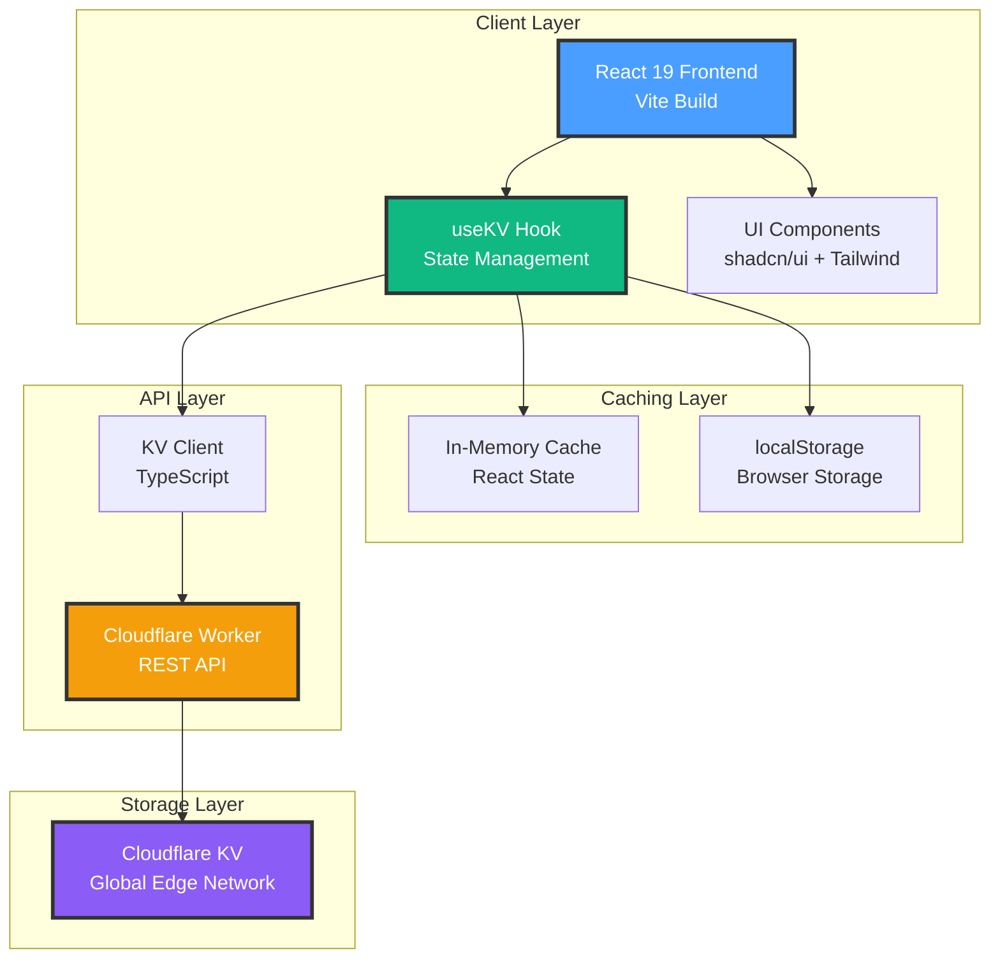
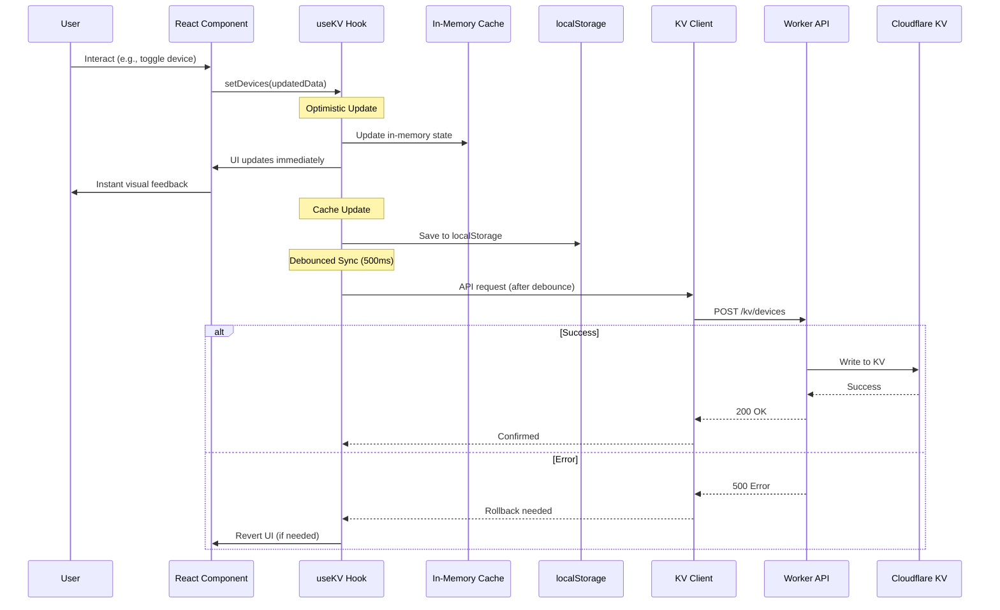
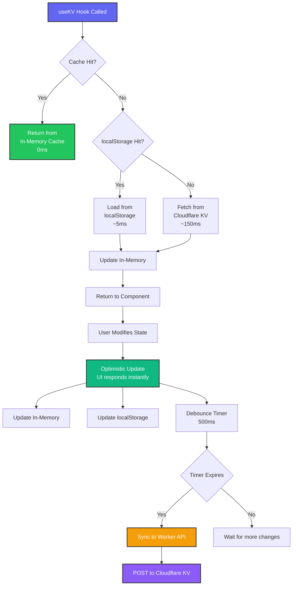
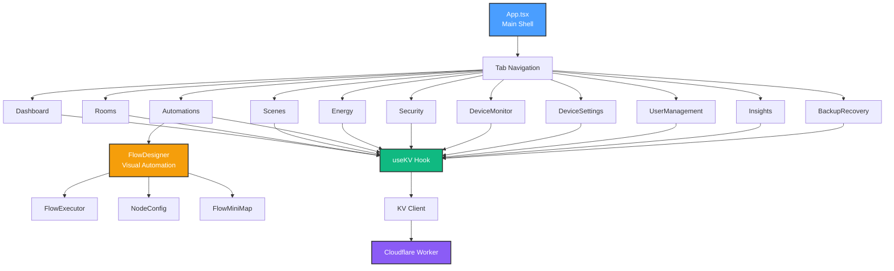
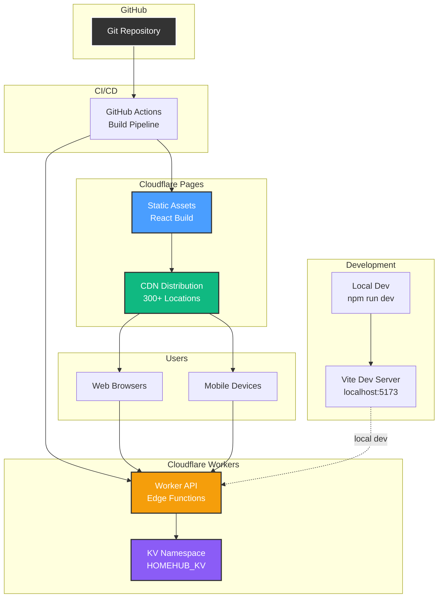
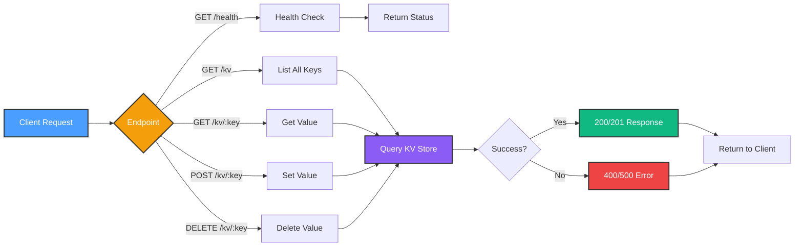
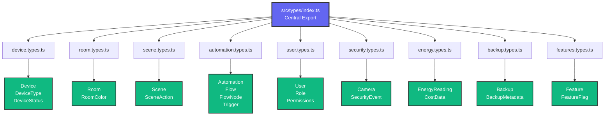
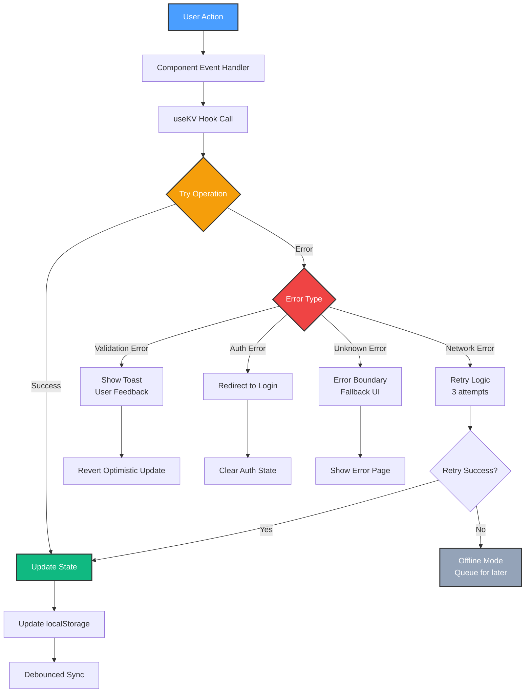
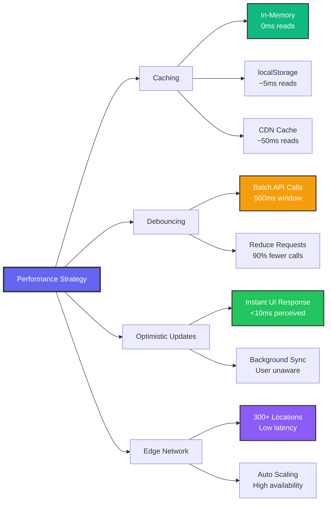
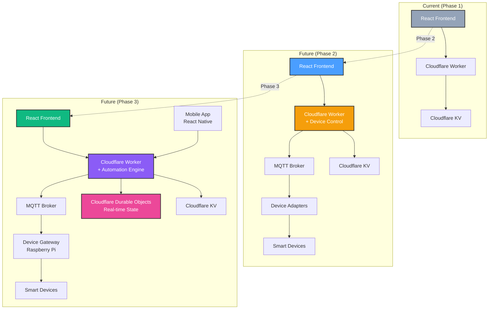

# HomeHub Architecture

This document provides a comprehensive overview of HomeHub's architecture using Mermaid diagrams.

## Table of Contents

- [System Overview](#system-overview)
- [Data Flow](#data-flow)
- [State Management](#state-management)
- [Component Structure](#component-structure)
- [Deployment Architecture](#deployment-architecture)
- [Migration Path](#migration-path)

---

## System Overview

High-level view of the HomeHub system architecture.



---

## Data Flow

Complete data flow from user interaction to persistent storage.



---

## State Management

How the custom useKV hook manages state across layers.



---

## Component Structure

Organization of React components and their relationships.



---

## Deployment Architecture

Production deployment on Cloudflare infrastructure.



---

## Migration Path

Evolution from GitHub Spark to Cloudflare.

```mermaid
graph LR
    subgraph "Phase 1: GitHub Spark"
        A1[React App]
        A2[@github/spark/hooks]
        A3[Spark KV<br/>GitHub Backend]
        
        A1 --> A2 --> A3
    end
    
    subgraph "Phase 2: Hybrid"
        B1[React App]
        B2[Custom useKV<br/>localStorage only]
        B3[Mock Worker]
        
        B1 --> B2 --> B3
    end
    
    subgraph "Phase 3: Cloudflare"
        C1[React App]
        C2[Custom useKV<br/>+ localStorage]
        C3[Cloudflare Worker]
        C4[Cloudflare KV]
        
        C1 --> C2 --> C3 --> C4
    end
    
    A1 -.migrate.-> B1
    B1 -.deploy.-> C1
    
    style A1 fill:#94a3b8,stroke:#333,stroke-width:2px,color:#fff
    style A2 fill:#64748b,stroke:#333,stroke-width:2px,color:#fff
    style C1 fill:#4a9eff,stroke:#333,stroke-width:2px,color:#fff
    style C2 fill:#10b981,stroke:#333,stroke-width:2px,color:#fff
    style C3 fill:#f59e0b,stroke:#333,stroke-width:2px,color:#fff
    style C4 fill:#8b5cf6,stroke:#333,stroke-width:2px,color:#fff
```

---

## Worker API Endpoints

REST API structure of the Cloudflare Worker.



---

## Type System Organization

How TypeScript types are structured.



---

## Error Handling Flow

How errors are handled throughout the system.



---

## Performance Optimization

Key performance optimizations in the architecture.



---

## Future Architecture (Phase 2+)

Planned enhancements for device integration.



---

## Documentation

For more details, see:

- **[README.md](../README.md)** - Project overview
- **[CLOUDFLARE_DEPLOYMENT.md](CLOUDFLARE_DEPLOYMENT.md)** - Deployment guide
- **[CLOUDFLARE_MIGRATION.md](CLOUDFLARE_MIGRATION.md)** - Migration details
- **[MIGRATION_SUMMARY.md](MIGRATION_SUMMARY.md)** - Complete migration summary
- **[Copilot Instructions](../.github/copilot-instructions.md)** - Development guidelines

---

*All diagrams generated using [Mermaid](https://mermaid.js.org/)*
