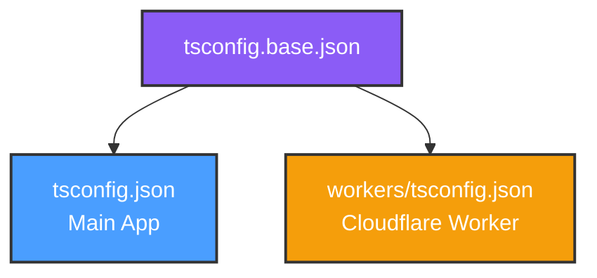
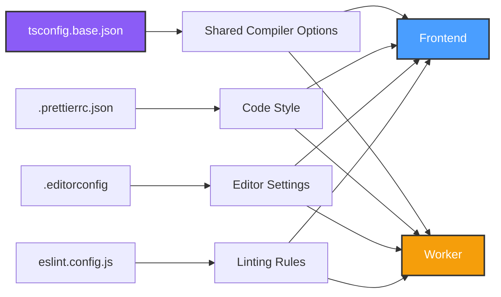
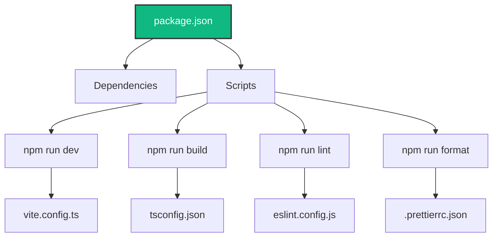

# HomeHub Configuration Guide

This document explains the configuration setup and synchronization across the HomeHub project.

## 📁 Configuration Files Overview

### TypeScript Configuration



#### `tsconfig.base.json`

**Purpose**: Shared TypeScript compiler options for consistency across the project.

**Key Settings**:

- Strict type checking enabled
- ES2022 target for modern JavaScript features
- Bundler module resolution
- Common linting rules

#### `tsconfig.json` (Main App)

**Purpose**: Frontend-specific TypeScript configuration.

**Extends**: `tsconfig.base.json`

**Key Features**:

- React JSX support (`"jsx": "react-jsx"`)
- Path aliases (`@/*` → `./src/*`)
- DOM types for browser APIs
- Project references to workers

#### `workers/tsconfig.json` (Worker)

**Purpose**: Backend-specific TypeScript configuration.

**Extends**: `../tsconfig.base.json`

**Key Features**:

- Cloudflare Workers types
- ES2022 for Worker runtime
- No DOM types (server-side only)
- Composite project for build optimization

---

### Code Quality Tools

#### ESLint (`eslint.config.js`)

**Purpose**: JavaScript/TypeScript linting for code quality.

**Features**:

- React Hooks rules enforcement
- TypeScript-specific rules
- Unused variable warnings
- React Fast Refresh compatibility

**Commands**:

```bash
npm run lint          # Check for issues
npm run lint:fix      # Auto-fix issues
```

#### Prettier (`.prettierrc.json`)

**Purpose**: Opinionated code formatter.

**Settings**:

- No semicolons (JavaScript style)
- Single quotes
- 100 character line width
- 2-space indentation
- Tailwind CSS class sorting (via plugin)

**Commands**:

```bash
npm run format        # Format all files
npm run format:check  # Check formatting
```

#### EditorConfig (`.editorconfig`)

**Purpose**: Cross-editor consistency for basic formatting.

**Features**:

- LF line endings (Unix-style)
- UTF-8 encoding
- 2-space indentation
- Trim trailing whitespace

---

### Environment Variables

#### Frontend (`.env`)

**Location**: Root directory
**Prefix Required**: `VITE_` (exposed to client)

```env
VITE_KV_API_URL=http://localhost:8787
VITE_KV_AUTH_TOKEN=your-secret-token
```

**Usage in Code**:

```typescript
import.meta.env.VITE_KV_API_URL
```

#### Worker (`workers/.dev.vars`)

**Location**: `workers/.dev.vars` (development only)
**Format**: Plain key=value (no prefix)

```env
AUTH_TOKEN=your-secret-token
ENVIRONMENT=development
```

**Usage in Code**:

```typescript
export default {
  async fetch(request: Request, env: WorkerEnv) {
    const token = env.AUTH_TOKEN
  },
}
```

**⚠️ Security Note**: Never commit `.env` or `.dev.vars` files. Use `.env.example` for templates.

---

### VS Code Integration

#### Settings (`.vscode/settings.json`)

**Purpose**: Shared workspace settings for consistent development experience.

**Key Features**:

- Format on save (Prettier)
- ESLint auto-fix on save
- TypeScript version pinned to workspace
- Tailwind CSS IntelliSense
- Path aliases for imports

#### Extensions (`.vscode/extensions.json`)

**Purpose**: Recommended extensions for optimal developer experience.

**Essential Extensions**:

- `dbaeumer.vscode-eslint` - ESLint integration
- `esbenp.prettier-vscode` - Prettier formatter
- `bradlc.vscode-tailwindcss` - Tailwind CSS IntelliSense
- `cloudflare.vscode-cloudflare-workers` - Worker debugging

---

## 🔄 Synchronization Strategy

### What's Synchronized?



### Why This Approach?

1. **Single Source of Truth**: `tsconfig.base.json` ensures TypeScript settings are consistent
2. **Environment-Specific Overrides**: Each project can override base settings when needed
3. **Automatic Formatting**: Prettier + EditorConfig ensure code style consistency
4. **Early Error Detection**: ESLint catches issues before runtime
5. **VS Code Integration**: Workspace settings work seamlessly with tools

---

## 🚀 Getting Started

### Initial Setup

1. **Install Dependencies**:

   ```bash
   npm install
   cd workers && npm install
   ```

2. **Copy Environment Files**:

   ```bash
   cp .env.example .env
   # Edit .env with your values
   ```

3. **Install VS Code Extensions**:
   - Open VS Code
   - Press `Ctrl+Shift+P` → "Extensions: Show Recommended Extensions"
   - Click "Install" on all recommended extensions

4. **Verify Setup**:

   ```bash
   npm run validate  # Runs type-check + lint + format:check
   ```

### Daily Workflow

```bash
# Start development servers
npm run dev                  # Frontend (port 5173)
npm run worker:dev          # Worker (port 8787)

# Before committing
npm run validate            # Check everything
npm run format              # Auto-fix formatting
npm run lint:fix            # Auto-fix lint issues

# Build for production
npm run build               # Frontend
npm run worker:deploy       # Worker
```

---

## 🔧 Customization

### Adding New Shared TypeScript Rules

Edit `tsconfig.base.json`:

```json
{
  "compilerOptions": {
    "newRule": true // Will apply to both projects
  }
}
```

### Project-Specific TypeScript Rules

Override in `tsconfig.json` or `workers/tsconfig.json`:

```json
{
  "extends": "./tsconfig.base.json",
  "compilerOptions": {
    "newRule": false // Override for this project only
  }
}
```

### Adding ESLint Rules

Edit `eslint.config.js`:

```javascript
rules: {
  'your-new-rule': 'warn',
}
```

### Changing Code Style

Edit `.prettierrc.json`:

```json
{
  "printWidth": 120, // Change line width
  "semi": true // Add semicolons
}
```

---

## 📊 Configuration Dependencies



---

## 🐛 Troubleshooting

### TypeScript Errors After Config Changes

```bash
# Clear build cache
rm -rf node_modules/.cache
rm -rf node_modules/.tmp
npm run type-check
```

### ESLint Not Auto-Fixing in VS Code

1. Check that `dbaeumer.vscode-eslint` extension is installed
2. Verify `.vscode/settings.json` has `"source.fixAll.eslint": "explicit"`
3. Reload VS Code: `Ctrl+Shift+P` → "Reload Window"

### Prettier Not Formatting

1. Check that `esbenp.prettier-vscode` extension is installed
2. Set as default formatter: `Ctrl+Shift+P` → "Format Document With..." → "Configure Default Formatter" → "Prettier"
3. Verify `.prettierrc.json` exists in project root

### Path Aliases Not Working

```bash
# Restart TypeScript server
# In VS Code: Ctrl+Shift+P → "TypeScript: Restart TS Server"
```

---

## 📚 Related Documentation

- [Architecture Overview](./ARCHITECTURE.md)
- [Cloudflare Deployment](./CLOUDFLARE_DEPLOYMENT.md)
- [Best Practices](./BEST_PRACTICES.md)
- [Security Guidelines](./SECURITY.md)
