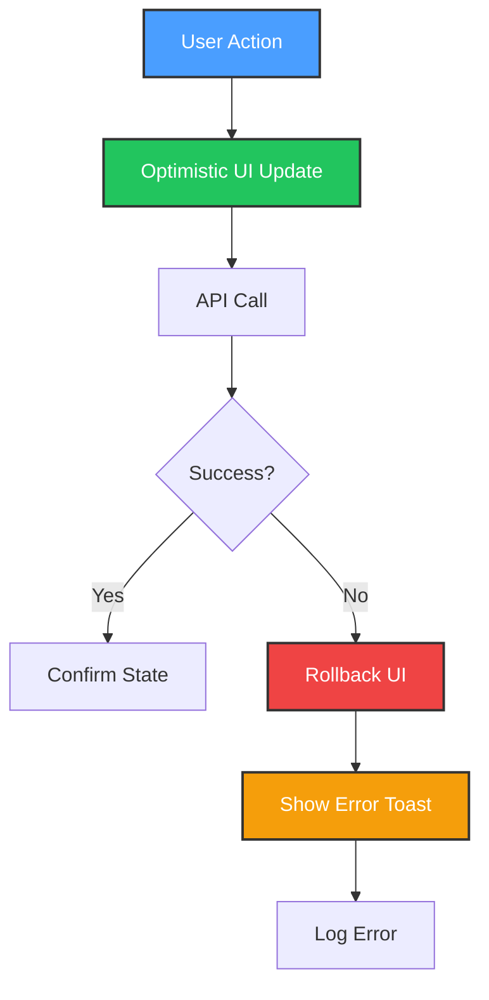

# Error Handling Patterns Guide

**Purpose**: Standardized error handling patterns for HomeHub across async operations, API calls, and device control.

**Last Updated**: October 16, 2025

---

## Table of Contents

- [Error Handling Philosophy](#error-handling-philosophy)
- [Try-Catch Patterns](#try-catch-patterns)
- [Error Boundaries](#error-boundaries)
- [API Error Handling](#api-error-handling)
- [Device Control Errors](#device-control-errors)
- [Rollback Strategies](#rollback-strategies)
- [User Feedback Patterns](#user-feedback-patterns)
- [Logging and Debugging](#logging-and-debugging)

---

## Error Handling Philosophy

### Core Principles

1. **Fail Gracefully**: Never crash the app - show helpful error messages
2. **User-First**: Tell users what went wrong in plain language
3. **Recoverable**: Provide retry mechanisms when possible
4. **Logged**: All errors logged to console in development
5. **Optimistic**: Update UI immediately, rollback on failure



---

## Try-Catch Patterns

### Pattern 1: Basic Try-Catch with Toast

✅ **CORRECT**: User-friendly error messages

```typescript
import { toast } from 'sonner'

const performAction = async () => {
  try {
    const result = await apiCall()
    toast.success('Action completed successfully')
    return result
  } catch (error) {
    // Log full error for debugging
    console.error('Action failed:', error)

    // Show user-friendly message
    toast.error('Failed to complete action. Please try again.')

    // Re-throw if caller needs to handle
    throw error
  }
}
```

❌ **WRONG**: Silent failures or exposing technical details

```typescript
// BAD - Silent failure
const performAction = async () => {
  try {
    await apiCall()
  } catch (error) {
    // Nothing happens - user doesn't know it failed!
  }
}

// BAD - Technical error messages
catch (error) {
  toast.error(error.message) // "TypeError: Cannot read property 'xyz' of undefined"
}
```

### Pattern 2: Typed Error Handling

```typescript
class DeviceControlError extends Error {
  constructor(
    message: string,
    public deviceId: string,
    public deviceName: string,
    public operation: string
  ) {
    super(message)
    this.name = 'DeviceControlError'
  }
}

const controlDevice = async (device: Device, enabled: boolean) => {
  try {
    await adapter.control(device.id, enabled)
  } catch (error) {
    throw new DeviceControlError(
      'Device control failed',
      device.id,
      device.name,
      enabled ? 'turn_on' : 'turn_off'
    )
  }
}

// Usage
try {
  await controlDevice(device, true)
} catch (error) {
  if (error instanceof DeviceControlError) {
    toast.error(`Failed to ${error.operation} ${error.deviceName}`)
  } else {
    toast.error('An unexpected error occurred')
  }
}
```

### Pattern 3: Error with Retry Logic

```typescript
const retryOperation = async <T>(
  operation: () => Promise<T>,
  maxRetries: number = 3,
  delayMs: number = 1000
): Promise<T> => {
  let lastError: Error

  for (let attempt = 1; attempt <= maxRetries; attempt++) {
    try {
      return await operation()
    } catch (error) {
      lastError = error as Error
      console.warn(`Attempt ${attempt}/${maxRetries} failed:`, error)

      if (attempt < maxRetries) {
        await new Promise(resolve => setTimeout(resolve, delayMs * attempt))
      }
    }
  }

  throw new Error(`Operation failed after ${maxRetries} attempts: ${lastError.message}`)
}

// Usage
try {
  const result = await retryOperation(
    () => HueBridgeAdapter.setLightState(bridgeId, lightId, { on: true }),
    3
  )
  toast.success('Light controlled successfully')
} catch (error) {
  toast.error('Failed to control light after multiple attempts')
}
```

---

## Error Boundaries

### Root-Level Error Boundary

**File**: `src/ErrorFallback.tsx` (already exists)

```typescript
import { useEffect } from 'react'
import type { FallbackProps } from 'react-error-boundary'
import { Button } from '@/components/ui/button'
import { Card } from '@/components/ui/card'

export function ErrorFallback({ error, resetErrorBoundary }: FallbackProps) {
  useEffect(() => {
    console.error('Error Boundary caught error:', error)
  }, [error])

  return (
    <div className="flex min-h-screen items-center justify-center p-4">
      <Card className="max-w-md p-6">
        <h2 className="text-xl font-bold text-red-600 mb-4">Something went wrong</h2>
        <p className="text-muted-foreground mb-4">
          The application encountered an error. This has been logged for investigation.
        </p>

        {process.env.NODE_ENV === 'development' && (
          <pre className="bg-muted p-4 rounded text-xs overflow-auto mb-4">
            {error.message}
          </pre>
        )}

        <div className="flex gap-2">
          <Button onClick={resetErrorBoundary}>Try Again</Button>
          <Button variant="outline" onClick={() => window.location.reload()}>
            Reload Page
          </Button>
        </div>
      </Card>
    </div>
  )
}
```

### Feature-Level Error Boundaries

```typescript
import { ErrorBoundary } from 'react-error-boundary'

export function Dashboard() {
  return (
    <ErrorBoundary
      FallbackComponent={DashboardErrorFallback}
      onReset={() => {
        // Reset component state
        window.location.href = '/dashboard'
      }}
      onError={(error) => {
        console.error('Dashboard error:', error)
        // Could send to error tracking service
      }}
    >
      <DashboardContent />
    </ErrorBoundary>
  )
}

function DashboardErrorFallback({ resetErrorBoundary }: FallbackProps) {
  return (
    <div className="p-4">
      <h3>Dashboard failed to load</h3>
      <Button onClick={resetErrorBoundary}>Retry</Button>
    </div>
  )
}
```

---

## API Error Handling

### Pattern 1: HTTP Status Code Handling

```typescript
const handleApiError = (response: Response, operation: string): never => {
  switch (response.status) {
    case 400:
      throw new Error(`Invalid request: ${operation}`)
    case 401:
      throw new Error('Authentication required')
    case 403:
      throw new Error('You do not have permission to perform this action')
    case 404:
      throw new Error('Resource not found')
    case 429:
      throw new Error('Too many requests. Please wait a moment.')
    case 500:
    case 502:
    case 503:
      throw new Error('Server error. Please try again later.')
    default:
      throw new Error(`Request failed: ${response.statusText}`)
  }
}

// Usage
const callApi = async (url: string) => {
  const response = await fetch(url)

  if (!response.ok) {
    handleApiError(response, 'fetch data')
  }

  return response.json()
}
```

### Pattern 2: Network Error Detection

```typescript
const isNetworkError = (error: unknown): boolean => {
  if (error instanceof TypeError) {
    return (
      error.message.includes('Failed to fetch') || error.message.includes('Network request failed')
    )
  }
  return false
}

const performNetworkOperation = async () => {
  try {
    await fetch(url)
  } catch (error) {
    if (isNetworkError(error)) {
      toast.error('Network error. Please check your connection.')
    } else {
      toast.error('An unexpected error occurred')
    }
  }
}
```

### Pattern 3: Timeout Handling

```typescript
const fetchWithTimeout = async (url: string, timeout: number = 5000): Promise<Response> => {
  const controller = new AbortController()
  const timeoutId = setTimeout(() => controller.abort(), timeout)

  try {
    const response = await fetch(url, { signal: controller.signal })
    clearTimeout(timeoutId)
    return response
  } catch (error) {
    clearTimeout(timeoutId)

    if (error.name === 'AbortError') {
      throw new Error('Request timed out. The device may be offline.')
    }
    throw error
  }
}

// Usage
try {
  const response = await fetchWithTimeout('http://192.168.1.100/status', 3000)
  const data = await response.json()
} catch (error) {
  if (error.message.includes('timed out')) {
    toast.error("Device not responding. Check if it's online.")
  } else {
    toast.error('Failed to communicate with device')
  }
}
```

---

## Device Control Errors

### Pattern 1: Protocol-Specific Error Handling

```typescript
const controlDevice = async (device: Device, enabled: boolean): Promise<void> => {
  // Validation errors
  if (!device.config?.baseUrl && device.protocol === 'http') {
    toast.error(`${device.name} is not configured correctly`)
    throw new Error('Device missing baseUrl configuration')
  }

  try {
    switch (device.protocol) {
      case 'hue':
        await controlHueDevice(device, enabled)
        break
      case 'http':
        await controlHttpDevice(device, enabled)
        break
      case 'mqtt':
        await controlMqttDevice(device, enabled)
        break
      default:
        throw new Error(`Unsupported protocol: ${device.protocol}`)
    }
  } catch (error) {
    // Protocol-specific error handling
    if (device.protocol === 'hue' && error.message.includes('unauthorized')) {
      toast.error('Hue bridge authentication expired. Please reconnect.')
    } else if (device.protocol === 'http' && error.message.includes('timeout')) {
      toast.error(`${device.name} is not responding. Is it powered on?`)
    } else {
      toast.error(`Failed to control ${device.name}`)
    }

    throw error
  }
}
```

### Pattern 2: Bulk Operation Error Aggregation

```typescript
interface BulkOperationResult {
  successful: string[] // Device IDs
  failed: Array<{ deviceId: string; error: string }>
}

const controlMultipleDevices = async (
  deviceIds: string[],
  enabled: boolean
): Promise<BulkOperationResult> => {
  const results = await Promise.allSettled(
    deviceIds.map(id => {
      const device = devices.find(d => d.id === id)
      return device ? controlDevice(device, enabled) : Promise.reject('Device not found')
    })
  )

  const successful: string[] = []
  const failed: Array<{ deviceId: string; error: string }> = []

  results.forEach((result, index) => {
    const deviceId = deviceIds[index]
    if (result.status === 'fulfilled') {
      successful.push(deviceId)
    } else {
      failed.push({ deviceId, error: result.reason.message })
    }
  })

  // Show summary toast
  if (failed.length === 0) {
    toast.success(`All ${successful.length} devices controlled successfully`)
  } else if (successful.length === 0) {
    toast.error(`Failed to control all ${failed.length} devices`)
  } else {
    toast.warning(
      `${successful.length} succeeded, ${failed.length} failed. Check logs for details.`
    )
  }

  return { successful, failed }
}
```

---

## Rollback Strategies

### Pattern 1: Optimistic Update with Rollback

```typescript
const toggleDevice = useCallback(
  async (deviceId: string) => {
    // 1. Save current state
    const previousDevices = devices

    // 2. Optimistic update
    setDevices(prev => prev.map(d => (d.id === deviceId ? { ...d, enabled: !d.enabled } : d)))

    try {
      // 3. Perform actual operation
      const device = devices.find(d => d.id === deviceId)
      if (!device) throw new Error('Device not found')

      await controlDevice(device, !device.enabled)
      toast.success(`${device.name} ${device.enabled ? 'off' : 'on'}`)
    } catch (error) {
      // 4. Rollback on failure
      setDevices(previousDevices)

      const device = devices.find(d => d.id === deviceId)
      toast.error(`Failed to control ${device?.name || 'device'}`)

      console.error('Device control error:', error)
    }
  },
  [devices, setDevices]
)
```

### Pattern 2: Transaction-Style Operations

```typescript
interface StateSnapshot<T> {
  timestamp: Date
  data: T
}

class StateManager<T> {
  private snapshots: StateSnapshot<T>[] = []

  createSnapshot(data: T): void {
    this.snapshots.push({ timestamp: new Date(), data })

    // Keep only last 10 snapshots
    if (this.snapshots.length > 10) {
      this.snapshots.shift()
    }
  }

  rollback(): T | null {
    const snapshot = this.snapshots.pop()
    return snapshot?.data || null
  }

  clear(): void {
    this.snapshots = []
  }
}

// Usage
const stateManager = new StateManager<Device[]>()

const performComplexOperation = async () => {
  stateManager.createSnapshot(devices)

  try {
    // Multi-step operation
    await step1()
    await step2()
    await step3()

    stateManager.clear() // Success, clear snapshots
  } catch (error) {
    const previousState = stateManager.rollback()
    if (previousState) {
      setDevices(previousState)
      toast.error('Operation failed and was rolled back')
    }
  }
}
```

---

## User Feedback Patterns

### Pattern 1: Toast Notifications

```typescript
import { toast } from 'sonner'

// Success
toast.success('Device turned on successfully')
toast.success('Scene activated', { description: 'All devices updated' })

// Error
toast.error('Failed to control device')
toast.error('Operation failed', {
  description: 'Please check your network connection',
  action: {
    label: 'Retry',
    onClick: () => retryOperation(),
  },
})

// Warning
toast.warning('Device battery low', { description: 'Replace batteries soon' })

// Info
toast.info('Automation triggered', { description: 'Good Morning scene activated' })

// Loading (dismissible manually)
const toastId = toast.loading('Discovering devices...')
// Later: toast.dismiss(toastId)
```

### Pattern 2: Inline Error States

```typescript
const [error, setError] = useState<string | null>(null)
const [isLoading, setIsLoading] = useState(false)

const performAction = async () => {
  setIsLoading(true)
  setError(null)

  try {
    await operation()
  } catch (err) {
    setError(err.message)
  } finally {
    setIsLoading(false)
  }
}

// Render
return (
  <div>
    {error && (
      <div className="bg-red-50 border border-red-200 text-red-800 px-4 py-3 rounded mb-4">
        <p className="font-medium">Error</p>
        <p className="text-sm">{error}</p>
      </div>
    )}

    <Button onClick={performAction} disabled={isLoading}>
      {isLoading ? 'Loading...' : 'Perform Action'}
    </Button>
  </div>
)
```

### Pattern 3: Error Messages with Actions

```typescript
const showErrorWithRetry = (operation: string, retryFn: () => void) => {
  toast.error(`Failed to ${operation}`, {
    description: 'Would you like to try again?',
    action: {
      label: 'Retry',
      onClick: retryFn,
    },
    duration: 10000, // Show longer for user to decide
  })
}

// Usage
try {
  await controlDevice(device, true)
} catch (error) {
  showErrorWithRetry('control device', () => controlDevice(device, true))
}
```

---

## Logging and Debugging

### Pattern 1: Development vs Production Logging

```typescript
const log = {
  error: (message: string, data?: any) => {
    console.error(`[ERROR] ${message}`, data)

    // In production, send to error tracking service
    if (import.meta.env.PROD) {
      // sendToErrorTracking(message, data)
    }
  },

  warn: (message: string, data?: any) => {
    console.warn(`[WARN] ${message}`, data)
  },

  info: (message: string, data?: any) => {
    if (import.meta.env.DEV) {
      console.info(`[INFO] ${message}`, data)
    }
  },

  debug: (message: string, data?: any) => {
    if (import.meta.env.DEV) {
      console.debug(`[DEBUG] ${message}`, data)
    }
  },
}

// Usage
try {
  await performOperation()
} catch (error) {
  log.error('Operation failed', { operation: 'controlDevice', error })
  toast.error('Operation failed')
}
```

### Pattern 2: Error Context

```typescript
interface ErrorContext {
  timestamp: Date
  component: string
  action: string
  user?: string
  deviceId?: string
  additionalData?: Record<string, any>
}

const logErrorWithContext = (error: Error, context: ErrorContext) => {
  console.error('Error occurred:', {
    message: error.message,
    stack: error.stack,
    ...context,
  })

  // In production, send to monitoring service
  if (import.meta.env.PROD) {
    // Sentry.captureException(error, { contexts: { custom: context } })
  }
}

// Usage
try {
  await HueBridgeAdapter.setLightState(bridgeId, lightId, { on: true })
} catch (error) {
  logErrorWithContext(error, {
    timestamp: new Date(),
    component: 'Dashboard',
    action: 'toggleDevice',
    deviceId: device.id,
    additionalData: { bridgeId, lightId },
  })

  toast.error('Failed to control light')
}
```

---

## Error Handling Checklist

Before deploying error-prone code, verify:

- [ ] All async operations have try-catch blocks
- [ ] User receives feedback (toast or inline error)
- [ ] Errors are logged to console in development
- [ ] Optimistic updates have rollback logic
- [ ] Network errors are handled gracefully
- [ ] Timeout errors show helpful messages
- [ ] Retry logic for transient failures
- [ ] Error boundaries catch render errors
- [ ] Production errors don't expose sensitive data
- [ ] Error messages are user-friendly

---

## Common Patterns Summary

```typescript
// 1. Basic error handling
try {
  await operation()
  toast.success('Success')
} catch (error) {
  console.error(error)
  toast.error('User-friendly message')
}

// 2. With rollback
const prev = state
setState(newState)
try {
  await operation()
} catch (error) {
  setState(prev)
  toast.error('Rolled back')
}

// 3. With retry
await retryOperation(() => operation(), 3)

// 4. Bulk operations
const results = await Promise.allSettled(operations)
// Handle individual successes/failures

// 5. Network timeout
await fetchWithTimeout(url, 5000)
```

---

**Note**: For specific device control error patterns, see `docs/guides/SERVICE_LAYER_ARCHITECTURE.md`.
