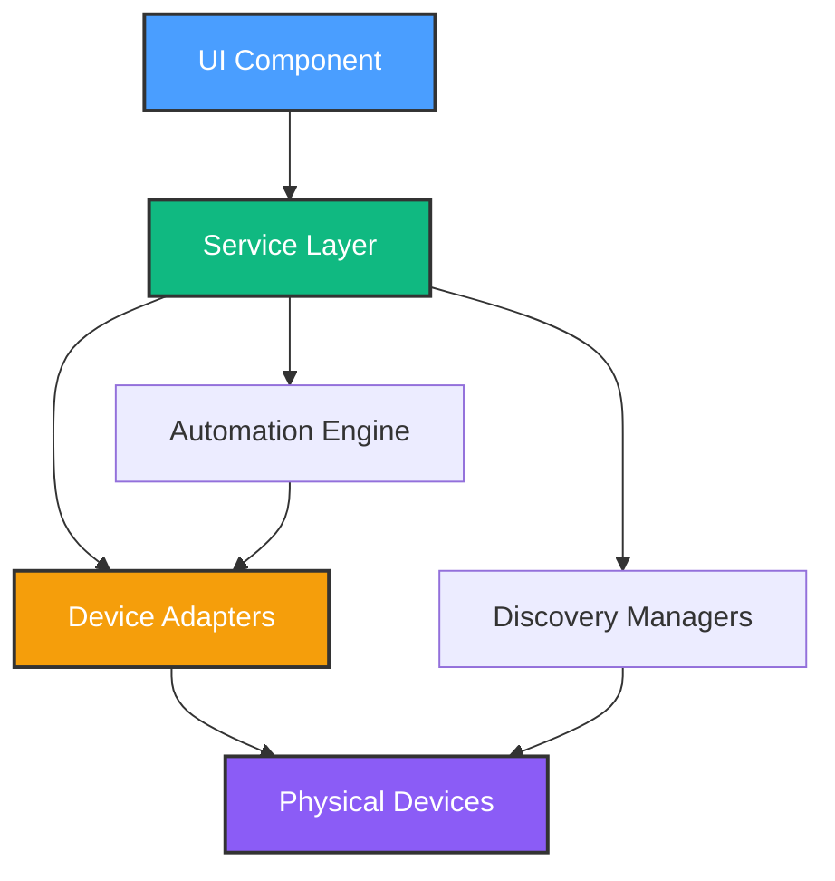

# Service Layer Architecture Guide

**Purpose**: Document the service layer patterns used in HomeHub for device discovery, control, and automation.

**Last Updated**: October 16, 2025

---

## Table of Contents

- [Overview](#overview)
- [Service Architecture](#service-architecture)
- [Device Discovery Services](#device-discovery-services)
- [Device Control Services](#device-control-services)
- [Automation Engine Services](#automation-engine-services)
- [Service Patterns](#service-patterns)
- [Adding New Services](#adding-new-services)

---

## Overview

HomeHub's service layer provides business logic separation from UI components. Services handle:

- **Device Discovery**: Finding devices on the network
- **Device Control**: Sending commands to devices via various protocols
- **Automation Execution**: Running time/condition-based rules
- **State Management**: Coordinating between adapters and UI



---

## Service Architecture

### Directory Structure

```
src/services/
├── discovery/              # Device discovery services
│   ├── HTTPScanner.ts     # HTTP/REST device scanner
│   ├── MQTTScanner.ts     # MQTT broker scanner (future)
│   ├── mDNSScanner.ts     # mDNS/Bonjour discovery (future)
│   └── DiscoveryManager.ts # Orchestrates all scanners
│
├── devices/                # Device control adapters
│   ├── HueBridgeAdapter.ts # Philips Hue bridge API
│   ├── HTTPDeviceAdapter.ts # Generic HTTP devices
│   ├── MQTTAdapter.ts      # MQTT pub/sub (future)
│   └── DeviceManager.ts    # Device control routing
│
├── automation/             # Automation execution engine
│   ├── Scheduler.ts        # Time-based triggers
│   ├── ConditionEvaluator.ts # Threshold monitoring
│   ├── ActionExecutor.ts   # Device action execution
│   ├── FlowInterpreter.ts  # Visual flow execution
│   └── GeofenceMonitor.ts  # Location-based triggers
│
└── index.ts                # Public API exports
```

### Service Principles

1. **Single Responsibility**: Each service has one clear purpose
2. **Stateless**: Services don't store state, they operate on passed data
3. **Async/Await**: All I/O operations use promises
4. **Error Handling**: Services throw descriptive errors, callers handle them
5. **Type Safety**: All parameters and returns are strongly typed

---

## Device Discovery Services

### HTTPScanner

**Purpose**: Scan IP ranges for HTTP-based smart devices (Shelly, TP-Link, Hue bridges).

**Location**: `src/services/discovery/HTTPScanner.ts`

```typescript
import type { Device } from '@/types'

export class HTTPScanner {
  /**
   * Scan an IP range for HTTP devices
   * @param startIp - Starting IP (e.g., "192.168.1.1")
   * @param endIp - Ending IP (e.g., "192.168.1.254")
   * @param timeout - Request timeout in ms (default: 2000)
   * @returns Array of discovered devices
   */
  static async scan(startIp: string, endIp: string, timeout: number = 2000): Promise<Device[]> {
    const devices: Device[] = []
    const ips = this.generateIPRange(startIp, endIp)

    // Scan with concurrency limit (10 simultaneous requests)
    const results = await Promise.allSettled(ips.map(ip => this.probeIP(ip, timeout)))

    results.forEach(result => {
      if (result.status === 'fulfilled' && result.value) {
        devices.push(result.value)
      }
    })

    return devices
  }

  /**
   * Probe a single IP for known device patterns
   * @private
   */
  private static async probeIP(ip: string, timeout: number): Promise<Device | null> {
    // Try known endpoints: /status, /api/info, /description.xml
    const endpoints = ['/status', '/api/info', '/description.xml']

    for (const endpoint of endpoints) {
      try {
        const response = await this.fetchWithTimeout(`http://${ip}${endpoint}`, timeout)

        if (response.ok) {
          const data = await response.json()
          return this.parseDeviceResponse(ip, endpoint, data)
        }
      } catch {
        // Ignore and try next endpoint
      }
    }

    return null
  }

  /**
   * Parse device response into Device interface
   * @private
   */
  private static parseDeviceResponse(ip: string, endpoint: string, data: any): Device | null {
    // Shelly device pattern
    if (data.type && data.type.startsWith('SHSW')) {
      return {
        id: `shelly-${ip.replace(/\./g, '-')}`,
        name: data.name || `Shelly Device (${ip})`,
        type: 'light',
        room: 'Unknown',
        status: 'online',
        enabled: data.ison || false,
        protocol: 'http',
        config: { baseUrl: `http://${ip}` },
      }
    }

    // Philips Hue bridge pattern
    if (data.bridgeid || data.modelid === 'BSB002') {
      return {
        id: `hue-bridge-${data.bridgeid}`,
        name: 'Philips Hue Bridge',
        type: 'light',
        room: 'Hub',
        status: 'online',
        enabled: true,
        protocol: 'hue',
        config: {
          baseUrl: `http://${ip}`,
          bridgeId: data.bridgeid,
        },
      }
    }

    // TP-Link device pattern
    if (data.system && data.system.get_sysinfo) {
      const sysinfo = data.system.get_sysinfo
      return {
        id: `tplink-${sysinfo.deviceId}`,
        name: sysinfo.alias || 'TP-Link Device',
        type: 'light',
        room: 'Unknown',
        status: 'online',
        enabled: sysinfo.relay_state === 1,
        protocol: 'http',
        config: { baseUrl: `http://${ip}` },
      }
    }

    return null
  }

  /**
   * Generate array of IPs between start and end
   * @private
   */
  private static generateIPRange(startIp: string, endIp: string): string[] {
    const start = this.ipToNumber(startIp)
    const end = this.ipToNumber(endIp)
    const ips: string[] = []

    for (let i = start; i <= end; i++) {
      ips.push(this.numberToIp(i))
    }

    return ips
  }

  private static ipToNumber(ip: string): number {
    return ip.split('.').reduce((acc, octet) => (acc << 8) + parseInt(octet, 10), 0)
  }

  private static numberToIp(num: number): string {
    return [(num >>> 24) & 0xff, (num >>> 16) & 0xff, (num >>> 8) & 0xff, num & 0xff].join('.')
  }

  private static async fetchWithTimeout(url: string, timeout: number): Promise<Response> {
    const controller = new AbortController()
    const timeoutId = setTimeout(() => controller.abort(), timeout)

    try {
      return await fetch(url, { signal: controller.signal })
    } finally {
      clearTimeout(timeoutId)
    }
  }
}
```

### DiscoveryManager

**Purpose**: Orchestrate multiple discovery protocols and aggregate results.

**Location**: `src/services/discovery/DiscoveryManager.ts`

```typescript
import type { Device } from '@/types'
import { HTTPScanner } from './HTTPScanner'
// import { MQTTScanner } from './MQTTScanner' // Future
// import { mDNSScanner } from './mDNSScanner' // Future

export class DiscoveryManager {
  /**
   * Run all discovery protocols in parallel
   * @param options - Discovery configuration
   * @returns Combined array of unique devices
   */
  static async discoverAll(options: {
    http?: { startIp: string; endIp: string; timeout?: number }
    mqtt?: { brokerUrl: string }
    mdns?: { serviceTypes: string[] }
  }): Promise<Device[]> {
    const promises: Promise<Device[]>[] = []

    // HTTP discovery
    if (options.http) {
      promises.push(
        HTTPScanner.scan(options.http.startIp, options.http.endIp, options.http.timeout)
      )
    }

    // MQTT discovery (future)
    // if (options.mqtt) {
    //   promises.push(MQTTScanner.scan(options.mqtt.brokerUrl))
    // }

    // mDNS discovery (future)
    // if (options.mdns) {
    //   promises.push(mDNSScanner.scan(options.mdns.serviceTypes))
    // }

    const results = await Promise.allSettled(promises)
    const devices: Device[] = []

    results.forEach(result => {
      if (result.status === 'fulfilled') {
        devices.push(...result.value)
      }
    })

    // Deduplicate by ID
    return this.deduplicateDevices(devices)
  }

  /**
   * Remove duplicate devices based on ID
   * @private
   */
  private static deduplicateDevices(devices: Device[]): Device[] {
    const seen = new Set<string>()
    return devices.filter(device => {
      if (seen.has(device.id)) return false
      seen.add(device.id)
      return true
    })
  }
}
```

**Usage Example**:

```typescript
import { DiscoveryManager } from '@/services/discovery/DiscoveryManager'

// Discover all devices on local network
const devices = await DiscoveryManager.discoverAll({
  http: {
    startIp: '192.168.1.1',
    endIp: '192.168.1.254',
    timeout: 2000,
  },
})

console.log(`Found ${devices.length} devices`)
```

---

## Device Control Services

### HueBridgeAdapter

**Purpose**: Control Philips Hue lights via the Hue Bridge API.

**Location**: `src/services/devices/HueBridgeAdapter.ts`

```typescript
import type { Device } from '@/types'

/**
 * Philips Hue Bridge API adapter
 * Docs: https://developers.meethue.com/develop/hue-api/
 */
export class HueBridgeAdapter {
  private static bridges = new Map<string, { baseUrl: string; username: string }>()

  /**
   * Register a Hue Bridge for use
   * @param bridgeId - Unique bridge identifier
   * @param baseUrl - Bridge IP (e.g., "http://192.168.1.2")
   * @param username - API username (created via pairing button)
   */
  static registerBridge(bridgeId: string, baseUrl: string, username: string) {
    this.bridges.set(bridgeId, { baseUrl, username })
  }

  /**
   * Set light state (on/off, brightness, color)
   * @param bridgeId - Bridge identifier
   * @param lightId - Light number (1-based)
   * @param state - Desired state changes
   */
  static async setLightState(
    bridgeId: string,
    lightId: number | string,
    state: {
      on?: boolean
      bri?: number // 0-254
      hue?: number // 0-65535
      sat?: number // 0-254
      ct?: number // 153-500 (mireds)
    }
  ): Promise<void> {
    const bridge = this.bridges.get(bridgeId)
    if (!bridge) {
      throw new Error(`Bridge ${bridgeId} not registered`)
    }

    const url = `${bridge.baseUrl}/api/${bridge.username}/lights/${lightId}/state`
    const response = await fetch(url, {
      method: 'PUT',
      headers: { 'Content-Type': 'application/json' },
      body: JSON.stringify(state),
    })

    if (!response.ok) {
      throw new Error(`Hue API error: ${response.statusText}`)
    }

    const data = await response.json()

    // Check for Hue API errors
    if (data[0]?.error) {
      throw new Error(`Hue API error: ${data[0].error.description}`)
    }
  }

  /**
   * Get light state
   * @param bridgeId - Bridge identifier
   * @param lightId - Light number
   */
  static async getLightState(
    bridgeId: string,
    lightId: number | string
  ): Promise<{
    on: boolean
    bri: number
    hue?: number
    sat?: number
    ct?: number
  }> {
    const bridge = this.bridges.get(bridgeId)
    if (!bridge) {
      throw new Error(`Bridge ${bridgeId} not registered`)
    }

    const url = `${bridge.baseUrl}/api/${bridge.username}/lights/${lightId}`
    const response = await fetch(url)

    if (!response.ok) {
      throw new Error(`Hue API error: ${response.statusText}`)
    }

    const data = await response.json()
    return data.state
  }

  /**
   * Get all lights on a bridge
   * @param bridgeId - Bridge identifier
   */
  static async getAllLights(bridgeId: string): Promise<Device[]> {
    const bridge = this.bridges.get(bridgeId)
    if (!bridge) {
      throw new Error(`Bridge ${bridgeId} not registered`)
    }

    const url = `${bridge.baseUrl}/api/${bridge.username}/lights`
    const response = await fetch(url)

    if (!response.ok) {
      throw new Error(`Hue API error: ${response.statusText}`)
    }

    const lights = await response.json()
    const devices: Device[] = []

    for (const [lightId, light] of Object.entries(lights as any)) {
      devices.push({
        id: `hue-${bridgeId}-${lightId}`,
        name: light.name,
        type: 'light',
        room: 'Unknown',
        status: light.state.reachable ? 'online' : 'offline',
        enabled: light.state.on,
        value: Math.round((light.state.bri / 254) * 100), // Convert to percentage
        unit: '%',
        protocol: 'hue',
        config: {
          bridgeId,
          lightId: parseInt(lightId, 10),
          baseUrl: bridge.baseUrl,
        },
      })
    }

    return devices
  }
}
```

**Usage Example**:

```typescript
import { HueBridgeAdapter } from '@/services/devices/HueBridgeAdapter'

// Register bridge (one-time setup)
HueBridgeAdapter.registerBridge('001788FFFE123456', 'http://192.168.1.2', 'your-username-here')

// Turn on light #1 at 50% brightness
await HueBridgeAdapter.setLightState('001788FFFE123456', 1, {
  on: true,
  bri: 127, // 50% of 254
})

// Get all lights
const devices = await HueBridgeAdapter.getAllLights('001788FFFE123456')
```

---

## Automation Engine Services

### Scheduler

**Purpose**: Execute time-based automation triggers.

**Location**: `src/services/automation/Scheduler.ts`

```typescript
import type { Automation } from '@/types'

export class Scheduler {
  private static intervals = new Map<string, NodeJS.Timeout>()
  private static callbacks = new Map<string, () => void>()

  /**
   * Start scheduler for an automation
   * @param automation - Automation with time trigger
   * @param callback - Function to execute when triggered
   */
  static start(automation: Automation, callback: () => void): void {
    if (!automation.trigger.time) {
      throw new Error('Automation must have time trigger')
    }

    // Store callback
    this.callbacks.set(automation.id, callback)

    // Calculate next execution time
    const nextRun = this.calculateNextRun(automation.trigger.time, automation.trigger.days)

    const delay = nextRun.getTime() - Date.now()

    // Schedule execution
    const timeoutId = setTimeout(() => {
      this.execute(automation.id)
      // Reschedule for next day
      this.start(automation, callback)
    }, delay)

    this.intervals.set(automation.id, timeoutId)
  }

  /**
   * Stop scheduler for an automation
   * @param automationId - Automation ID to stop
   */
  static stop(automationId: string): void {
    const timeoutId = this.intervals.get(automationId)
    if (timeoutId) {
      clearTimeout(timeoutId)
      this.intervals.delete(automationId)
    }
    this.callbacks.delete(automationId)
  }

  /**
   * Execute automation callback
   * @private
   */
  private static execute(automationId: string): void {
    const callback = this.callbacks.get(automationId)
    if (callback) {
      try {
        callback()
      } catch (error) {
        console.error(`Scheduler execution error for ${automationId}:`, error)
      }
    }
  }

  /**
   * Calculate next execution time
   * @private
   */
  private static calculateNextRun(time: string, days?: string[]): Date {
    const [hours, minutes] = time.split(':').map(Number)
    const now = new Date()
    const next = new Date()

    next.setHours(hours, minutes, 0, 0)

    // If time has passed today, move to tomorrow
    if (next <= now) {
      next.setDate(next.getDate() + 1)
    }

    // If specific days are set, find next matching day
    if (days && days.length > 0) {
      while (!this.isDayMatch(next, days)) {
        next.setDate(next.getDate() + 1)
      }
    }

    return next
  }

  private static isDayMatch(date: Date, days: string[]): boolean {
    const dayNames = ['sunday', 'monday', 'tuesday', 'wednesday', 'thursday', 'friday', 'saturday']
    const dayName = dayNames[date.getDay()]
    return days.includes(dayName)
  }
}
```

**Usage Example**:

```typescript
import { Scheduler } from '@/services/automation/Scheduler'

// Start automation that runs at 7:00 AM on weekdays
Scheduler.start(automation, async () => {
  console.log('Good morning! Executing automation...')
  // Execute automation actions
  await executeAutomationActions(automation)
})

// Stop automation
Scheduler.stop(automation.id)
```

---

## Service Patterns

### Pattern 1: Singleton Service Classes

Services use static methods (singleton pattern) to maintain shared state and configuration.

```typescript
export class ServiceName {
  private static config = new Map<string, any>()

  static initialize(config: any) {
    this.config.set('key', config)
  }

  static async operation(): Promise<void> {
    // Use this.config
  }
}
```

### Pattern 2: Async Error Handling

Services throw errors, components catch and handle them.

```typescript
// Service
export class DeviceAdapter {
  static async control(device: Device): Promise<void> {
    if (!device.config?.baseUrl) {
      throw new Error('Device missing configuration')
    }
    // Perform operation
  }
}

// Component
try {
  await DeviceAdapter.control(device)
  toast.success('Device controlled successfully')
} catch (error) {
  toast.error(`Failed to control device: ${error.message}`)
}
```

### Pattern 3: Type-Safe Service APIs

All service methods have explicit parameter and return types.

```typescript
// ✅ GOOD: Type-safe service
static async scan(startIp: string, endIp: string): Promise<Device[]> {
  // Implementation
}

// ❌ BAD: Untyped service
static async scan(startIp, endIp) {
  // Implementation
}
```

---

## Adding New Services

### Step 1: Create Service File

```bash
# For device adapter
src/services/devices/MyDeviceAdapter.ts

# For discovery scanner
src/services/discovery/MyScanner.ts

# For automation component
src/services/automation/MyExecutor.ts
```

### Step 2: Implement Service Class

```typescript
import type { Device } from '@/types'

/**
 * Description of what this service does
 */
export class MyDeviceAdapter {
  /**
   * Initialize the adapter
   * @param config - Configuration object
   */
  static initialize(config: any): void {
    // Setup code
  }

  /**
   * Main operation
   * @param device - Device to control
   * @param action - Action to perform
   */
  static async control(device: Device, action: string): Promise<void> {
    // Validation
    if (!device.config?.requiredField) {
      throw new Error('Device missing required configuration')
    }

    // Perform operation
    try {
      await fetch(/* ... */)
    } catch (error) {
      throw new Error(`Operation failed: ${error.message}`)
    }
  }
}
```

### Step 3: Export from index.ts

```typescript
// src/services/index.ts
export { MyDeviceAdapter } from './devices/MyDeviceAdapter'
```

### Step 4: Write Tests

```typescript
// src/services/devices/MyDeviceAdapter.test.ts
import { describe, it, expect } from 'vitest'
import { MyDeviceAdapter } from './MyDeviceAdapter'

describe('MyDeviceAdapter', () => {
  it('should control device', async () => {
    const device = { id: '1', config: { requiredField: 'value' } }
    await expect(MyDeviceAdapter.control(device, 'on')).resolves.not.toThrow()
  })

  it('should throw on missing config', async () => {
    const device = { id: '1', config: {} }
    await expect(MyDeviceAdapter.control(device, 'on')).rejects.toThrow()
  })
})
```

---

**Note**: For complete automation engine documentation, see `docs/development/AUTOMATION_ENGINE_COMPLETE.md`.
