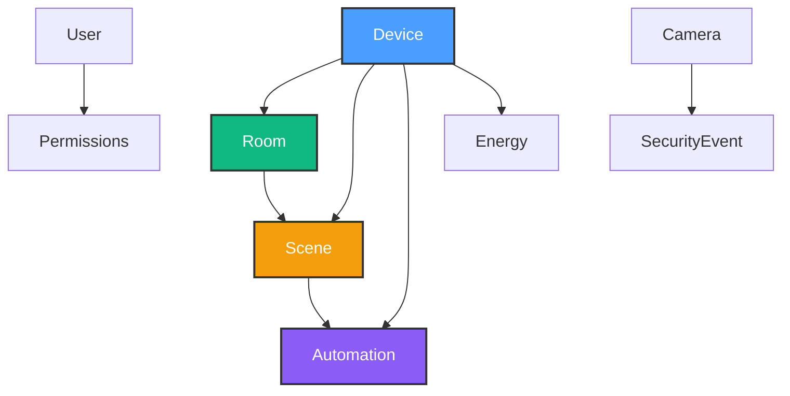

# HomeHub TypeScript API Reference

**Purpose**: Centralized reference for all TypeScript types, interfaces, and their relationships. This document helps Copilot understand the type system and generate correct code.

**Last Updated**: October 16, 2025

---

## Table of Contents

- [Core Types Overview](#core-types-overview)
- [Device Types](#device-types)
- [Room Types](#room-types)
- [Scene Types](#scene-types)
- [Automation Types](#automation-types)
- [Security Types](#security-types)
- [Energy Types](#energy-types)
- [User Types](#user-types)
- [Type Relationships](#type-relationships)
- [Usage Patterns](#usage-patterns)

---

## Core Types Overview



---

## Device Types

### Device Interface

**Location**: `src/types/device.types.ts`

```typescript
/**
 * Core device entity representing any smart home device
 * Used by: Dashboard, Rooms, DeviceMonitor, Automations
 */
export interface Device {
  /** Unique identifier (UUID) */
  id: string

  /** Display name shown in UI */
  name: string

  /** Device category for UI grouping and icon selection */
  type: DeviceType

  /** Room association for organization */
  room: string

  /** Current connection status */
  status: DeviceStatus

  /** Power state (on/off) */
  enabled: boolean

  /** Communication protocol (determines control adapter) */
  protocol: DeviceProtocol

  /** Current value (brightness, temperature, etc.) */
  value?: number

  /** Unit of measurement for value */
  unit?: string

  /** Last successful communication timestamp */
  lastSeen?: Date

  /** Battery percentage (0-100) for battery-powered devices */
  batteryLevel?: number

  /** WiFi/connectivity strength (0-100) */
  signalStrength?: number

  /** User-favorited for quick access */
  isFavorite?: boolean

  /** Protocol-specific configuration */
  config?: {
    /** HTTP adapter: base URL */
    baseUrl?: string
    /** Hue adapter: bridge ID + light number */
    bridgeId?: string
    lightId?: number | string
  }
}
```

### Device Type Enums

```typescript
/**
 * Device categories
 * Used for: Icon selection, filtering, UI grouping
 */
export type DeviceType = 'light' | 'thermostat' | 'security' | 'sensor'

/**
 * Connection status states
 * Determines badge color: online=green, offline=red, warning=yellow, error=red
 */
export type DeviceStatus = 'online' | 'offline' | 'warning' | 'error'

/**
 * Communication protocols
 * Determines which adapter to use in src/services/devices/
 */
export type DeviceProtocol = 'mqtt' | 'http' | 'hue'
```

### Device Alert Interface

```typescript
/**
 * Device health alerts for monitoring
 * Used by: DeviceMonitor component
 */
export interface DeviceAlert {
  id: string
  deviceId: string
  deviceName: string
  type: AlertType
  severity: AlertSeverity
  message: string
  timestamp: Date
  acknowledged: boolean
}

export type AlertType = 'offline' | 'low-battery' | 'weak-signal' | 'error' | 'maintenance'
export type AlertSeverity = 'low' | 'medium' | 'high' | 'critical'
```

---

## Room Types

**Location**: `src/types/room.types.ts`

```typescript
/**
 * Physical room/zone for device organization
 * Used by: Rooms component, device assignment, filtering
 */
export interface Room {
  /** Unique identifier */
  id: string

  /** Display name */
  name: string

  /** Lucide icon name (e.g., "home", "bed", "utensils") */
  icon: string

  /** Device IDs belonging to this room */
  deviceIds: string[]

  /** Optional theme color (OKLCH format) */
  color?: string

  /** Display order for drag-and-drop reordering */
  order?: number
}
```

**KV Store Key**: `"rooms"` - Array of all rooms

---

## Scene Types

**Location**: `src/types/scene.types.ts`

```typescript
/**
 * Predefined device state combinations
 * Used by: Scenes component, Dashboard quick actions
 */
export interface Scene {
  /** Unique identifier */
  id: string

  /** Display name */
  name: string

  /** Lucide icon name */
  icon: string

  /** Optional description for UI tooltips */
  description?: string

  /** Target device states to apply */
  deviceStates: Array<{
    deviceId: string
    enabled: boolean
    value?: number
  }>

  /** Scene availability toggle */
  enabled: boolean

  /** Last activation timestamp */
  lastActivated?: Date
}
```

**KV Store Keys**:

- `"scenes"` - Array of scene definitions
- `"active-scene"` - Currently active scene ID (string | null)

---

## Automation Types

**Location**: `src/types/automation.types.ts`

### Automation Interface

```typescript
/**
 * Time/condition-based automation rule
 * Used by: Automations component, automation engine services
 */
export interface Automation {
  /** Unique identifier */
  id: string

  /** Display name */
  name: string

  /** Master enable/disable switch */
  enabled: boolean

  /** Trigger configuration */
  trigger: AutomationTrigger

  /** Actions to execute when triggered */
  actions: AutomationAction[]

  /** Last execution timestamp */
  lastRun?: Date

  /** Total execution count */
  runCount?: number
}
```

### Trigger Types

```typescript
/**
 * Automation trigger configuration
 * Type determines which fields are required
 */
export interface AutomationTrigger {
  /** Trigger type determines behavior */
  type: TriggerType

  // Time-based trigger
  time?: string // "HH:MM" format
  days?: string[] // ["monday", "tuesday", ...]

  // Condition trigger (threshold monitoring)
  deviceId?: string
  operator?: ComparisonOperator
  threshold?: number

  // Geofence trigger
  location?: {
    lat: number
    lng: number
    radius: number // meters
  }
}

export type TriggerType = 'time' | 'condition' | 'geofence' | 'device-state'
export type ComparisonOperator = '<' | '>' | '==' | '!='
```

### Action Types

```typescript
/**
 * Automation action to execute
 */
export interface AutomationAction {
  /** Target device ID */
  deviceId: string

  /** Action type */
  actionType: 'turn_on' | 'turn_off' | 'toggle' | 'set_brightness' | 'set_color' | 'set_temperature'

  /** Target value (for brightness, color, temperature) */
  value?: number

  /** Delay before execution (milliseconds) */
  delay?: number
}
```

**KV Store Key**: `"automations"` - Array of automation rules

---

## Security Types

**Location**: `src/types/security.types.ts`

### Camera Interface

```typescript
/**
 * Security camera definition
 * Used by: Security component, camera modals
 */
export interface Camera {
  /** Unique identifier */
  id: string

  /** Display name */
  name: string

  /** Physical location */
  location: string

  /** Current status */
  status: 'recording' | 'idle' | 'offline'

  /** Recording enabled/disabled */
  recordingEnabled: boolean

  /** Motion detection enabled */
  motionDetection: boolean

  /** Night vision enabled */
  nightVision: boolean

  /** Last motion event timestamp */
  lastMotion?: Date

  /** Live stream URL (DASH/HLS) */
  streamUrl?: string

  /** Latest snapshot URL */
  snapshotUrl?: string
}
```

### Security Event Interface

```typescript
/**
 * Security event/alert
 * Used by: Security component, notifications
 */
export interface SecurityEvent {
  id: string
  type: 'motion' | 'door-open' | 'alarm' | 'camera-offline'
  severity: 'low' | 'medium' | 'high' | 'critical'
  message: string
  timestamp: Date
  acknowledged: boolean
  cameraId?: string
}
```

**KV Store Keys**:

- `"security-cameras"` - Array of cameras (Arlo integration)
- `"security-events"` - Array of events
- `"security-armed"` - Boolean system arm state

---

## Energy Types

**Location**: `src/types/energy.types.ts`

### Energy Reading

```typescript
/**
 * Power consumption reading
 * Used by: Energy component, analytics
 */
export interface EnergyReading {
  timestamp: Date
  power: number // Watts
  energy: number // kWh
  cost: number // USD
}
```

### Device Energy Data

```typescript
/**
 * Energy consumption for a specific device
 */
export interface DeviceEnergyData {
  deviceId: string
  deviceName: string
  readings: EnergyReading[]
  totalEnergy: number // kWh
  totalCost: number // USD
  averagePower: number // Watts
  peakPower: number // Watts
}
```

### Energy Settings

```typescript
/**
 * Energy monitoring configuration
 */
export interface EnergySettings {
  /** Electricity rate ($/kWh) */
  electricityRate: number

  /** Time-of-use pricing enabled */
  timeOfUsePricing: boolean

  /** Peak rate hours */
  peakHours?: Array<{ start: string; end: string }>

  /** Alert threshold (kWh/day) */
  alertThreshold?: number
}
```

**KV Store Keys**:

- `"energy-settings"` - Configuration
- `"energy-data"` - Historical readings

---

## User Types

**Location**: `src/types/user.types.ts`

```typescript
/**
 * User account and permissions
 * Used by: Users component, access control (future Phase 6.2+)
 */
export interface User {
  id: string
  name: string
  email: string
  role: 'admin' | 'member' | 'guest'
  permissions: {
    canEditDevices: boolean
    canCreateScenes: boolean
    canManageUsers: boolean
    canViewSecurity: boolean
  }
  avatar?: string
  lastActive?: Date
}
```

**KV Store Key**: `"home-users"` - Array of users

---

## Type Relationships

### Device → Room → Scene → Automation

```typescript
// Example: Getting all devices in a room
const room = rooms.find(r => r.id === roomId)
const roomDevices = devices.filter(d => room.deviceIds.includes(d.id))

// Example: Applying a scene
const scene = scenes.find(s => s.id === sceneId)
scene.deviceStates.forEach(state => {
  const device = devices.find(d => d.id === state.deviceId)
  // Update device.enabled and device.value
})

// Example: Automation action execution
const automation = automations.find(a => a.id === automationId)
automation.actions.forEach(action => {
  const device = devices.find(d => d.id === action.deviceId)
  // Execute action on device
})
```

---

## Usage Patterns

### Pattern 1: Device State Updates

```typescript
import { useKV } from '@/hooks/use-kv'
import { MOCK_DEVICES } from '@/constants'
import type { Device } from '@/types'

const [devices, setDevices] = useKV<Device[]>('devices', MOCK_DEVICES)

// Update single device (correct pattern)
const updateDevice = (id: string, updates: Partial<Device>) => {
  setDevices(prev => prev.map(d => (d.id === id ? { ...d, ...updates } : d)))
}

// Toggle device (common pattern)
const toggleDevice = (id: string) => {
  setDevices(prev => prev.map(d => (d.id === id ? { ...d, enabled: !d.enabled } : d)))
}
```

### Pattern 2: Room Device Filtering

```typescript
import type { Device, Room } from '@/types'

// Get devices for a specific room
const getRoomDevices = (room: Room, devices: Device[]): Device[] => {
  return devices.filter(d => room.deviceIds.includes(d.id))
}

// Get room statistics
const getRoomStats = (room: Room, devices: Device[]) => {
  const roomDevices = getRoomDevices(room, devices)
  return {
    total: roomDevices.length,
    online: roomDevices.filter(d => d.status === 'online').length,
    enabled: roomDevices.filter(d => d.enabled).length,
  }
}
```

### Pattern 3: Scene Activation

```typescript
import type { Scene, Device } from '@/types'

const activateScene = async (scene: Scene, setDevices: Function) => {
  // Update all devices in scene
  setDevices((prev: Device[]) =>
    prev.map(device => {
      const sceneState = scene.deviceStates.find(s => s.deviceId === device.id)
      if (!sceneState) return device

      return {
        ...device,
        enabled: sceneState.enabled,
        value: sceneState.value ?? device.value,
      }
    })
  )

  // Update scene metadata
  setScenes((prev: Scene[]) =>
    prev.map(s => (s.id === scene.id ? { ...s, lastActivated: new Date() } : s))
  )
}
```

### Pattern 4: Type Guards

```typescript
import type { Device, DeviceType } from '@/types'

// Type guard for light devices
const isLight = (device: Device): boolean => {
  return device.type === 'light'
}

// Type guard for battery-powered devices
const hasBattery = (device: Device): device is Device & { batteryLevel: number } => {
  return device.batteryLevel !== undefined && device.batteryLevel !== null
}

// Usage
const device = devices.find(d => d.id === id)
if (device && hasBattery(device)) {
  console.log(`Battery: ${device.batteryLevel}%`)
}
```

### Pattern 5: Protocol-Specific Handling

```typescript
import type { Device, DeviceProtocol } from '@/types'
import { HueBridgeAdapter } from '@/services/devices/HueBridgeAdapter'
import { HTTPDeviceAdapter } from '@/services/devices/HTTPDeviceAdapter'

const controlDevice = async (device: Device, enabled: boolean) => {
  switch (device.protocol) {
    case 'hue':
      if (!device.config?.bridgeId || !device.config?.lightId) {
        throw new Error('Hue device missing bridge configuration')
      }
      await HueBridgeAdapter.setLightState(device.config.bridgeId, device.config.lightId, {
        on: enabled,
      })
      break

    case 'http':
      if (!device.config?.baseUrl) {
        throw new Error('HTTP device missing baseUrl')
      }
      await HTTPDeviceAdapter.control(device.config.baseUrl, {
        action: enabled ? 'on' : 'off',
      })
      break

    case 'mqtt':
      // MQTT implementation
      break

    default:
      throw new Error(`Unknown protocol: ${device.protocol}`)
  }
}
```

---

## Import Patterns

### Correct Import Structure

```typescript
// 1. React imports
import { useState, useCallback, useEffect } from 'react'

// 2. Type imports
import type { Device, Room, Scene } from '@/types'

// 3. Hook imports
import { useKV } from '@/hooks/use-kv'

// 4. Constant imports
import { MOCK_DEVICES, KV_KEYS } from '@/constants'

// 5. UI component imports
import { Button } from '@/components/ui/button'
import { Card } from '@/components/ui/card'

// 6. Icon imports
import { LightbulbIcon, HomeIcon } from '@/lib/icons'

// 7. Service imports
import { HueBridgeAdapter } from '@/services/devices/HueBridgeAdapter'

// 8. Utility imports
import { cn } from '@/lib/utils'
import { toast } from 'sonner'
```

---

## Type Safety Best Practices

### ✅ DO: Use Type Imports

```typescript
import type { Device, Room } from '@/types'
```

### ✅ DO: Define Return Types

```typescript
const getDeviceById = (id: string, devices: Device[]): Device | undefined => {
  return devices.find(d => d.id === id)
}
```

### ✅ DO: Use Generics with useKV

```typescript
const [devices, setDevices] = useKV<Device[]>('devices', MOCK_DEVICES)
```

### ❌ DON'T: Use `any`

```typescript
// BAD
const device: any = devices.find(d => d.id === id)

// GOOD
const device: Device | undefined = devices.find(d => d.id === id)
```

### ❌ DON'T: Inline Complex Types

```typescript
// BAD - Define in src/types/
const [data, setData] = useState<{ id: string; name: string; enabled: boolean }[]>([])

// GOOD - Import from types
const [devices, setDevices] = useKV<Device[]>('devices', MOCK_DEVICES)
```

---

## Quick Reference

### All KV Store Keys

```typescript
// From src/constants/kv-keys.ts
export const KV_KEYS = {
  DEVICES: 'devices',
  ROOMS: 'rooms',
  SCENES: 'scenes',
  AUTOMATIONS: 'automations',
  CAMERAS: 'security-cameras',
  EVENTS: 'security-events',
  USERS: 'home-users',
  ENERGY_SETTINGS: 'energy-settings',
  ACTIVE_SCENE: 'active-scene',
  SECURITY_ARMED: 'security-armed',
} as const
```

### Type Import Locations

| Type                                                     | Import From                |
| -------------------------------------------------------- | -------------------------- |
| `Device`, `DeviceType`, `DeviceStatus`, `DeviceProtocol` | `@/types/device.types`     |
| `Room`                                                   | `@/types/room.types`       |
| `Scene`                                                  | `@/types/scene.types`      |
| `Automation`, `AutomationTrigger`, `AutomationAction`    | `@/types/automation.types` |
| `Camera`, `SecurityEvent`                                | `@/types/security.types`   |
| `EnergyReading`, `EnergySettings`                        | `@/types/energy.types`     |
| `User`                                                   | `@/types/user.types`       |
| All types (re-exported)                                  | `@/types`                  |

---

**Note**: This document is authoritative for type definitions. When adding new types, update this document to keep it current.
