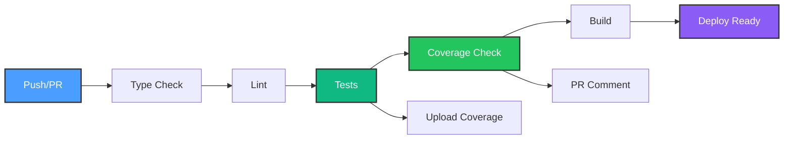

# CI/CD Setup Guide

Complete guide to the automated Continuous Integration and Continuous Deployment pipeline for HomeHub.

**Last Updated**: October 13, 2025
**Status**: Production Ready ✅

---

## 📋 Table of Contents

- [Overview](#overview)
- [GitHub Actions Workflow](#github-actions-workflow)
- [Coverage Badges](#coverage-badges)
- [Quality Gates](#quality-gates)
- [Local Testing](#local-testing)
- [Troubleshooting](#troubleshooting)
- [Maintenance](#maintenance)

---

## Overview

HomeHub uses GitHub Actions for automated testing, coverage reporting, and quality enforcement. Every push and pull request triggers a complete validation pipeline.

### What Gets Tested

✅ **Type Safety**: TypeScript compilation checks
✅ **Code Quality**: ESLint rules enforcement
✅ **Unit Tests**: 175+ tests across core components
✅ **Coverage**: Automated coverage reporting with thresholds
✅ **Build**: Production build validation

### Pipeline Architecture



---

## GitHub Actions Workflow

**File**: `.github/workflows/ci.yml`

### Workflow Structure

The CI pipeline consists of 2 jobs that run in sequence:

#### Job 1: Test & Coverage

**Triggers**: Push to `main`/`develop`, Pull Requests
**Matrix**: Node.js 18.x and 20.x
**Duration**: ~2-3 minutes

**Steps**:

1. **Checkout**: Clone repository code
2. **Setup Node**: Install Node.js with npm caching
3. **Install**: `npm ci` for clean dependency install
4. **Type Check**: Run TypeScript compiler
5. **Lint**: Check ESLint rules
6. **Test**: Execute full test suite with coverage
7. **Coverage Summary**: Generate human-readable report
8. **Upload**: Save coverage artifacts (30-day retention)
9. **Quality Gate**: Validate coverage thresholds
10. **PR Comment**: Post coverage report to pull request

#### Job 2: Build

**Triggers**: After test job passes
**Node Version**: 20.x only
**Duration**: ~1-2 minutes

**Steps**:

1. **Checkout**: Clone repository code
2. **Setup Node**: Install Node.js with npm caching
3. **Install**: `npm ci` for clean dependency install
4. **Build**: Run production build
5. **Upload**: Save build artifacts (7-day retention)

### Node.js Version Matrix

Tests run on **both Node.js 18.x and 20.x** to ensure compatibility across versions. Coverage reports are only generated on Node 20.x to avoid duplicates.

### Caching Strategy

**npm cache**: Automatically cached by `actions/setup-node@v4`
**Cache Key**: Based on `package-lock.json` hash
**Benefits**: 30-50% faster installation on subsequent runs

---

## Coverage Badges

Coverage badges are displayed in the README and auto-updated based on test results.

### Current Badges


### Badge Generation

**Script**: `scripts/generate-badges.cjs`

#### Usage

```bash
# Generate badges (default format)
node scripts/generate-badges.cjs

# Generate markdown for README
node scripts/generate-badges.cjs --markdown

# Generate shields.io URLs
node scripts/generate-badges.cjs --shields

# Generate JSON for API endpoint
node scripts/generate-badges.cjs --json
```

#### Output Formats

**Default**: Human-readable report with coverage percentages and badge colors

```
╔══════════════════════════════════════════════╗
║       Coverage Badge Generator Report        ║
╚══════════════════════════════════════════════╝

📊 Tier 1 Coverage (Avg of 3 files):
  Statements: 94.11% → green
  Branches:   89.07% → yellowgreen
  Functions:  100.00% → brightgreen
  Tests:      passing → brightgreen
```

**Markdown** (`--markdown`): Ready-to-paste markdown badges

```markdown


```

**Shields** (`--shields`): Individual badge URLs with labels

**JSON** (`--json`): Structured data for API endpoints

### Badge Colors

Colors are automatically determined based on coverage percentage:

| Coverage | Color | Badge |
|----------|-------|-------|
| ≥95% | `brightgreen` |  |
| 90-94% | `green` |  |
| 85-89% | `yellowgreen` |  |
| 80-84% | `yellow` |  |
| 70-79% | `orange` |  |
| <70% | `red` |  |

### Updating Badges

**Manual Update** (after running tests locally):

```bash
npm run test:badges
node scripts/generate-badges.cjs --markdown
# Copy output to README.md
```

**Automatic Update** (recommended):

Badges are static in the README. To make them dynamic, consider:

1. **Coveralls Integration**: Upload coverage to Coveralls.io for dynamic badges
2. **Codecov Integration**: Use Codecov for advanced coverage analytics
3. **GitHub Actions Badge**: Add workflow status badge

---

## Quality Gates

Quality gates enforce minimum coverage standards. CI fails if thresholds are not met.

### Coverage Thresholds

**Tier 1 Files** (Critical Path):

- `use-kv.ts` (State Management)
- `HTTPScanner.ts` (Device Discovery)
- `HueBridgeAdapter.ts` (Device Control)

**Thresholds**:

| Metric | Threshold | Current | Status |
|--------|-----------|---------|--------|
| **Statements** | ≥90% | 94.11% | ✅ +4.11% |
| **Branches** | ≥85% | 89.07% | ✅ +4.07% |
| **Functions** | ≥95% | 100.00% | ✅ PERFECT |

### Enforcement

Quality gate checks run in the CI workflow:

```javascript
// Quality gate validation (excerpt from ci.yml)
const STATEMENT_THRESHOLD = 90;
const BRANCH_THRESHOLD = 85;
const FUNCTION_THRESHOLD = 95;

if (avgStatements < STATEMENT_THRESHOLD) {
  console.error('❌ Statement coverage below threshold');
  process.exit(1); // Fail CI
}
```

**Behavior**:

- ✅ Coverage meets all thresholds → CI passes
- ❌ Any threshold not met → CI fails, PR blocked

### Adjusting Thresholds

**When to Adjust**:

- Adding new untested code temporarily
- Refactoring existing code
- Initial development of new features

**How to Adjust**:

1. Edit `.github/workflows/ci.yml`
2. Modify threshold constants:

   ```javascript
   const STATEMENT_THRESHOLD = 85; // Lower from 90
   const BRANCH_THRESHOLD = 80;    // Lower from 85
   ```

3. Commit and push changes

**Best Practice**: Keep thresholds high (90%+) for production code. Lower temporarily for active development, then restore.

---

## Local Testing

Test your changes locally before pushing to GitHub.

### Quick Validation

```bash
# Run full CI validation locally
npm run validate        # Type check + lint + format
npm run test:coverage   # Tests with coverage
npm run build           # Production build
```

### Coverage Workflow

```bash
# 1. Run tests with coverage
npm run test:coverage

# 2. View HTML coverage report
open coverage/index.html    # macOS
start coverage/index.html   # Windows
xdg-open coverage/index.html # Linux

# 3. Generate coverage badges
node scripts/generate-badges.cjs

# 4. Check coverage summary
node scripts/get-coverage.cjs
```

### Pre-Push Checklist

Before pushing code, ensure:

- [ ] `npm run type-check` passes (0 TypeScript errors)
- [ ] `npm run lint` passes (0 ESLint errors)
- [ ] `npm run test:coverage` passes (175+ tests)
- [ ] Coverage thresholds met (≥90% statements, ≥85% branches)
- [ ] `npm run build` succeeds (production build)

**Tip**: Add a pre-push git hook to automate this:

```bash
# .git/hooks/pre-push
#!/bin/sh
npm run validate && npm run test:coverage && npm run build
```

---

## Troubleshooting

Common issues and solutions.

### CI Failing on Type Check

**Error**: `Found X errors in Y files`

**Solution**:

```bash
npm run type-check        # See full error list
npm run type-check:watch  # Watch mode for fixing
```

Common causes:

- Missing type imports
- Incorrect type annotations
- `any` usage without `@ts-ignore`

### CI Failing on Lint

**Error**: `X errors and Y warnings`

**Solution**:

```bash
npm run lint              # See all lint errors
npm run lint:fix          # Auto-fix fixable issues
```

Common causes:

- Unused imports
- Missing dependencies in useEffect
- Console.log statements (remove or add eslint-disable)

### Coverage Below Threshold

**Error**: `❌ Statement coverage below threshold: 88.5% < 90%`

**Solution**:

1. **Find uncovered code**:

   ```bash
   npm run test:coverage
   open coverage/index.html  # Browse visual report
   ```

2. **Add tests** for red/yellow highlighted lines

3. **Or adjust thresholds** (see [Adjusting Thresholds](#adjusting-thresholds))

### Tests Passing Locally But Failing in CI

**Causes**:

- Environment differences (Node version, timezone)
- Race conditions in async tests
- Missing cleanup between tests

**Solution**:

1. **Check Node version**:

   ```bash
   node --version  # Should match CI (18.x or 20.x)
   ```

2. **Run tests with clean state**:

   ```bash
   rm -rf node_modules coverage
   npm ci
   npm run test:coverage
   ```

3. **Check for flaky tests**:

   ```bash
   npm run test:run -- --reporter=verbose
   ```

### Artifacts Not Uploading

**Error**: `Upload artifact failed`

**Solution**:

- Check artifact paths exist: `coverage/`, `dist/`
- Ensure tests ran successfully before upload step
- Verify GitHub Actions permissions (needs write access)

---

## Maintenance

Keep your CI/CD pipeline healthy.

### Regular Updates

**Monthly**:

- [ ] Update GitHub Actions versions (`@v4` → `@v5`)
- [ ] Review coverage trends (should stay stable or improve)
- [ ] Check for new ESLint rules

**Quarterly**:

- [ ] Audit test execution time (should stay <3 min)
- [ ] Review quality gate thresholds (adjust if needed)
- [ ] Update Node.js versions in matrix

**Yearly**:

- [ ] Evaluate new testing tools (Vitest updates)
- [ ] Consider mutation testing (Stryker)
- [ ] Review CI costs (Actions minutes usage)

### Monitoring

**Key Metrics**:

- **Test Pass Rate**: Should be 100%
- **Coverage Trend**: Should stay ≥90%
- **CI Duration**: Should stay <5 minutes
- **Flaky Test Rate**: Should be 0%

**GitHub Insights**:

- Actions tab → Workflow runs
- Check for patterns (specific branches failing)
- Monitor artifact storage usage

### Performance Optimization

**Speed Up CI**:

1. **Use npm cache** (already enabled via `actions/setup-node@v4`)
2. **Parallelize tests** (Vitest runs in parallel by default)
3. **Reduce matrix** (only test on Node 20.x if 18.x is not required)
4. **Skip build on draft PRs**:

   ```yaml
   if: github.event.pull_request.draft == false
   ```

**Current Baseline**:

- Test Job: ~2-3 minutes
- Build Job: ~1-2 minutes
- Total: ~4-5 minutes

---

## Quick Reference

### Commands

```bash
# Run all tests
npm test

# Run tests with coverage
npm run test:coverage

# Generate coverage badges
npm run test:badges

# Full CI validation locally
npm run validate && npm run test:coverage && npm run build
```

### Files

| File | Purpose |
|------|---------|
| `.github/workflows/ci.yml` | GitHub Actions workflow definition |
| `scripts/generate-badges.cjs` | Coverage badge generator |
| `scripts/get-coverage.cjs` | Tier 1 coverage reporter |
| `vitest.config.ts` | Test framework configuration |
| `coverage/` | Generated coverage reports (git-ignored) |

### Links

- [GitHub Actions Docs](https://docs.github.com/en/actions)
- [Vitest Documentation](https://vitest.dev/)
- [Shields.io Badge Generator](https://shields.io/)
- [Coverage Best Practices](https://martinfowler.com/bliki/TestCoverage.html)

---

## Next Steps

After setting up CI/CD:

1. ✅ **Week 2**: Component Tests (Dashboard, Rooms, Scenes UI)
2. ✅ **Week 3**: Integration Tests (Full automation workflows)
3. ✅ **Week 4**: E2E Tests (User journey testing)
4. ✅ **Add Mutation Testing**: Validate test quality with Stryker
5. ✅ **Set Up Monitoring**: Sentry for production error tracking

---

**Questions?** Check the [Testing Guide](../guides/TESTING.md) or open an issue on GitHub.
