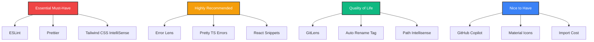

# 🔌 VS Code Extensions Guide for HomeHub

This guide explains the recommended VS Code extensions for optimal development experience with the HomeHub project.

---

## 🚀 Quick Install

When you open this project in VS Code, you'll see a notification:

> **"This workspace has extension recommendations."**

Click **"Install All"** to get started immediately!

Or manually install via Command Palette:

1. Press `Ctrl+Shift+P` (Windows/Linux) or `Cmd+Shift+P` (Mac)
2. Type "Extensions: Show Recommended Extensions"
3. Click "Install" on each extension

---

## ✨ Essential Extensions (Must Have!)

These are **required** for the best development experience:

### 1. **ESLint** (`dbaeumer.vscode-eslint`)

**What it does**: Real-time linting for JavaScript/TypeScript code

**Why you need it**:

- ✅ Catches errors as you type
- ✅ Auto-fixes issues on save (configured in workspace settings)
- ✅ Enforces React Hooks rules
- ✅ Highlights unused variables/imports

**Usage**: Just install it - already configured in `.vscode/settings.json`

---

### 2. **Prettier** (`esbenp.prettier-vscode`)

**What it does**: Opinionated code formatter

**Why you need it**:

- ✅ Consistent code style across the project
- ✅ Auto-formats on save (no manual formatting!)
- ✅ Sorts Tailwind CSS classes automatically
- ✅ Works with ESLint for seamless integration

**Usage**: Set as default formatter (already done in workspace settings)

---

### 3. **Tailwind CSS IntelliSense** (`bradlc.vscode-tailwindcss`)

**What it does**: Autocomplete, syntax highlighting, and linting for Tailwind CSS

**Why you need it**:

- ✅ Autocomplete for all Tailwind classes
- ✅ Color previews in editor
- ✅ Lint warnings for invalid classes
- ✅ Hover to see CSS properties
- ✅ Works with `cn()` utility and `cva()` from class-variance-authority

**Demo**:

```tsx
<div className="bg-primary/80 backdrop-blur-xl">
//              ↑ Shows color preview and CSS details on hover
```

---

## 🎨 React & TypeScript Extensions

### 4. **ES7+ React Snippets** (`dsznajder.es7-react-js-snippets`)

**What it does**: Code snippets for React development

**Useful Snippets**:

- `rafce` → React Arrow Function Component Export
- `usf` → useState hook
- `uef` → useEffect hook
- `imr` → import React from 'react'

**Example**:

```tsx
// Type: rafce
export const MyComponent = () => {
  return <div></div>
}
```

---

### 5. **Error Lens** (`usernamehw.errorlens`)

**What it does**: Displays errors/warnings inline in your code

**Why you need it**:

- ✅ See errors immediately without hovering
- ✅ Color-coded severity (red=error, yellow=warning)
- ✅ Faster debugging workflow

**Before**: Error shown in Problems panel only
**After**: Error appears directly in your code with context

---

### 6. **Pretty TypeScript Errors** (`yoavbls.pretty-ts-errors`)

**What it does**: Makes TypeScript errors readable and beautiful

**Why you need it**:

- ✅ Formats complex type errors into readable format
- ✅ Syntax highlighting in error messages
- ✅ Collapsible sections for long errors

**Example**:

```
Instead of: Type 'string' is not assignable to type 'number | undefined'
You see:    Pretty formatted error with highlighted types
```

---

### 7. **DotENV** (`mikestead.dotenv`)

**What it does**: Syntax highlighting for `.env` files

**Why you need it**:

- ✅ Color-coded environment variables
- ✅ Makes `.env` files easier to read
- ✅ Highlights comments properly

---

## ☁️ Cloudflare Development

### 8. **Cloudflare Workers** (`cloudflare.vscode-cloudflare-workers`)

**What it does**: Tools for developing and deploying Cloudflare Workers

**Features**:

- ✅ Wrangler integration
- ✅ Worker logs in editor
- ✅ KV namespace explorer
- ✅ Quick deploy commands

**Usage**:

- View Worker logs: `Ctrl+Shift+P` → "Cloudflare: View Logs"
- Deploy Worker: `Ctrl+Shift+P` → "Cloudflare: Deploy"

---

## 📝 Code Quality & Documentation

### 9. **Code Spell Checker** (`streetsidesoftware.code-spell-checker`)

**What it does**: Spell checking for code and comments

**Why you need it**:

- ✅ Catches typos in variable names
- ✅ Checks comments and strings
- ✅ Customizable dictionary
- ✅ Prevents embarrassing typos in production

**Add custom words**: Right-click word → "Add to Dictionary"

---

### 10. **Markdown Mermaid** (`bierner.markdown-mermaid`)

**What it does**: Preview Mermaid diagrams in Markdown files

**Why you need it**:

- ✅ See architecture diagrams in documentation
- ✅ Used extensively in `docs/ARCHITECTURE.md`
- ✅ Live preview as you edit

**Usage**: Open `.md` file → `Ctrl+K V` for side-by-side preview

---

### 11. **Markdown Lint** (`DavidAnson.vscode-markdownlint`)

**What it does**: Linting for Markdown files

**Why you need it**:

- ✅ Consistent documentation style
- ✅ Fixes common Markdown mistakes
- ✅ Ensures docs render correctly on GitHub

---

## 🔍 Git & Version Control

### 12. **GitLens** (`eamodio.gitlens`)

**What it does**: Supercharges Git capabilities in VS Code

**Features**:

- ✅ Inline Git blame annotations
- ✅ See who changed each line (and when)
- ✅ File history visualization
- ✅ Compare commits easily
- ✅ Interactive rebase editor

**Usage**: Hover over any line to see Git blame info

---

### 13. **GitHub Pull Requests** (`github.vscode-pull-request-github`)

**What it does**: Manage GitHub PRs directly in VS Code

**Features**:

- ✅ View, create, and review PRs
- ✅ Comment on code
- ✅ Approve/request changes
- ✅ Never leave your editor!

---

### 14. **Git Graph** (`mhutchie.git-graph`)

**What it does**: Visual Git commit graph

**Features**:

- ✅ See branch history visually
- ✅ Understand complex merge scenarios
- ✅ Cherry-pick commits
- ✅ Beautiful UI for Git operations

**Usage**: Click "Git Graph" in status bar or `Ctrl+Shift+P` → "Git Graph: View"

---

## 🛠️ Utilities

### 15. **Path Intellisense** (`christian-kohler.path-intellisense`)

**What it does**: Autocomplete for file paths

**Why you need it**:

- ✅ Autocomplete imports
- ✅ Works with `@/` path aliases
- ✅ Prevents typos in import paths

**Example**:

```tsx
import { useKV } from '@/hooks/use-kv'
//                    ↑ Autocomplete as you type
```

---

### 16. **TypeScript Next** (`ms-vscode.vscode-typescript-next`)

**What it does**: Latest TypeScript language service

**Why you need it**:

- ✅ Newest TypeScript features
- ✅ Better IntelliSense
- ✅ Bug fixes before official release

---

### 17. **EditorConfig** (`EditorConfig.EditorConfig`)

**What it does**: Applies `.editorconfig` rules

**Why you need it**:

- ✅ Consistent formatting across editors
- ✅ Enforces line endings (LF)
- ✅ Indentation rules
- ✅ Works alongside Prettier

---

### 18. **Auto Rename Tag** (`formulahendry.auto-rename-tag`)

**What it does**: Automatically renames paired HTML/JSX tags

**Example**:

```tsx
<Card>Content</Card>
// Change opening tag to <CardContent>
// Closing tag auto-updates: <CardContent>Content</CardContent>
```

---

### 19. **Import Cost** (`wix.vscode-import-cost`)

**What it does**: Shows the size of imported packages inline

**Why you need it**:

- ✅ See bundle impact of imports
- ✅ Catch large dependencies
- ✅ Optimize bundle size

**Example**:

```tsx
import _ from 'lodash' // 69.5kB (shows inline)
```

---

## 🎯 Optional (Nice to Have)

### 20. **JSON Language Service** (`ms-vscode.vscode-json-languageservice`)

**What it does**: Enhanced JSON editing with schema validation

**Features**:

- ✅ Autocomplete for `package.json`
- ✅ Validates `tsconfig.json`
- ✅ Schema-aware editing

---

### 21. **Image Preview** (`kisstkondoros.vscode-gutter-preview`)

**What it does**: Shows image previews in the gutter

**Why useful**:

- ✅ Preview imported images
- ✅ See icons/logos inline
- ✅ Hover to see full-size image

---

### 22. **Material Icon Theme** (`PKief.material-icon-theme`)

**What it does**: Beautiful file icons in the sidebar

**Why you might want it**:

- ✅ Makes file tree more readable
- ✅ Visual distinction between file types
- ✅ Looks professional

**Enable**: `Ctrl+Shift+P` → "Preferences: File Icon Theme" → "Material Icon Theme"

---

### 23. **GitHub Copilot** (`GitHub.copilot`)

**What it does**: AI-powered code completion

**Features**:

- ✅ Generates code from comments
- ✅ Autocompletes entire functions
- ✅ Learns from your codebase
- ✅ Multi-line suggestions

**Note**: Requires GitHub Copilot subscription

---

## ⚠️ Extensions to Avoid

These extensions **conflict** with our setup and are explicitly **not recommended**:

| Extension            | Why to Avoid            |
| -------------------- | ----------------------- |
| `hookyqr.beautify`   | Conflicts with Prettier |
| `HookyQR.JSBeautify` | Outdated, use Prettier  |
| `dbaeumer.jshint`    | Use ESLint instead      |

---

## 🔧 Post-Install Configuration

After installing extensions, **reload VS Code**:

1. Press `Ctrl+Shift+P`
2. Type "Reload Window"
3. Press Enter

Or simply close and reopen VS Code.

---

## 🎨 Recommended Settings

These are already configured in `.vscode/settings.json`, but here's what they do:

```json
{
  // Auto-format on save
  "editor.formatOnSave": true,
  "editor.defaultFormatter": "esbenp.prettier-vscode",

  // Auto-fix ESLint issues on save
  "editor.codeActionsOnSave": {
    "source.fixAll.eslint": "explicit",
    "source.organizeImports": "explicit"
  },

  // Tailwind CSS IntelliSense for custom functions
  "tailwindCSS.experimental.classRegex": [
    ["cva\\(([^)]*)\\)", "[\"'`]([^\"'`]*).*?[\"'`]"],
    ["cn\\(([^)]*)\\)", "[\"'`]([^\"'`]*).*?[\"'`]"]
  ]
}
```

---

## 📊 Extension Priority Matrix



---

## 🚀 Quick Start Checklist

- [ ] Install all recommended extensions
- [ ] Reload VS Code
- [ ] Open any `.tsx` file and verify:
  - [ ] ESLint is running (check status bar)
  - [ ] Prettier formats on save
  - [ ] Tailwind classes show autocomplete
  - [ ] Error Lens shows inline errors
- [ ] Test a commit:
  - [ ] GitLens blame shows in editor
  - [ ] Git Graph available in status bar

---

## 💡 Pro Tips

1. **Disable Extensions for Other Projects**: Use workspace-specific settings
   - Right-click extension → "Disable (Workspace)"

2. **Sync Settings Across Machines**: Enable Settings Sync
   - `Ctrl+Shift+P` → "Settings Sync: Turn On"

3. **Customize Keyboard Shortcuts**:
   - `Ctrl+K Ctrl+S` → Search for command → Set custom key

4. **Performance**: If VS Code feels slow:
   - Disable extensions you're not actively using
   - Increase memory limit: `"files.maxMemoryForLargeFilesMB": 4096`

---

## 🆘 Troubleshooting

### ESLint not working?

1. Check output: `Ctrl+Shift+P` → "ESLint: Show Output Channel"
2. Verify `eslint.config.js` exists in project root
3. Reload window

### Prettier not formatting?

1. Check default formatter: `Ctrl+Shift+P` → "Format Document With..."
2. Select "Configure Default Formatter" → "Prettier"
3. Verify `.prettierrc.json` exists

### Tailwind IntelliSense not showing?

1. Check `tailwind.config.js` exists
2. Reload window
3. Check extension is enabled for workspace

### Extensions won't install?

1. Check internet connection
2. Check VS Code marketplace: <https://marketplace.visualstudio.com/>
3. Try manual install: Download VSIX → `Ctrl+Shift+P` → "Install from VSIX"

---

## 📚 Additional Resources

- [VS Code Extension Marketplace](https://marketplace.visualstudio.com/)
- [VS Code Tips & Tricks](https://code.visualstudio.com/docs/getstarted/tips-and-tricks)
- [Keyboard Shortcuts Reference](https://code.visualstudio.com/shortcuts/keyboard-shortcuts-windows.pdf)

---

## 🎯 Summary

**Must Install (3)**:

1. ESLint
2. Prettier
3. Tailwind CSS IntelliSense

**Highly Recommended (5)**: 4. React Snippets 5. Error Lens 6. Pretty TypeScript Errors 7. GitLens 8. Cloudflare Workers

**Nice to Have (rest)**: Install based on your workflow preferences

---

Happy coding! 🚀
