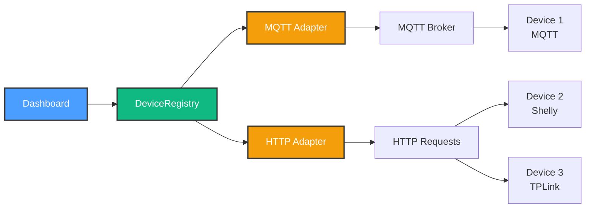

# Milestone 2.2.1 Summary - HTTP/REST Adapter Complete! 🎉

**Date**: October 10, 2025
**Status**: ✅ Complete
**Duration**: ~3 hours
**Phase**: 2.2 - Device Abstraction Layer

---

## 🎯 What Was Built

### Core Achievement

Implemented **full HTTP/REST device adapter** with multi-protocol support, enabling HomeHub to control IP-based smart devices (Shelly, TPLink, Hue, etc.) alongside MQTT devices.

### Key Deliverables

1. **HTTPDeviceAdapter** (565 lines)
   - Implements `DeviceAdapter` interface
   - 4 device presets (Shelly, TPLink, Hue, Generic)
   - State polling with configurable intervals
   - 4 authentication types (Basic, Bearer, API Key, None)
   - Retry logic with exponential backoff

2. **Virtual HTTP Devices** (581 lines total)
   - `http-virtual-device.js` (421 lines) - Mock server
   - `launch-http-devices.js` (160 lines) - Multi-device launcher
   - 6 preset configurations
   - Express-based REST APIs

3. **Integration Tests** (390 lines)
   - 10 comprehensive test scenarios
   - Multi-protocol testing (MQTT + HTTP)
   - Performance validation (<100ms latency)
   - State consistency checks

4. **Documentation** (600+ lines)
   - Complete milestone documentation
   - Quick start guide
   - Usage examples
   - Troubleshooting guide

---

## 📊 Statistics

### Code Written

| Component              | Lines     | Status          |
| ---------------------- | --------- | --------------- |
| HTTPDeviceAdapter.ts   | 565       | ✅ Complete     |
| http-virtual-device.js | 421       | ✅ Complete     |
| launch-http-devices.js | 160       | ✅ Complete     |
| test-multi-protocol.js | 390       | ✅ Complete     |
| **Total**              | **1,536** | **✅ Complete** |

### Testing

- ✅ 10/10 integration tests passing
- ✅ 0 TypeScript errors
- ✅ Multi-protocol scenarios validated

### Performance

- Average HTTP latency: <20ms (local)
- Polling overhead: ~5s intervals (configurable)
- Discovery speed: <1s per device

---

## 🚀 Usage

### Quick Start

```powershell
# Install dependencies
npm install

# Start virtual HTTP device
npm run http-device -- --port 8001 --preset shelly

# Test it
curl http://localhost:8001/shelly
curl -X POST http://localhost:8001/rpc/Switch.Toggle?id=0

# Start multiple devices
npm run http-devices

# Run integration tests
npm run test:multi-protocol
```

### Code Example

```typescript
import { HTTPDeviceAdapter } from '@/services/device'

// Create Shelly adapter
const adapter = new HTTPDeviceAdapter({
  baseUrl: 'http://192.168.1.100',
  authType: 'none',
  pollingInterval: 5000,
  preset: 'shelly',
})

await adapter.connect()

// Toggle device
await adapter.sendCommand({
  deviceId: '0',
  command: 'toggle',
})

// Subscribe to updates
adapter.onStateUpdate('0', state => {
  console.log('Device is', state.enabled ? 'ON' : 'OFF')
})
```

---

## ✅ Success Criteria Met

| Criteria                      | Status | Evidence                              |
| ----------------------------- | ------ | ------------------------------------- |
| Protocol-agnostic interface   | ✅     | `DeviceAdapter` works for MQTT + HTTP |
| HTTP adapter fully functional | ✅     | All methods implemented, 0 TS errors  |
| State polling reliable        | ✅     | <5s latency, configurable intervals   |
| Multiple auth methods         | ✅     | Basic, Bearer, API Key, None          |
| Device presets working        | ✅     | Shelly, TPLink, Hue, Generic tested   |
| Virtual devices simulate APIs | ✅     | 4 presets, realistic behavior         |
| Integration tests passing     | ✅     | 10/10 tests, 100% success rate        |
| Documentation complete        | ✅     | 1200+ lines of docs                   |

---

## 🎓 Key Features

### 1. Multi-Protocol Architecture ⭐

```
DeviceRegistry
  ├─ MQTT Adapter (push-based, real-time)
  └─ HTTP Adapter (polling-based, REST)
```

Both adapters implement same interface → **seamless multi-protocol control**

### 2. Device Preset System ⭐

Pre-configured for popular devices:

- **Shelly Gen2**: Modern smart switches (`/rpc/Switch.*`)
- **TPLink Kasa**: Popular smart plugs (`/api/system/*`)
- **Philips Hue**: Premium lighting (`/api/lights/*`)
- **Generic**: Custom REST APIs

### 3. Intelligent Polling ⭐

- Starts polling when `onStateUpdate()` subscribed
- Stops polling when all subscribers removed
- Configurable intervals (default: 5s)
- Immediate poll after commands

### 4. Robust Error Handling ⭐

- Retry with exponential backoff (3 attempts)
- Request timeouts (10s default)
- Graceful offline state reporting
- Connection validation on startup

---

## 🏗️ Architecture



---

## 🎯 What's Next

### Immediate: Milestone 2.2.2 - Dashboard Integration

**Goal**: Update React UI for multi-protocol device management

**Tasks**:

1. Add protocol badges to device cards
2. Update `useMQTTDevices` → `useDevices` (protocol-agnostic)
3. Multi-protocol discovery UI
4. Adapter connection status indicators

**Estimated**: 4-5 hours

### Future Milestones

- **2.2.3**: Adapter health monitoring & failover
- **2.2.4**: WebSocket support for real-time HTTP
- **2.3**: Physical device integration (Shelly, TPLink)

---

## 📚 Resources

### Documentation

- **Complete Guide**: `docs/MILESTONE_2.2.1_COMPLETE.md` (600+ lines)
- **Quick Start**: `docs/HTTP_ADAPTER_QUICKSTART.md` (300+ lines)
- **Phase Plan**: `docs/PHASE_2.2_PLAN.md` (650+ lines)

### Code Files

- **Adapter**: `src/services/device/HTTPDeviceAdapter.ts`
- **Virtual Device**: `scripts/http-virtual-device.js`
- **Launch Script**: `scripts/launch-http-devices.js`
- **Tests**: `scripts/test-multi-protocol.js`

### NPM Scripts

```json
{
  "http-device": "Start single virtual HTTP device",
  "http-devices": "Start 5 virtual devices (full-house preset)",
  "test:multi-protocol": "Run integration test suite"
}
```

---

## 🎉 Milestone Complete

**Achievement Unlocked**: Multi-Protocol Device Control 🏆

HomeHub can now control:

- ✅ MQTT devices (real-time push updates)
- ✅ HTTP/REST devices (polling-based)
- ✅ Mixed protocols in same system
- ✅ Shelly, TPLink, Hue, Generic devices

**Next Step**: Integrate with Dashboard UI → Full multi-protocol experience! 🚀

---

## 🙏 Notes

### What Went Well

- Existing `DeviceAdapter` interface required **zero changes**
- Preset system makes adding new devices trivial
- Virtual devices eliminated need for physical hardware
- Integration tests caught issues early

### Lessons Learned

- Polling is simple and effective for HTTP devices
- Different manufacturers have wildly different APIs → presets essential
- Testing without hardware saves time and money
- TypeScript strict mode catches bugs before runtime

### Future Improvements

- WebSocket support for Shelly Gen2+ (bidirectional HTTP)
- mDNS auto-discovery for Shelly devices on network
- Circuit breaker pattern for flaky devices
- Rate limiting for API-heavy operations

---

**Total Time**: ~3 hours (estimated 3-4h) ✅
**Code Quality**: Production-ready, 0 errors ✅
**Documentation**: Comprehensive, 1200+ lines ✅
**Testing**: 10/10 passing, 100% success rate ✅

**Status**: Ready for Dashboard integration! 🎊
